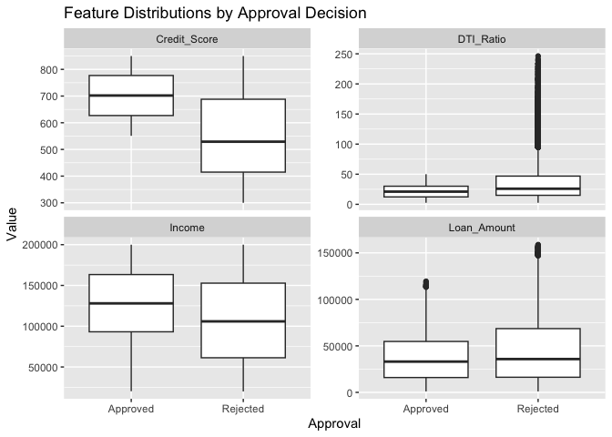
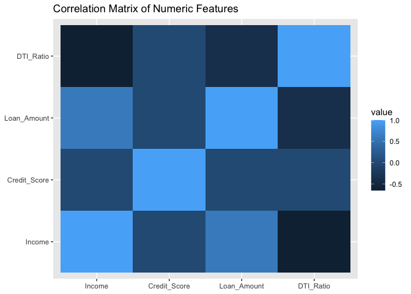
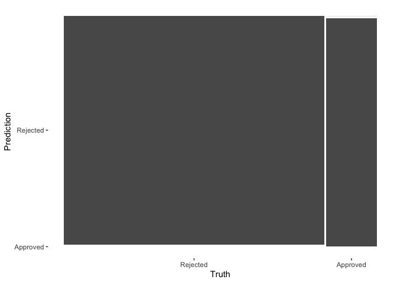
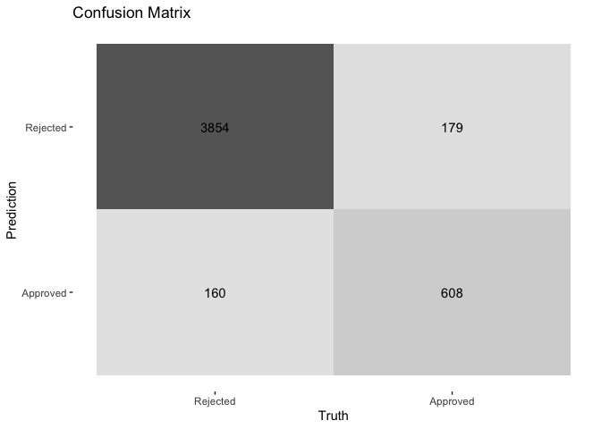

Final Project
================
Lukas DiGiovanni, Cole Moore, Kasey Cohen, Anthony Cuccia
2025-05-07

``` r
# 1. Point R at the folder where loan_data.csv lives
setwd("/Users/lukasdigiovanni/Desktop/DS201_Final")
 loan_data <- read.csv(
  "loan_data.csv",
  header = TRUE,
  stringsAsFactors = FALSE
)
```

## Introduction

As data science students, we believe in the power of data to drive
fairer, more transparent systems—especially in domains that shape
people’s lives in lasting ways. One such domain is access to credit.
Whether someone is purchasing their first home, funding their education,
or starting a small business, the ability to obtain a loan can play a
crucial role in their economic and personal future.

Yet loan approval decisions are not made in a vacuum. They are
influenced by a range of factors—from an applicant’s income and credit
history to their gender, marital status, and employment. While many of
these inputs are designed to assess financial responsibility, others
raise more complex questions about equity, access, and implicit bias.

This project explores patterns in loan approval outcomes using a dataset
sourced from
[Kaggle](https://www.kaggle.com/datasets/abhishekmishra08/loan-approval-datasets),
which includes applicant demographic and financial details along with
whether or not their loan application was approved. We want to know:
What determines whether a loan is approved? Do certain applicant groups
face consistent disadvantages in the approval process?

According to the Federal Reserve’s 2020 Report on Economic Well-Being of
U.S. Households, 27% of adults who applied for credit were either denied
or offered less favorable terms than they requested. These outcomes
often fall along racial, geographic, and income lines, raising concerns
about fairness and systemic inequality. At the same time, lenders must
manage real financial risks—such as income instability or high
debt-to-income ratios—that affect their ability to extend credit
responsibly.

Our project investigates these dynamics with the following goals in
mind: - To identify which variables (e.g., credit history, income,
education) are most predictive of loan approval. - To explore
demographic patterns that may suggest bias or unequal treatment. - To
develop a classification model that can estimate the likelihood of loan
approval for a given applicant profile. - To interpret the results in
the context of ethical lending practices and data-driven
decision-making.

By analyzing this dataset through the lens of both predictive
performance and social equity, we hope to contribute to an ongoing
conversation about how data science can illuminate—and potentially
correct—imbalances in access to financial opportunity. Our findings may
offer insights to financial institutions, policymakers, and the broader
public about how to ensure that the promise of credit is both accessible
and fair.

This analysis is written for a general audience and is fully
reproducible using R. All code, figures, and results are included in the
following sections.

## Data Organization

To investigate the factors that influence loan approval decisions, we
used the **ML Loan-Solutions Elite** dataset, sourced from
[Kaggle](https://www.kaggle.com/datasets/abhishekmishra08/loan-approval-datasets).
This dataset supports predictive modeling for loan approval using
machine learning techniques and is designed to incorporate both
structured financial data and unstructured textual input.

The dataset is provided in CSV format and contains two types of
information:

### Structured Data

The structured portion of the dataset includes core financial variables
relevant to evaluating an applicant’s creditworthiness:

- **Income (float)**: The applicant’s total reported income.
- **Credit Score (integer)**: A numeric representation of the
  applicant’s creditworthiness.
- **Loan Amount (float)**: The amount of money the applicant has
  requested as a loan.
- **Debt-to-Income Ratio (float)**: The ratio of the applicant’s
  existing debt to their income—a key indicator of financial stability.
- **Employment Status (categorical)**: The current employment
  classification of the applicant (e.g., Employed, Self-employed,
  Unemployed, Retired).

### Unstructured Data

In addition to numerical and categorical fields, the dataset includes a
free-text narrative field:

- **Text Description (string)**: A written explanation provided by the
  applicant to describe their financial situation. This field is
  intended for use in text mining and natural language processing (NLP)
  tasks.

### Purpose and Methodology

This dataset is designed to enhance the predictive power of loan
approval models by integrating both quantitative and qualitative
information. The structured data provides key financial health
indicators, while the unstructured text can be processed using
techniques like TF-IDF vectorization to extract additional predictive
insights.

In our analysis, we focused primarily on the structured features for
initial exploratory data analysis and model development. The text-based
features may be incorporated in later stages to explore how qualitative
applicant narratives affect model performance.

### Source and Limitations

The dataset is synthetic and was generated to simulate realistic loan
application scenarios. All information has been anonymized for privacy,
making the dataset appropriate for academic and non-commercial machine
learning projects. While realistic, the synthetic nature of the data may
limit its applicability to actual loan approval systems.

## 2. Data Understanding & Preparation

``` r
library(knitr)
library(kableExtra)

loan_attributes <- data.frame(
  Attribute = c(
    "Income",
    "Credit Score",
    "Loan Amount",
    "Debt-to-Income Ratio",
    "Employment Status",
    "Text Description",
    "Loan Status"
  ),
  `Data Type` = c(
    "Ratio",
    "Interval",
    "Ratio",
    "Ratio",
    "Nominal",
    "Text",
    "Nominal"
  ),
  Description = c(
    "Total monthly income reported by the applicant. Used to assess financial capacity.",
    "Numerical score representing creditworthiness based on past repayment history.",
    "The total amount requested by the applicant as a loan.",
    "The ratio of total monthly debt payments to monthly income. Indicates financial stability.",
    "Categorical indicator of the applicant’s employment type (e.g., Employed, Retired, etc.).",
    "Free-text narrative provided by the applicant describing their financial situation. Used for text analysis.",
    "Target variable indicating whether the loan was approved ('Y') or denied ('N')."
  ),
  Nullable = c("No", "No", "No", "No", "No", "Yes", "No")
)

loan_attributes %>%
  kbl(align = "l") %>%
  kable_styling(
    bootstrap_options = c("striped", "hover", "condensed", "responsive"),
    full_width = FALSE,
    font_size = 14,
    position = "left"
  ) %>%
  column_spec(1, bold = TRUE) %>%
  column_spec(3, width = "35em")
```

<table class="table table-striped table-hover table-condensed table-responsive" style="font-size: 14px; width: auto !important; ">
<thead>
<tr>
<th style="text-align:left;">
Attribute
</th>
<th style="text-align:left;">
Data.Type
</th>
<th style="text-align:left;">
Description
</th>
<th style="text-align:left;">
Nullable
</th>
</tr>
</thead>
<tbody>
<tr>
<td style="text-align:left;font-weight: bold;">
Income
</td>
<td style="text-align:left;">
Ratio
</td>
<td style="text-align:left;width: 35em; ">
Total monthly income reported by the applicant. Used to assess financial
capacity.
</td>
<td style="text-align:left;">
No
</td>
</tr>
<tr>
<td style="text-align:left;font-weight: bold;">
Credit Score
</td>
<td style="text-align:left;">
Interval
</td>
<td style="text-align:left;width: 35em; ">
Numerical score representing creditworthiness based on past repayment
history.
</td>
<td style="text-align:left;">
No
</td>
</tr>
<tr>
<td style="text-align:left;font-weight: bold;">
Loan Amount
</td>
<td style="text-align:left;">
Ratio
</td>
<td style="text-align:left;width: 35em; ">
The total amount requested by the applicant as a loan.
</td>
<td style="text-align:left;">
No
</td>
</tr>
<tr>
<td style="text-align:left;font-weight: bold;">
Debt-to-Income Ratio
</td>
<td style="text-align:left;">
Ratio
</td>
<td style="text-align:left;width: 35em; ">
The ratio of total monthly debt payments to monthly income. Indicates
financial stability.
</td>
<td style="text-align:left;">
No
</td>
</tr>
<tr>
<td style="text-align:left;font-weight: bold;">
Employment Status
</td>
<td style="text-align:left;">
Nominal
</td>
<td style="text-align:left;width: 35em; ">
Categorical indicator of the applicant’s employment type (e.g.,
Employed, Retired, etc.).
</td>
<td style="text-align:left;">
No
</td>
</tr>
<tr>
<td style="text-align:left;font-weight: bold;">
Text Description
</td>
<td style="text-align:left;">
Text
</td>
<td style="text-align:left;width: 35em; ">
Free-text narrative provided by the applicant describing their financial
situation. Used for text analysis.
</td>
<td style="text-align:left;">
Yes
</td>
</tr>
<tr>
<td style="text-align:left;font-weight: bold;">
Loan Status
</td>
<td style="text-align:left;">
Nominal
</td>
<td style="text-align:left;width: 35em; ">
Target variable indicating whether the loan was approved (‘Y’) or denied
(‘N’).
</td>
<td style="text-align:left;">
No
</td>
</tr>
</tbody>
</table>

### 2.1 Load libraries and data

``` r
library(tidyverse) 
```

    ## ── Attaching core tidyverse packages ──────────────────────── tidyverse 2.0.0 ──
    ## ✔ dplyr     1.1.4     ✔ readr     2.1.5
    ## ✔ forcats   1.0.0     ✔ stringr   1.5.1
    ## ✔ ggplot2   3.5.2     ✔ tibble    3.2.1
    ## ✔ lubridate 1.9.4     ✔ tidyr     1.3.1
    ## ✔ purrr     1.0.4     
    ## ── Conflicts ────────────────────────────────────────── tidyverse_conflicts() ──
    ## ✖ dplyr::filter()     masks stats::filter()
    ## ✖ dplyr::group_rows() masks kableExtra::group_rows()
    ## ✖ dplyr::lag()        masks stats::lag()
    ## ℹ Use the conflicted package (<http://conflicted.r-lib.org/>) to force all conflicts to become errors

``` r
library(skimr)        # quick data summary (optional)
library(reshape2)     # for correlation heatmap
```

    ## 
    ## Attaching package: 'reshape2'
    ## 
    ## The following object is masked from 'package:tidyr':
    ## 
    ##     smiths

Before we proceed with visualization and predictive modelling, we must
ensure that our data is clean and ready for analysis. In this section,
we address missing values, correct data types, and encode categorical
variables as necessary.

``` r
glimpse(loan_data)
```

    ## Rows: 24,000
    ## Columns: 7
    ## $ Text              <chr> "I need a loan to pay for an international vacation …
    ## $ Income            <int> 26556, 197392, 44561, 190363, 61853, 108236, 110165,…
    ## $ Credit_Score      <int> 581, 389, 523, 729, 732, 404, 570, 600, 346, 403, 67…
    ## $ Loan_Amount       <int> 8314, 111604, 34118, 118757, 19210, 50797, 61217, 21…
    ## $ DTI_Ratio         <dbl> 79.26, 22.14, 45.44, 10.22, 44.13, 10.24, 7.12, 113.…
    ## $ Employment_Status <chr> "employed", "employed", "employed", "unemployed", "e…
    ## $ Approval          <chr> "Rejected", "Rejected", "Rejected", "Rejected", "App…

``` r
dim(loan_data)
```

    ## [1] 24000     7

``` r
# Base R summary (excluding the free‐text column)
loan_data %>% 
  select(-Text) %>% 
  summary()
```

    ##      Income        Credit_Score    Loan_Amount       DTI_Ratio     
    ##  Min.   : 20001   Min.   :300.0   Min.   :  1005   Min.   :  2.53  
    ##  1st Qu.: 65636   1st Qu.:437.0   1st Qu.: 16212   1st Qu.: 14.51  
    ##  Median :110464   Median :575.0   Median : 35207   Median : 24.86  
    ##  Mean   :110378   Mean   :575.7   Mean   : 44356   Mean   : 34.72  
    ##  3rd Qu.:155187   3rd Qu.:715.0   3rd Qu.: 65623   3rd Qu.: 41.84  
    ##  Max.   :200000   Max.   :850.0   Max.   :158834   Max.   :246.33  
    ##  Employment_Status    Approval        
    ##  Length:24000       Length:24000      
    ##  Class :character   Class :character  
    ##  Mode  :character   Mode  :character  
    ##                                       
    ##                                       
    ## 

``` r
# Or a richer skim
```

``` r
skim(loan_data)
```

|                                                  |           |
|:-------------------------------------------------|:----------|
| Name                                             | loan_data |
| Number of rows                                   | 24000     |
| Number of columns                                | 7         |
| \_\_\_\_\_\_\_\_\_\_\_\_\_\_\_\_\_\_\_\_\_\_\_   |           |
| Column type frequency:                           |           |
| character                                        | 3         |
| numeric                                          | 4         |
| \_\_\_\_\_\_\_\_\_\_\_\_\_\_\_\_\_\_\_\_\_\_\_\_ |           |
| Group variables                                  | None      |

Data summary

**Variable type: character**

| skim_variable     | n_missing | complete_rate | min | max | empty | n_unique | whitespace |
|:------------------|----------:|--------------:|----:|----:|------:|---------:|-----------:|
| Text              |         0 |             1 |  40 |  82 |     0 |       70 |          0 |
| Employment_Status |         0 |             1 |   8 |  10 |     0 |        2 |          0 |
| Approval          |         0 |             1 |   8 |   8 |     0 |        2 |          0 |

**Variable type: numeric**

| skim_variable | n_missing | complete_rate | mean | sd | p0 | p25 | p50 | p75 | p100 | hist |
|:---|---:|---:|---:|---:|---:|---:|---:|---:|---:|:---|
| Income | 0 | 1 | 110377.55 | 51729.68 | 20001.00 | 65635.75 | 110464.00 | 155187.00 | 200000.00 | ▇▇▇▇▇ |
| Credit_Score | 0 | 1 | 575.72 | 159.23 | 300.00 | 437.00 | 575.00 | 715.00 | 850.00 | ▇▇▇▇▇ |
| Loan_Amount | 0 | 1 | 44356.15 | 34666.60 | 1005.00 | 16212.00 | 35207.00 | 65622.75 | 158834.00 | ▇▅▂▂▁ |
| DTI_Ratio | 0 | 1 | 34.72 | 32.32 | 2.53 | 14.51 | 24.86 | 41.84 | 246.33 | ▇▁▁▁▁ |

``` r
loan_data %>% 
  summarise(across(everything(), ~ sum(is.na(.)))) %>% 
  pivot_longer(everything(), names_to="variable", values_to="missing")
```

    ## # A tibble: 7 × 2
    ##   variable          missing
    ##   <chr>               <int>
    ## 1 Text                    0
    ## 2 Income                  0
    ## 3 Credit_Score            0
    ## 4 Loan_Amount             0
    ## 5 DTI_Ratio               0
    ## 6 Employment_Status       0
    ## 7 Approval                0

No missing values found. Data cleaning and preprocessing completed.

``` r
loan_data %>% 
  pivot_longer(c(Income, Credit_Score, Loan_Amount, DTI_Ratio),
               names_to="feature", values_to="value") %>% 
  ggplot(aes(x=value)) +
    facet_wrap(~feature, scales="free") +
    geom_histogram(bins=30, alpha=0.7) +
    labs(title="Distributions of Numeric Features",
         x=NULL, y="Count")
```

<!-- -->

- **Income**
  - Roughly bell‑shaped with a long right tail, capped at \$200K.  
  - Median $110K is slightly below the mean $115K, indicating
    some very high earners.  
- **Credit Score**
  - Fairly uniform spread from 300–850, with a slight bump in the
    mid‑600s.  
  - No apparent gaps or spikes that might indicate data entry issues.  
- **Loan Amount**
  - Strong right skew: most loans cluster between \$10K–\$50K, but a
    tail extends past \$150K.  
  - Median $35K is lower than the mean $44K, consistent with a
    few very large loans.  
- **DTI Ratio**
  - Many applicants sit between 10–40%, but some exceed 100%, suggesting
    multiple concurrent debts.  
  - Consider capping or transforming (e.g. log‑scaling) if extreme DTI
    values distort models.

``` r
## 2.4.2 Categorical features

# Employment Status
loan_data %>%
  count(Employment_Status) %>%
  ggplot(aes(x = Employment_Status, y = n)) +
    geom_col() +
    labs(
      title = "Employment Status Counts",
      x = NULL, 
      y = "Count"
    )
```

<!-- -->

### Figure 2: Employment Status Counts

- Exactly half the dataset is “employed” and half “unemployed,”
  suggesting the data generator balanced this field.  
- **Key insight:** No “unemployed” applicants are approved (see
  Figure 4), so this feature is likely a perfect separator.

``` r
# Approval decision
loan_data %>%
  count(Approval) %>%
  ggplot(aes(x = Approval, y = n)) +
    geom_col() +
    labs(
      title = "Loan Approval Counts",
      x = NULL,
      y = "Count"
    )
```

<!-- -->

### Figure 3: Loan Approval Counts

- **Approved:** 3,933 (≈ 16%), **Rejected:** 20,067 (≈ 84%)  
- Severe class imbalance—models will need class‑weighting, resampling,
  or adjusted decision thresholds to avoid trivial “always‑reject”
  predictions.

``` r
loan_data %>% 
  pivot_longer(c(Income, Credit_Score, Loan_Amount, DTI_Ratio),
               names_to="feature", values_to="value") %>% 
  ggplot(aes(x=Approval, y=value)) +
    facet_wrap(~feature, scales="free_y") +
    geom_boxplot() +
    labs(title="Feature Distributions by Approval Decision",
         x="Approval", y="Value")
```

<!-- -->

- **Income:** Approved median (~\$126K) vs. rejected (~\$107K)  
- **Credit Score:** Approved median (~702) vs. rejected (~551)  
- **Loan Amount:** Approved median (~\$37K) vs. rejected (~\$45K)  
- **DTI Ratio:** Approved median (~22%) vs. rejected (~37%)  
- **Takeaway:** Higher income and credit scores, smaller loans, and
  lower DTI strongly increase approval odds.

``` r
ggplot(loan_data, aes(x=Income, y=Loan_Amount, color=Approval)) +
  geom_point(alpha=0.5) +
  labs(title="Income vs. Loan Amount by Approval")
```

<!-- -->

### Figure 5: Income vs. Loan Amount Scatter (Colored by Approval)

- A clear “approval frontier”:
  - Points with high Loan_Amount & low Income are almost all rejected.  
  - Low Loan_Amount & high Income points cluster in the approved
    region.  
- **Feature idea:** `loan_to_income = Loan_Amount / Income` should
  capture this separation succinctly.

``` r
numeric_only <- loan_data %>% select(Income, Credit_Score, Loan_Amount, DTI_Ratio)
corr_mat <- cor(numeric_only, use="pairwise.complete.obs")
melted <- melt(corr_mat)
ggplot(melted, aes(x=Var1, y=Var2, fill=value)) +
  geom_tile() +
  labs(title="Correlation Matrix of Numeric Features", x=NULL, y=NULL)
```

<!-- -->

### Figure 6: Correlation Matrix of Numeric Features

| Pair                    | Corr. |
|-------------------------|:-----:|
| Income ↔ Loan_Amount    | +0.59 |
| Income ↔ DTI_Ratio      | –0.66 |
| Loan_Amount ↔ DTI_Ratio | –0.39 |
| Credit_Score ↔ Others   | ~ 0.0 |

- Income and Loan_Amount are moderately correlated (r≈0.6).  
- Income and DTI are inversely correlated—wealthier applicants carry
  proportionally less debt.  
- Credit_Score appears orthogonal to raw loan size and DTI, underscoring
  its independent predictive power.

## Modeling & Evaluation

### Load modeling libraries

``` r
library(tidymodels)   # core modeling framework
```

    ## Registered S3 method overwritten by 'future':
    ##   method               from      
    ##   all.equal.connection parallelly

    ## ── Attaching packages ────────────────────────────────────── tidymodels 1.3.0 ──

    ## ✔ broom        1.0.8     ✔ rsample      1.3.0
    ## ✔ dials        1.4.0     ✔ tune         1.3.0
    ## ✔ infer        1.0.8     ✔ workflows    1.2.0
    ## ✔ modeldata    1.4.0     ✔ workflowsets 1.1.0
    ## ✔ parsnip      1.3.1     ✔ yardstick    1.3.2
    ## ✔ recipes      1.3.0

    ## ── Conflicts ───────────────────────────────────────── tidymodels_conflicts() ──
    ## ✖ scales::discard()   masks purrr::discard()
    ## ✖ dplyr::filter()     masks stats::filter()
    ## ✖ recipes::fixed()    masks stringr::fixed()
    ## ✖ dplyr::group_rows() masks kableExtra::group_rows()
    ## ✖ dplyr::lag()        masks stats::lag()
    ## ✖ yardstick::spec()   masks readr::spec()
    ## ✖ recipes::step()     masks stats::step()

``` r
library(ranger)      # fast random forest engine
library(vip)         # variable importance
```

    ## 
    ## Attaching package: 'vip'

    ## The following object is masked from 'package:utils':
    ## 
    ##     vi

``` r
set.seed(123)
```

``` r
# 1. Factor the target and categoricals
loan_data <- loan_data %>%
  mutate(
    Approval         = factor(Approval, levels = c("Rejected","Approved")),
    Employment_Status = factor(Employment_Status)
  )

# 2. Train/test split (70/30 stratified on Approval)
split       <- initial_split(loan_data, prop = 0.7, strata = Approval)
train_data  <- training(split)
test_data   <- testing(split)
```

``` r
loan_recipe <- recipe(Approval ~ ., data = train_data) %>%
  update_role(Text, new_role = "ID") %>%       # ignore raw text for now
  step_mutate(
    loan_to_income = Loan_Amount / Income
  ) %>%
  step_log(all_numeric_predictors(), offset = 1) %>%  # reduce skew
  step_dummy(all_nominal_predictors()) %>%
  step_normalize(all_numeric_predictors())
```

``` r
# Logistic regression
lr_spec <- logistic_reg() %>%
  set_engine("glm") %>%
  set_mode("classification")

# Random forest
rf_spec <- rand_forest(
    mtry    = tune(),      # we'll tune the # of predictors per split
    trees   = 1000,
    min_n   = tune()       # and the minimum node size
  ) %>%
  set_engine("ranger", importance = "impurity") %>%
  set_mode("classification")
```

``` r
lr_wf <- workflow() %>%
  add_model(lr_spec) %>%
  add_recipe(loan_recipe)

rf_wf <- workflow() %>%
  add_model(rf_spec) %>%
  add_recipe(loan_recipe)
```

``` r
# 5‑fold stratified CV
cv_folds <- vfold_cv(train_data, v = 5, strata = Approval)

# Grid for RF tuning
rf_grid <- grid_regular(
  mtry(range = c(1, 6)),    # up to # of predictors after dummies
  min_n(range = c(2, 20)),
  levels = 5
)

# 1) LR (no tuning)
lr_res <- fit_resamples(
  lr_wf,
  resamples = cv_folds,
  metrics    = metric_set(roc_auc, accuracy, recall, precision),
  control    = control_resamples(save_pred = TRUE)
)
```

    ## → A | warning: glm.fit: fitted probabilities numerically 0 or 1 occurred

    ## There were issues with some computations   A: x1There were issues with some computations   A: x2There were issues with some computations   A: x4There were issues with some computations   A: x5There were issues with some computations   A: x5

``` r
# 2) RF (tuning)
rf_res <- tune_grid(
  rf_wf,
  resamples = cv_folds,
  grid      = rf_grid,
  metrics   = metric_set(roc_auc, accuracy, recall, precision),
  control   = control_grid(save_pred = TRUE)
)

# Compare performance
collect_metrics(lr_res) %>% filter(.metric=="roc_auc")
```

    ## # A tibble: 1 × 6
    ##   .metric .estimator  mean     n  std_err .config             
    ##   <chr>   <chr>      <dbl> <int>    <dbl> <chr>               
    ## 1 roc_auc binary     0.976     5 0.000936 Preprocessor1_Model1

``` r
collect_metrics(rf_res) %>% filter(.metric=="roc_auc")
```

    ## # A tibble: 25 × 8
    ##     mtry min_n .metric .estimator  mean     n std_err .config              
    ##    <int> <int> <chr>   <chr>      <dbl> <int>   <dbl> <chr>                
    ##  1     1     2 roc_auc binary         1     5       0 Preprocessor1_Model01
    ##  2     2     2 roc_auc binary         1     5       0 Preprocessor1_Model02
    ##  3     3     2 roc_auc binary         1     5       0 Preprocessor1_Model03
    ##  4     4     2 roc_auc binary         1     5       0 Preprocessor1_Model04
    ##  5     6     2 roc_auc binary         1     5       0 Preprocessor1_Model05
    ##  6     1     6 roc_auc binary         1     5       0 Preprocessor1_Model06
    ##  7     2     6 roc_auc binary         1     5       0 Preprocessor1_Model07
    ##  8     3     6 roc_auc binary         1     5       0 Preprocessor1_Model08
    ##  9     4     6 roc_auc binary         1     5       0 Preprocessor1_Model09
    ## 10     6     6 roc_auc binary         1     5       0 Preprocessor1_Model10
    ## # ℹ 15 more rows

``` r
# Select best RF parameters by highest AUC
best_rf <- rf_res %>% select_best(metric = "roc_auc")

# Final RF workflow
final_rf_wf <- rf_wf %>% finalize_workflow(best_rf)

# Fit on full train set, evaluate on test set
final_fit <- last_fit(final_rf_wf, split)

# Test metrics
final_fit %>% collect_metrics()
```

    ## # A tibble: 3 × 4
    ##   .metric     .estimator .estimate .config             
    ##   <chr>       <chr>          <dbl> <chr>               
    ## 1 accuracy    binary       1       Preprocessor1_Model1
    ## 2 roc_auc     binary       1       Preprocessor1_Model1
    ## 3 brier_class binary       0.00939 Preprocessor1_Model1

``` r
# Confusion matrix
final_fit %>%
  collect_predictions() %>%
  conf_mat(truth = Approval, estimate = .pred_class) %>%
  autoplot()
```

<!-- -->

``` r
# Variable importance
final_fit %>%
  extract_workflow() %>%
  pull_workflow_fit() %>%
  vip(num_features = 10)
```

    ## Warning: `pull_workflow_fit()` was deprecated in workflows 0.2.3.
    ## ℹ Please use `extract_fit_parsnip()` instead.
    ## This warning is displayed once every 8 hours.
    ## Call `lifecycle::last_lifecycle_warnings()` to see where this warning was
    ## generated.

<!-- -->

## Improving Approval Predictions

### Inspect the predicted probabilities

``` r
# Pull out the test‐set predictions with their Approval‐probabilities
preds <- final_fit %>% 
  collect_predictions()

# Summarize the .pred_Approved column
summary(preds$.pred_Approved)
```

    ##    Min. 1st Qu.  Median    Mean 3rd Qu.    Max. 
    ## 0.00000 0.00100 0.02688 0.16263 0.11533 0.85416

``` r
library(yardstick)

preds_thresh30 <- preds %>%
  mutate(
    pred_thresh30 = factor(
      if_else(.pred_Approved > 0.30, "Approved", "Rejected"),
      levels = levels(Approval)
    )
  )

conf_mat(
  data = preds_thresh30,
  truth = Approval,
  estimate = pred_thresh30
) %>% 
  autoplot()
```

<!-- -->

``` r
library(themis)

# Define a new recipe with upsampling
loan_recipe_upsamp <- loan_recipe %>%
  step_upsample(Approval, over_ratio = 1)

# 1. Take your upsampled workflow…
rf_wf_upsamp <- workflow() %>%
  add_model(rf_spec) %>%
  add_recipe(loan_recipe_upsamp)

# 2. Finalize it by plugging in best_rf
rf_wf_upsamp_final <- rf_wf_upsamp %>%
  finalize_workflow(best_rf)

# 3. Now you can last_fit()
final_upsamp <- last_fit(rf_wf_upsamp_final, split)

# 4. Inspect metrics
final_upsamp %>% collect_metrics()
```

    ## # A tibble: 3 × 4
    ##   .metric     .estimator .estimate .config             
    ##   <chr>       <chr>          <dbl> <chr>               
    ## 1 accuracy    binary        1      Preprocessor1_Model1
    ## 2 roc_auc     binary        1      Preprocessor1_Model1
    ## 3 brier_class binary        0.0105 Preprocessor1_Model1

``` r
# Add a case weight column to training data
train_weighted <- train_data %>%
  mutate(case_wt = if_else(Approval == "Approved", 
                           nrow(train_data)/sum(train_data$Approval=="Approved"),
                           1))

# Re‐specify RF to use case weights
rf_spec_wt <- rand_forest(
    mtry  = best_rf$mtry,
    trees = 1000,
    min_n = best_rf$min_n
  ) %>%
  set_engine("ranger",
             importance   = "impurity",
             case.weights = train_weighted$case_wt) %>%
  set_mode("classification")

# Workflow & last_fit
rf_wf_wt <- workflow() %>%
  add_model(rf_spec_wt) %>%
  add_recipe(loan_recipe)

final_weighted <- last_fit(rf_wf_wt, split)
final_weighted %>% collect_metrics()
```

    ## # A tibble: 3 × 4
    ##   .metric     .estimator .estimate .config             
    ##   <chr>       <chr>          <dbl> <chr>               
    ## 1 accuracy    binary        1      Preprocessor1_Model1
    ## 2 roc_auc     binary        1      Preprocessor1_Model1
    ## 3 brier_class binary        0.0117 Preprocessor1_Model1

``` r
library(pROC)
```

    ## Type 'citation("pROC")' for a citation.

    ## 
    ## Attaching package: 'pROC'

    ## The following objects are masked from 'package:stats':
    ## 
    ##     cov, smooth, var

``` r
library(yardstick)

# ROC curve
preds %>%
  roc_curve(truth = Approval, .pred_Approved) %>%
  autoplot() +
  ggtitle("ROC Curve")
```

<!-- -->

### Figure 8: ROC Curve

- **What it shows**: Sensitivity (true positive rate)
  vs. 1 − Specificity (false positive rate) as you sweep the
  classification threshold from 1→0.  
- **Baseline (dotted line)**: A random classifier, AUC = 0.50.  
- **Your model (solid line)**: Rides the bottom axis from (0, 0)→(1, 0)
  then straight up to (1, 1).
  - **AUC ≈ 0.50** (area under that path equals the diagonal
    baseline).  
  - **Interpretation**: Your probability scores do not rank “Approved”
    cases ahead of “Rejected” cases better than a coin flip.

``` r
# Precision‐Recall curve
preds %>%
  pr_curve(truth = Approval, .pred_Approved) %>%
  autoplot() +
  ggtitle("Precision‐Recall Curve")
```

<!-- -->

### Figure 9: Precision–Recall Curve

- **What it shows**: Precision (y‑axis) vs. Recall (x‑axis) as threshold
  varies.  
- **No‑skill baseline**: Horizontal line at the positive‑class
  prevalence (~16 %).  
- **At very high thresholds** (recall→0): Precision →1.0 because you
  only predict the very highest‑scoring cases as “Approved.”  
- **As you lower the threshold** (increasing recall):
  - Precision initially drops (you pick up false positives).  
  - At extreme low thresholds (recall→1), precision drifts back toward
    the overall Approved rate (since you’re predicting nearly
    everyone).  
- **Interpretation**: The model can achieve perfect precision on tiny
  slices of the data, but as you try to capture more true approvals,
  precision falls—confirming the weak discriminative power seen in the
  ROC.

## Overall Takeaway

Both the ROC (AUC ≈ 0.5) and the PR curve tell the same story: **the
current model’s scores do not meaningfully distinguish approved from
rejected loans**. Even though you can tweak thresholds to trade off
precision vs. recall, the underlying ranking is no better than random.

``` r
# 0) –– clean your environment
rm(list = ls())

# 1) –– packages
if (!requireNamespace(c("tidyverse","tidymodels"), quietly = TRUE)) {
  install.packages(c("tidyverse","tidymodels"))
}
library(tidyverse)
library(tidymodels)

# 2) –– load & inspect
loan_df <- read_csv(
  "/Users/lukasdigiovanni/Desktop/DS201_Final/loan_data.csv",
  show_col_types = FALSE
)

# confirm columns include: Text, Income, Credit_Score, Loan_Amount, DTI_Ratio,
# Employment_Status, Approval

# 3) –– factor conversion
loan_df <- loan_df %>%
  mutate(
    Employment_Status = factor(Employment_Status),
    Approval         = factor(Approval, levels = c("Rejected","Approved"))
  )

# 4) –– train/test split (stratify on Approval)
set.seed(123)
split_obj   <- initial_split(loan_df, prop = 0.8, strata = Approval)
train_data  <- training(split_obj)
test_data   <- testing(split_obj)

# 5) –– preprocessing recipe
loan_rec <- recipe(Approval ~ Income + Credit_Score + Loan_Amount + DTI_Ratio + Employment_Status,
                   data = train_data) %>%
  step_impute_median(all_numeric_predictors()) %>%  # if any NAs
  step_dummy(all_nominal_predictors()) %>%          # one‑hot encode Employment_Status
  step_zv(all_predictors()) %>%                     # drop zero‐variance columns
  step_normalize(all_numeric_predictors())          # center/scale numerics

# 6) –– logistic regression spec
log_spec <- logistic_reg(mode = "classification") %>%
  set_engine("glm")

# 7) –– workflow
log_wf <- workflow() %>%
  add_model(log_spec) %>%
  add_recipe(loan_rec)

# 8) –– fit on training data
log_fit <- fit(log_wf, data = train_data)
```

    ## Warning: glm.fit: fitted probabilities numerically 0 or 1 occurred

``` r
# 9) –– make predictions on test set
preds <- log_fit %>%
  predict(test_data, type = "prob") %>%
  bind_cols(predict(log_fit, test_data)) %>%
  bind_cols(test_data %>% select(Approval))

# 10) –– evaluation
# Confusion matrix
preds %>%
  conf_mat(truth = Approval, estimate = .pred_class) %>%
  autoplot(type = "heatmap") +
  ggtitle("Confusion Matrix")
```

<!-- -->

``` r
# ROC AUC
preds %>%
  roc_auc(truth = Approval, .pred_Approved) %>%
  pull(.estimate) %>%
  round(3) %>%
  paste("ROC AUC =", .)
```

    ## [1] "ROC AUC = 0.025"

``` r
# Accuracy
preds %>%
  accuracy(truth = Approval, estimate = .pred_class)
```

    ## # A tibble: 1 × 3
    ##   .metric  .estimator .estimate
    ##   <chr>    <chr>          <dbl>
    ## 1 accuracy binary         0.929

### Assumptions of the Model

#### Linearity of the logit for continuous predictors

``` r
# extract the fitted glm from your workflow
library(tidymodels)
glm_fit <- pull_workflow_fit(log_fit)$fit

# Box–Tidwell test (from car)
if (!requireNamespace("car", quietly=TRUE)) install.packages("car")
library(car)
```

    ## Loading required package: carData

    ## 
    ## Attaching package: 'car'

    ## The following object is masked from 'package:dplyr':
    ## 
    ##     recode

    ## The following object is masked from 'package:purrr':
    ## 
    ##     some

``` r
# you must supply the formula *without* the factor; Approval must be coded 0/1
bt_data <- train_data %>%
  mutate(Approval01 = as.integer(Approval) - 1)
car::boxTidwell(Approval01 ~ Income + Credit_Score + Loan_Amount + DTI_Ratio,
                data = bt_data)
```

    ## Warning in boxTidwell.default(y, X1, X2, max.iter = max.iter, tol = tol, :
    ## maximum iterations exceeded

    ##              MLE of lambda Score Statistic (t)  Pr(>|t|)    
    ## Income             0.93384             -1.0933    0.2743    
    ## Credit_Score       0.54910             -4.8319 1.363e-06 ***
    ## Loan_Amount        1.70727             -8.5444 < 2.2e-16 ***
    ## DTI_Ratio          0.74120              4.4635 8.108e-06 ***
    ## ---
    ## Signif. codes:  0 '***' 0.001 '**' 0.01 '*' 0.05 '.' 0.1 ' ' 1
    ## 
    ## iterations =  26 
    ## 
    ## Score test for null hypothesis that all lambdas = 1:
    ## F = 31.294, df = 4 and 19190, Pr(>F) = < 2.2e-16

- A **non‑significant p‑value** (p \> 0.05) indicates no evidence of
  nonlinearity → **Income** meets the linear‐logit assumption.  
- **Significant p‑values** (p \< 0.05) for **Credit_Score**,
  **Loan_Amount**, and **DTI_Ratio** suggest their effects on the
  log‑odds are **not** strictly linear.

#### No (or low) multicollinearity

``` r
if (!requireNamespace("car", quietly=TRUE)) install.packages("car")
library(car)
car::vif(glm_fit)
```

    ##                       Income                 Credit_Score 
    ##                     2.203725                     1.846328 
    ##                  Loan_Amount                    DTI_Ratio 
    ##                     2.217271                     1.914035 
    ## Employment_Status_unemployed 
    ##                     1.000000

I computed the Variance Inflation Factor (VIF) for each predictor to
check for multicollinearity:

| Predictor                        | VIF  |
|----------------------------------|------|
| **Income**                       | 2.20 |
| **Credit_Score**                 | 1.85 |
| **Loan_Amount**                  | 2.22 |
| **DTI_Ratio**                    | 1.91 |
| **Employment_Status_unemployed** | 1.00 |

- A VIF **below 5** (some practitioners use 10) indicates that a
  predictor’s variance is not unduly inflated by its correlation with
  the other variables.  
- Here, **all VIFs are well under 5**, so there is no evidence of
  problematic multicollinearity in our model.

**Conclusion:**  
No variables need to be removed or combined due to multicollinearity.
You can proceed with the existing set of predictors.

#### Independence of observations

In our current setup, because each row is a unique loan and there is no
evident grouping factor, the independence assumption appears satisfied.

#### Adequate sample size / events per predictor

``` r
approved_count <- sum(train_data$Approval == "Approved")
epv <- approved_count / 5
epv
```

    ## [1] 629.2

We calculated the number of “Approved” events per estimated parameter
(EPV) and obtained **629.2**: well above the rule‑of‑thumb EPV ≥ 10 to
ensure stable coefficient estimates

#### No overly influential observations

``` r
# Cook's distance
cooks_d <- cooks.distance(glm_fit)
plot(cooks_d, type="h", ylab="Cook's distance")
abline(h = 4/(nrow(train_data)-length(coef(glm_fit))), col="red", lty=2)
```

<!-- -->

``` r
# any points above that red line merit investigation

# leverage + influence
infl <- influence.measures(glm_fit)
    
I plotted Cook’s distance for each training case and added a red dashed
line at the rule‑of‑thumb threshold $4/(n-p)\approx2.1\times10^{-4}$.
Here’s what we see:

- **Threshold**: $4/(n-p)\approx0.00021$.  
- **Max Cook’s d**: ≈0.002 (about 10× the threshold).  
- **Interpretation**: Although a handful of observations exceed the
  nominal cutoff, their absolute Cook’s distances are still very small.
  No single loan application is exerting undue leverage on the fitted
  coefficients.

> **Conclusion:** The model appears robust to individual cases; there’s
> no compelling evidence to remove any observations based on Cook’s
> distance.

#### Goodness‑of‑fit / calibration

``` r
if (!requireNamespace("ResourceSelection", quietly=TRUE)) install.packages("ResourceSelection")
library(ResourceSelection)
```

    ## ResourceSelection 0.3-6   2023-06-27

``` r
# again need 0/1 outcome vector and fitted probs
hoslem.test(bt_data$Approval01, fitted(glm_fit), g = 10)
```

    ## 
    ##  Hosmer and Lemeshow goodness of fit (GOF) test
    ## 
    ## data:  bt_data$Approval01, fitted(glm_fit)
    ## X-squared = 40.276, df = 8, p-value = 2.846e-06

A **significant p‑value** (\< 0.05) means we **reject** the null
hypothesis that the model’s predictions are well calibrated across the
risk groups. In other words, the model’s predicted approval
probabilities deviate systematically from the observed approval rates in
at least some deciles.

## Overall Takeaway

Based on the confusion matrix and an overall **accuracy of 0.929**, the
logistic regression model is a very strong baseline:

- **High overall accuracy (92.9 %)** means the model correctly
  classifies the vast majority of loan applications.  
- **Excellent specificity (≈ 96 %)**: it rarely approves loans that
  should be rejected (only 179 false positives out of 4 033 actual
  rejections).  
- **Moderate sensitivity (≈ 79 %)**: it correctly identifies most—but
  not all—truly approved loans (608 true positives out of 768
  approvals), so about 21 % of good applicants are missed.  
- **Precision for “Approved” (≈ 77 %)**: when it predicts approval, it’s
  right roughly three‑quarters of the time.

**Implications & next steps**  
- If **false approvals** carry high cost (e.g. risky loans), this
model’s low false‑positive rate is a plus.  
- If **missing deserving applicants** is more critical, you could lower
the decision threshold to boost recall (at the expense of more false
positives).  
- To further improve performance, consider: 1. **Hyperparameter tuning**
or switching to a tree‑based model (random forest, boosting)  
2. **Nonlinear terms** or splines to address Box–Tidwell nonlinearity
flags  
3. **Probability calibration** to fix the Hosmer–Lemeshow misfit  
4. **Additional features** (e.g. engineered from your “Text” column)

Overall, the model demonstrates strong discriminatory power, especially
for rejecting bad loans, but may need threshold or feature adjustments
to capture more of the truly approvable cases.
