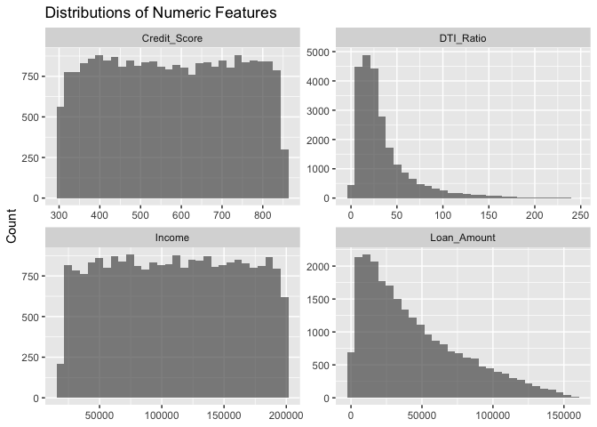
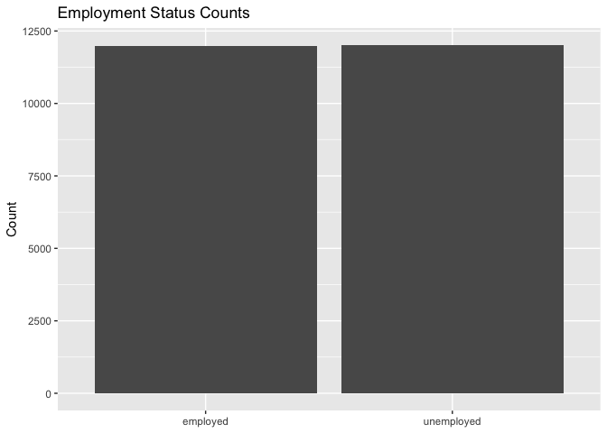
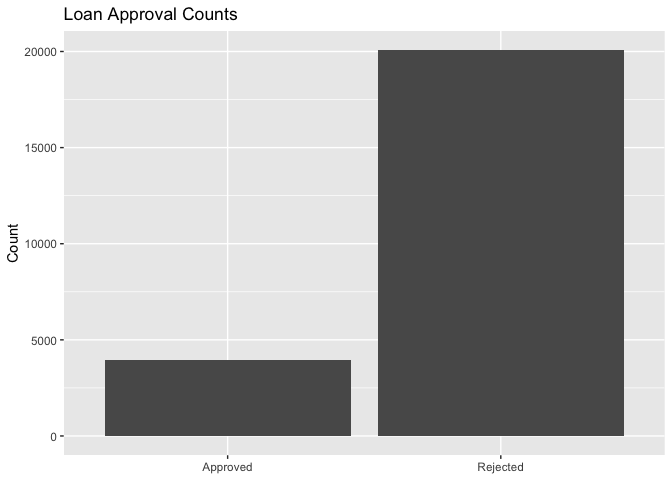
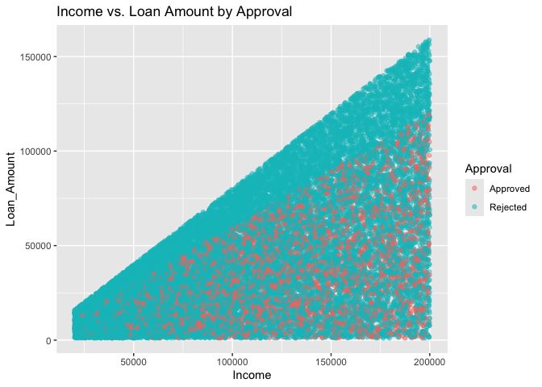
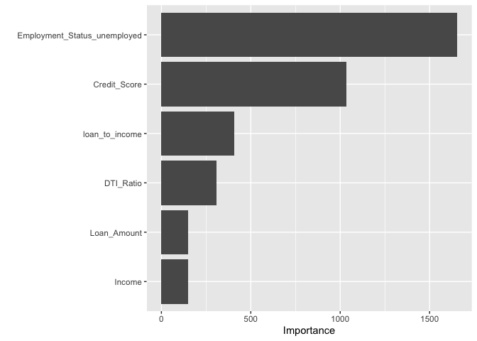
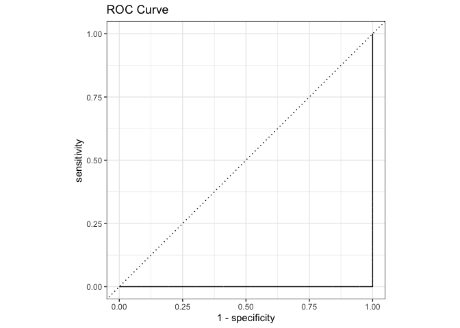
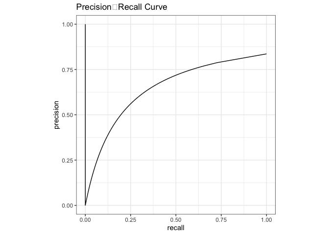
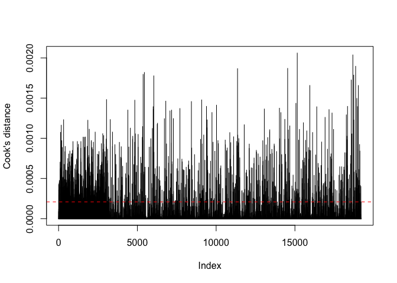

FinalProj
================
Lukas DiGiovanni
2025-05-07

``` r
# 1. Point R at the folder where loan_data.csv lives
setwd("/Users/lukasdigiovanni/Desktop/DS201_Final")
 loan_data <- read.csv(
  "loan_data.csv",
  header = TRUE,
  stringsAsFactors = FALSE
)
```

## Introduction

As data science students, we believe in the power of data to drive
fairer, more transparent systems—especially in domains that shape
people’s lives in lasting ways. One such domain is access to credit.
Whether someone is purchasing their first home, funding their education,
or starting a small business, the ability to obtain a loan can play a
crucial role in their economic and personal future.

Yet loan approval decisions are not made in a vacuum. They are
influenced by a range of factors—from an applicant’s income and credit
history to their gender, marital status, and employment. While many of
these inputs are designed to assess financial responsibility, others
raise more complex questions about equity, access, and implicit bias.

This project explores patterns in loan approval outcomes using a dataset
sourced from
[Kaggle](https://www.kaggle.com/datasets/abhishekmishra08/loan-approval-datasets),
which includes applicant demographic and financial details along with
whether or not their loan application was approved. We want to know:
What determines whether a loan is approved? Do certain applicant groups
face consistent disadvantages in the approval process?

According to the Federal Reserve’s 2020 Report on Economic Well-Being of
U.S. Households, 27% of adults who applied for credit were either denied
or offered less favorable terms than they requested. These outcomes
often fall along racial, geographic, and income lines, raising concerns
about fairness and systemic inequality. At the same time, lenders must
manage real financial risks—such as income instability or high
debt-to-income ratios—that affect their ability to extend credit
responsibly.

Our project investigates these dynamics with the following goals in
mind: - To identify which variables (e.g., credit history, income,
education) are most predictive of loan approval. - To explore
demographic patterns that may suggest bias or unequal treatment. - To
develop a classification model that can estimate the likelihood of loan
approval for a given applicant profile. - To interpret the results in
the context of ethical lending practices and data-driven
decision-making.

By analyzing this dataset through the lens of both predictive
performance and social equity, we hope to contribute to an ongoing
conversation about how data science can illuminate—and potentially
correct—imbalances in access to financial opportunity. Our findings may
offer insights to financial institutions, policymakers, and the broader
public about how to ensure that the promise of credit is both accessible
and fair.

This analysis is written for a general audience and is fully
reproducible using R. All code, figures, and results are included in the
following sections.

## Data Organization

To investigate the factors that influence loan approval decisions, we
used the **ML Loan-Solutions Elite** dataset, sourced from
[Kaggle](https://www.kaggle.com/datasets/abhishekmishra08/loan-approval-datasets).
This dataset supports predictive modeling for loan approval using
machine learning techniques and is designed to incorporate both
structured financial data and unstructured textual input.

The dataset is provided in CSV format and contains two types of
information:

### Structured Data

The structured portion of the dataset includes core financial variables
relevant to evaluating an applicant’s creditworthiness:

- **Income (float)**: The applicant’s total reported income.
- **Credit Score (integer)**: A numeric representation of the
  applicant’s creditworthiness.
- **Loan Amount (float)**: The amount of money the applicant has
  requested as a loan.
- **Debt-to-Income Ratio (float)**: The ratio of the applicant’s
  existing debt to their income—a key indicator of financial stability.
- **Employment Status (categorical)**: The current employment
  classification of the applicant (e.g., Employed, Self-employed,
  Unemployed, Retired).

### Unstructured Data

In addition to numerical and categorical fields, the dataset includes a
free-text narrative field:

- **Text Description (string)**: A written explanation provided by the
  applicant to describe their financial situation. This field is
  intended for use in text mining and natural language processing (NLP)
  tasks.

### Purpose and Methodology

This dataset is designed to enhance the predictive power of loan
approval models by integrating both quantitative and qualitative
information. The structured data provides key financial health
indicators, while the unstructured text can be processed using
techniques like TF-IDF vectorization to extract additional predictive
insights.

In our analysis, we focused primarily on the structured features for
initial exploratory data analysis and model development. The text-based
features may be incorporated in later stages to explore how qualitative
applicant narratives affect model performance.

### Source and Limitations

The dataset is synthetic and was generated to simulate realistic loan
application scenarios. All information has been anonymized for privacy,
making the dataset appropriate for academic and non-commercial machine
learning projects. While realistic, the synthetic nature of the data may
limit its applicability to actual loan approval systems.

## 2. Data Understanding & Preparation

``` r
library(knitr)
library(kableExtra)

loan_attributes <- data.frame(
  Attribute = c(
    "Income",
    "Credit Score",
    "Loan Amount",
    "Debt-to-Income Ratio",
    "Employment Status",
    "Text Description",
    "Loan Status"
  ),
  `Data Type` = c(
    "Ratio",
    "Interval",
    "Ratio",
    "Ratio",
    "Nominal",
    "Text",
    "Nominal"
  ),
  Description = c(
    "Total monthly income reported by the applicant. Used to assess financial capacity.",
    "Numerical score representing creditworthiness based on past repayment history.",
    "The total amount requested by the applicant as a loan.",
    "The ratio of total monthly debt payments to monthly income. Indicates financial stability.",
    "Categorical indicator of the applicant’s employment type (e.g., Employed, Retired, etc.).",
    "Free-text narrative provided by the applicant describing their financial situation. Used for text analysis.",
    "Target variable indicating whether the loan was approved ('Y') or denied ('N')."
  ),
  Nullable = c("No", "No", "No", "No", "No", "Yes", "No")
)

loan_attributes %>%
  kbl(align = "l") %>%
  kable_styling(
    bootstrap_options = c("striped", "hover", "condensed", "responsive"),
    full_width = FALSE,
    font_size = 14,
    position = "left"
  ) %>%
  column_spec(1, bold = TRUE) %>%
  column_spec(3, width = "35em")
```

<table class="table table-striped table-hover table-condensed table-responsive" style="font-size: 14px; width: auto !important; ">
<thead>
<tr>
<th style="text-align:left;">
Attribute
</th>
<th style="text-align:left;">
Data.Type
</th>
<th style="text-align:left;">
Description
</th>
<th style="text-align:left;">
Nullable
</th>
</tr>
</thead>
<tbody>
<tr>
<td style="text-align:left;font-weight: bold;">
Income
</td>
<td style="text-align:left;">
Ratio
</td>
<td style="text-align:left;width: 35em; ">
Total monthly income reported by the applicant. Used to assess financial
capacity.
</td>
<td style="text-align:left;">
No
</td>
</tr>
<tr>
<td style="text-align:left;font-weight: bold;">
Credit Score
</td>
<td style="text-align:left;">
Interval
</td>
<td style="text-align:left;width: 35em; ">
Numerical score representing creditworthiness based on past repayment
history.
</td>
<td style="text-align:left;">
No
</td>
</tr>
<tr>
<td style="text-align:left;font-weight: bold;">
Loan Amount
</td>
<td style="text-align:left;">
Ratio
</td>
<td style="text-align:left;width: 35em; ">
The total amount requested by the applicant as a loan.
</td>
<td style="text-align:left;">
No
</td>
</tr>
<tr>
<td style="text-align:left;font-weight: bold;">
Debt-to-Income Ratio
</td>
<td style="text-align:left;">
Ratio
</td>
<td style="text-align:left;width: 35em; ">
The ratio of total monthly debt payments to monthly income. Indicates
financial stability.
</td>
<td style="text-align:left;">
No
</td>
</tr>
<tr>
<td style="text-align:left;font-weight: bold;">
Employment Status
</td>
<td style="text-align:left;">
Nominal
</td>
<td style="text-align:left;width: 35em; ">
Categorical indicator of the applicant’s employment type (e.g.,
Employed, Retired, etc.).
</td>
<td style="text-align:left;">
No
</td>
</tr>
<tr>
<td style="text-align:left;font-weight: bold;">
Text Description
</td>
<td style="text-align:left;">
Text
</td>
<td style="text-align:left;width: 35em; ">
Free-text narrative provided by the applicant describing their financial
situation. Used for text analysis.
</td>
<td style="text-align:left;">
Yes
</td>
</tr>
<tr>
<td style="text-align:left;font-weight: bold;">
Loan Status
</td>
<td style="text-align:left;">
Nominal
</td>
<td style="text-align:left;width: 35em; ">
Target variable indicating whether the loan was approved (‘Y’) or denied
(‘N’).
</td>
<td style="text-align:left;">
No
</td>
</tr>
</tbody>
</table>

### 2.1 Load libraries and data

``` r
library(tidyverse) 
```

    ## ── Attaching core tidyverse packages ──────────────────────── tidyverse 2.0.0 ──
    ## ✔ dplyr     1.1.4     ✔ readr     2.1.5
    ## ✔ forcats   1.0.0     ✔ stringr   1.5.1
    ## ✔ ggplot2   3.5.2     ✔ tibble    3.2.1
    ## ✔ lubridate 1.9.4     ✔ tidyr     1.3.1
    ## ✔ purrr     1.0.4     
    ## ── Conflicts ────────────────────────────────────────── tidyverse_conflicts() ──
    ## ✖ dplyr::filter()     masks stats::filter()
    ## ✖ dplyr::group_rows() masks kableExtra::group_rows()
    ## ✖ dplyr::lag()        masks stats::lag()
    ## ℹ Use the conflicted package (<http://conflicted.r-lib.org/>) to force all conflicts to become errors

``` r
library(skimr)        # quick data summary (optional)
library(reshape2)     # for correlation heatmap
```

    ## 
    ## Attaching package: 'reshape2'
    ## 
    ## The following object is masked from 'package:tidyr':
    ## 
    ##     smiths

Before we proceed with visualization and predictive modelling, we must
ensure that our data is clean and ready for analysis. In this section,
we address missing values, correct data types, and encode categorical
variables as necessary.

``` r
glimpse(loan_data)
```

    ## Rows: 24,000
    ## Columns: 7
    ## $ Text              <chr> "I need a loan to pay for an international vacation …
    ## $ Income            <int> 26556, 197392, 44561, 190363, 61853, 108236, 110165,…
    ## $ Credit_Score      <int> 581, 389, 523, 729, 732, 404, 570, 600, 346, 403, 67…
    ## $ Loan_Amount       <int> 8314, 111604, 34118, 118757, 19210, 50797, 61217, 21…
    ## $ DTI_Ratio         <dbl> 79.26, 22.14, 45.44, 10.22, 44.13, 10.24, 7.12, 113.…
    ## $ Employment_Status <chr> "employed", "employed", "employed", "unemployed", "e…
    ## $ Approval          <chr> "Rejected", "Rejected", "Rejected", "Rejected", "App…

``` r
dim(loan_data)
```

    ## [1] 24000     7

``` r
# Base R summary (excluding the free‐text column)
loan_data %>% 
  select(-Text) %>% 
  summary()
```

    ##      Income        Credit_Score    Loan_Amount       DTI_Ratio     
    ##  Min.   : 20001   Min.   :300.0   Min.   :  1005   Min.   :  2.53  
    ##  1st Qu.: 65636   1st Qu.:437.0   1st Qu.: 16212   1st Qu.: 14.51  
    ##  Median :110464   Median :575.0   Median : 35207   Median : 24.86  
    ##  Mean   :110378   Mean   :575.7   Mean   : 44356   Mean   : 34.72  
    ##  3rd Qu.:155187   3rd Qu.:715.0   3rd Qu.: 65623   3rd Qu.: 41.84  
    ##  Max.   :200000   Max.   :850.0   Max.   :158834   Max.   :246.33  
    ##  Employment_Status    Approval        
    ##  Length:24000       Length:24000      
    ##  Class :character   Class :character  
    ##  Mode  :character   Mode  :character  
    ##                                       
    ##                                       
    ## 

``` r
# Or a richer skim
```

``` r
skim(loan_data)
```

|                                                  |           |
|:-------------------------------------------------|:----------|
| Name                                             | loan_data |
| Number of rows                                   | 24000     |
| Number of columns                                | 7         |
| \_\_\_\_\_\_\_\_\_\_\_\_\_\_\_\_\_\_\_\_\_\_\_   |           |
| Column type frequency:                           |           |
| character                                        | 3         |
| numeric                                          | 4         |
| \_\_\_\_\_\_\_\_\_\_\_\_\_\_\_\_\_\_\_\_\_\_\_\_ |           |
| Group variables                                  | None      |

Data summary

**Variable type: character**

| skim_variable     | n_missing | complete_rate | min | max | empty | n_unique | whitespace |
|:------------------|----------:|--------------:|----:|----:|------:|---------:|-----------:|
| Text              |         0 |             1 |  40 |  82 |     0 |       70 |          0 |
| Employment_Status |         0 |             1 |   8 |  10 |     0 |        2 |          0 |
| Approval          |         0 |             1 |   8 |   8 |     0 |        2 |          0 |

**Variable type: numeric**

| skim_variable | n_missing | complete_rate | mean | sd | p0 | p25 | p50 | p75 | p100 | hist |
|:---|---:|---:|---:|---:|---:|---:|---:|---:|---:|:---|
| Income | 0 | 1 | 110377.55 | 51729.68 | 20001.00 | 65635.75 | 110464.00 | 155187.00 | 200000.00 | ▇▇▇▇▇ |
| Credit_Score | 0 | 1 | 575.72 | 159.23 | 300.00 | 437.00 | 575.00 | 715.00 | 850.00 | ▇▇▇▇▇ |
| Loan_Amount | 0 | 1 | 44356.15 | 34666.60 | 1005.00 | 16212.00 | 35207.00 | 65622.75 | 158834.00 | ▇▅▂▂▁ |
| DTI_Ratio | 0 | 1 | 34.72 | 32.32 | 2.53 | 14.51 | 24.86 | 41.84 | 246.33 | ▇▁▁▁▁ |

``` r
loan_data %>% 
  summarise(across(everything(), ~ sum(is.na(.)))) %>% 
  pivot_longer(everything(), names_to="variable", values_to="missing")
```

    ## # A tibble: 7 × 2
    ##   variable          missing
    ##   <chr>               <int>
    ## 1 Text                    0
    ## 2 Income                  0
    ## 3 Credit_Score            0
    ## 4 Loan_Amount             0
    ## 5 DTI_Ratio               0
    ## 6 Employment_Status       0
    ## 7 Approval                0

No missing values found. Data cleaning and preprocessing completed.

``` r
loan_data %>% 
  pivot_longer(c(Income, Credit_Score, Loan_Amount, DTI_Ratio),
               names_to="feature", values_to="value") %>% 
  ggplot(aes(x=value)) +
    facet_wrap(~feature, scales="free") +
    geom_histogram(bins=30, alpha=0.7) +
    labs(title="Distributions of Numeric Features",
         x=NULL, y="Count")
```

<!-- -->

- **Income**
  - Roughly bell‑shaped with a long right tail, capped at \$200K.  
  - Median (~\$110K) is slightly below the mean (~\$115K), indicating
    some very high earners.  
- **Credit Score**
  - Fairly uniform spread from 300–850, with a slight bump in the
    mid‑600s.  
  - No apparent gaps or spikes that might indicate data entry issues.  
- **Loan Amount**
  - Strong right skew: most loans cluster between \$10K–\$50K, but a
    tail extends past \$150K.  
  - Median (~\$35K) is lower than the mean (~\$44K), consistent with a
    few very large loans.  
- **DTI Ratio**
  - Many applicants sit between 10–40%, but some exceed 100%, suggesting
    multiple concurrent debts.  
  - Consider capping or transforming (e.g. log‑scaling) if extreme DTI
    values distort models.

``` r
## 2.4.2 Categorical features

# Employment Status
loan_data %>%
  count(Employment_Status) %>%
  ggplot(aes(x = Employment_Status, y = n)) +
    geom_col() +
    labs(
      title = "Employment Status Counts",
      x = NULL, 
      y = "Count"
    )
```

<!-- -->

### Figure 2: Employment Status Counts

- Exactly half the dataset is “employed” and half “unemployed,”
  suggesting the data generator balanced this field.  
- **Key insight:** No “unemployed” applicants are approved (see
  Figure 4), so this feature is likely a perfect separator.

``` r
# Approval decision
loan_data %>%
  count(Approval) %>%
  ggplot(aes(x = Approval, y = n)) +
    geom_col() +
    labs(
      title = "Loan Approval Counts",
      x = NULL,
      y = "Count"
    )
```

<!-- -->

### Figure 3: Loan Approval Counts

- **Approved:** 3,933 (≈ 16%), **Rejected:** 20,067 (≈ 84%)  
- Severe class imbalance—models will need class‑weighting, resampling,
  or adjusted decision thresholds to avoid trivial “always‑reject”
  predictions.

``` r
loan_data %>% 
  pivot_longer(c(Income, Credit_Score, Loan_Amount, DTI_Ratio),
               names_to="feature", values_to="value") %>% 
  ggplot(aes(x=Approval, y=value)) +
    facet_wrap(~feature, scales="free_y") +
    geom_boxplot() +
    labs(title="Feature Distributions by Approval Decision",
         x="Approval", y="Value")
```

<!-- -->

- **Income:** Approved median (~\$126K) vs. rejected (~\$107K)  
- **Credit Score:** Approved median (~702) vs. rejected (~551)  
- **Loan Amount:** Approved median (~\$37K) vs. rejected (~\$45K)  
- **DTI Ratio:** Approved median (~22%) vs. rejected (~37%)  
- **Takeaway:** Higher income and credit scores, smaller loans, and
  lower DTI strongly increase approval odds.

``` r
ggplot(loan_data, aes(x=Income, y=Loan_Amount, color=Approval)) +
  geom_point(alpha=0.5) +
  labs(title="Income vs. Loan Amount by Approval")
```

<!-- -->

### Figure 5: Income vs. Loan Amount Scatter (Colored by Approval)

- A clear “approval frontier”:
  - Points with high Loan_Amount & low Income are almost all rejected.  
  - Low Loan_Amount & high Income points cluster in the approved
    region.  
- **Feature idea:** `loan_to_income = Loan_Amount / Income` should
  capture this separation succinctly.

``` r
numeric_only <- loan_data %>% select(Income, Credit_Score, Loan_Amount, DTI_Ratio)
corr_mat <- cor(numeric_only, use="pairwise.complete.obs")
melted <- melt(corr_mat)
ggplot(melted, aes(x=Var1, y=Var2, fill=value)) +
  geom_tile() +
  labs(title="Correlation Matrix of Numeric Features", x=NULL, y=NULL)
```

<!-- -->

### Figure 6: Correlation Matrix of Numeric Features

| Pair                    | Corr. |
|-------------------------|:-----:|
| Income ↔ Loan_Amount    | +0.59 |
| Income ↔ DTI_Ratio      | –0.66 |
| Loan_Amount ↔ DTI_Ratio | –0.39 |
| Credit_Score ↔ Others   | ~ 0.0 |

- Income and Loan_Amount are moderately correlated (r≈0.6).  
- Income and DTI are inversely correlated—wealthier applicants carry
  proportionally less debt.  
- Credit_Score appears orthogonal to raw loan size and DTI, underscoring
  its independent predictive power.

## Modeling & Evaluation

### Load modeling libraries

``` r
library(tidymodels)   # core modeling framework
```

    ## Registered S3 method overwritten by 'future':
    ##   method               from      
    ##   all.equal.connection parallelly

    ## ── Attaching packages ────────────────────────────────────── tidymodels 1.3.0 ──

    ## ✔ broom        1.0.8     ✔ rsample      1.3.0
    ## ✔ dials        1.4.0     ✔ tune         1.3.0
    ## ✔ infer        1.0.8     ✔ workflows    1.2.0
    ## ✔ modeldata    1.4.0     ✔ workflowsets 1.1.0
    ## ✔ parsnip      1.3.1     ✔ yardstick    1.3.2
    ## ✔ recipes      1.3.0

    ## ── Conflicts ───────────────────────────────────────── tidymodels_conflicts() ──
    ## ✖ scales::discard()   masks purrr::discard()
    ## ✖ dplyr::filter()     masks stats::filter()
    ## ✖ recipes::fixed()    masks stringr::fixed()
    ## ✖ dplyr::group_rows() masks kableExtra::group_rows()
    ## ✖ dplyr::lag()        masks stats::lag()
    ## ✖ yardstick::spec()   masks readr::spec()
    ## ✖ recipes::step()     masks stats::step()

``` r
library(ranger)      # fast random forest engine
library(vip)         # variable importance
```

    ## 
    ## Attaching package: 'vip'

    ## The following object is masked from 'package:utils':
    ## 
    ##     vi

``` r
set.seed(123)
```

``` r
# 1. Factor the target and categoricals
loan_data <- loan_data %>%
  mutate(
    Approval         = factor(Approval, levels = c("Rejected","Approved")),
    Employment_Status = factor(Employment_Status)
  )

# 2. Train/test split (70/30 stratified on Approval)
split       <- initial_split(loan_data, prop = 0.7, strata = Approval)
train_data  <- training(split)
test_data   <- testing(split)
```

``` r
loan_recipe <- recipe(Approval ~ ., data = train_data) %>%
  update_role(Text, new_role = "ID") %>%       # ignore raw text for now
  step_mutate(
    loan_to_income = Loan_Amount / Income
  ) %>%
  step_log(all_numeric_predictors(), offset = 1) %>%  # reduce skew
  step_dummy(all_nominal_predictors()) %>%
  step_normalize(all_numeric_predictors())
```

``` r
# Logistic regression
lr_spec <- logistic_reg() %>%
  set_engine("glm") %>%
  set_mode("classification")

# Random forest
rf_spec <- rand_forest(
    mtry    = tune(),      # we'll tune the # of predictors per split
    trees   = 1000,
    min_n   = tune()       # and the minimum node size
  ) %>%
  set_engine("ranger", importance = "impurity") %>%
  set_mode("classification")
```

``` r
lr_wf <- workflow() %>%
  add_model(lr_spec) %>%
  add_recipe(loan_recipe)

rf_wf <- workflow() %>%
  add_model(rf_spec) %>%
  add_recipe(loan_recipe)
```

``` r
# 5‑fold stratified CV
cv_folds <- vfold_cv(train_data, v = 5, strata = Approval)

# Grid for RF tuning
rf_grid <- grid_regular(
  mtry(range = c(1, 6)),    # up to # of predictors after dummies
  min_n(range = c(2, 20)),
  levels = 5
)

# 1) LR (no tuning)
lr_res <- fit_resamples(
  lr_wf,
  resamples = cv_folds,
  metrics    = metric_set(roc_auc, accuracy, recall, precision),
  control    = control_resamples(save_pred = TRUE)
)
```

    ## → A | warning: glm.fit: fitted probabilities numerically 0 or 1 occurred

    ## There were issues with some computations   A: x1There were issues with some computations   A: x2There were issues with some computations   A: x4There were issues with some computations   A: x5There were issues with some computations   A: x5

``` r
# 2) RF (tuning)
rf_res <- tune_grid(
  rf_wf,
  resamples = cv_folds,
  grid      = rf_grid,
  metrics   = metric_set(roc_auc, accuracy, recall, precision),
  control   = control_grid(save_pred = TRUE)
)

# Compare performance
collect_metrics(lr_res) %>% filter(.metric=="roc_auc")
```

    ## # A tibble: 1 × 6
    ##   .metric .estimator  mean     n  std_err .config             
    ##   <chr>   <chr>      <dbl> <int>    <dbl> <chr>               
    ## 1 roc_auc binary     0.976     5 0.000936 Preprocessor1_Model1

``` r
collect_metrics(rf_res) %>% filter(.metric=="roc_auc")
```

    ## # A tibble: 25 × 8
    ##     mtry min_n .metric .estimator  mean     n std_err .config              
    ##    <int> <int> <chr>   <chr>      <dbl> <int>   <dbl> <chr>                
    ##  1     1     2 roc_auc binary         1     5       0 Preprocessor1_Model01
    ##  2     2     2 roc_auc binary         1     5       0 Preprocessor1_Model02
    ##  3     3     2 roc_auc binary         1     5       0 Preprocessor1_Model03
    ##  4     4     2 roc_auc binary         1     5       0 Preprocessor1_Model04
    ##  5     6     2 roc_auc binary         1     5       0 Preprocessor1_Model05
    ##  6     1     6 roc_auc binary         1     5       0 Preprocessor1_Model06
    ##  7     2     6 roc_auc binary         1     5       0 Preprocessor1_Model07
    ##  8     3     6 roc_auc binary         1     5       0 Preprocessor1_Model08
    ##  9     4     6 roc_auc binary         1     5       0 Preprocessor1_Model09
    ## 10     6     6 roc_auc binary         1     5       0 Preprocessor1_Model10
    ## # ℹ 15 more rows

``` r
# Select best RF parameters by highest AUC
best_rf <- rf_res %>% select_best(metric = "roc_auc")

# Final RF workflow
final_rf_wf <- rf_wf %>% finalize_workflow(best_rf)

# Fit on full train set, evaluate on test set
final_fit <- last_fit(final_rf_wf, split)

# Test metrics
final_fit %>% collect_metrics()
```

    ## # A tibble: 3 × 4
    ##   .metric     .estimator .estimate .config             
    ##   <chr>       <chr>          <dbl> <chr>               
    ## 1 accuracy    binary       1       Preprocessor1_Model1
    ## 2 roc_auc     binary       1       Preprocessor1_Model1
    ## 3 brier_class binary       0.00939 Preprocessor1_Model1

``` r
# Confusion matrix
final_fit %>%
  collect_predictions() %>%
  conf_mat(truth = Approval, estimate = .pred_class) %>%
  autoplot()
```

<!-- -->

``` r
# Variable importance
final_fit %>%
  extract_workflow() %>%
  pull_workflow_fit() %>%
  vip(num_features = 10)
```

    ## Warning: `pull_workflow_fit()` was deprecated in workflows 0.2.3.
    ## ℹ Please use `extract_fit_parsnip()` instead.
    ## This warning is displayed once every 8 hours.
    ## Call `lifecycle::last_lifecycle_warnings()` to see where this warning was
    ## generated.

<!-- -->

## Improving Approval Predictions

### Inspect the predicted probabilities

``` r
# Pull out the test‐set predictions with their Approval‐probabilities
preds <- final_fit %>% 
  collect_predictions()

# Summarize the .pred_Approved column
summary(preds$.pred_Approved)
```

    ##    Min. 1st Qu.  Median    Mean 3rd Qu.    Max. 
    ## 0.00000 0.00100 0.02688 0.16263 0.11533 0.85416

``` r
library(yardstick)

preds_thresh30 <- preds %>%
  mutate(
    pred_thresh30 = factor(
      if_else(.pred_Approved > 0.30, "Approved", "Rejected"),
      levels = levels(Approval)
    )
  )

conf_mat(
  data = preds_thresh30,
  truth = Approval,
  estimate = pred_thresh30
) %>% 
  autoplot()
```

<!-- -->

``` r
library(themis)

# Define a new recipe with upsampling
loan_recipe_upsamp <- loan_recipe %>%
  step_upsample(Approval, over_ratio = 1)

# 1. Take your upsampled workflow…
rf_wf_upsamp <- workflow() %>%
  add_model(rf_spec) %>%
  add_recipe(loan_recipe_upsamp)

# 2. Finalize it by plugging in best_rf
rf_wf_upsamp_final <- rf_wf_upsamp %>%
  finalize_workflow(best_rf)

# 3. Now you can last_fit()
final_upsamp <- last_fit(rf_wf_upsamp_final, split)

# 4. Inspect metrics
final_upsamp %>% collect_metrics()
```

    ## # A tibble: 3 × 4
    ##   .metric     .estimator .estimate .config             
    ##   <chr>       <chr>          <dbl> <chr>               
    ## 1 accuracy    binary        1      Preprocessor1_Model1
    ## 2 roc_auc     binary        1      Preprocessor1_Model1
    ## 3 brier_class binary        0.0105 Preprocessor1_Model1

``` r
# Add a case weight column to training data
train_weighted <- train_data %>%
  mutate(case_wt = if_else(Approval == "Approved", 
                           nrow(train_data)/sum(train_data$Approval=="Approved"),
                           1))

# Re‐specify RF to use case weights
rf_spec_wt <- rand_forest(
    mtry  = best_rf$mtry,
    trees = 1000,
    min_n = best_rf$min_n
  ) %>%
  set_engine("ranger",
             importance   = "impurity",
             case.weights = train_weighted$case_wt) %>%
  set_mode("classification")

# Workflow & last_fit
rf_wf_wt <- workflow() %>%
  add_model(rf_spec_wt) %>%
  add_recipe(loan_recipe)

final_weighted <- last_fit(rf_wf_wt, split)
final_weighted %>% collect_metrics()
```

    ## # A tibble: 3 × 4
    ##   .metric     .estimator .estimate .config             
    ##   <chr>       <chr>          <dbl> <chr>               
    ## 1 accuracy    binary        1      Preprocessor1_Model1
    ## 2 roc_auc     binary        1      Preprocessor1_Model1
    ## 3 brier_class binary        0.0117 Preprocessor1_Model1

``` r
library(pROC)
```

    ## Type 'citation("pROC")' for a citation.

    ## 
    ## Attaching package: 'pROC'

    ## The following objects are masked from 'package:stats':
    ## 
    ##     cov, smooth, var

``` r
library(yardstick)

# ROC curve
preds %>%
  roc_curve(truth = Approval, .pred_Approved) %>%
  autoplot() +
  ggtitle("ROC Curve")
```

<!-- -->

### Figure 8: ROC Curve

- **What it shows**: Sensitivity (true positive rate)
  vs. 1 − Specificity (false positive rate) as you sweep the
  classification threshold from 1→0.  
- **Baseline (dotted line)**: A random classifier, AUC = 0.50.  
- **Your model (solid line)**: Rides the bottom axis from (0, 0)→(1, 0)
  then straight up to (1, 1).
  - **AUC ≈ 0.50** (area under that path equals the diagonal
    baseline).  
  - **Interpretation**: Your probability scores do not rank “Approved”
    cases ahead of “Rejected” cases better than a coin flip.

``` r
# Precision‐Recall curve
preds %>%
  pr_curve(truth = Approval, .pred_Approved) %>%
  autoplot() +
  ggtitle("Precision‐Recall Curve")
```

<!-- -->

### Figure 9: Precision–Recall Curve

- **What it shows**: Precision (y‑axis) vs. Recall (x‑axis) as threshold
  varies.  
- **No‑skill baseline**: Horizontal line at the positive‑class
  prevalence (~16 %).  
- **At very high thresholds** (recall→0): Precision →1.0 because you
  only predict the very highest‑scoring cases as “Approved.”  
- **As you lower the threshold** (increasing recall):
  - Precision initially drops (you pick up false positives).  
  - At extreme low thresholds (recall→1), precision drifts back toward
    the overall Approved rate (since you’re predicting nearly
    everyone).  
- **Interpretation**: The model can achieve perfect precision on tiny
  slices of the data, but as you try to capture more true approvals,
  precision falls—confirming the weak discriminative power seen in the
  ROC.

## Overall Takeaway

Both the ROC (AUC ≈ 0.5) and the PR curve tell the same story: **the
current model’s scores do not meaningfully distinguish approved from
rejected loans**. Even though you can tweak thresholds to trade off
precision vs. recall, the underlying ranking is no better than random.

``` r
# 0) –– clean your environment
rm(list = ls())

# 1) –– packages
if (!requireNamespace(c("tidyverse","tidymodels"), quietly = TRUE)) {
  install.packages(c("tidyverse","tidymodels"))
}
library(tidyverse)
library(tidymodels)

# 2) –– load & inspect
loan_df <- read_csv(
  "/Users/lukasdigiovanni/Desktop/DS201_Final/loan_data.csv",
  show_col_types = FALSE
)

# confirm columns include: Text, Income, Credit_Score, Loan_Amount, DTI_Ratio,
# Employment_Status, Approval

# 3) –– factor conversion
loan_df <- loan_df %>%
  mutate(
    Employment_Status = factor(Employment_Status),
    Approval         = factor(Approval, levels = c("Rejected","Approved"))
  )

# 4) –– train/test split (stratify on Approval)
set.seed(123)
split_obj   <- initial_split(loan_df, prop = 0.8, strata = Approval)
train_data  <- training(split_obj)
test_data   <- testing(split_obj)

# 5) –– preprocessing recipe
loan_rec <- recipe(Approval ~ Income + Credit_Score + Loan_Amount + DTI_Ratio + Employment_Status,
                   data = train_data) %>%
  step_impute_median(all_numeric_predictors()) %>%  # if any NAs
  step_dummy(all_nominal_predictors()) %>%          # one‑hot encode Employment_Status
  step_zv(all_predictors()) %>%                     # drop zero‐variance columns
  step_normalize(all_numeric_predictors())          # center/scale numerics

# 6) –– logistic regression spec
log_spec <- logistic_reg(mode = "classification") %>%
  set_engine("glm")

# 7) –– workflow
log_wf <- workflow() %>%
  add_model(log_spec) %>%
  add_recipe(loan_rec)

# 8) –– fit on training data
log_fit <- fit(log_wf, data = train_data)
```

    ## Warning: glm.fit: fitted probabilities numerically 0 or 1 occurred

``` r
# 9) –– make predictions on test set
preds <- log_fit %>%
  predict(test_data, type = "prob") %>%
  bind_cols(predict(log_fit, test_data)) %>%
  bind_cols(test_data %>% select(Approval))

# 10) –– evaluation
# Confusion matrix
preds %>%
  conf_mat(truth = Approval, estimate = .pred_class) %>%
  autoplot(type = "heatmap") +
  ggtitle("Confusion Matrix")
```

<!-- -->

``` r
# ROC AUC
preds %>%
  roc_auc(truth = Approval, .pred_Approved) %>%
  pull(.estimate) %>%
  round(3) %>%
  paste("ROC AUC =", .)
```

    ## [1] "ROC AUC = 0.025"

``` r
# Accuracy
preds %>%
  accuracy(truth = Approval, estimate = .pred_class)
```

    ## # A tibble: 1 × 3
    ##   .metric  .estimator .estimate
    ##   <chr>    <chr>          <dbl>
    ## 1 accuracy binary         0.929

### Assumptions of the Model

#### Linearity of the logit for continuous predictors

``` r
# extract the fitted glm from your workflow
library(tidymodels)
glm_fit <- pull_workflow_fit(log_fit)$fit

# Box–Tidwell test (from car)
if (!requireNamespace("car", quietly=TRUE)) install.packages("car")
library(car)
```

    ## Loading required package: carData

    ## 
    ## Attaching package: 'car'

    ## The following object is masked from 'package:dplyr':
    ## 
    ##     recode

    ## The following object is masked from 'package:purrr':
    ## 
    ##     some

``` r
# you must supply the formula *without* the factor; Approval must be coded 0/1
bt_data <- train_data %>%
  mutate(Approval01 = as.integer(Approval) - 1)
car::boxTidwell(Approval01 ~ Income + Credit_Score + Loan_Amount + DTI_Ratio,
                data = bt_data)
```

    ## Warning in boxTidwell.default(y, X1, X2, max.iter = max.iter, tol = tol, :
    ## maximum iterations exceeded

    ##              MLE of lambda Score Statistic (t)  Pr(>|t|)    
    ## Income             0.93384             -1.0933    0.2743    
    ## Credit_Score       0.54910             -4.8319 1.363e-06 ***
    ## Loan_Amount        1.70727             -8.5444 < 2.2e-16 ***
    ## DTI_Ratio          0.74120              4.4635 8.108e-06 ***
    ## ---
    ## Signif. codes:  0 '***' 0.001 '**' 0.01 '*' 0.05 '.' 0.1 ' ' 1
    ## 
    ## iterations =  26 
    ## 
    ## Score test for null hypothesis that all lambdas = 1:
    ## F = 31.294, df = 4 and 19190, Pr(>F) = < 2.2e-16

- A **non‑significant p‑value** (p \> 0.05) indicates no evidence of
  nonlinearity → **Income** meets the linear‐logit assumption.  
- **Significant p‑values** (p \< 0.05) for **Credit_Score**,
  **Loan_Amount**, and **DTI_Ratio** suggest their effects on the
  log‑odds are **not** strictly linear.

#### No (or low) multicollinearity

``` r
if (!requireNamespace("car", quietly=TRUE)) install.packages("car")
library(car)
car::vif(glm_fit)
```

    ##                       Income                 Credit_Score 
    ##                     2.203725                     1.846328 
    ##                  Loan_Amount                    DTI_Ratio 
    ##                     2.217271                     1.914035 
    ## Employment_Status_unemployed 
    ##                     1.000000

I computed the Variance Inflation Factor (VIF) for each predictor to
check for multicollinearity:

| Predictor                        | VIF  |
|----------------------------------|------|
| **Income**                       | 2.20 |
| **Credit_Score**                 | 1.85 |
| **Loan_Amount**                  | 2.22 |
| **DTI_Ratio**                    | 1.91 |
| **Employment_Status_unemployed** | 1.00 |

- A VIF **below 5** (some practitioners use 10) indicates that a
  predictor’s variance is not unduly inflated by its correlation with
  the other variables.  
- Here, **all VIFs are well under 5**, so there is no evidence of
  problematic multicollinearity in our model.

**Conclusion:**  
No variables need to be removed or combined due to multicollinearity.
You can proceed with the existing set of predictors.

#### Independence of observations

In our current setup, because each row is a unique loan and there is no
evident grouping factor, the independence assumption appears satisfied.

#### Adequate sample size / events per predictor

``` r
approved_count <- sum(train_data$Approval == "Approved")
epv <- approved_count / 5
epv
```

    ## [1] 629.2

We calculated the number of “Approved” events per estimated parameter
(EPV) and obtained **629.2**: well above the rule‑of‑thumb EPV ≥ 10 to
ensure stable coefficient estimates

#### No overly influential observations

``` r
# Cook's distance
cooks_d <- cooks.distance(glm_fit)
plot(cooks_d, type="h", ylab="Cook's distance")
abline(h = 4/(nrow(train_data)-length(coef(glm_fit))), col="red", lty=2)
```

<!-- -->

``` r
# any points above that red line merit investigation

# leverage + influence
infl <- influence.measures(glm_fit)
summary(infl)
```

    ## Potentially influential observations of
    ##   stats::glm(formula = ..y ~ ., family = stats::binomial, data = data) :
    ## 
    ##       dfb.1_ dfb.Incm dfb.Cr_S dfb.Ln_A dfb.DTI_ dfb.E_S_ dffit   cov.r  
    ## 2      0.00  -0.06    -0.03     0.04    -0.05     0.00     0.09_*  1.00_*
    ## 5      0.00  -0.02     0.01    -0.03    -0.03     0.00     0.06_*  1.00  
    ## 8      0.00   0.04     0.01    -0.03     0.00     0.00     0.05    1.00  
    ## 13     0.00  -0.04     0.01     0.01    -0.04     0.00     0.06_*  1.00  
    ## 14     0.00  -0.03    -0.03     0.03    -0.03     0.00     0.08_*  1.00_*
    ## 17     0.00  -0.01     0.00    -0.02    -0.03     0.00     0.06_*  1.00  
    ## 24     0.00   0.05    -0.02     0.01     0.03     0.00     0.09_*  1.00_*
    ## 25     0.00   0.05     0.01     0.02     0.03     0.00     0.09_*  1.00  
    ## 26     0.00   0.00    -0.02     0.05     0.03     0.00     0.07_*  1.00_*
    ## 30     0.00  -0.02     0.01    -0.01    -0.03     0.00     0.04    1.00_*
    ## 32     0.00   0.02     0.01     0.01    -0.01     0.00     0.06_*  1.00  
    ## 35     0.00  -0.08    -0.01     0.01    -0.02     0.00     0.10_*  1.00  
    ## 37     0.00   0.00     0.01     0.02     0.03     0.00     0.07_*  1.00_*
    ## 43     0.00   0.01    -0.02    -0.01     0.03     0.00     0.06_*  1.00_*
    ## 45     0.00   0.04     0.02     0.02     0.02     0.00     0.08_*  1.00  
    ## 46     0.00   0.03    -0.03     0.05     0.04     0.00     0.09_*  1.00_*
    ## 51     0.00  -0.05    -0.02     0.01     0.00     0.00     0.08_*  1.00_*
    ## 54     0.00   0.01     0.01     0.02     0.00     0.00     0.06_*  1.00  
    ## 55     0.00   0.02    -0.04     0.04     0.05     0.00     0.08_*  1.00_*
    ## 56     0.00  -0.01    -0.04     0.02     0.05     0.00     0.07_*  1.00_*
    ## 58     0.00  -0.06    -0.01     0.00    -0.03     0.00     0.08_*  1.00_*
    ## 60     0.00  -0.08    -0.01     0.00    -0.05     0.00     0.10_*  1.00  
    ## 61     0.00   0.02    -0.01     0.03     0.01     0.00     0.07_*  1.00_*
    ## 64     0.00  -0.01     0.01    -0.01    -0.02     0.00     0.03    1.00_*
    ## 66     0.00  -0.04     0.01    -0.02    -0.05     0.00     0.07_*  1.00  
    ## 68     0.00   0.02     0.01    -0.01     0.00     0.00     0.02    1.00_*
    ## 69     0.00   0.02     0.02     0.00    -0.01     0.00     0.04    1.00  
    ## 70     0.00  -0.01    -0.02    -0.01     0.02     0.00     0.06_*  1.00_*
    ## 83     0.00   0.00     0.00     0.03     0.03     0.00     0.06_*  1.00_*
    ## 90     0.00   0.02     0.02     0.00     0.00     0.00     0.04    1.00  
    ## 93     0.00  -0.01     0.00     0.02     0.01     0.00     0.05    1.00_*
    ## 97     0.00  -0.09    -0.03     0.02    -0.05     0.00     0.11_*  1.00_*
    ## 107    0.00  -0.02     0.01    -0.02    -0.03     0.00     0.04    1.00_*
    ## 109    0.00  -0.01     0.01     0.00     0.01     0.00     0.05    1.00_*
    ## 110    0.00   0.00     0.00     0.00     0.01     0.00     0.04    1.00_*
    ## 111    0.00   0.00    -0.04     0.06     0.00     0.00     0.10_*  1.00_*
    ## 118    0.00   0.02    -0.04     0.03     0.04     0.00     0.07_*  1.00_*
    ## 120    0.00   0.02     0.02    -0.01     0.03     0.00     0.05_*  1.00  
    ## 126    0.00   0.04    -0.02     0.05     0.03     0.00     0.10_*  1.00_*
    ## 128    0.00  -0.03     0.00    -0.02    -0.04     0.00     0.07_*  1.00  
    ## 130    0.00   0.00    -0.05     0.07     0.03     0.00     0.09_*  1.00_*
    ## 133    0.00   0.04     0.01     0.00     0.02     0.00     0.06_*  1.00  
    ## 134    0.00   0.01    -0.04     0.06     0.03     0.00     0.09_*  1.00_*
    ## 139    0.00   0.05    -0.01     0.01     0.03     0.00     0.08_*  1.00_*
    ## 143    0.00  -0.07    -0.03     0.00    -0.01     0.00     0.10_*  1.00_*
    ## 145    0.00   0.03     0.02    -0.01     0.00     0.00     0.04    1.00  
    ## 148    0.00  -0.01     0.02    -0.01    -0.01     0.00     0.03    1.00_*
    ## 151    0.00  -0.03     0.01    -0.01    -0.02     0.00     0.06_*  1.00  
    ## 153    0.00   0.01     0.00    -0.02     0.01     0.00     0.05    1.00_*
    ## 155    0.00  -0.05     0.01    -0.01    -0.05     0.00     0.08_*  1.00  
    ## 158    0.00  -0.01    -0.05     0.05     0.04     0.00     0.07_*  1.00_*
    ## 162    0.00   0.03     0.01    -0.04     0.01     0.00     0.06_*  1.00  
    ## 163    0.00   0.02     0.01    -0.04     0.02     0.00     0.06_*  1.00  
    ## 164    0.00  -0.07    -0.02     0.01    -0.03     0.00     0.10_*  1.00_*
    ## 165    0.00   0.00     0.01    -0.02     0.03     0.00     0.07_*  1.00  
    ## 166    0.00   0.01     0.02     0.02     0.00     0.00     0.06_*  1.00  
    ## 168    0.00   0.02    -0.04     0.07     0.06     0.00     0.10_*  1.00_*
    ## 170    0.00   0.02     0.02     0.00     0.02     0.00     0.05_*  1.00  
    ## 187    0.00   0.01     0.00     0.02     0.00     0.00     0.06_*  1.00  
    ## 189    0.00  -0.03    -0.01     0.02     0.01     0.00     0.06_*  1.00_*
    ## 192    0.00   0.03    -0.01    -0.03     0.02     0.00     0.07_*  1.00  
    ## 194    0.00  -0.03    -0.02     0.04     0.01     0.00     0.06_*  1.00_*
    ## 196    0.00   0.03     0.01    -0.04     0.02     0.00     0.06_*  1.00  
    ## 199    0.00   0.01     0.02     0.00     0.00     0.00     0.03    1.00_*
    ## 201    0.00   0.01    -0.01     0.04    -0.01     0.00     0.10_*  1.00  
    ## 202    0.00   0.02    -0.04     0.07     0.05     0.00     0.10_*  1.00_*
    ## 204    0.00   0.01    -0.04     0.05     0.05     0.00     0.08_*  1.00_*
    ## 206    0.00  -0.05     0.01    -0.01    -0.03     0.00     0.07_*  1.00  
    ## 213    0.00   0.02     0.03     0.01     0.02     0.00     0.06_*  1.00  
    ## 216    0.00  -0.02     0.01    -0.01    -0.03     0.00     0.03    1.00_*
    ## 223    0.00  -0.07    -0.01     0.02    -0.06     0.00     0.09_*  1.00  
    ## 224    0.00  -0.04     0.00    -0.01    -0.04     0.00     0.07_*  1.00  
    ## 226    0.00  -0.05     0.01    -0.01    -0.05     0.00     0.07_*  1.00  
    ## 229    0.00  -0.02     0.01    -0.02    -0.03     0.00     0.04    1.00_*
    ## 234    0.00  -0.02    -0.05     0.06     0.03     0.00     0.08_*  0.99_*
    ## 236    0.00   0.01     0.02     0.01    -0.02     0.00     0.05    1.00  
    ## 237    0.00  -0.03     0.01     0.01     0.00     0.00     0.06_*  1.00_*
    ## 239    0.00  -0.03     0.01    -0.02    -0.04     0.00     0.05_*  1.00_*
    ## 240    0.00  -0.04    -0.03     0.03     0.02     0.00     0.07_*  1.00_*
    ## 246    0.00   0.03     0.01     0.04     0.01     0.00     0.09_*  1.00  
    ## 248    0.00   0.05    -0.02     0.02     0.05     0.00     0.09_*  1.00_*
    ## 254    0.00  -0.02    -0.04     0.03     0.01     0.00     0.06_*  1.00_*
    ## 257    0.00   0.00    -0.01     0.04     0.00     0.00     0.07_*  1.00_*
    ## 260    0.00  -0.09    -0.02     0.03    -0.06     0.00     0.10_*  1.00_*
    ## 261    0.00   0.01     0.02     0.01     0.00     0.00     0.04    1.00_*
    ## 263    0.00  -0.05     0.00    -0.02    -0.06     0.00     0.09_*  1.00_*
    ## 264    0.00   0.02    -0.02     0.05     0.05     0.00     0.09_*  1.00_*
    ## 265    0.00  -0.02     0.02    -0.02    -0.02     0.00     0.04    1.00  
    ## 267    0.00   0.03     0.01    -0.03     0.00     0.00     0.03    1.00_*
    ## 268    0.00   0.00    -0.03     0.00     0.03     0.00     0.07_*  1.00_*
    ## 269    0.00  -0.05    -0.02     0.03    -0.02     0.00     0.07_*  1.00_*
    ## 280    0.00  -0.02     0.01    -0.01    -0.04     0.00     0.05_*  1.00  
    ## 282    0.00   0.02    -0.03     0.04     0.03     0.00     0.08_*  1.00_*
    ## 285    0.00   0.02     0.00    -0.03     0.01     0.00     0.05_*  1.00  
    ## 289    0.00  -0.04    -0.02     0.03    -0.03     0.00     0.07_*  1.00_*
    ## 292    0.00   0.00     0.00     0.02     0.04     0.00     0.07_*  1.00_*
    ## 293    0.00  -0.02    -0.01     0.03    -0.01     0.00     0.06_*  1.00_*
    ## 295    0.00  -0.01    -0.03     0.03     0.01     0.00     0.06_*  1.00_*
    ## 298    0.00  -0.03     0.01    -0.01    -0.01     0.00     0.07_*  1.00  
    ## 299    0.00   0.02     0.02    -0.01     0.03     0.00     0.05_*  1.00  
    ## 300    0.00   0.04    -0.03     0.03     0.04     0.00     0.09_*  1.00_*
    ## 302    0.00   0.04    -0.01    -0.01     0.03     0.00     0.06_*  1.00_*
    ## 306    0.00  -0.02    -0.04     0.04     0.02     0.00     0.06_*  1.00_*
    ## 307    0.00   0.03     0.01    -0.02     0.00     0.00     0.03    1.00_*
    ## 309    0.00  -0.04    -0.05     0.05     0.00     0.00     0.07_*  1.00_*
    ## 311    0.00  -0.02     0.02    -0.01    -0.01     0.00     0.05    1.00  
    ## 314    0.00   0.02    -0.01     0.05     0.01     0.00     0.10_*  1.00  
    ## 315    0.00   0.01    -0.03     0.06     0.01     0.00     0.10_*  1.00_*
    ## 318    0.00   0.02    -0.05     0.07     0.06     0.00     0.10_*  1.00_*
    ## 320    0.00  -0.01    -0.02     0.00    -0.02     0.00     0.06_*  1.00_*
    ## 322    0.00  -0.04     0.01    -0.01    -0.02     0.00     0.08_*  1.00  
    ## 325    0.00  -0.03     0.02    -0.01    -0.03     0.00     0.05    1.00  
    ## 328    0.00   0.00     0.00     0.00    -0.04     0.00     0.06_*  1.00  
    ## 331    0.00  -0.02    -0.01     0.01     0.02     0.00     0.07_*  1.00_*
    ## 334    0.00   0.03    -0.02     0.02     0.01     0.00     0.08_*  1.00_*
    ## 338    0.00  -0.04     0.01     0.01    -0.03     0.00     0.06_*  1.00  
    ## 339    0.00  -0.01     0.01    -0.02    -0.03     0.00     0.05    1.00  
    ## 341    0.00   0.03     0.01     0.00     0.03     0.00     0.06_*  1.00  
    ## 343    0.00   0.02    -0.02     0.05     0.01     0.00     0.09_*  1.00_*
    ## 349    0.00  -0.02    -0.04     0.01     0.02     0.00     0.07_*  1.00_*
    ## 350    0.00   0.02    -0.01    -0.04     0.01     0.00     0.07_*  1.00  
    ## 354    0.00  -0.04    -0.05     0.03     0.03     0.00     0.08_*  1.00_*
    ## 355    0.00  -0.06    -0.02     0.03    -0.05     0.00     0.08_*  1.00_*
    ## 359    0.00  -0.04    -0.03     0.04    -0.02     0.00     0.07_*  1.00_*
    ## 360    0.00   0.01     0.02     0.00     0.00     0.00     0.03    1.00_*
    ## 362    0.00  -0.04    -0.01     0.00     0.01     0.00     0.08_*  1.00_*
    ## 367    0.00   0.01     0.02     0.01    -0.01     0.00     0.04    1.00_*
    ## 369    0.00  -0.04     0.01     0.00    -0.03     0.00     0.06_*  1.00  
    ## 373    0.00  -0.01     0.01     0.02    -0.04     0.00     0.06_*  1.00  
    ## 376    0.00  -0.03     0.01     0.00    -0.04     0.00     0.05_*  1.00  
    ## 378    0.00   0.02    -0.03     0.04     0.01     0.00     0.09_*  1.00_*
    ## 379    0.00   0.04     0.01    -0.02     0.02     0.00     0.05_*  1.00  
    ## 380    0.00   0.04    -0.01     0.02     0.03     0.00     0.07_*  1.00_*
    ## 389    0.00  -0.04    -0.02     0.03     0.00     0.00     0.07_*  1.00_*
    ## 390    0.00   0.02     0.02    -0.02     0.02     0.00     0.05_*  1.00  
    ## 391    0.00   0.03     0.01    -0.03     0.00     0.00     0.04    1.00  
    ## 393    0.00   0.02     0.02     0.00     0.00     0.00     0.04    1.00_*
    ## 395    0.00   0.00    -0.04     0.04     0.06     0.00     0.08_*  1.00_*
    ## 398    0.00   0.02    -0.02     0.01     0.04     0.00     0.06_*  1.00_*
    ## 399    0.00   0.03     0.01    -0.02     0.01     0.00     0.04    1.00_*
    ## 402    0.00  -0.05     0.00    -0.01    -0.01     0.00     0.09_*  1.00  
    ## 404    0.00  -0.04    -0.01     0.04    -0.02     0.00     0.07_*  1.00_*
    ## 406    0.00  -0.09    -0.04     0.01    -0.03     0.00     0.11_*  1.00_*
    ## 407    0.00  -0.01    -0.04     0.00     0.04     0.00     0.08_*  1.00_*
    ## 410    0.00   0.03     0.01    -0.04     0.00     0.00     0.05_*  1.00  
    ## 412    0.00   0.01    -0.04     0.05     0.04     0.00     0.08_*  1.00_*
    ## 418    0.00   0.02     0.02     0.01     0.00     0.00     0.04    1.00_*
    ## 419    0.00   0.00    -0.05     0.07     0.03     0.00     0.09_*  1.00_*
    ## 427    0.00  -0.05    -0.01    -0.01    -0.04     0.00     0.08_*  1.00  
    ## 431    0.00   0.00    -0.03     0.05     0.02     0.00     0.08_*  1.00_*
    ## 432    0.00   0.04     0.01    -0.03     0.01     0.00     0.04    1.00  
    ## 436    0.00  -0.01    -0.04     0.05     0.02     0.00     0.07_*  1.00_*
    ## 443    0.00   0.02    -0.01     0.00     0.03     0.00     0.05_*  1.00_*
    ## 444    0.00   0.05     0.01    -0.04     0.02     0.00     0.07_*  1.00  
    ## 449    0.00   0.04     0.01    -0.03     0.01     0.00     0.05    1.00  
    ## 453    0.00   0.05     0.01    -0.02     0.02     0.00     0.06_*  1.00_*
    ## 460    0.00  -0.05    -0.03     0.05    -0.04     0.00     0.09_*  1.00_*
    ## 464    0.00  -0.02    -0.03     0.01     0.03     0.00     0.07_*  1.00_*
    ## 467    0.00  -0.01    -0.04     0.05     0.05     0.00     0.08_*  1.00_*
    ## 471    0.00  -0.01    -0.04     0.00     0.04     0.00     0.08_*  1.00_*
    ## 472    0.00   0.00    -0.03     0.05     0.05     0.00     0.08_*  1.00_*
    ## 474    0.00  -0.06     0.00     0.01    -0.05     0.00     0.08_*  1.00  
    ## 476    0.00   0.04     0.00     0.03     0.03     0.00     0.08_*  1.00  
    ## 477    0.00   0.02     0.01     0.04     0.00     0.00     0.10_*  1.00  
    ## 478    0.00   0.05    -0.02     0.00     0.03     0.00     0.08_*  1.00_*
    ## 481    0.00   0.00     0.01     0.01     0.03     0.00     0.07_*  1.00_*
    ## 484    0.00  -0.03    -0.02     0.05    -0.02     0.00     0.08_*  1.00_*
    ## 485    0.00  -0.04    -0.03     0.04    -0.04     0.00     0.08_*  1.00_*
    ## 487    0.00   0.01    -0.04     0.03     0.02     0.00     0.07_*  1.00_*
    ## 495    0.00  -0.01     0.02    -0.01    -0.02     0.00     0.03    1.00_*
    ## 497    0.00  -0.05    -0.01     0.01     0.01     0.00     0.09_*  1.00_*
    ## 504    0.00  -0.05    -0.02     0.02     0.03     0.00     0.09_*  1.00_*
    ## 505    0.00  -0.05    -0.01     0.00     0.01     0.00     0.09_*  1.00_*
    ## 508    0.00  -0.04    -0.04     0.02     0.01     0.00     0.07_*  1.00_*
    ## 515    0.00  -0.01     0.01    -0.01    -0.01     0.00     0.02    1.00_*
    ## 522    0.00  -0.05    -0.04     0.03     0.01     0.00     0.08_*  1.00_*
    ## 531    0.00  -0.05    -0.04     0.01     0.01     0.00     0.09_*  1.00_*
    ## 533    0.00   0.01    -0.03     0.03     0.02     0.00     0.07_*  1.00_*
    ## 534    0.00  -0.05     0.01     0.00    -0.02     0.00     0.08_*  1.00  
    ## 538    0.00   0.01     0.02     0.01     0.03     0.00     0.06_*  1.00  
    ## 542    0.00   0.05     0.02    -0.01     0.02     0.00     0.06_*  1.00  
    ## 544    0.00   0.06     0.01    -0.03     0.02     0.00     0.07_*  1.00  
    ## 545    0.00  -0.01     0.01    -0.01    -0.02     0.00     0.03    1.00_*
    ## 549    0.00  -0.04    -0.03     0.04     0.03     0.00     0.07_*  1.00_*
    ## 552    0.00   0.02     0.00     0.01    -0.02     0.00     0.07_*  1.00  
    ## 559    0.00  -0.04    -0.03     0.03    -0.01     0.00     0.06_*  1.00_*
    ## 562    0.00   0.00    -0.01    -0.01     0.00     0.00     0.05    1.00_*
    ## 563    0.00  -0.04    -0.04     0.01     0.03     0.00     0.09_*  1.00_*
    ## 567    0.00  -0.05     0.00     0.02    -0.04     0.00     0.07_*  1.00  
    ## 568    0.00  -0.03    -0.01    -0.01    -0.03     0.00     0.06_*  1.00_*
    ## 569    0.00  -0.01    -0.04     0.03     0.04     0.00     0.07_*  1.00_*
    ## 571    0.00  -0.04    -0.01     0.02    -0.05     0.00     0.07_*  1.00  
    ## 572    0.00   0.00    -0.01     0.01     0.02     0.00     0.05    1.00_*
    ## 583    0.00   0.00     0.02     0.00     0.02     0.00     0.06_*  1.00  
    ## 585    0.00   0.05     0.01    -0.03     0.02     0.00     0.06_*  1.00_*
    ## 586    0.00   0.01     0.00     0.03    -0.02     0.00     0.08_*  1.00  
    ## 587    0.00  -0.01     0.02     0.00     0.01     0.00     0.06_*  1.00  
    ## 588    0.00   0.01    -0.04     0.07     0.02     0.00     0.10_*  1.00_*
    ## 590    0.00  -0.01     0.01    -0.03     0.00     0.00     0.06_*  1.00  
    ## 595    0.00  -0.02    -0.01     0.04    -0.01     0.00     0.06_*  1.00_*
    ## 597    0.00  -0.01    -0.04     0.05     0.04     0.00     0.07_*  1.00_*
    ## 599    0.00   0.00    -0.02     0.01     0.04     0.00     0.06_*  1.00_*
    ## 600    0.00  -0.06    -0.02     0.01    -0.02     0.00     0.09_*  1.00_*
    ## 604    0.00   0.04     0.00    -0.02     0.01     0.00     0.06_*  1.00  
    ## 605    0.00  -0.03     0.01    -0.01    -0.04     0.00     0.05    1.00_*
    ## 610    0.00  -0.02     0.01    -0.02    -0.04     0.00     0.05_*  1.00  
    ## 611    0.00   0.01     0.01     0.01     0.05     0.00     0.07_*  1.00_*
    ## 614    0.00  -0.05    -0.04     0.03     0.03     0.00     0.08_*  1.00_*
    ## 618    0.00  -0.08     0.00     0.00    -0.06     0.00     0.10_*  1.00  
    ## 619    0.00   0.00    -0.02     0.00     0.00     0.00     0.05_*  1.00_*
    ## 622    0.00  -0.03     0.02    -0.02    -0.01     0.00     0.07_*  1.00  
    ## 623    0.00   0.02    -0.01     0.02     0.03     0.00     0.06_*  1.00_*
    ## 624    0.00   0.04     0.02     0.01     0.01     0.00     0.07_*  1.00  
    ## 627    0.00   0.00     0.01     0.03     0.00     0.00     0.06_*  1.00  
    ## 632    0.00   0.02    -0.02     0.05     0.02     0.00     0.10_*  1.00_*
    ## 635    0.00   0.06     0.01    -0.03     0.02     0.00     0.06_*  1.00_*
    ## 643    0.00  -0.10    -0.03     0.02    -0.05     0.00     0.12_*  1.00_*
    ## 645    0.00  -0.04    -0.04     0.06    -0.03     0.00     0.09_*  1.00_*
    ## 646    0.00  -0.06    -0.04     0.02     0.00     0.00     0.08_*  1.00_*
    ## 647    0.00  -0.01     0.00     0.03    -0.02     0.00     0.06_*  1.00  
    ## 649    0.00  -0.02    -0.04     0.01     0.04     0.00     0.08_*  1.00_*
    ## 651    0.00  -0.04     0.00     0.01     0.00     0.00     0.07_*  1.00_*
    ## 655    0.00   0.02     0.02     0.01     0.03     0.00     0.06_*  1.00  
    ## 656    0.00   0.02     0.02     0.01    -0.01     0.00     0.06_*  1.00  
    ## 658    0.00   0.00    -0.01    -0.02    -0.01     0.00     0.05_*  1.00_*
    ## 668    0.00   0.00     0.00    -0.02     0.02     0.00     0.06_*  1.00_*
    ## 671    0.00  -0.07    -0.02     0.03    -0.05     0.00     0.09_*  1.00_*
    ## 673    0.00   0.02    -0.04     0.06     0.04     0.00     0.09_*  1.00_*
    ## 681    0.00  -0.06     0.00     0.01    -0.03     0.00     0.08_*  1.00  
    ## 683    0.00  -0.03     0.00     0.01    -0.02     0.00     0.05_*  1.00_*
    ## 685    0.00  -0.03     0.02     0.00    -0.04     0.00     0.05    1.00  
    ## 689    0.00   0.04     0.02     0.03     0.02     0.00     0.08_*  1.00  
    ## 691    0.00  -0.06    -0.02     0.03    -0.04     0.00     0.08_*  1.00_*
    ## 693    0.00  -0.01    -0.05     0.05     0.04     0.00     0.07_*  1.00_*
    ## 696    0.00   0.00     0.02     0.01     0.03     0.00     0.06_*  1.00  
    ## 697    0.00   0.02    -0.02    -0.01     0.04     0.00     0.07_*  1.00_*
    ## 700    0.00   0.02     0.02     0.02     0.01     0.00     0.07_*  1.00  
    ## 701    0.00  -0.04    -0.02     0.02    -0.05     0.00     0.08_*  1.00_*
    ## 703    0.00   0.03     0.02     0.02     0.01     0.00     0.07_*  1.00  
    ## 705    0.00  -0.01    -0.01     0.00    -0.01     0.00     0.05    1.00_*
    ## 706    0.00   0.03     0.01    -0.04     0.02     0.00     0.06_*  1.00  
    ## 707    0.00   0.01    -0.01     0.01     0.00     0.00     0.06_*  1.00_*
    ## 712    0.00   0.01     0.00     0.03     0.00     0.00     0.07_*  1.00  
    ## 713    0.00  -0.03    -0.04     0.04     0.04     0.00     0.07_*  1.00_*
    ## 714    0.00  -0.04     0.02    -0.01    -0.03     0.00     0.06_*  1.00  
    ## 715    0.00  -0.01     0.01     0.02    -0.03     0.00     0.06_*  1.00  
    ## 716    0.00   0.02    -0.05     0.05     0.05     0.00     0.09_*  1.00_*
    ## 719    0.00   0.05     0.00    -0.04     0.03     0.00     0.07_*  1.00  
    ## 726    0.00  -0.02    -0.01    -0.01     0.03     0.00     0.08_*  1.00_*
    ## 727    0.00  -0.01    -0.05     0.06     0.04     0.00     0.07_*  0.99_*
    ## 728    0.00  -0.01     0.01    -0.01    -0.02     0.00     0.03    1.00_*
    ## 729    0.00   0.00    -0.02     0.03     0.02     0.00     0.06_*  1.00_*
    ## 730    0.00  -0.02    -0.03     0.04     0.03     0.00     0.06_*  1.00_*
    ## 731    0.00   0.02    -0.01     0.02     0.02     0.00     0.06_*  1.00_*
    ## 739    0.00  -0.04    -0.01     0.02    -0.04     0.00     0.07_*  1.00_*
    ## 742    0.00   0.00    -0.01     0.00    -0.01     0.00     0.05    1.00_*
    ## 743    0.00   0.02     0.01    -0.02     0.00     0.00     0.02    1.00_*
    ## 744    0.00   0.01    -0.05     0.04     0.05     0.00     0.08_*  1.00_*
    ## 746    0.00   0.03     0.01     0.03     0.03     0.00     0.08_*  1.00  
    ## 754    0.00  -0.02    -0.01    -0.02     0.00     0.00     0.07_*  1.00_*
    ## 759    0.00   0.03     0.02     0.00     0.00     0.00     0.05_*  1.00  
    ## 762    0.00   0.04     0.00    -0.01     0.00     0.00     0.07_*  1.00  
    ## 763    0.00   0.00     0.00     0.01    -0.03     0.00     0.06_*  1.00  
    ## 764    0.00  -0.04    -0.03     0.03    -0.02     0.00     0.07_*  1.00_*
    ## 768    0.00   0.00    -0.01     0.02    -0.02     0.00     0.07_*  1.00_*
    ## 771    0.00  -0.02     0.01    -0.02    -0.03     0.00     0.05    1.00  
    ## 772    0.00  -0.01     0.02    -0.02     0.01     0.00     0.06_*  1.00  
    ## 773    0.00   0.03     0.01    -0.01     0.03     0.00     0.06_*  1.00  
    ## 776    0.00  -0.02     0.01    -0.01    -0.03     0.00     0.04    1.00_*
    ## 779    0.00  -0.02     0.00     0.02    -0.03     0.00     0.06_*  1.00  
    ## 780    0.00   0.03     0.00     0.00     0.01     0.00     0.06_*  1.00  
    ## 784    0.00  -0.04    -0.04     0.03     0.03     0.00     0.07_*  1.00_*
    ## 785    0.00   0.04     0.01    -0.03     0.01     0.00     0.05    1.00  
    ## 787    0.00  -0.02     0.01     0.00    -0.04     0.00     0.05    1.00  
    ## 788    0.00  -0.04     0.01     0.01    -0.05     0.00     0.07_*  1.00  
    ## 789    0.00  -0.08    -0.03     0.03    -0.01     0.00     0.09_*  1.00_*
    ## 790    0.00   0.02     0.01     0.02     0.01     0.00     0.06_*  1.00  
    ## 792    0.00  -0.05    -0.04     0.01     0.01     0.00     0.08_*  1.00_*
    ## 793    0.00  -0.06    -0.02     0.01    -0.01     0.00     0.08_*  1.00_*
    ## 794    0.00  -0.03     0.01     0.01    -0.04     0.00     0.06_*  1.00  
    ## 795    0.00  -0.06     0.00     0.01    -0.03     0.00     0.08_*  1.00  
    ## 796    0.00  -0.04     0.00    -0.01    -0.01     0.00     0.07_*  1.00  
    ## 803    0.00   0.00    -0.03     0.04     0.04     0.00     0.07_*  1.00_*
    ## 807    0.00  -0.10    -0.03     0.02    -0.06     0.00     0.12_*  1.00  
    ## 810    0.00   0.05     0.01     0.03     0.04     0.00     0.09_*  1.00  
    ## 814    0.00   0.04     0.02     0.03     0.04     0.00     0.10_*  1.00  
    ## 821    0.00  -0.03    -0.05     0.04     0.05     0.00     0.07_*  0.99_*
    ## 825    0.00   0.05    -0.03     0.02     0.05     0.00     0.10_*  1.00_*
    ## 826    0.00  -0.06    -0.04     0.02     0.01     0.00     0.09_*  1.00_*
    ## 827    0.00  -0.06    -0.04     0.03     0.00     0.00     0.08_*  1.00_*
    ## 828    0.00  -0.01     0.00     0.02    -0.01     0.00     0.05    1.00_*
    ## 831    0.00  -0.04    -0.01     0.01    -0.03     0.00     0.06_*  1.00_*
    ## 836    0.00   0.03     0.01    -0.04     0.01     0.00     0.05_*  1.00  
    ## 837    0.00  -0.03    -0.05     0.07    -0.01     0.00     0.10_*  1.00_*
    ## 841    0.00   0.02     0.02     0.00     0.04     0.00     0.07_*  1.00  
    ## 843    0.00   0.04    -0.02    -0.03     0.05     0.00     0.09_*  1.00_*
    ## 844    0.00   0.01    -0.02     0.02     0.03     0.00     0.06_*  1.00_*
    ## 845    0.00  -0.10    -0.03     0.02    -0.07     0.00     0.13_*  1.00  
    ## 849    0.00  -0.06    -0.02     0.02    -0.05     0.00     0.08_*  1.00_*
    ## 854    0.00   0.04     0.02    -0.02     0.01     0.00     0.04    1.00_*
    ## 855    0.00   0.02     0.02     0.00     0.00     0.00     0.04    1.00  
    ## 857    0.00  -0.05     0.00     0.01    -0.02     0.00     0.07_*  1.00  
    ## 858    0.00  -0.06     0.01    -0.01    -0.05     0.00     0.08_*  1.00_*
    ## 863    0.00  -0.05     0.00    -0.01    -0.05     0.00     0.08_*  1.00  
    ## 865    0.00  -0.09    -0.03     0.02    -0.02     0.00     0.11_*  1.00_*
    ## 868    0.00  -0.01     0.01    -0.01    -0.02     0.00     0.03    1.00_*
    ## 871    0.00  -0.05     0.01    -0.01    -0.05     0.00     0.08_*  1.00  
    ## 876    0.00   0.02     0.02     0.02     0.02     0.00     0.06_*  1.00  
    ## 878    0.00  -0.07     0.00     0.00    -0.05     0.00     0.09_*  1.00  
    ## 883    0.00   0.05     0.01    -0.04     0.02     0.00     0.07_*  1.00  
    ## 884    0.00  -0.09    -0.03     0.01    -0.04     0.00     0.11_*  1.00_*
    ## 885    0.00   0.01    -0.01     0.03     0.00     0.00     0.06_*  1.00_*
    ## 886    0.00  -0.01    -0.05     0.03     0.05     0.00     0.07_*  0.99_*
    ## 887    0.00  -0.05    -0.04     0.04     0.02     0.00     0.07_*  1.00_*
    ## 892    0.00  -0.04     0.01    -0.01    -0.05     0.00     0.07_*  1.00  
    ## 893    0.00  -0.02    -0.01     0.04    -0.01     0.00     0.07_*  1.00_*
    ## 894    0.00   0.02    -0.01     0.02    -0.01     0.00     0.08_*  1.00  
    ## 897    0.00   0.03     0.01    -0.02     0.00     0.00     0.03    1.00_*
    ## 900    0.00   0.03    -0.01     0.02     0.02     0.00     0.07_*  1.00_*
    ## 902    0.00  -0.02     0.01    -0.02    -0.04     0.00     0.04    1.00_*
    ## 904    0.00  -0.01     0.00     0.00     0.02     0.00     0.06_*  1.00_*
    ## 905    0.00   0.00    -0.02     0.02     0.05     0.00     0.07_*  1.00_*
    ## 906    0.00  -0.04     0.01     0.01    -0.04     0.00     0.06_*  1.00  
    ## 908    0.00   0.02    -0.02     0.04     0.03     0.00     0.08_*  1.00_*
    ## 914    0.00  -0.09    -0.05     0.03    -0.01     0.00     0.11_*  1.00_*
    ## 915    0.00   0.01     0.00     0.02     0.02     0.00     0.06_*  1.00_*
    ## 918    0.00  -0.06    -0.02     0.02     0.00     0.00     0.09_*  1.00_*
    ## 919    0.00   0.01    -0.01     0.01     0.01     0.00     0.05    1.00_*
    ## 924    0.00  -0.02     0.01    -0.02    -0.02     0.00     0.06_*  1.00  
    ## 925    0.00   0.01     0.00     0.01    -0.02     0.00     0.06_*  1.00  
    ## 926    0.00  -0.01     0.01    -0.02     0.01     0.00     0.06_*  1.00  
    ## 928    0.00  -0.01     0.00    -0.01    -0.04     0.00     0.05_*  1.00  
    ## 935    0.00  -0.04     0.01     0.00    -0.04     0.00     0.06_*  1.00  
    ## 936    0.00  -0.03     0.01     0.01    -0.01     0.00     0.06_*  1.00  
    ## 938    0.00   0.04     0.01    -0.02    -0.01     0.00     0.05    1.00  
    ## 940    0.00  -0.08    -0.01     0.01    -0.05     0.00     0.10_*  1.00  
    ## 944    0.00   0.03     0.01    -0.03     0.00     0.00     0.03    1.00  
    ## 948    0.00  -0.02     0.01    -0.02    -0.03     0.00     0.04    1.00  
    ## 949    0.00  -0.03    -0.05     0.05     0.00     0.00     0.07_*  1.00_*
    ## 952    0.00   0.00    -0.04     0.05     0.01     0.00     0.09_*  1.00_*
    ## 954    0.00  -0.02     0.02    -0.01    -0.03     0.00     0.04    1.00  
    ## 958    0.00   0.04    -0.02     0.00     0.04     0.00     0.07_*  1.00_*
    ## 959    0.00   0.01    -0.04     0.03     0.06     0.00     0.07_*  1.00_*
    ## 960    0.00  -0.01     0.02    -0.02     0.00     0.00     0.05_*  1.00  
    ## 964    0.00  -0.03     0.02     0.00    -0.04     0.00     0.05    1.00_*
    ## 965    0.00  -0.01    -0.02     0.04     0.02     0.00     0.06_*  1.00_*
    ## 967    0.00   0.02     0.00     0.04     0.01     0.00     0.09_*  1.00  
    ## 970    0.00   0.02     0.02     0.02     0.02     0.00     0.06_*  1.00  
    ## 971    0.00   0.03     0.01    -0.02     0.00     0.00     0.03    1.00  
    ## 979    0.00   0.00    -0.01     0.01    -0.01     0.00     0.05_*  1.00_*
    ## 980    0.00   0.01     0.00     0.02     0.00     0.00     0.05    1.00_*
    ## 983    0.00   0.01     0.02     0.00    -0.01     0.00     0.04    1.00_*
    ## 987    0.00   0.04    -0.01     0.01     0.01     0.00     0.07_*  1.00_*
    ## 988    0.00   0.00     0.00     0.03     0.03     0.00     0.06_*  1.00_*
    ## 991    0.00  -0.02     0.02    -0.01    -0.03     0.00     0.04    1.00_*
    ## 993    0.00   0.00     0.00    -0.01    -0.03     0.00     0.05_*  1.00  
    ## 1000   0.00  -0.05     0.01    -0.01    -0.02     0.00     0.08_*  1.00  
    ## 1002   0.00   0.03     0.02    -0.02     0.01     0.00     0.04    1.00  
    ## 1005   0.00  -0.03     0.01     0.00     0.01     0.00     0.07_*  1.00  
    ## 1011   0.00   0.01    -0.02     0.04     0.00     0.00     0.09_*  1.00_*
    ## 1012   0.00   0.01    -0.02     0.00     0.03     0.00     0.06_*  1.00_*
    ## 1013   0.00  -0.06     0.00     0.00    -0.04     0.00     0.09_*  1.00  
    ## 1015   0.00   0.03    -0.02     0.02     0.03     0.00     0.07_*  1.00_*
    ## 1016   0.00   0.02     0.00     0.02     0.04     0.00     0.07_*  1.00_*
    ## 1019   0.00  -0.02    -0.04     0.03     0.05     0.00     0.07_*  1.00_*
    ## 1023   0.00   0.04     0.02     0.00     0.01     0.00     0.06_*  1.00_*
    ## 1025   0.00  -0.06    -0.02     0.02    -0.03     0.00     0.08_*  1.00_*
    ## 1029   0.00   0.05     0.01    -0.01     0.02     0.00     0.07_*  1.00  
    ## 1034   0.00  -0.03    -0.05     0.03     0.04     0.00     0.08_*  1.00_*
    ## 1037   0.00  -0.03     0.00     0.00     0.02     0.00     0.08_*  1.00  
    ## 1038   0.00  -0.07    -0.01     0.02    -0.05     0.00     0.09_*  1.00  
    ## 1039   0.00   0.04     0.00     0.02     0.02     0.00     0.08_*  1.00  
    ## 1040   0.00  -0.01     0.01    -0.01    -0.02     0.00     0.03    1.00_*
    ## 1047   0.00  -0.03     0.00     0.02    -0.02     0.00     0.06_*  1.00_*
    ## 1049   0.00   0.06     0.00    -0.02     0.04     0.00     0.08_*  1.00  
    ## 1050   0.00   0.00    -0.04     0.02     0.05     0.00     0.07_*  1.00_*
    ## 1055   0.00  -0.02     0.02    -0.01    -0.03     0.00     0.04    1.00  
    ## 1061   0.00  -0.02    -0.02     0.00     0.03     0.00     0.07_*  1.00_*
    ## 1062   0.00  -0.07    -0.05     0.03     0.00     0.00     0.08_*  1.00_*
    ## 1064   0.00  -0.01     0.01    -0.01    -0.02     0.00     0.02    1.00_*
    ## 1068   0.00  -0.06    -0.05     0.04     0.00     0.00     0.08_*  1.00_*
    ## 1069   0.00   0.01     0.02     0.01    -0.01     0.00     0.05    1.00_*
    ## 1078   0.00  -0.03    -0.02     0.02     0.03     0.00     0.07_*  1.00_*
    ## 1081   0.00   0.01     0.00     0.02     0.03     0.00     0.06_*  1.00_*
    ## 1087   0.00  -0.02    -0.04     0.02     0.01     0.00     0.06_*  1.00_*
    ## 1088   0.00  -0.03    -0.04     0.03     0.03     0.00     0.07_*  1.00_*
    ## 1098   0.00  -0.05     0.01    -0.01    -0.04     0.00     0.07_*  1.00  
    ## 1099   0.00  -0.04     0.00    -0.02    -0.02     0.00     0.08_*  1.00  
    ## 1100   0.00  -0.04     0.02    -0.01    -0.04     0.00     0.06_*  1.00_*
    ## 1101   0.00  -0.05     0.01    -0.01    -0.04     0.00     0.08_*  1.00_*
    ## 1103   0.00   0.03     0.01    -0.02     0.00     0.00     0.03    1.00_*
    ## 1104   0.00   0.04     0.02    -0.02     0.01     0.00     0.05    1.00  
    ## 1107   0.00  -0.02    -0.02     0.04    -0.02     0.00     0.07_*  1.00_*
    ## 1113   0.00   0.00    -0.04     0.04     0.01     0.00     0.07_*  1.00_*
    ## 1116   0.00   0.02    -0.01    -0.03     0.03     0.00     0.07_*  1.00_*
    ## 1117   0.00   0.00    -0.02     0.03     0.05     0.00     0.07_*  1.00_*
    ## 1118   0.00   0.02     0.00    -0.03     0.01     0.00     0.06_*  1.00  
    ## 1119   0.00  -0.05    -0.04     0.03     0.01     0.00     0.08_*  1.00_*
    ## 1123   0.00   0.05    -0.01     0.00     0.01     0.00     0.07_*  1.00  
    ## 1127   0.00   0.04     0.01    -0.04     0.02     0.00     0.06_*  1.00  
    ## 1128   0.00  -0.02     0.00    -0.02    -0.02     0.00     0.06_*  1.00  
    ## 1129   0.00  -0.02     0.00     0.01     0.01     0.00     0.05_*  1.00_*
    ## 1130   0.00  -0.02    -0.04     0.04     0.05     0.00     0.07_*  1.00_*
    ## 1131   0.00   0.03     0.01     0.01     0.02     0.00     0.06_*  1.00  
    ## 1135   0.00   0.01     0.00     0.04     0.00     0.00     0.08_*  1.00  
    ## 1138   0.00  -0.06    -0.02     0.02    -0.02     0.00     0.08_*  1.00_*
    ## 1140   0.00   0.01     0.02     0.00     0.03     0.00     0.07_*  1.00  
    ## 1142   0.00   0.05     0.01    -0.03     0.01     0.00     0.06_*  1.00_*
    ## 1143   0.00  -0.08    -0.01     0.03    -0.06     0.00     0.10_*  1.00  
    ## 1145   0.00   0.00    -0.04     0.06     0.04     0.00     0.08_*  1.00_*
    ## 1146   0.00   0.01    -0.03    -0.01     0.05     0.00     0.08_*  1.00_*
    ## 1152   0.00  -0.06    -0.05     0.04     0.00     0.00     0.08_*  1.00_*
    ## 1156   0.00   0.00    -0.01    -0.01    -0.01     0.00     0.05    1.00_*
    ## 1158   0.00   0.02     0.02     0.00     0.00     0.00     0.04    1.00  
    ## 1160   0.00  -0.02     0.01    -0.01     0.01     0.00     0.07_*  1.00  
    ## 1161   0.00  -0.06     0.01    -0.01    -0.05     0.00     0.08_*  1.00  
    ## 1163   0.00  -0.05     0.00     0.02    -0.05     0.00     0.07_*  1.00  
    ## 1165   0.00  -0.03    -0.01     0.01    -0.03     0.00     0.06_*  1.00_*
    ## 1168   0.00   0.02     0.00    -0.02     0.02     0.00     0.05    1.00_*
    ## 1169   0.00   0.02     0.01     0.03     0.04     0.00     0.08_*  1.00  
    ## 1173   0.00   0.03    -0.01     0.01     0.02     0.00     0.06_*  1.00_*
    ## 1174   0.00   0.03     0.00    -0.03     0.04     0.00     0.07_*  1.00  
    ## 1178   0.00   0.03    -0.03     0.04     0.04     0.00     0.09_*  1.00_*
    ## 1180   0.00   0.03    -0.01     0.06     0.04     0.00     0.11_*  1.00_*
    ## 1184   0.00   0.00     0.01     0.02     0.03     0.00     0.06_*  1.00_*
    ## 1187   0.00  -0.02    -0.01     0.02    -0.03     0.00     0.06_*  1.00_*
    ## 1188   0.00  -0.03     0.02    -0.02    -0.02     0.00     0.06_*  1.00  
    ## 1193   0.00   0.02    -0.05     0.07     0.03     0.00     0.10_*  1.00_*
    ## 1195   0.00   0.01     0.01     0.02     0.00     0.00     0.06_*  1.00  
    ## 1196   0.00  -0.01     0.01     0.01    -0.03     0.00     0.06_*  1.00  
    ## 1197   0.00  -0.04    -0.05     0.03     0.02     0.00     0.08_*  1.00_*
    ## 1200   0.00  -0.02    -0.04     0.04     0.05     0.00     0.07_*  1.00_*
    ## 1201   0.00   0.04    -0.02     0.02     0.01     0.00     0.09_*  1.00  
    ## 1203   0.00  -0.01    -0.04     0.00     0.03     0.00     0.07_*  1.00_*
    ## 1204   0.00  -0.03     0.01    -0.01    -0.05     0.00     0.06_*  1.00  
    ## 1206   0.00   0.04     0.01    -0.02     0.02     0.00     0.06_*  1.00  
    ## 1210   0.00   0.06    -0.03     0.02     0.06     0.00     0.10_*  1.00_*
    ## 1211   0.00   0.02     0.00     0.03     0.02     0.00     0.07_*  1.00_*
    ## 1217   0.00   0.04    -0.03     0.06     0.06     0.00     0.11_*  1.00_*
    ## 1224   0.00  -0.05    -0.02     0.03     0.02     0.00     0.08_*  1.00_*
    ## 1234   0.00   0.00    -0.01     0.02     0.02     0.00     0.05_*  1.00_*
    ## 1236   0.00   0.01    -0.02     0.01     0.05     0.00     0.07_*  1.00_*
    ## 1237   0.00   0.00     0.00     0.03    -0.01     0.00     0.06_*  1.00  
    ## 1238   0.00  -0.04    -0.03     0.00     0.03     0.00     0.09_*  1.00_*
    ## 1239   0.00  -0.02     0.00     0.00    -0.01     0.00     0.05    1.00_*
    ## 1244   0.00  -0.03    -0.01     0.01    -0.02     0.00     0.05    1.00_*
    ## 1246   0.00   0.03     0.01    -0.01    -0.01     0.00     0.06_*  1.00  
    ## 1257   0.00   0.04     0.02     0.00     0.02     0.00     0.07_*  1.00  
    ## 1261   0.00  -0.08    -0.04     0.02     0.00     0.00     0.10_*  1.00_*
    ## 1263   0.00   0.02     0.02     0.03     0.00     0.00     0.08_*  1.00  
    ## 1265   0.00  -0.08    -0.02     0.01    -0.02     0.00     0.10_*  1.00_*
    ## 1267   0.00  -0.02     0.02    -0.01     0.00     0.00     0.06_*  1.00  
    ## 1269   0.00   0.01     0.00     0.01     0.02     0.00     0.05    1.00_*
    ## 1273   0.00  -0.02    -0.03     0.03     0.04     0.00     0.07_*  1.00_*
    ## 1274   0.00  -0.03    -0.05     0.05     0.03     0.00     0.07_*  0.99_*
    ## 1275   0.00   0.03    -0.02     0.05     0.01     0.00     0.10_*  1.00_*
    ## 1278   0.00  -0.01     0.00    -0.01    -0.01     0.00     0.05    1.00_*
    ## 1279   0.00  -0.02     0.01    -0.01    -0.04     0.00     0.04    1.00  
    ## 1281   0.00  -0.01    -0.01    -0.02     0.01     0.00     0.07_*  1.00_*
    ## 1284   0.00  -0.01    -0.02     0.01     0.02     0.00     0.05_*  1.00_*
    ## 1285   0.00   0.00    -0.02    -0.01    -0.01     0.00     0.06_*  1.00_*
    ## 1286   0.00   0.00     0.01    -0.03     0.00     0.00     0.05_*  1.00  
    ## 1289   0.00  -0.01    -0.01     0.00     0.02     0.00     0.07_*  1.00_*
    ## 1291   0.00  -0.02    -0.02     0.00     0.00     0.00     0.06_*  1.00_*
    ## 1293   0.00  -0.06    -0.03     0.03    -0.04     0.00     0.08_*  1.00_*
    ## 1294   0.00   0.02     0.00     0.01     0.02     0.00     0.06_*  1.00_*
    ## 1296   0.00   0.02     0.00     0.00     0.04     0.00     0.06_*  1.00_*
    ## 1298   0.00  -0.02    -0.01     0.02    -0.03     0.00     0.06_*  1.00_*
    ## 1304   0.00  -0.07    -0.01     0.01    -0.04     0.00     0.09_*  1.00  
    ## 1314   0.00  -0.01     0.00    -0.03    -0.03     0.00     0.06_*  1.00  
    ## 1315   0.00  -0.01    -0.02     0.04     0.04     0.00     0.07_*  1.00_*
    ## 1320   0.00  -0.02     0.00     0.01     0.00     0.00     0.05    1.00_*
    ## 1326   0.00  -0.02    -0.02     0.04     0.03     0.00     0.07_*  1.00_*
    ## 1330   0.00   0.04     0.02     0.00     0.02     0.00     0.06_*  1.00  
    ## 1334   0.00  -0.01    -0.01     0.02     0.04     0.00     0.07_*  1.00_*
    ## 1338   0.00  -0.02     0.01    -0.02    -0.04     0.00     0.05    1.00  
    ## 1339   0.00  -0.02    -0.02     0.02    -0.03     0.00     0.07_*  1.00_*
    ## 1341   0.00  -0.05    -0.03     0.03     0.00     0.00     0.07_*  1.00_*
    ## 1345   0.00  -0.04    -0.03     0.03     0.02     0.00     0.07_*  1.00_*
    ## 1346   0.00  -0.04     0.01     0.00    -0.05     0.00     0.06_*  1.00  
    ## 1347   0.00  -0.05     0.01     0.00    -0.01     0.00     0.08_*  1.00  
    ## 1348   0.00  -0.02     0.00    -0.02    -0.02     0.00     0.06_*  1.00  
    ## 1352   0.00  -0.05     0.00    -0.01    -0.06     0.00     0.08_*  1.00  
    ## 1354   0.00  -0.04    -0.03     0.03    -0.02     0.00     0.06_*  1.00_*
    ## 1359   0.00  -0.03     0.02    -0.01    -0.04     0.00     0.05_*  1.00_*
    ## 1363   0.00   0.03     0.00    -0.03     0.02     0.00     0.06_*  1.00  
    ## 1366   0.00  -0.08    -0.03     0.02    -0.01     0.00     0.10_*  1.00_*
    ## 1369   0.00   0.03    -0.01     0.03     0.01     0.00     0.08_*  1.00_*
    ## 1372   0.00  -0.01     0.00     0.02    -0.02     0.00     0.06_*  1.00  
    ## 1373   0.00  -0.04     0.01    -0.01    -0.05     0.00     0.06_*  1.00_*
    ## 1377   0.00  -0.06     0.00     0.00    -0.07     0.00     0.09_*  1.00  
    ## 1380   0.00  -0.02    -0.01     0.02    -0.02     0.00     0.05_*  1.00_*
    ## 1381   0.00   0.01    -0.03     0.04     0.03     0.00     0.07_*  1.00_*
    ## 1384   0.00   0.03    -0.01     0.00     0.04     0.00     0.06_*  1.00_*
    ## 1385   0.00   0.00    -0.02    -0.01     0.02     0.00     0.06_*  1.00_*
    ## 1388   0.00   0.00    -0.01    -0.01    -0.01     0.00     0.05    1.00_*
    ## 1389   0.00  -0.02     0.01     0.02    -0.02     0.00     0.06_*  1.00  
    ## 1392   0.00  -0.01    -0.05     0.03     0.04     0.00     0.07_*  1.00_*
    ## 1394   0.00  -0.04     0.00     0.00    -0.05     0.00     0.06_*  1.00  
    ## 1398   0.00   0.05     0.01    -0.02     0.02     0.00     0.06_*  1.00  
    ## 1400   0.00  -0.07    -0.02     0.01    -0.03     0.00     0.08_*  1.00_*
    ## 1401   0.00  -0.02     0.00    -0.01     0.00     0.00     0.05_*  1.00_*
    ## 1402   0.00   0.03     0.01     0.00    -0.01     0.00     0.05_*  1.00  
    ## 1404   0.00  -0.02    -0.05     0.05     0.04     0.00     0.07_*  0.99_*
    ## 1408   0.00  -0.05    -0.01     0.00     0.01     0.00     0.09_*  1.00_*
    ## 1410   0.00  -0.02    -0.05     0.04     0.04     0.00     0.07_*  0.99_*
    ## 1411   0.00   0.00    -0.04     0.04     0.05     0.00     0.07_*  1.00_*
    ## 1414   0.00  -0.04     0.02    -0.01    -0.04     0.00     0.06_*  1.00_*
    ## 1415   0.00   0.02     0.00    -0.01     0.04     0.00     0.07_*  1.00_*
    ## 1416   0.00   0.00    -0.05     0.07     0.02     0.00     0.10_*  1.00_*
    ## 1417   0.00  -0.02    -0.02    -0.01     0.00     0.00     0.06_*  1.00_*
    ## 1426   0.00  -0.02     0.02     0.00    -0.04     0.00     0.04    1.00  
    ## 1427   0.00  -0.02    -0.04     0.05     0.03     0.00     0.07_*  1.00_*
    ## 1428   0.00  -0.05    -0.04     0.01     0.02     0.00     0.09_*  1.00_*
    ## 1430   0.00   0.06     0.01    -0.03     0.02     0.00     0.07_*  1.00  
    ## 1435   0.00  -0.04    -0.01     0.03    -0.04     0.00     0.08_*  1.00  
    ## 1442   0.00   0.01    -0.01     0.01     0.03     0.00     0.05    1.00_*
    ## 1448   0.00   0.05     0.00    -0.02     0.01     0.00     0.06_*  1.00  
    ## 1451   0.00  -0.03     0.01     0.01     0.01     0.00     0.06_*  1.00_*
    ## 1453   0.00  -0.07    -0.04     0.05    -0.05     0.00     0.10_*  1.00_*
    ## 1457   0.00   0.02     0.01     0.03     0.00     0.00     0.08_*  1.00  
    ## 1460   0.00   0.02     0.00     0.02     0.02     0.00     0.07_*  1.00  
    ## 1464   0.00   0.04     0.00     0.02     0.03     0.00     0.08_*  1.00_*
    ## 1466   0.00  -0.03     0.02     0.00    -0.04     0.00     0.05    1.00  
    ## 1471   0.00   0.03     0.02     0.01     0.00     0.00     0.06_*  1.00  
    ## 1474   0.00  -0.03    -0.02     0.02    -0.02     0.00     0.06_*  1.00_*
    ## 1478   0.00  -0.03    -0.01    -0.01     0.00     0.00     0.06_*  1.00_*
    ## 1481   0.00   0.00    -0.04     0.03     0.04     0.00     0.06_*  1.00_*
    ## 1482   0.00  -0.04    -0.04     0.03     0.03     0.00     0.07_*  1.00_*
    ## 1485   0.00  -0.03     0.01    -0.02    -0.04     0.00     0.06_*  1.00  
    ## 1486   0.00  -0.01     0.01    -0.03    -0.03     0.00     0.05    1.00  
    ## 1488   0.00   0.04     0.00    -0.03     0.03     0.00     0.06_*  1.00  
    ## 1489   0.00   0.05     0.01    -0.02     0.01     0.00     0.06_*  1.00  
    ## 1491   0.00   0.00    -0.02     0.01     0.00     0.00     0.05    1.00_*
    ## 1492   0.00  -0.02     0.01    -0.01    -0.04     0.00     0.04    1.00  
    ## 1495   0.00  -0.03     0.00    -0.02    -0.03     0.00     0.07_*  1.00  
    ## 1497   0.00  -0.04    -0.01    -0.02    -0.04     0.00     0.07_*  1.00  
    ## 1498   0.00   0.02     0.02     0.00     0.00     0.00     0.05    1.00  
    ## 1500   0.00   0.02    -0.01     0.00     0.04     0.00     0.06_*  1.00_*
    ## 1505   0.00   0.00    -0.03     0.03     0.06     0.00     0.08_*  1.00_*
    ## 1506   0.00  -0.05     0.01     0.00    -0.04     0.00     0.07_*  1.00  
    ## 1511   0.00  -0.04    -0.01     0.01    -0.05     0.00     0.07_*  1.00  
    ## 1515   0.00   0.05     0.01     0.02     0.02     0.00     0.08_*  1.00  
    ## 1516   0.00  -0.02    -0.01     0.00    -0.03     0.00     0.06_*  1.00_*
    ## 1517   0.00  -0.04     0.02     0.00    -0.04     0.00     0.06_*  1.00  
    ## 1520   0.00  -0.01     0.00     0.03    -0.01     0.00     0.06_*  1.00_*
    ## 1526   0.00  -0.03    -0.01     0.03     0.01     0.00     0.06_*  1.00_*
    ## 1527   0.00  -0.02     0.00     0.03    -0.02     0.00     0.06_*  1.00  
    ## 1531   0.00   0.02     0.02     0.01    -0.01     0.00     0.06_*  1.00  
    ## 1532   0.00  -0.03    -0.05     0.04     0.01     0.00     0.07_*  1.00_*
    ## 1534   0.00   0.03     0.01    -0.03     0.02     0.00     0.05_*  1.00  
    ## 1536   0.00  -0.03     0.00     0.02    -0.04     0.00     0.06_*  1.00  
    ## 1537   0.00   0.02     0.00     0.02     0.00     0.00     0.06_*  1.00_*
    ## 1539   0.00   0.03    -0.03     0.00     0.05     0.00     0.07_*  1.00_*
    ## 1541   0.00  -0.04     0.02    -0.01    -0.03     0.00     0.07_*  1.00  
    ## 1543   0.00   0.03    -0.02     0.01     0.01     0.00     0.07_*  1.00_*
    ## 1544   0.00  -0.04    -0.04     0.02     0.00     0.00     0.07_*  1.00_*
    ## 1546   0.00  -0.03     0.00     0.00    -0.04     0.00     0.06_*  1.00  
    ## 1547   0.00  -0.06    -0.03     0.02    -0.03     0.00     0.08_*  1.00_*
    ## 1548   0.00   0.02    -0.02     0.04     0.03     0.00     0.08_*  1.00_*
    ## 1550   0.00   0.02     0.02     0.01    -0.01     0.00     0.05    1.00  
    ## 1554   0.00  -0.03     0.01    -0.01    -0.04     0.00     0.05_*  1.00  
    ## 1556   0.00   0.02    -0.04     0.03     0.02     0.00     0.07_*  1.00_*
    ## 1557   0.00   0.00    -0.01     0.05     0.01     0.00     0.08_*  1.00_*
    ## 1558   0.00  -0.08    -0.01     0.00    -0.07     0.00     0.11_*  1.00  
    ## 1559   0.00   0.02    -0.04     0.07     0.05     0.00     0.11_*  1.00_*
    ## 1564   0.00  -0.01     0.01     0.01     0.03     0.00     0.07_*  1.00_*
    ## 1568   0.00  -0.03     0.01     0.00    -0.04     0.00     0.05_*  1.00  
    ## 1571   0.00  -0.01     0.01    -0.02    -0.03     0.00     0.03    1.00  
    ## 1574   0.00  -0.05    -0.01     0.00    -0.02     0.00     0.08_*  1.00_*
    ## 1587   0.00  -0.02    -0.01     0.01    -0.02     0.00     0.05    1.00_*
    ## 1589   0.00  -0.04    -0.01     0.03    -0.04     0.00     0.08_*  1.00_*
    ## 1592   0.00  -0.01     0.01    -0.01    -0.02     0.00     0.03    1.00_*
    ## 1594   0.00  -0.02    -0.03     0.03    -0.01     0.00     0.06_*  1.00_*
    ## 1601   0.00   0.02     0.00    -0.01     0.02     0.00     0.05    1.00_*
    ## 1603   0.00  -0.05     0.01    -0.02    -0.05     0.00     0.08_*  1.00  
    ## 1605   0.00   0.05    -0.02     0.04     0.04     0.00     0.10_*  1.00_*
    ## 1606   0.00  -0.05     0.01     0.00    -0.05     0.00     0.07_*  1.00  
    ## 1609   0.00  -0.02    -0.01     0.01    -0.04     0.00     0.07_*  1.00  
    ## 1618   0.00   0.04    -0.03     0.03     0.05     0.00     0.09_*  1.00_*
    ## 1627   0.00   0.03    -0.03     0.07     0.05     0.00     0.12_*  1.00_*
    ## 1629   0.00   0.02    -0.01     0.04     0.02     0.00     0.08_*  1.00_*
    ## 1632   0.00   0.02     0.00    -0.01     0.03     0.00     0.06_*  1.00_*
    ## 1633   0.00   0.00     0.00     0.00     0.01     0.00     0.04    1.00_*
    ## 1636   0.00   0.01    -0.04     0.04     0.05     0.00     0.07_*  1.00_*
    ## 1638   0.00   0.00     0.02     0.01     0.02     0.00     0.06_*  1.00  
    ## 1643   0.00  -0.03     0.00     0.00    -0.01     0.00     0.06_*  1.00  
    ## 1647   0.00   0.03     0.00    -0.02     0.00     0.00     0.06_*  1.00  
    ## 1650   0.00   0.03     0.01    -0.04     0.00     0.00     0.04    1.00  
    ## 1651   0.00  -0.03    -0.02     0.00     0.03     0.00     0.08_*  1.00_*
    ## 1655   0.00   0.00     0.00     0.01     0.00     0.00     0.04    1.00_*
    ## 1656   0.00   0.05    -0.04     0.04     0.06     0.00     0.11_*  1.00_*
    ## 1659   0.00   0.06    -0.01     0.01     0.04     0.00     0.09_*  1.00  
    ## 1660   0.00  -0.03    -0.01     0.04    -0.02     0.00     0.07_*  1.00_*
    ## 1665   0.00   0.03     0.00    -0.03     0.02     0.00     0.05_*  1.00  
    ## 1669   0.00  -0.03    -0.04     0.04     0.03     0.00     0.07_*  1.00_*
    ## 1682   0.00  -0.03    -0.01    -0.02    -0.03     0.00     0.07_*  1.00  
    ## 1683   0.00   0.00    -0.04     0.01     0.04     0.00     0.07_*  1.00_*
    ## 1688   0.00  -0.01    -0.04     0.03     0.02     0.00     0.06_*  1.00_*
    ## 1692   0.00   0.04     0.00     0.00     0.00     0.00     0.07_*  1.00  
    ## 1694   0.00   0.03     0.02    -0.01     0.01     0.00     0.04    1.00  
    ## 1697   0.00  -0.02     0.02     0.00    -0.01     0.00     0.05_*  1.00  
    ## 1699   0.00   0.02    -0.04     0.07     0.04     0.00     0.11_*  1.00_*
    ## 1701   0.00  -0.04     0.01    -0.02    -0.02     0.00     0.08_*  1.00  
    ## 1705   0.00   0.00     0.00     0.02     0.00     0.00     0.05    1.00_*
    ## 1708   0.00  -0.05     0.01     0.00    -0.03     0.00     0.07_*  1.00  
    ## 1709   0.00  -0.05     0.00     0.00     0.01     0.00     0.09_*  1.00  
    ## 1712   0.00  -0.09    -0.02     0.01    -0.05     0.00     0.11_*  1.00  
    ## 1716   0.00  -0.03     0.02    -0.01    -0.02     0.00     0.05_*  1.00  
    ## 1717   0.00  -0.04    -0.01    -0.01    -0.01     0.00     0.08_*  1.00_*
    ## 1719   0.00  -0.01     0.02    -0.01    -0.02     0.00     0.04    1.00  
    ## 1720   0.00   0.06    -0.01     0.00     0.03     0.00     0.09_*  1.00  
    ## 1721   0.00   0.01     0.00    -0.01     0.04     0.00     0.07_*  1.00_*
    ## 1723   0.00   0.00    -0.02     0.03     0.05     0.00     0.07_*  1.00_*
    ## 1724   0.00   0.00    -0.02    -0.02     0.00     0.00     0.06_*  1.00_*
    ## 1725   0.00   0.02     0.02     0.01    -0.01     0.00     0.05    1.00  
    ## 1726   0.00   0.02    -0.01    -0.03     0.02     0.00     0.07_*  1.00  
    ## 1730   0.00   0.05    -0.02     0.03     0.04     0.00     0.10_*  1.00_*
    ## 1733   0.00  -0.08    -0.04     0.02    -0.03     0.00     0.10_*  1.00_*
    ## 1734   0.00   0.03     0.01    -0.02     0.01     0.00     0.03    1.00_*
    ## 1736   0.00  -0.01    -0.03     0.04     0.02     0.00     0.06_*  1.00_*
    ## 1737   0.00   0.04     0.01    -0.05     0.02     0.00     0.06_*  1.00  
    ## 1738   0.00   0.02     0.02     0.00     0.00     0.00     0.03    1.00  
    ## 1742   0.00   0.02     0.01     0.01    -0.01     0.00     0.07_*  1.00  
    ## 1747   0.00  -0.01     0.00    -0.03     0.02     0.00     0.07_*  1.00  
    ## 1749   0.00  -0.05    -0.02     0.01    -0.05     0.00     0.08_*  1.00_*
    ## 1751   0.00   0.02     0.01     0.03     0.00     0.00     0.07_*  1.00  
    ## 1752   0.00  -0.01    -0.03     0.04     0.05     0.00     0.07_*  1.00_*
    ## 1754   0.00   0.02     0.00    -0.02     0.04     0.00     0.07_*  1.00  
    ## 1756   0.00  -0.05     0.00    -0.01    -0.03     0.00     0.08_*  1.00  
    ## 1762   0.00  -0.04    -0.02     0.01     0.01     0.00     0.07_*  1.00_*
    ## 1763   0.00   0.00     0.00     0.01     0.02     0.00     0.05    1.00_*
    ## 1767   0.00  -0.02     0.01    -0.02    -0.03     0.00     0.04    1.00_*
    ## 1773   0.00   0.01    -0.01    -0.01    -0.01     0.00     0.05    1.00_*
    ## 1778   0.00  -0.01    -0.01     0.01    -0.02     0.00     0.06_*  1.00_*
    ## 1779   0.00   0.05    -0.01     0.02     0.03     0.00     0.09_*  1.00  
    ## 1782   0.00   0.04     0.00     0.00     0.01     0.00     0.06_*  1.00  
    ## 1789   0.00  -0.06     0.00     0.02    -0.04     0.00     0.07_*  1.00  
    ## 1798   0.00   0.05     0.02     0.02     0.03     0.00     0.09_*  1.00  
    ## 1801   0.00  -0.05     0.01    -0.01    -0.04     0.00     0.07_*  1.00_*
    ## 1802   0.00  -0.07    -0.03     0.03     0.00     0.00     0.09_*  1.00_*
    ## 1803   0.00   0.00    -0.04     0.03     0.04     0.00     0.06_*  1.00_*
    ## 1804   0.00   0.02     0.02     0.02     0.02     0.00     0.06_*  1.00  
    ## 1810   0.00   0.03     0.02    -0.01     0.01     0.00     0.04    1.00  
    ## 1811   0.00  -0.05     0.01     0.00    -0.02     0.00     0.07_*  1.00  
    ## 1812   0.00  -0.01     0.02    -0.02     0.01     0.00     0.06_*  1.00  
    ## 1819   0.00  -0.04    -0.05     0.03     0.03     0.00     0.07_*  0.99_*
    ## 1820   0.00  -0.03    -0.05     0.03     0.04     0.00     0.07_*  0.99_*
    ## 1822   0.00   0.03     0.02     0.03     0.01     0.00     0.09_*  1.00_*
    ## 1826   0.00   0.01    -0.01     0.03     0.03     0.00     0.06_*  1.00_*
    ## 1828   0.00  -0.03    -0.02    -0.01    -0.03     0.00     0.07_*  1.00_*
    ## 1829   0.00   0.01    -0.01     0.01     0.05     0.00     0.07_*  1.00_*
    ## 1830   0.00   0.02     0.03     0.01     0.01     0.00     0.06_*  1.00  
    ## 1831   0.00  -0.03     0.02    -0.02    -0.02     0.00     0.06_*  1.00  
    ## 1835   0.00   0.02    -0.02     0.03     0.02     0.00     0.07_*  1.00_*
    ## 1837   0.00   0.03    -0.01     0.00     0.02     0.00     0.06_*  1.00_*
    ## 1839   0.00  -0.02    -0.04     0.07    -0.01     0.00     0.10_*  1.00_*
    ## 1842   0.00   0.02     0.02     0.01     0.00     0.00     0.05    1.00  
    ## 1846   0.00  -0.03     0.02    -0.01    -0.03     0.00     0.05_*  1.00_*
    ## 1848   0.00  -0.07    -0.01    -0.01    -0.06     0.00     0.10_*  1.00  
    ## 1856   0.00   0.01    -0.01     0.05     0.04     0.00     0.09_*  1.00_*
    ## 1857   0.00  -0.06    -0.05     0.04     0.02     0.00     0.09_*  0.99_*
    ## 1859   0.00   0.03     0.02     0.02     0.02     0.00     0.08_*  1.00  
    ## 1865   0.00  -0.02    -0.05     0.06     0.04     0.00     0.07_*  0.99_*
    ## 1869   0.00  -0.02     0.02     0.01     0.02     0.00     0.07_*  1.00  
    ## 1876   0.00   0.05     0.01    -0.03     0.01     0.00     0.05_*  1.00_*
    ## 1878   0.00  -0.06    -0.02     0.02     0.00     0.00     0.08_*  1.00_*
    ## 1881   0.00   0.03     0.01    -0.03     0.01     0.00     0.04    1.00  
    ## 1882   0.00   0.03     0.01    -0.02     0.01     0.00     0.04    1.00_*
    ## 1884   0.00   0.03     0.00     0.02     0.01     0.00     0.07_*  1.00  
    ## 1886   0.00  -0.06    -0.03     0.03    -0.03     0.00     0.08_*  1.00_*
    ## 1887   0.00  -0.04    -0.02     0.00    -0.01     0.00     0.07_*  1.00_*
    ## 1888   0.00   0.02    -0.01     0.04     0.04     0.00     0.08_*  1.00_*
    ## 1893   0.00   0.04     0.01    -0.03     0.01     0.00     0.05    1.00  
    ## 1899   0.00   0.04    -0.01     0.06     0.05     0.00     0.11_*  1.00_*
    ## 1903   0.00   0.04    -0.02     0.03     0.04     0.00     0.09_*  1.00_*
    ## 1907   0.00  -0.04     0.01    -0.01    -0.06     0.00     0.07_*  1.00_*
    ## 1908   0.00  -0.04     0.01    -0.02    -0.05     0.00     0.07_*  1.00  
    ## 1911   0.00  -0.05    -0.01     0.01     0.00     0.00     0.08_*  1.00_*
    ## 1913   0.00  -0.04    -0.05     0.04     0.03     0.00     0.07_*  0.99_*
    ## 1914   0.00  -0.05    -0.02     0.02     0.02     0.00     0.08_*  1.00_*
    ## 1915   0.00  -0.03    -0.01     0.00    -0.04     0.00     0.07_*  1.00  
    ## 1916   0.00  -0.02    -0.05     0.07     0.01     0.00     0.09_*  1.00_*
    ## 1918   0.00  -0.04    -0.03     0.04    -0.01     0.00     0.07_*  1.00_*
    ## 1920   0.00   0.03     0.00    -0.01    -0.01     0.00     0.06_*  1.00  
    ## 1925   0.00  -0.02     0.01    -0.03    -0.01     0.00     0.06_*  1.00  
    ## 1933   0.00  -0.02    -0.01     0.01    -0.03     0.00     0.06_*  1.00  
    ## 1935   0.00   0.04     0.01     0.00     0.02     0.00     0.06_*  1.00  
    ## 1936   0.00   0.02    -0.05     0.05     0.05     0.00     0.09_*  1.00_*
    ## 1938   0.00   0.00    -0.02     0.03     0.04     0.00     0.06_*  1.00_*
    ## 1939   0.00  -0.01    -0.02     0.00     0.00     0.00     0.05    1.00_*
    ## 1940   0.00  -0.01     0.02    -0.01    -0.01     0.00     0.04    1.00  
    ## 1943   0.00  -0.07     0.00    -0.01    -0.06     0.00     0.09_*  1.00  
    ## 1944   0.00   0.04    -0.02     0.01     0.04     0.00     0.07_*  1.00_*
    ## 1946   0.00  -0.01    -0.05     0.05     0.05     0.00     0.07_*  0.99_*
    ## 1955   0.00   0.02    -0.03     0.06     0.05     0.00     0.10_*  1.00_*
    ## 1958   0.00  -0.05    -0.01     0.00    -0.05     0.00     0.08_*  1.00  
    ## 1959   0.00  -0.03     0.02     0.00    -0.03     0.00     0.05    1.00  
    ## 1961   0.00   0.05     0.01    -0.03     0.01     0.00     0.06_*  1.00  
    ## 1964   0.00   0.00    -0.04     0.03     0.03     0.00     0.06_*  1.00_*
    ## 1965   0.00   0.04     0.02     0.03     0.03     0.00     0.09_*  1.00  
    ## 1971   0.00  -0.05    -0.04     0.03    -0.02     0.00     0.08_*  1.00_*
    ## 1972   0.00   0.02    -0.03     0.03     0.05     0.00     0.07_*  1.00_*
    ## 1973   0.00  -0.05    -0.01     0.00     0.00     0.00     0.08_*  1.00_*
    ## 1974   0.00  -0.03    -0.05     0.04     0.04     0.00     0.07_*  0.99_*
    ## 1984   0.00   0.00    -0.03     0.03     0.04     0.00     0.07_*  1.00_*
    ## 1985   0.00   0.02     0.02     0.02     0.00     0.00     0.06_*  1.00  
    ## 1988   0.00  -0.02    -0.02     0.01    -0.02     0.00     0.06_*  1.00_*
    ## 1992   0.00   0.00     0.00    -0.02     0.01     0.00     0.06_*  1.00  
    ## 1995   0.00   0.04    -0.02     0.04     0.05     0.00     0.09_*  1.00_*
    ## 1998   0.00  -0.06    -0.03     0.02    -0.04     0.00     0.08_*  1.00_*
    ## 2002   0.00  -0.03     0.02    -0.01    -0.04     0.00     0.05_*  1.00_*
    ## 2005   0.00  -0.01    -0.03     0.06     0.01     0.00     0.08_*  1.00_*
    ## 2006   0.00  -0.04     0.02    -0.01    -0.03     0.00     0.06_*  1.00  
    ## 2010   0.00   0.03    -0.01    -0.01     0.03     0.00     0.06_*  1.00_*
    ## 2012   0.00  -0.02     0.00     0.01    -0.03     0.00     0.05_*  1.00  
    ## 2013   0.00   0.02     0.01     0.03     0.00     0.00     0.07_*  1.00  
    ## 2015   0.00   0.03     0.02    -0.02     0.03     0.00     0.06_*  1.00  
    ## 2016   0.00   0.04     0.01    -0.03     0.01     0.00     0.05    1.00_*
    ## 2018   0.00   0.01    -0.02     0.02     0.02     0.00     0.05_*  1.00_*
    ## 2023   0.00   0.00     0.01    -0.03     0.01     0.00     0.06_*  1.00  
    ## 2024   0.00   0.01     0.01     0.03    -0.01     0.00     0.07_*  1.00  
    ## 2026   0.00   0.02    -0.04     0.05     0.02     0.00     0.09_*  1.00_*
    ## 2030   0.00   0.04     0.01    -0.04     0.02     0.00     0.06_*  1.00  
    ## 2036   0.00   0.05    -0.01     0.00     0.03     0.00     0.08_*  1.00  
    ## 2037   0.00   0.00    -0.01    -0.01     0.00     0.00     0.04    1.00_*
    ## 2038   0.00  -0.03    -0.03     0.05     0.01     0.00     0.07_*  1.00_*
    ## 2039   0.00   0.04     0.01    -0.02     0.01     0.00     0.06_*  1.00  
    ## 2040   0.00   0.01     0.03    -0.01     0.01     0.00     0.05    1.00  
    ## 2042   0.00   0.00    -0.02     0.00    -0.01     0.00     0.05    1.00_*
    ## 2055   0.00   0.04     0.02     0.00     0.01     0.00     0.06_*  1.00  
    ## 2056   0.00  -0.07     0.00    -0.01    -0.06     0.00     0.10_*  1.00  
    ## 2058   0.00   0.03    -0.01    -0.01     0.03     0.00     0.06_*  1.00_*
    ## 2059   0.00  -0.03    -0.03     0.05     0.01     0.00     0.06_*  1.00_*
    ## 2062   0.00  -0.01    -0.01     0.06    -0.02     0.00     0.10_*  1.00  
    ## 2065   0.00  -0.05    -0.02     0.03    -0.03     0.00     0.07_*  1.00_*
    ## 2067   0.00   0.02    -0.01     0.05     0.04     0.00     0.09_*  1.00_*
    ## 2069   0.00   0.04     0.01    -0.02     0.00     0.00     0.05    1.00  
    ## 2070   0.00   0.01     0.00     0.00     0.05     0.00     0.07_*  1.00_*
    ## 2072   0.00  -0.01    -0.04     0.08     0.00     0.00     0.11_*  1.00_*
    ## 2073   0.00   0.05    -0.02     0.01     0.02     0.00     0.08_*  1.00_*
    ## 2075   0.00   0.00    -0.05     0.05     0.04     0.00     0.08_*  1.00_*
    ## 2079   0.00  -0.09    -0.04     0.03    -0.01     0.00     0.11_*  1.00_*
    ## 2081   0.00   0.04     0.02    -0.01     0.01     0.00     0.05    1.00  
    ## 2082   0.00   0.02     0.00     0.02    -0.01     0.00     0.07_*  1.00  
    ## 2083   0.00   0.00    -0.03     0.00     0.05     0.00     0.08_*  1.00_*
    ## 2085   0.00  -0.02    -0.04     0.05     0.05     0.00     0.07_*  1.00_*
    ## 2087   0.00   0.06     0.00    -0.01     0.03     0.00     0.08_*  1.00  
    ## 2097   0.00   0.01     0.00    -0.01     0.02     0.00     0.05    1.00_*
    ## 2098   0.00  -0.02    -0.05     0.03     0.05     0.00     0.07_*  0.99_*
    ## 2106   0.00  -0.05     0.01    -0.02    -0.05     0.00     0.08_*  1.00  
    ## 2107   0.00  -0.03     0.01    -0.02     0.00     0.00     0.08_*  1.00  
    ## 2112   0.00  -0.03    -0.01     0.01    -0.02     0.00     0.06_*  1.00_*
    ## 2116   0.00   0.03     0.00     0.03     0.00     0.00     0.08_*  1.00  
    ## 2118   0.00  -0.01     0.01     0.02    -0.02     0.00     0.06_*  1.00  
    ## 2120   0.00   0.04    -0.02     0.00     0.03     0.00     0.07_*  1.00_*
    ## 2124   0.00  -0.04    -0.04     0.03     0.01     0.00     0.07_*  1.00_*
    ## 2125   0.00  -0.02    -0.04     0.01     0.04     0.00     0.08_*  1.00_*
    ## 2126   0.00   0.00     0.01     0.01     0.02     0.00     0.06_*  1.00  
    ## 2128   0.00   0.00    -0.05     0.07     0.02     0.00     0.09_*  1.00_*
    ## 2129   0.00   0.02     0.02     0.00     0.02     0.00     0.06_*  1.00  
    ## 2139   0.00  -0.02     0.00     0.02     0.00     0.00     0.05_*  1.00_*
    ## 2143   0.00  -0.01    -0.05     0.04     0.05     0.00     0.07_*  0.99_*
    ## 2149   0.00  -0.03     0.02    -0.01    -0.02     0.00     0.06_*  1.00  
    ## 2151   0.00  -0.03    -0.02     0.00     0.01     0.00     0.07_*  1.00_*
    ## 2152   0.00   0.01    -0.01     0.06     0.00     0.00     0.11_*  1.00  
    ## 2157   0.00  -0.04     0.01    -0.01    -0.04     0.00     0.06_*  1.00  
    ## 2159   0.00  -0.04    -0.03     0.02     0.02     0.00     0.07_*  1.00_*
    ## 2167   0.00   0.01    -0.01     0.01     0.00     0.00     0.05    1.00_*
    ## 2172   0.00  -0.02    -0.05     0.04     0.04     0.00     0.07_*  0.99_*
    ## 2174   0.00  -0.01    -0.02     0.02     0.02     0.00     0.05_*  1.00_*
    ## 2175   0.00  -0.01     0.00     0.02    -0.02     0.00     0.06_*  1.00  
    ## 2176   0.00  -0.02    -0.04     0.04     0.05     0.00     0.07_*  1.00_*
    ## 2178   0.00  -0.03     0.00     0.01     0.00     0.00     0.06_*  1.00_*
    ## 2184   0.00  -0.03     0.00    -0.01    -0.01     0.00     0.06_*  1.00_*
    ## 2185   0.00   0.05    -0.02     0.02     0.04     0.00     0.09_*  1.00_*
    ## 2190   0.00  -0.04     0.01    -0.02    -0.05     0.00     0.07_*  1.00_*
    ## 2194   0.00  -0.04    -0.02     0.04    -0.02     0.00     0.07_*  1.00_*
    ## 2196   0.00   0.03     0.00    -0.01     0.02     0.00     0.05    1.00_*
    ## 2198   0.00  -0.04     0.01    -0.01    -0.03     0.00     0.07_*  1.00  
    ## 2201   0.00  -0.02    -0.03     0.03     0.03     0.00     0.06_*  1.00_*
    ## 2202   0.00  -0.01     0.01    -0.02     0.00     0.00     0.06_*  1.00  
    ## 2205   0.00  -0.03     0.01    -0.02    -0.04     0.00     0.06_*  1.00  
    ## 2207   0.00   0.03     0.02     0.03     0.02     0.00     0.08_*  1.00  
    ## 2208   0.00   0.02     0.01     0.02     0.02     0.00     0.06_*  1.00  
    ## 2211   0.00   0.01    -0.05     0.07     0.03     0.00     0.10_*  1.00_*
    ## 2212   0.00  -0.05     0.00     0.00    -0.06     0.00     0.08_*  1.00  
    ## 2218   0.00   0.01    -0.02     0.04     0.05     0.00     0.07_*  1.00_*
    ## 2221   0.00   0.03     0.00     0.00     0.00     0.00     0.06_*  1.00  
    ## 2224   0.00   0.00     0.01     0.01    -0.02     0.00     0.05_*  1.00  
    ## 2226   0.00   0.06    -0.01    -0.02     0.03     0.00     0.08_*  1.00  
    ## 2229   0.00  -0.02     0.01    -0.01    -0.03     0.00     0.04    1.00_*
    ## 2232   0.00   0.03    -0.01     0.00     0.00     0.00     0.06_*  1.00  
    ## 2233   0.00  -0.01    -0.02     0.00     0.00     0.00     0.06_*  1.00_*
    ## 2236   0.00   0.01    -0.03     0.04     0.01     0.00     0.08_*  1.00_*
    ## 2237   0.00  -0.02    -0.02     0.03     0.03     0.00     0.07_*  1.00_*
    ## 2240   0.00  -0.07    -0.01     0.02    -0.07     0.00     0.09_*  1.00  
    ## 2243   0.00  -0.04    -0.02    -0.01    -0.01     0.00     0.07_*  1.00_*
    ## 2245   0.00   0.04     0.01    -0.02     0.00     0.00     0.05_*  1.00  
    ## 2253   0.00   0.01    -0.01     0.00     0.05     0.00     0.07_*  1.00_*
    ## 2255   0.00  -0.02     0.02    -0.01    -0.02     0.00     0.04    1.00  
    ## 2256   0.00   0.03     0.03     0.01     0.01     0.00     0.06_*  1.00_*
    ## 2260   0.00   0.02     0.01    -0.02     0.00     0.00     0.02    1.00_*
    ## 2263   0.00   0.04    -0.02     0.01     0.04     0.00     0.08_*  1.00_*
    ## 2268   0.00  -0.03    -0.01     0.00    -0.01     0.00     0.06_*  1.00_*
    ## 2279   0.00   0.04     0.01     0.00     0.02     0.00     0.06_*  1.00  
    ## 2282   0.00  -0.04    -0.03     0.04     0.00     0.00     0.07_*  1.00_*
    ## 2284   0.00  -0.03    -0.05     0.04     0.01     0.00     0.07_*  1.00_*
    ## 2286   0.00  -0.01     0.00     0.00    -0.01     0.00     0.04    1.00_*
    ## 2290   0.00   0.05    -0.01     0.02     0.04     0.00     0.09_*  1.00_*
    ## 2295   0.00  -0.04    -0.03     0.00     0.00     0.00     0.08_*  1.00_*
    ## 2296   0.00  -0.01     0.02    -0.02     0.00     0.00     0.05_*  1.00  
    ## 2297   0.00  -0.03     0.01     0.00    -0.05     0.00     0.06_*  1.00  
    ## 2301   0.00   0.01    -0.02     0.01     0.01     0.00     0.05_*  1.00_*
    ## 2304   0.00  -0.03     0.02    -0.02    -0.01     0.00     0.07_*  1.00  
    ## 2306   0.00   0.03     0.01    -0.01    -0.01     0.00     0.05    1.00  
    ## 2311   0.00   0.02    -0.01    -0.01     0.01     0.00     0.05    1.00_*
    ## 2312   0.00   0.00     0.01     0.03    -0.02     0.00     0.07_*  1.00  
    ## 2318   0.00  -0.02    -0.02     0.02     0.01     0.00     0.05    1.00_*
    ## 2319   0.00  -0.06    -0.03     0.01    -0.03     0.00     0.08_*  1.00_*
    ## 2323   0.00   0.03    -0.04     0.07     0.05     0.00     0.12_*  1.00_*
    ## 2336   0.00   0.02     0.01    -0.02     0.00     0.00     0.02    1.00_*
    ## 2337   0.00  -0.06     0.01    -0.01    -0.06     0.00     0.09_*  1.00_*
    ## 2339   0.00  -0.02     0.00     0.00    -0.04     0.00     0.06_*  1.00  
    ## 2348   0.00  -0.02    -0.02     0.04    -0.02     0.00     0.08_*  1.00_*
    ## 2350   0.00  -0.03     0.02    -0.01    -0.03     0.00     0.05_*  1.00  
    ## 2355   0.00  -0.03     0.02    -0.02    -0.02     0.00     0.05_*  1.00  
    ## 2356   0.00  -0.05     0.01    -0.01    -0.03     0.00     0.07_*  1.00  
    ## 2357   0.00   0.04    -0.03     0.03     0.04     0.00     0.09_*  1.00_*
    ## 2362   0.00  -0.01     0.02    -0.02     0.00     0.00     0.05    1.00  
    ## 2363   0.00   0.02     0.02     0.02     0.00     0.00     0.06_*  1.00  
    ## 2364   0.00  -0.01     0.02    -0.02     0.00     0.00     0.05    1.00  
    ## 2367   0.00  -0.05    -0.03     0.02     0.02     0.00     0.08_*  1.00_*
    ## 2369   0.00   0.07    -0.01     0.01     0.05     0.00     0.10_*  1.00  
    ## 2371   0.00   0.03     0.01     0.00     0.00     0.00     0.06_*  1.00  
    ## 2372   0.00  -0.03    -0.03     0.04    -0.02     0.00     0.07_*  1.00_*
    ## 2374   0.00   0.04     0.01    -0.03     0.01     0.00     0.04    1.00_*
    ## 2377   0.00   0.02     0.02    -0.02     0.02     0.00     0.05_*  1.00  
    ## 2385   0.00  -0.01    -0.03    -0.01     0.04     0.00     0.08_*  1.00_*
    ## 2386   0.00   0.00    -0.04     0.05     0.02     0.00     0.07_*  1.00_*
    ## 2388   0.00  -0.03    -0.04     0.06     0.02     0.00     0.07_*  1.00_*
    ## 2389   0.00   0.03     0.02     0.01     0.01     0.00     0.07_*  1.00  
    ## 2399   0.00   0.04     0.01    -0.03     0.01     0.00     0.05    1.00_*
    ## 2401   0.00  -0.04    -0.03     0.03     0.00     0.00     0.07_*  1.00_*
    ## 2404   0.00   0.05    -0.01    -0.03     0.03     0.00     0.08_*  1.00  
    ## 2407   0.00  -0.03    -0.01     0.02     0.00     0.00     0.06_*  1.00_*
    ## 2408   0.00   0.00    -0.01    -0.01     0.00     0.00     0.05    1.00_*
    ## 2413   0.00  -0.02    -0.01    -0.01     0.01     0.00     0.06_*  1.00_*
    ## 2416   0.00  -0.03    -0.02     0.05    -0.02     0.00     0.08_*  1.00_*
    ## 2437   0.00   0.04     0.02     0.01     0.02     0.00     0.07_*  1.00  
    ## 2441   0.00  -0.02     0.01     0.02    -0.03     0.00     0.06_*  1.00  
    ## 2447   0.00  -0.01    -0.01     0.02     0.04     0.00     0.07_*  1.00_*
    ## 2450   0.00   0.04    -0.03     0.05     0.05     0.00     0.10_*  1.00_*
    ## 2452   0.00   0.01     0.01     0.02     0.01     0.00     0.06_*  1.00  
    ## 2461   0.00   0.02     0.02     0.01     0.03     0.00     0.06_*  1.00  
    ## 2464   0.00   0.03    -0.04     0.06     0.04     0.00     0.11_*  1.00_*
    ## 2475   0.00  -0.03     0.02    -0.01    -0.04     0.00     0.05    1.00_*
    ## 2477   0.00   0.02     0.01    -0.02     0.00     0.00     0.02    1.00_*
    ## 2479   0.00   0.03     0.00     0.00     0.02     0.00     0.05_*  1.00_*
    ## 2482   0.00   0.02     0.02     0.01     0.01     0.00     0.06_*  1.00  
    ## 2484   0.00  -0.02    -0.05     0.06     0.01     0.00     0.08_*  1.00_*
    ## 2486   0.00   0.00    -0.04     0.03     0.05     0.00     0.07_*  1.00_*
    ## 2489   0.00   0.00     0.01    -0.01     0.01     0.00     0.05    1.00_*
    ## 2495   0.00   0.03     0.01     0.00     0.03     0.00     0.06_*  1.00  
    ## 2496   0.00  -0.02    -0.03     0.04     0.05     0.00     0.07_*  1.00_*
    ## 2498   0.00   0.02     0.02     0.01     0.00     0.00     0.04    1.00_*
    ## 2502   0.00   0.01     0.01    -0.02     0.02     0.00     0.06_*  1.00  
    ## 2504   0.00   0.05    -0.01     0.04     0.04     0.00     0.10_*  1.00_*
    ## 2505   0.00  -0.02     0.00    -0.02    -0.02     0.00     0.05_*  1.00  
    ## 2506   0.00   0.02     0.01    -0.02     0.00     0.00     0.03    1.00_*
    ## 2515   0.00   0.03     0.01     0.03     0.01     0.00     0.08_*  1.00  
    ## 2518   0.00   0.01    -0.03     0.01     0.05     0.00     0.08_*  1.00_*
    ## 2519   0.00   0.00     0.02    -0.03     0.01     0.00     0.06_*  1.00  
    ## 2523   0.00   0.00    -0.02     0.00     0.02     0.00     0.06_*  1.00_*
    ## 2525   0.00  -0.02     0.01     0.01     0.02     0.00     0.07_*  1.00_*
    ## 2527   0.00  -0.02     0.00    -0.01     0.02     0.00     0.07_*  1.00_*
    ## 2528   0.00   0.06     0.01    -0.01     0.03     0.00     0.07_*  1.00  
    ## 2530   0.00   0.04    -0.04     0.05     0.04     0.00     0.10_*  1.00_*
    ## 2532   0.00   0.03     0.01    -0.03     0.00     0.00     0.04    1.00  
    ## 2533   0.00   0.03     0.00    -0.01     0.01     0.00     0.05    1.00_*
    ## 2534   0.00  -0.04    -0.01     0.01     0.00     0.00     0.07_*  1.00_*
    ## 2537   0.00   0.03     0.02    -0.03     0.01     0.00     0.05    1.00  
    ## 2538   0.00   0.03    -0.02     0.00     0.03     0.00     0.06_*  1.00_*
    ## 2539   0.00  -0.03     0.02    -0.01    -0.03     0.00     0.05    1.00_*
    ## 2553   0.00  -0.03     0.01    -0.02    -0.03     0.00     0.06_*  1.00  
    ## 2554   0.00  -0.02    -0.04     0.01     0.04     0.00     0.08_*  1.00_*
    ## 2557   0.00  -0.03     0.01    -0.02    -0.05     0.00     0.06_*  1.00  
    ## 2559   0.00   0.03     0.02    -0.03     0.02     0.00     0.05_*  1.00  
    ## 2560   0.00  -0.02     0.01    -0.02    -0.01     0.00     0.05_*  1.00  
    ## 2561   0.00  -0.01    -0.02     0.01     0.00     0.00     0.05    1.00_*
    ## 2562   0.00   0.02    -0.03     0.04     0.04     0.00     0.08_*  1.00_*
    ## 2564   0.00   0.02    -0.05     0.06     0.03     0.00     0.10_*  1.00_*
    ## 2568   0.00  -0.01     0.00     0.00     0.02     0.00     0.07_*  1.00_*
    ## 2573   0.00   0.04     0.01     0.00     0.02     0.00     0.06_*  1.00  
    ## 2575   0.00  -0.04     0.02    -0.02    -0.02     0.00     0.07_*  1.00  
    ## 2578   0.00   0.00    -0.03     0.01     0.04     0.00     0.07_*  1.00_*
    ## 2585   0.00  -0.03    -0.03     0.01    -0.01     0.00     0.07_*  1.00_*
    ## 2590   0.00  -0.01    -0.05     0.03     0.05     0.00     0.07_*  0.99_*
    ## 2595   0.00   0.02     0.01    -0.02     0.00     0.00     0.03    1.00_*
    ## 2598   0.00  -0.06    -0.03     0.03     0.00     0.00     0.08_*  1.00_*
    ## 2601   0.00   0.04     0.01    -0.02    -0.01     0.00     0.06_*  1.00  
    ## 2604   0.00   0.03     0.02     0.00     0.02     0.00     0.05_*  1.00  
    ## 2606   0.00  -0.04     0.00     0.00     0.00     0.00     0.07_*  1.00  
    ## 2609   0.00   0.06     0.01    -0.03     0.02     0.00     0.06_*  1.00  
    ## 2611   0.00  -0.03    -0.01     0.00     0.01     0.00     0.07_*  1.00_*
    ## 2615   0.00  -0.04     0.02    -0.01    -0.04     0.00     0.06_*  1.00_*
    ## 2621   0.00  -0.02     0.01    -0.01    -0.03     0.00     0.04    1.00_*
    ## 2622   0.00  -0.02    -0.05     0.03     0.03     0.00     0.07_*  1.00_*
    ## 2623   0.00   0.01    -0.03     0.03     0.05     0.00     0.07_*  1.00_*
    ## 2624   0.00  -0.05     0.01     0.00    -0.05     0.00     0.07_*  1.00  
    ## 2628   0.00  -0.02     0.02    -0.01    -0.02     0.00     0.04    1.00_*
    ## 2630   0.00  -0.01     0.02    -0.01     0.00     0.00     0.03    1.00  
    ## 2632   0.00   0.03     0.01    -0.03     0.00     0.00     0.03    1.00_*
    ## 2636   0.00   0.01    -0.03     0.05     0.03     0.00     0.08_*  1.00_*
    ## 2644   0.00   0.01    -0.03     0.06     0.03     0.00     0.09_*  1.00_*
    ## 2645   0.00  -0.03     0.01    -0.01    -0.04     0.00     0.05_*  1.00  
    ## 2653   0.00  -0.09    -0.03     0.02    -0.04     0.00     0.11_*  1.00_*
    ## 2657   0.00   0.02    -0.02    -0.02     0.03     0.00     0.07_*  1.00_*
    ## 2658   0.00  -0.02    -0.01    -0.02     0.01     0.00     0.07_*  1.00_*
    ## 2659   0.00   0.00    -0.01     0.03     0.02     0.00     0.06_*  1.00_*
    ## 2660   0.00   0.00     0.01    -0.01     0.02     0.00     0.06_*  1.00  
    ## 2661   0.00  -0.04     0.01    -0.01    -0.06     0.00     0.07_*  1.00_*
    ## 2664   0.00   0.01    -0.01     0.05     0.04     0.00     0.08_*  1.00_*
    ## 2665   0.00  -0.02    -0.01     0.02     0.03     0.00     0.07_*  1.00_*
    ## 2670   0.00   0.01    -0.02     0.06     0.00     0.00     0.10_*  1.00_*
    ## 2671   0.00  -0.02    -0.01     0.03    -0.01     0.00     0.06_*  1.00_*
    ## 2676   0.00   0.05    -0.01     0.05     0.05     0.00     0.11_*  1.00_*
    ## 2683   0.00   0.04     0.00    -0.02     0.02     0.00     0.06_*  1.00  
    ## 2689   0.00   0.00     0.02    -0.03     0.01     0.00     0.06_*  1.00  
    ## 2690   0.00   0.02    -0.01    -0.02     0.01     0.00     0.06_*  1.00_*
    ## 2702   0.00  -0.05     0.02    -0.01    -0.02     0.00     0.08_*  1.00  
    ## 2704   0.00   0.02     0.01     0.01     0.02     0.00     0.06_*  1.00  
    ## 2711   0.00   0.01    -0.01     0.02     0.00     0.00     0.06_*  1.00_*
    ## 2714   0.00  -0.01    -0.04     0.07     0.01     0.00     0.09_*  1.00_*
    ## 2715   0.00  -0.09    -0.04     0.02    -0.03     0.00     0.11_*  1.00_*
    ## 2716   0.00   0.04     0.00    -0.04     0.04     0.00     0.08_*  1.00  
    ## 2718   0.00  -0.02    -0.02     0.00    -0.01     0.00     0.06_*  1.00_*
    ## 2722   0.00  -0.08     0.00    -0.01    -0.07     0.00     0.11_*  1.00_*
    ## 2724   0.00  -0.01    -0.02     0.04     0.03     0.00     0.07_*  1.00_*
    ## 2725   0.00   0.05     0.00    -0.02     0.03     0.00     0.07_*  1.00  
    ## 2728   0.00   0.03     0.02     0.00     0.00     0.00     0.05    1.00  
    ## 2731   0.00   0.00    -0.05     0.03     0.06     0.00     0.07_*  1.00_*
    ## 2732   0.00  -0.04     0.01     0.00    -0.05     0.00     0.06_*  1.00  
    ## 2733   0.00  -0.04    -0.01     0.00     0.01     0.00     0.09_*  1.00_*
    ## 2734   0.00  -0.05    -0.04     0.03     0.03     0.00     0.09_*  1.00_*
    ## 2736   0.00   0.03     0.02     0.01     0.01     0.00     0.07_*  1.00  
    ## 2737   0.00  -0.06    -0.01    -0.01    -0.03     0.00     0.09_*  1.00  
    ## 2740   0.00  -0.04    -0.05     0.06     0.00     0.00     0.08_*  1.00_*
    ## 2741   0.00  -0.02     0.02    -0.01    -0.03     0.00     0.04    1.00  
    ## 2744   0.00  -0.05     0.00    -0.01    -0.04     0.00     0.08_*  1.00  
    ## 2746   0.00  -0.06    -0.01     0.02    -0.04     0.00     0.08_*  1.00_*
    ## 2747   0.00  -0.05     0.00    -0.02    -0.03     0.00     0.08_*  1.00  
    ## 2748   0.00  -0.07    -0.03     0.02     0.00     0.00     0.10_*  1.00_*
    ## 2750   0.00  -0.01     0.02    -0.02    -0.01     0.00     0.04    1.00  
    ## 2755   0.00   0.03    -0.04     0.05     0.04     0.00     0.09_*  1.00_*
    ## 2756   0.00   0.02     0.00     0.00    -0.01     0.00     0.05_*  1.00  
    ## 2759   0.00   0.04     0.01    -0.04     0.02     0.00     0.06_*  1.00  
    ## 2762   0.00  -0.02    -0.04     0.05     0.05     0.00     0.07_*  1.00_*
    ## 2768   0.00   0.04     0.00    -0.02     0.04     0.00     0.07_*  1.00  
    ## 2769   0.00   0.04     0.01    -0.03     0.01     0.00     0.05    1.00_*
    ## 2770   0.00   0.03     0.00    -0.03     0.01     0.00     0.06_*  1.00  
    ## 2772   0.00  -0.04     0.00     0.01    -0.01     0.00     0.07_*  1.00_*
    ## 2773   0.00   0.02    -0.03     0.00     0.04     0.00     0.07_*  1.00_*
    ## 2777   0.00  -0.06    -0.04     0.04    -0.02     0.00     0.08_*  1.00_*
    ## 2780   0.00  -0.04     0.02    -0.02    -0.04     0.00     0.06_*  1.00_*
    ## 2782   0.00   0.03     0.01     0.00     0.03     0.00     0.06_*  1.00  
    ## 2785   0.00   0.05     0.01    -0.03     0.02     0.00     0.06_*  1.00  
    ## 2788   0.00  -0.06     0.00     0.00    -0.02     0.00     0.09_*  1.00  
    ## 2790   0.00  -0.04    -0.01     0.02     0.00     0.00     0.06_*  1.00_*
    ## 2795   0.00  -0.03     0.01    -0.01    -0.02     0.00     0.06_*  1.00  
    ## 2796   0.00  -0.01    -0.01     0.02    -0.01     0.00     0.05    1.00_*
    ## 2800   0.00  -0.04     0.01    -0.01    -0.04     0.00     0.07_*  1.00  
    ## 2801   0.00   0.04    -0.05     0.05     0.06     0.00     0.10_*  1.00_*
    ## 2802   0.00  -0.03    -0.05     0.06     0.01     0.00     0.08_*  1.00_*
    ## 2804   0.00   0.01    -0.04     0.04     0.05     0.00     0.07_*  1.00_*
    ## 2809   0.00   0.00    -0.01     0.04    -0.02     0.00     0.08_*  1.00_*
    ## 2812   0.00   0.02    -0.02     0.06     0.00     0.00     0.11_*  1.00_*
    ## 2813   0.00  -0.01    -0.05     0.04     0.06     0.00     0.08_*  0.99_*
    ## 2814   0.00   0.03    -0.01     0.06     0.03     0.00     0.11_*  1.00_*
    ## 2815   0.00  -0.01    -0.02     0.04     0.01     0.00     0.06_*  1.00_*
    ## 2816   0.00   0.01     0.00    -0.03     0.01     0.00     0.07_*  1.00  
    ## 2826   0.00   0.05     0.02    -0.02     0.02     0.00     0.06_*  1.00  
    ## 2829   0.00  -0.01    -0.05     0.04     0.03     0.00     0.07_*  1.00_*
    ## 2831   0.00   0.04     0.00     0.00     0.00     0.00     0.07_*  1.00  
    ## 2834   0.00   0.03    -0.03     0.07     0.05     0.00     0.11_*  1.00_*
    ## 2835   0.00  -0.06    -0.01     0.00    -0.02     0.00     0.08_*  1.00  
    ## 2837   0.00   0.00    -0.01     0.00     0.04     0.00     0.07_*  1.00_*
    ## 2838   0.00  -0.08    -0.03     0.02    -0.03     0.00     0.09_*  1.00_*
    ## 2846   0.00  -0.03     0.01    -0.02    -0.02     0.00     0.06_*  1.00  
    ## 2847   0.00  -0.03    -0.05     0.04     0.05     0.00     0.07_*  0.99_*
    ## 2849   0.00  -0.01     0.01     0.00     0.02     0.00     0.06_*  1.00  
    ## 2853   0.00  -0.02     0.01     0.01     0.00     0.00     0.05_*  1.00  
    ## 2854   0.00  -0.02     0.01    -0.01    -0.04     0.00     0.05    1.00  
    ## 2859   0.00   0.03     0.00     0.00     0.01     0.00     0.06_*  1.00  
    ## 2862   0.00  -0.03     0.00     0.00     0.01     0.00     0.07_*  1.00_*
    ## 2863   0.00  -0.11    -0.04     0.02    -0.05     0.00     0.13_*  1.00_*
    ## 2868   0.00  -0.06    -0.01    -0.01    -0.06     0.00     0.09_*  1.00  
    ## 2870   0.00   0.02    -0.05     0.05     0.05     0.00     0.09_*  1.00_*
    ## 2871   0.00   0.01     0.00    -0.03     0.03     0.00     0.08_*  1.00  
    ## 2878   0.00   0.00    -0.02     0.00     0.01     0.00     0.06_*  1.00_*
    ## 2882   0.00   0.00     0.00     0.05    -0.01     0.00     0.09_*  1.00  
    ## 2884   0.00  -0.05    -0.02     0.03    -0.04     0.00     0.07_*  1.00_*
    ## 2886   0.00   0.05     0.00    -0.02     0.02     0.00     0.07_*  1.00  
    ## 2891   0.00   0.02    -0.02    -0.02     0.05     0.00     0.08_*  1.00_*
    ## 2892   0.00  -0.03     0.02    -0.01    -0.03     0.00     0.05    1.00_*
    ## 2893   0.00  -0.06    -0.01     0.01    -0.06     0.00     0.08_*  1.00  
    ## 2902   0.00   0.02    -0.02     0.02     0.00     0.00     0.07_*  1.00_*
    ## 2903   0.00   0.02     0.01     0.00    -0.02     0.00     0.05_*  1.00  
    ## 2904   0.00  -0.01    -0.01     0.03     0.00     0.00     0.05_*  1.00_*
    ## 2909   0.00   0.03     0.01    -0.02     0.00     0.00     0.04    1.00  
    ## 2910   0.00   0.03     0.00    -0.02     0.01     0.00     0.06_*  1.00  
    ## 2912   0.00  -0.05    -0.01     0.02     0.00     0.00     0.08_*  1.00_*
    ## 2913   0.00   0.05    -0.01     0.00     0.04     0.00     0.07_*  1.00_*
    ## 2918   0.00   0.03    -0.03    -0.01     0.06     0.00     0.09_*  1.00_*
    ## 2919   0.00  -0.03     0.02    -0.01    -0.01     0.00     0.06_*  1.00  
    ## 2921   0.00   0.00    -0.04     0.04     0.06     0.00     0.08_*  1.00_*
    ## 2927   0.00  -0.01     0.00     0.03    -0.03     0.00     0.07_*  1.00  
    ## 2930   0.00   0.05     0.01    -0.03     0.02     0.00     0.06_*  1.00  
    ## 2931   0.00  -0.02     0.00    -0.03    -0.02     0.00     0.06_*  1.00  
    ## 2934   0.00   0.05     0.00    -0.02     0.03     0.00     0.07_*  1.00  
    ## 2936   0.00  -0.01    -0.03    -0.01     0.02     0.00     0.07_*  1.00_*
    ## 2940   0.00  -0.05    -0.05     0.04     0.03     0.00     0.08_*  0.99_*
    ## 2949   0.00  -0.02     0.02    -0.01    -0.03     0.00     0.04    1.00  
    ## 2955   0.00  -0.05    -0.04     0.02     0.01     0.00     0.07_*  1.00_*
    ## 2957   0.00   0.02     0.02     0.00     0.00     0.00     0.04    1.00  
    ## 2958   0.00  -0.03    -0.02    -0.01     0.02     0.00     0.08_*  1.00_*
    ## 2961   0.00   0.02    -0.01     0.02     0.01     0.00     0.06_*  1.00_*
    ## 2962   0.00   0.04     0.00     0.02     0.04     0.00     0.07_*  1.00_*
    ## 2964   0.00  -0.02     0.00     0.01     0.00     0.00     0.05    1.00_*
    ## 2973   0.00   0.03     0.02     0.00     0.00     0.00     0.05    1.00  
    ## 2974   0.00   0.01     0.02     0.01    -0.01     0.00     0.05    1.00_*
    ## 2981   0.00  -0.04    -0.03     0.03    -0.03     0.00     0.07_*  1.00_*
    ## 2983   0.00  -0.05    -0.05     0.04     0.02     0.00     0.08_*  0.99_*
    ## 2984   0.00   0.01    -0.01     0.05     0.02     0.00     0.08_*  1.00_*
    ## 2985   0.00  -0.02    -0.01     0.03    -0.02     0.00     0.06_*  1.00_*
    ## 2986   0.00  -0.02    -0.04     0.04     0.03     0.00     0.07_*  1.00_*
    ## 2991   0.00   0.01    -0.01     0.00     0.00     0.00     0.05    1.00_*
    ## 2995   0.00  -0.02    -0.01     0.00     0.02     0.00     0.06_*  1.00_*
    ## 2997   0.00  -0.06     0.01    -0.02    -0.05     0.00     0.08_*  1.00_*
    ## 2999   0.00  -0.07    -0.03     0.02    -0.04     0.00     0.09_*  1.00_*
    ## 3000   0.00  -0.05     0.01     0.00    -0.04     0.00     0.07_*  1.00  
    ## 3004   0.00  -0.02     0.00    -0.02     0.00     0.00     0.07_*  1.00  
    ## 3005   0.00   0.03    -0.01    -0.02     0.04     0.00     0.07_*  1.00_*
    ## 3006   0.00  -0.01    -0.03     0.01     0.03     0.00     0.06_*  1.00_*
    ## 3010   0.00   0.01    -0.01    -0.01    -0.01     0.00     0.05    1.00_*
    ## 3011   0.00   0.04     0.00     0.05     0.03     0.00     0.11_*  1.00  
    ## 3020   0.00  -0.09    -0.05     0.03    -0.03     0.00     0.11_*  1.00_*
    ## 3021   0.00   0.04    -0.01     0.03     0.02     0.00     0.09_*  1.00_*
    ## 3024   0.00   0.01     0.00     0.01     0.01     0.00     0.05    1.00_*
    ## 3025   0.00   0.04     0.00     0.01     0.03     0.00     0.06_*  1.00_*
    ## 3026   0.00  -0.06    -0.05     0.04     0.03     0.00     0.08_*  0.99_*
    ## 3028   0.00   0.03     0.02     0.01     0.00     0.00     0.05    1.00  
    ## 3041   0.00  -0.01     0.00     0.00     0.03     0.00     0.07_*  1.00_*
    ## 3043   0.00   0.02    -0.05     0.07     0.06     0.00     0.10_*  0.99_*
    ## 3045   0.00  -0.04    -0.02     0.02     0.03     0.00     0.08_*  1.00_*
    ## 3048   0.00  -0.04    -0.01     0.02    -0.04     0.00     0.07_*  1.00  
    ## 3052   0.00  -0.02    -0.01     0.02    -0.01     0.00     0.05    1.00_*
    ## 3054   0.00   0.04     0.00    -0.01     0.00     0.00     0.06_*  1.00  
    ## 3058   0.00   0.00     0.02     0.01    -0.02     0.00     0.05    1.00  
    ## 3059   0.00  -0.01     0.01    -0.01    -0.02     0.00     0.02    1.00_*
    ## 3060   0.00   0.03    -0.03     0.06     0.02     0.00     0.11_*  1.00_*
    ## 3072   0.00   0.00    -0.01     0.01    -0.02     0.00     0.06_*  1.00  
    ## 3081   0.00  -0.05     0.01    -0.01    -0.03     0.00     0.07_*  1.00  
    ## 3082   0.00  -0.01     0.02    -0.01     0.00     0.00     0.06_*  1.00  
    ## 3089   0.00   0.03     0.00    -0.03     0.00     0.00     0.06_*  1.00  
    ## 3090   0.00  -0.01    -0.04     0.02     0.02     0.00     0.06_*  1.00_*
    ## 3091   0.00   0.00     0.00     0.00     0.02     0.00     0.06_*  1.00_*
    ## 3092   0.00   0.00    -0.02     0.03     0.02     0.00     0.06_*  1.00_*
    ## 3100   0.00   0.03     0.01    -0.03     0.00     0.00     0.04    1.00_*
    ## 3109   0.00   0.01    -0.01     0.01     0.01     0.00     0.05    1.00_*
    ## 3110   0.00  -0.01    -0.05     0.05     0.04     0.00     0.07_*  0.99_*
    ## 3113   0.00  -0.03    -0.05     0.03     0.04     0.00     0.07_*  1.00_*
    ## 3115   0.00  -0.03     0.01     0.00    -0.05     0.00     0.06_*  1.00  
    ## 3122   0.00  -0.06    -0.04     0.02     0.02     0.00     0.09_*  1.00_*
    ## 3123   0.00  -0.04    -0.01     0.02    -0.03     0.00     0.06_*  1.00_*
    ## 3128   0.00   0.02     0.01    -0.02     0.00     0.00     0.02    1.00_*
    ## 3130   0.00  -0.05    -0.03     0.02    -0.01     0.00     0.07_*  1.00_*
    ## 3133   0.00   0.02     0.00     0.01    -0.01     0.00     0.07_*  1.00  
    ## 3135   0.00  -0.05    -0.02    -0.01    -0.01     0.00     0.08_*  1.00_*
    ## 3137   0.00   0.01    -0.04     0.01     0.06     0.00     0.08_*  1.00_*
    ## 3144   0.00   0.00    -0.01     0.05    -0.01     0.00     0.10_*  1.00  
    ## 3167   0.00  -0.01    -0.03    -0.01    -0.03     0.00    -0.08_*  1.00  
    ## 3171   0.00   0.04     0.01    -0.01     0.01     0.00    -0.05    1.00  
    ## 3172   0.00  -0.01    -0.01    -0.06     0.00     0.00    -0.11_*  1.00_*
    ## 3180   0.00  -0.01     0.02     0.02     0.00     0.00    -0.06_*  1.00  
    ## 3189   0.00   0.01    -0.02     0.03    -0.01     0.00    -0.08_*  1.00  
    ## 3196   0.00   0.01     0.00     0.04     0.03     0.00    -0.07_*  1.00  
    ## 3203   0.00  -0.01     0.00     0.00    -0.03     0.00    -0.04    1.00_*
    ## 3205   0.00   0.01     0.01    -0.03     0.01     0.00    -0.04    1.00  
    ## 3206   0.00   0.03     0.01     0.02     0.03     0.00    -0.06_*  1.00  
    ## 3216   0.00  -0.02     0.00     0.00    -0.05     0.00    -0.06_*  1.00_*
    ## 3227   0.00  -0.04     0.01     0.05     0.00     0.00    -0.09_*  1.00  
    ## 3242   0.00   0.00     0.00    -0.01    -0.03     0.00    -0.04    1.00_*
    ## 3252   0.00   0.00     0.00     0.00     0.00     0.00     0.00    1.01_*
    ## 3253   0.00   0.00     0.00     0.00     0.00     0.00     0.00    1.00_*
    ## 3255   0.00   0.00     0.00    -0.04     0.00     0.00    -0.06_*  1.00  
    ## 3264   0.00  -0.07     0.00     0.03    -0.02     0.00    -0.08_*  1.00  
    ## 3280   0.00  -0.12    -0.03     0.10    -0.03     0.00    -0.15_*  1.00_*
    ## 3292   0.00   0.00     0.00     0.00     0.00     0.00     0.00    1.00_*
    ## 3301   0.00  -0.03    -0.02     0.04    -0.04     0.00    -0.08_*  1.00  
    ## 3314   0.00   0.00     0.00     0.00     0.00     0.00     0.00    1.00_*
    ## 3316   0.00  -0.01     0.00     0.00    -0.03     0.00    -0.03    1.00_*
    ## 3321   0.00   0.00     0.00    -0.01    -0.03     0.00    -0.03    1.00_*
    ## 3328   0.00  -0.03     0.02     0.03     0.00     0.00    -0.06_*  1.00  
    ## 3334   0.00   0.00     0.00     0.00     0.00     0.00     0.00    1.00_*
    ## 3349   0.00   0.03    -0.04    -0.01     0.07     0.00    -0.10_*  1.00_*
    ## 3357   0.00  -0.03     0.02     0.01    -0.02     0.00    -0.04    1.00  
    ## 3358   0.00  -0.01     0.02     0.01     0.00     0.00    -0.04    1.00_*
    ## 3361   0.00  -0.02     0.00    -0.04    -0.01     0.00    -0.08_*  1.00_*
    ## 3395   0.00  -0.01     0.00     0.00    -0.05     0.00    -0.06_*  1.00_*
    ## 3396   0.00   0.00     0.00     0.00     0.00     0.00     0.00    1.00_*
    ## 3403   0.00   0.00     0.00     0.00     0.00     0.00     0.00    1.00_*
    ## 3406   0.00   0.00     0.01     0.00    -0.02     0.00    -0.02    1.00_*
    ## 3419   0.00  -0.02    -0.07     0.05    -0.01     0.00    -0.11_*  1.00_*
    ## 3421   0.00  -0.02    -0.07    -0.01     0.04     0.00    -0.11_*  1.00_*
    ## 3432   0.00   0.05     0.01     0.00     0.04     0.00    -0.07_*  1.00_*
    ## 3433   0.00   0.00     0.00     0.00     0.00     0.00     0.00    1.00_*
    ## 3455   0.00  -0.05     0.01     0.03    -0.02     0.00    -0.07_*  1.00  
    ## 3482   0.00  -0.07    -0.01     0.07     0.00     0.00    -0.10_*  1.00  
    ## 3494   0.00   0.06     0.00    -0.02     0.03     0.00    -0.07_*  1.00  
    ## 3504   0.00   0.00     0.00     0.03     0.05     0.00    -0.07_*  1.00_*
    ## 3510   0.00   0.00     0.00     0.00    -0.03     0.00    -0.04    1.00_*
    ## 3511   0.00   0.01     0.00     0.00    -0.02     0.00    -0.04    1.00_*
    ## 3519   0.00   0.04     0.01     0.00     0.04     0.00    -0.06_*  1.00  
    ## 3549   0.00   0.02     0.01     0.00     0.01     0.00    -0.02    1.00_*
    ## 3567   0.00   0.01     0.00    -0.04     0.02     0.00    -0.07_*  1.00  
    ## 3568   0.00   0.04     0.02     0.00     0.03     0.00    -0.05_*  1.00  
    ## 3574   0.00  -0.11    -0.01     0.09    -0.03     0.00    -0.14_*  1.00  
    ## 3611   0.00  -0.02    -0.01    -0.06    -0.03     0.00    -0.10_*  1.00_*
    ## 3621   0.00  -0.02    -0.04    -0.05     0.02     0.00    -0.13_*  1.00  
    ## 3628   0.00   0.06    -0.03    -0.02     0.08     0.00    -0.11_*  1.00  
    ## 3640   0.00   0.00     0.00     0.00     0.00     0.00     0.00    1.00_*
    ## 3645   0.00  -0.10     0.01     0.08    -0.03     0.00    -0.13_*  1.00_*
    ## 3659   0.00   0.00     0.00     0.00     0.00     0.00     0.00    1.00_*
    ## 3682   0.00  -0.01     0.00     0.01    -0.04     0.00    -0.05_*  1.00_*
    ## 3683   0.00   0.00     0.00     0.00     0.00     0.00     0.00    1.00_*
    ## 3685   0.00   0.00     0.00     0.00    -0.01     0.00    -0.01    1.00_*
    ## 3693   0.00  -0.01     0.00     0.00    -0.04     0.00    -0.05_*  1.00_*
    ## 3713   0.00   0.06    -0.03    -0.03     0.06     0.00    -0.09_*  1.00  
    ## 3739   0.00  -0.02     0.00     0.00    -0.05     0.00    -0.06_*  1.00_*
    ## 3751   0.00   0.03     0.00    -0.04     0.02     0.00    -0.07_*  1.00  
    ## 3769   0.00  -0.01    -0.03    -0.03    -0.03     0.00    -0.08_*  1.00  
    ## 3779   0.00  -0.01    -0.01     0.02    -0.05     0.00    -0.08_*  1.00_*
    ## 3784   0.00  -0.07     0.00     0.06     0.01     0.00    -0.11_*  1.00  
    ## 3789   0.00  -0.05     0.00     0.04     0.01     0.00    -0.09_*  1.00  
    ## 3799   0.00  -0.04     0.01     0.01     0.00     0.00    -0.06_*  1.00  
    ## 3803   0.00   0.00     0.00     0.00     0.00     0.00     0.00    1.00_*
    ## 3821   0.00  -0.01     0.01    -0.03    -0.01     0.00    -0.05    1.00_*
    ## 3824   0.00   0.00     0.00     0.00     0.00     0.00     0.00    1.00_*
    ## 3847   0.00   0.00     0.01    -0.04     0.00     0.00    -0.05    1.00_*
    ## 3848   0.00   0.02     0.02     0.00     0.02     0.00    -0.04    1.00_*
    ## 3858   0.00   0.00     0.00     0.00     0.00     0.00     0.00    1.00_*
    ## 3860   0.00   0.01    -0.07    -0.01     0.05     0.00    -0.11_*  1.00_*
    ## 3887   0.00   0.00     0.00     0.00    -0.03     0.00    -0.04    1.00_*
    ## 3894   0.00  -0.01     0.00     0.00    -0.04     0.00    -0.06_*  1.00_*
    ## 3930   0.00   0.00     0.00     0.00     0.00     0.00     0.00    1.00_*
    ## 3935   0.00  -0.04     0.02     0.04     0.01     0.00    -0.09_*  1.00_*
    ## 3936   0.00  -0.01    -0.04    -0.02     0.01     0.00    -0.09_*  1.00_*
    ## 3938   0.00   0.06    -0.05     0.02     0.07     0.00    -0.11_*  1.00_*
    ## 3964   0.00  -0.01     0.00     0.00    -0.05     0.00    -0.06_*  1.00_*
    ## 3967   0.00  -0.01    -0.01    -0.06    -0.01     0.00    -0.09_*  1.00_*
    ## 3968   0.00  -0.01    -0.04    -0.05     0.02     0.00    -0.13_*  1.00  
    ## 3969   0.00  -0.01    -0.04    -0.01    -0.03     0.00    -0.09_*  1.00  
    ## 3977   0.00  -0.03    -0.05    -0.05     0.01     0.00    -0.14_*  1.00  
    ## 3979   0.00  -0.01    -0.01     0.05     0.04     0.00    -0.08_*  1.00_*
    ## 3982   0.00   0.03     0.01    -0.03     0.02     0.00    -0.04    1.00  
    ## 3993   0.00   0.00    -0.03     0.07     0.07     0.00    -0.11_*  1.00_*
    ## 3996   0.00   0.05    -0.01    -0.01     0.02     0.00    -0.07_*  1.00  
    ## 3998   0.00   0.00     0.00     0.00     0.00     0.00     0.00    1.00_*
    ## 4006   0.00   0.02     0.02     0.00     0.01     0.00    -0.03    1.00_*
    ## 4009   0.00   0.03    -0.03    -0.05     0.04     0.00    -0.11_*  1.00  
    ## 4023   0.00   0.00     0.00     0.00     0.00     0.00     0.00    1.00_*
    ## 4026   0.00   0.00    -0.04     0.03    -0.03     0.00    -0.10_*  1.00  
    ## 4029   0.00  -0.04     0.02     0.03    -0.02     0.00    -0.06_*  1.00_*
    ## 4038   0.00   0.00     0.00     0.00     0.00     0.00     0.00    1.00_*
    ## 4042   0.00   0.00     0.00     0.00     0.00     0.00     0.00    1.00_*
    ## 4051   0.00   0.00     0.00     0.00     0.00     0.00     0.00    1.00_*
    ## 4053   0.00   0.00     0.00     0.00     0.00     0.00     0.00    1.00_*
    ## 4067   0.00   0.03    -0.04    -0.03     0.06     0.00    -0.11_*  1.00_*
    ## 4070   0.00   0.00     0.00     0.00     0.00     0.00     0.00    1.00_*
    ## 4116   0.00   0.02     0.01     0.02     0.04     0.00    -0.07_*  1.00  
    ## 4123   0.00   0.05     0.00    -0.02     0.03     0.00    -0.06_*  1.00  
    ## 4158   0.00   0.00    -0.01     0.00    -0.03     0.00    -0.06_*  1.00  
    ## 4163   0.00  -0.02     0.01     0.03     0.00     0.00    -0.06_*  1.00  
    ## 4167   0.00  -0.01    -0.01     0.05     0.04     0.00    -0.08_*  1.00_*
    ## 4174   0.00  -0.02     0.02     0.01     0.00     0.00    -0.05    1.00_*
    ## 4188   0.00   0.00     0.00     0.00     0.00     0.00     0.00    1.00_*
    ## 4197   0.00  -0.04     0.01     0.04     0.02     0.00    -0.09_*  1.00  
    ## 4202   0.00  -0.01     0.00     0.00    -0.03     0.00    -0.04    1.00_*
    ## 4206   0.00   0.06     0.01    -0.01     0.04     0.00    -0.07_*  1.00_*
    ## 4207   0.00   0.00     0.00     0.00     0.00     0.00     0.00    1.00_*
    ## 4214   0.00   0.00     0.00     0.00     0.00     0.00     0.00    1.00_*
    ## 4215   0.00   0.00     0.00     0.00     0.00     0.00     0.00    1.00_*
    ## 4216   0.00  -0.05     0.00     0.02     0.00     0.00    -0.08_*  1.00  
    ## 4243   0.00  -0.04     0.02     0.03    -0.01     0.00    -0.08_*  1.00_*
    ## 4254   0.00  -0.07     0.00     0.07     0.01     0.00    -0.12_*  1.00  
    ## 4259   0.00   0.00     0.00     0.00     0.00     0.00     0.00    1.00_*
    ## 4275   0.00   0.02     0.01     0.00     0.01     0.00    -0.02    1.00_*
    ## 4279   0.00   0.05    -0.02    -0.02     0.04     0.00    -0.07_*  1.00  
    ## 4280   0.00  -0.04     0.01     0.02     0.00     0.00    -0.07_*  1.00  
    ## 4286   0.00   0.06     0.00    -0.03     0.05     0.00    -0.08_*  1.00  
    ## 4290   0.00   0.00     0.00     0.00     0.00     0.00     0.00    1.00_*
    ## 4293   0.00   0.03     0.01    -0.02     0.02     0.00    -0.04    1.00_*
    ## 4299   0.00   0.05    -0.05     0.01     0.03     0.00    -0.10_*  1.00_*
    ## 4302   0.00   0.00     0.02     0.00     0.00     0.00    -0.03    1.00_*
    ## 4308   0.00  -0.01    -0.07     0.01     0.03     0.00    -0.09_*  1.00_*
    ## 4321   0.00   0.03     0.02     0.00     0.01     0.00    -0.04    1.00_*
    ## 4331   0.00   0.02     0.01    -0.03     0.01     0.00    -0.04    1.00  
    ## 4339   0.00  -0.05     0.02     0.04    -0.01     0.00    -0.09_*  1.00_*
    ## 4344   0.00  -0.03     0.02     0.02    -0.01     0.00    -0.06_*  1.00  
    ## 4358   0.00   0.00    -0.03     0.02    -0.02     0.00    -0.07_*  1.00  
    ## 4360   0.00   0.01     0.00    -0.05     0.00     0.00    -0.07_*  1.00_*
    ## 4362   0.00  -0.01    -0.03     0.02    -0.03     0.00    -0.08_*  1.00  
    ## 4368   0.00   0.00    -0.01    -0.04     0.02     0.00    -0.08_*  1.00  
    ## 4374   0.00  -0.02     0.02     0.01    -0.01     0.00    -0.05    1.00_*
    ## 4376   0.00   0.06    -0.01     0.00     0.03     0.00    -0.09_*  1.00  
    ## 4380   0.00   0.04     0.02    -0.01     0.02     0.00    -0.05    1.00_*
    ## 4393   0.00   0.03     0.01     0.00     0.01     0.00    -0.04    1.00_*
    ## 4394   0.00   0.04    -0.07    -0.01     0.08     0.00    -0.12_*  1.00_*
    ## 4418   0.00   0.00     0.00     0.00     0.00     0.00     0.00    1.00_*
    ## 4436   0.00  -0.04    -0.02     0.07     0.04     0.00    -0.10_*  1.00_*
    ## 4437   0.00  -0.02     0.02     0.01    -0.02     0.00    -0.04    1.00_*
    ## 4441   0.00  -0.02     0.02     0.01    -0.02     0.00    -0.04    1.00  
    ## 4444   0.00   0.00     0.00     0.00     0.00     0.00     0.00    1.00_*
    ## 4450   0.00   0.00     0.00     0.00    -0.04     0.00    -0.06_*  1.00_*
    ## 4451   0.00   0.00     0.00     0.00     0.00     0.00     0.00    1.00_*
    ## 4452   0.00   0.01     0.01     0.02     0.02     0.00    -0.06_*  1.00  
    ## 4457   0.00  -0.03    -0.07     0.06    -0.02     0.00    -0.11_*  1.00_*
    ## 4464   0.00   0.03    -0.01     0.05     0.08     0.00    -0.10_*  1.00_*
    ## 4471   0.00   0.00     0.00     0.00    -0.03     0.00    -0.05    1.00_*
    ## 4475   0.00   0.00     0.00     0.00     0.00     0.00     0.00    1.01_*
    ## 4483   0.00  -0.05    -0.01     0.06     0.00     0.00    -0.09_*  1.00  
    ## 4484   0.00   0.00     0.01    -0.03     0.00     0.00    -0.03    1.00_*
    ## 4489   0.00   0.01    -0.01     0.01    -0.03     0.00    -0.07_*  1.00  
    ## 4500   0.00   0.00     0.01     0.00    -0.02     0.00    -0.02    1.00_*
    ## 4511   0.00   0.02     0.00    -0.05     0.01     0.00    -0.06_*  1.00_*
    ## 4516   0.00   0.00     0.00     0.00     0.00     0.00     0.00    1.00_*
    ## 4522   0.00   0.03    -0.02    -0.01     0.01     0.00    -0.07_*  1.00  
    ## 4532   0.00   0.01    -0.01    -0.01    -0.04     0.00    -0.06_*  1.00_*
    ## 4542   0.00   0.01    -0.02    -0.06     0.00     0.00    -0.10_*  1.00_*
    ## 4545   0.00   0.00     0.00     0.00     0.00     0.00     0.00    1.00_*
    ## 4551   0.00   0.03     0.02     0.00     0.03     0.00    -0.05_*  1.00  
    ## 4556   0.00   0.04    -0.07    -0.01     0.08     0.00    -0.11_*  1.00_*
    ## 4562   0.00   0.00     0.00     0.00     0.00     0.00     0.00    1.00_*
    ## 4569   0.00  -0.03     0.01     0.04     0.01     0.00    -0.07_*  1.00  
    ## 4574   0.00  -0.02     0.02     0.02     0.00     0.00    -0.06_*  1.00_*
    ## 4604   0.00   0.00     0.00     0.00     0.00     0.00     0.00    1.00_*
    ## 4608   0.00   0.00     0.00     0.00     0.00     0.00     0.00    1.00_*
    ## 4621   0.00   0.00     0.00     0.00     0.00     0.00     0.00    1.00_*
    ## 4627   0.00   0.02    -0.01    -0.03     0.03     0.00    -0.07_*  1.00  
    ## 4652   0.00   0.00     0.00     0.00     0.00     0.00     0.00    1.00_*
    ## 4660   0.00   0.02    -0.06     0.00     0.04     0.00    -0.09_*  1.00_*
    ## 4682   0.00   0.00     0.00     0.00    -0.02     0.00    -0.02    1.00_*
    ## 4692   0.00   0.00     0.00    -0.01    -0.04     0.00    -0.05_*  1.00_*
    ## 4694   0.00   0.04    -0.07     0.01     0.08     0.00    -0.11_*  1.00_*
    ## 4697   0.00   0.00     0.00     0.00     0.00     0.00     0.00    1.00_*
    ## 4705   0.00   0.00     0.00     0.00     0.00     0.00     0.00    1.00_*
    ## 4707   0.00   0.04    -0.07     0.01     0.07     0.00    -0.11_*  1.00_*
    ## 4719   0.00  -0.01     0.00     0.01    -0.03     0.00    -0.06_*  1.00  
    ## 4729   0.00   0.00     0.00     0.00     0.00     0.00     0.00    1.00_*
    ## 4740   0.00   0.00     0.01    -0.04    -0.01     0.00    -0.05    1.00_*
    ## 4746   0.00   0.01    -0.01     0.01    -0.04     0.00    -0.09_*  1.00_*
    ## 4753   0.00  -0.02     0.00    -0.04    -0.02     0.00    -0.07_*  1.00_*
    ## 4758   0.00   0.01     0.01    -0.02     0.00     0.00    -0.02    1.00_*
    ## 4767   0.00  -0.06    -0.02     0.07     0.01     0.00    -0.10_*  1.00_*
    ## 4774   0.00  -0.04    -0.05    -0.02    -0.01     0.00    -0.11_*  1.00_*
    ## 4792   0.00  -0.02    -0.01     0.01    -0.06     0.00    -0.08_*  1.00_*
    ## 4820   0.00   0.00     0.00     0.00    -0.03     0.00    -0.04    1.00_*
    ## 4826   0.00  -0.06    -0.03     0.08     0.04     0.00    -0.10_*  1.00_*
    ## 4828   0.00  -0.02     0.02     0.00    -0.02     0.00    -0.04    1.00_*
    ## 4830   0.00   0.01    -0.07     0.02     0.06     0.00    -0.09_*  1.00_*
    ## 4835   0.00   0.00     0.00    -0.01    -0.04     0.00    -0.05    1.00_*
    ## 4836   0.00   0.08    -0.06     0.03     0.10     0.00    -0.13_*  1.00_*
    ## 4846   0.00  -0.02     0.02     0.01    -0.01     0.00    -0.04    1.00_*
    ## 4850   0.00   0.00     0.00     0.00     0.00     0.00     0.00    1.00_*
    ## 4853   0.00   0.01    -0.01    -0.02    -0.03     0.00    -0.05_*  1.00  
    ## 4859   0.00   0.03    -0.03    -0.03     0.02     0.00    -0.08_*  1.00  
    ## 4860   0.00  -0.04     0.02     0.03    -0.01     0.00    -0.08_*  1.00  
    ## 4863   0.00   0.00     0.00     0.00     0.00     0.00     0.00    1.00_*
    ## 4865   0.00  -0.06     0.01     0.06     0.00     0.00    -0.11_*  1.00  
    ## 4872   0.00  -0.11    -0.03     0.09    -0.01     0.00    -0.13_*  1.00_*
    ## 4896   0.00   0.01    -0.02    -0.02     0.00     0.00    -0.06_*  1.00  
    ## 4898   0.00  -0.03     0.02     0.01    -0.02     0.00    -0.05    1.00  
    ## 4902   0.00   0.03     0.01    -0.01     0.02     0.00    -0.03    1.00_*
    ## 4921   0.00   0.05     0.00    -0.01     0.01     0.00    -0.06_*  1.00  
    ## 4922   0.00  -0.03    -0.01    -0.05    -0.02     0.00    -0.10_*  1.00_*
    ## 4925   0.00  -0.01    -0.03    -0.06     0.01     0.00    -0.12_*  1.00  
    ## 4926   0.00  -0.01     0.01     0.00    -0.01     0.00    -0.03    1.00_*
    ## 4932   0.00  -0.02    -0.01     0.01    -0.04     0.00    -0.07_*  1.00  
    ## 4933   0.00   0.00     0.00     0.00     0.00     0.00     0.00    1.00_*
    ## 4938   0.00   0.00     0.00     0.00     0.00     0.00     0.00    1.00_*
    ## 4957   0.00  -0.02     0.01     0.05     0.02     0.00    -0.08_*  1.00  
    ## 4958   0.00   0.00     0.00    -0.01    -0.03     0.00    -0.04    1.00_*
    ## 4970   0.00  -0.02    -0.03     0.08     0.06     0.00    -0.10_*  1.00_*
    ## 4982   0.00   0.00     0.00     0.00     0.00     0.00     0.00    1.00_*
    ## 4993   0.00  -0.02     0.01     0.05     0.03     0.00    -0.09_*  1.00  
    ## 5009   0.00   0.05    -0.01    -0.02     0.03     0.00    -0.07_*  1.00  
    ## 5025   0.00   0.00     0.00    -0.01    -0.04     0.00    -0.05    1.00_*
    ## 5030   0.00  -0.02     0.02     0.01     0.00     0.00    -0.05    1.00  
    ## 5031   0.00   0.00     0.00     0.00    -0.03     0.00    -0.03    1.00_*
    ## 5032   0.00  -0.01     0.01     0.00     0.02     0.00    -0.05_*  1.00  
    ## 5036   0.00  -0.03     0.02     0.01    -0.02     0.00    -0.05    1.00  
    ## 5041   0.00  -0.06     0.01     0.02    -0.03     0.00    -0.07_*  1.00  
    ## 5047   0.00  -0.05    -0.06     0.06    -0.04     0.00    -0.12_*  1.00_*
    ## 5049   0.00  -0.03    -0.05    -0.04     0.02     0.00    -0.14_*  1.00  
    ## 5061   0.00   0.02    -0.01     0.00    -0.02     0.00    -0.06_*  1.00  
    ## 5088   0.00  -0.01    -0.01    -0.04    -0.01     0.00    -0.07_*  1.00_*
    ## 5089   0.00   0.02     0.00     0.03     0.04     0.00    -0.07_*  1.00  
    ## 5094   0.00  -0.04     0.01     0.03     0.00     0.00    -0.07_*  1.00  
    ## 5096   0.00   0.00    -0.02    -0.05    -0.01     0.00    -0.10_*  1.00_*
    ## 5099   0.00   0.02     0.02     0.00     0.02     0.00    -0.04    1.00  
    ## 5101   0.00   0.00     0.00     0.00    -0.01     0.00    -0.02    1.00_*
    ## 5106   0.00   0.00     0.00     0.00     0.00     0.00     0.00    1.00_*
    ## 5119   0.00   0.00     0.01     0.00    -0.03     0.00    -0.03    1.00_*
    ## 5123   0.00   0.00     0.00     0.00    -0.02     0.00    -0.02    1.00_*
    ## 5130   0.00   0.00     0.01    -0.03    -0.01     0.00    -0.05    1.00  
    ## 5139   0.00  -0.01     0.02     0.01    -0.01     0.00    -0.03    1.00  
    ## 5146   0.00  -0.01    -0.02    -0.04     0.01     0.00    -0.09_*  1.00  
    ## 5148   0.00   0.00    -0.01    -0.03     0.00     0.00    -0.06_*  1.00  
    ## 5153   0.00   0.06     0.01    -0.01     0.04     0.00    -0.08_*  1.00_*
    ## 5168   0.00   0.00     0.00     0.04     0.02     0.00    -0.07_*  1.00  
    ## 5173   0.00  -0.04     0.02     0.03    -0.01     0.00    -0.07_*  1.00_*
    ## 5174   0.00   0.02    -0.01    -0.01    -0.01     0.00    -0.06_*  1.00  
    ## 5177   0.00   0.00     0.00     0.00     0.00     0.00     0.00    1.00_*
    ## 5207   0.00   0.00     0.00     0.00     0.00     0.00     0.00    1.00_*
    ## 5209   0.00  -0.06    -0.02     0.09     0.03     0.00    -0.11_*  1.00_*
    ## 5211   0.00   0.02    -0.05    -0.01     0.01     0.00    -0.09_*  1.00_*
    ## 5218   0.00  -0.01     0.02     0.03     0.03     0.00    -0.07_*  1.00  
    ## 5219   0.00   0.00     0.00     0.00    -0.03     0.00    -0.04    1.00  
    ## 5227   0.00   0.04     0.02    -0.01     0.03     0.00    -0.06_*  1.00_*
    ## 5235   0.00   0.05    -0.05     0.02     0.04     0.00    -0.10_*  1.00_*
    ## 5244   0.00  -0.01     0.00    -0.04    -0.02     0.00    -0.07_*  1.00_*
    ## 5259   0.00   0.03    -0.05     0.00     0.08     0.00    -0.10_*  1.00_*
    ## 5299   0.00   0.01     0.00    -0.04     0.00     0.00    -0.05_*  1.00  
    ## 5301   0.00   0.01     0.00    -0.01    -0.03     0.00    -0.05    1.00_*
    ## 5314   0.00  -0.04    -0.07     0.07    -0.03     0.00    -0.12_*  1.00_*
    ## 5315   0.00   0.05     0.01     0.03     0.07     0.00    -0.10_*  1.00  
    ## 5328   0.00   0.00     0.00     0.00     0.00     0.00     0.00    1.00_*
    ## 5330   0.00  -0.01     0.00    -0.05    -0.02     0.00    -0.08_*  1.00_*
    ## 5335   0.00   0.03    -0.06     0.01     0.08     0.00    -0.11_*  1.00_*
    ## 5338   0.00   0.04    -0.04    -0.01     0.06     0.00    -0.09_*  1.00_*
    ## 5340   0.00   0.00     0.00     0.00     0.00     0.00     0.00    1.00_*
    ## 5343   0.00  -0.05     0.01     0.03    -0.02     0.00    -0.07_*  1.00  
    ## 5344   0.00   0.06    -0.05     0.00     0.09     0.00    -0.11_*  1.00_*
    ## 5360   0.00  -0.08    -0.02     0.08     0.03     0.00    -0.13_*  1.00_*
    ## 5366   0.00  -0.10    -0.04     0.10     0.01     0.00    -0.13_*  1.00_*
    ## 5386   0.00   0.00     0.00     0.00     0.00     0.00     0.00    1.01_*
    ## 5387   0.00   0.00    -0.02    -0.05    -0.02     0.00    -0.09_*  1.00  
    ## 5390   0.00  -0.02    -0.01     0.07     0.05     0.00    -0.11_*  1.00_*
    ## 5393   0.00  -0.10     0.01     0.07    -0.04     0.00    -0.13_*  1.00_*
    ## 5423   0.00   0.00     0.00     0.00     0.00     0.00     0.00    1.00_*
    ## 5427   0.00   0.00     0.00     0.00     0.00     0.00     0.00    1.00_*
    ## 5430   0.00  -0.02    -0.01     0.01    -0.06     0.00    -0.08_*  1.00_*
    ## 5439   0.00   0.00     0.00     0.00     0.00     0.00     0.00    1.00_*
    ## 5446   0.00   0.05    -0.07     0.03     0.09     0.00    -0.11_*  0.99_*
    ## 5461   0.00   0.00     0.00     0.00    -0.02     0.00    -0.02    1.00_*
    ## 5473   0.00   0.00     0.00     0.00     0.00     0.00     0.00    1.00_*
    ## 5479   0.00  -0.02     0.02     0.00    -0.01     0.00    -0.05    1.00  
    ## 5485   0.00  -0.10    -0.02     0.08    -0.02     0.00    -0.12_*  1.00  
    ## 5492   0.00  -0.01     0.00    -0.03    -0.02     0.00    -0.06_*  1.00  
    ## 5517   0.00  -0.01    -0.03     0.03    -0.03     0.00    -0.08_*  1.00  
    ## 5535   0.00  -0.01    -0.03    -0.04    -0.02     0.00    -0.09_*  1.00  
    ## 5546   0.00   0.00     0.00    -0.01    -0.02     0.00    -0.03    1.00  
    ## 5632   0.00   0.00     0.01    -0.02    -0.01     0.00    -0.03    1.00_*
    ## 5634   0.00   0.00     0.00     0.00     0.00     0.00     0.00    1.00_*
    ## 5640   0.00   0.00     0.00     0.00     0.00     0.00     0.00    1.00_*
    ## 5651   0.00  -0.05     0.01     0.03     0.01     0.00    -0.08_*  1.00  
    ## 5675   0.00   0.03     0.02     0.00     0.03     0.00    -0.05    1.00_*
    ## 5676   0.00   0.00     0.00    -0.01    -0.03     0.00    -0.04    1.00_*
    ## 5687   0.00   0.00     0.01     0.03     0.04     0.00    -0.08_*  1.00  
    ## 5695   0.00  -0.03     0.02     0.03    -0.01     0.00    -0.06_*  1.00  
    ## 5704   0.00   0.01    -0.05    -0.01     0.06     0.00    -0.10_*  1.00_*
    ## 5712   0.00   0.00     0.00     0.00    -0.01     0.00    -0.02    1.00_*
    ## 5719   0.00   0.00     0.00     0.00     0.00     0.00     0.00    1.00_*
    ## 5753   0.00  -0.10    -0.02     0.09    -0.01     0.00    -0.13_*  1.00  
    ## 5767   0.00  -0.05     0.02     0.02    -0.02     0.00    -0.07_*  1.00_*
    ## 5780   0.00   0.00     0.00    -0.04     0.01     0.00    -0.07_*  1.00_*
    ## 5781   0.00   0.00    -0.01    -0.04     0.00     0.00    -0.07_*  1.00  
    ## 5801   0.00   0.00     0.00     0.00     0.00     0.00     0.00    1.00_*
    ## 5820   0.00   0.00     0.00     0.00     0.00     0.00     0.00    1.00_*
    ## 5828   0.00  -0.01     0.00     0.00    -0.03     0.00    -0.03    1.00_*
    ## 5845   0.00   0.00     0.00     0.00    -0.02     0.00    -0.03    1.00_*
    ## 5846   0.00   0.04    -0.02    -0.01     0.03     0.00    -0.07_*  1.00  
    ## 5852   0.00   0.05    -0.06     0.02     0.07     0.00    -0.11_*  1.00_*
    ## 5855   0.00   0.00     0.00     0.00    -0.03     0.00    -0.04    1.00_*
    ## 5856   0.00  -0.05    -0.06     0.05    -0.06     0.00    -0.13_*  1.00_*
    ## 5871   0.00  -0.05     0.02     0.03    -0.02     0.00    -0.08_*  1.00_*
    ## 5889   0.00   0.00     0.00     0.00     0.00     0.00     0.00    1.01_*
    ## 5900   0.00   0.00     0.00     0.00     0.00     0.00     0.00    1.00_*
    ## 5901   0.00   0.04    -0.01    -0.03     0.02     0.00    -0.06_*  1.00  
    ## 5903   0.00   0.04     0.01    -0.02     0.03     0.00    -0.05    1.00  
    ## 5911   0.00   0.06     0.01    -0.01     0.04     0.00    -0.08_*  1.00_*
    ## 5919   0.00  -0.04    -0.05     0.04    -0.04     0.00    -0.09_*  1.00_*
    ## 5942   0.00   0.01    -0.05    -0.01     0.01     0.00    -0.09_*  1.00_*
    ## 5947   0.00   0.00     0.00    -0.04    -0.01     0.00    -0.06_*  1.00_*
    ## 5953   0.00  -0.06    -0.04     0.09     0.04     0.00    -0.11_*  1.00_*
    ## 5958   0.00   0.00     0.00     0.00     0.00     0.00     0.00    1.00_*
    ## 5959   0.00   0.00     0.00     0.00    -0.05     0.00    -0.07_*  1.00_*
    ## 5965   0.00   0.00     0.00    -0.03    -0.02     0.00    -0.05    1.00  
    ## 5987   0.00   0.00     0.00     0.00     0.00     0.00     0.00    1.01_*
    ## 6004   0.00   0.05    -0.07     0.03     0.07     0.00    -0.11_*  1.00_*
    ## 6010   0.00   0.05    -0.07     0.02     0.08     0.00    -0.11_*  1.00_*
    ## 6022   0.00   0.01    -0.02    -0.04     0.02     0.00    -0.08_*  1.00  
    ## 6027   0.00   0.00     0.00     0.00     0.00     0.00     0.00    1.00_*
    ## 6042   0.00  -0.09    -0.05     0.09     0.02     0.00    -0.12_*  1.00_*
    ## 6045   0.00   0.03     0.02     0.00     0.04     0.00    -0.06_*  1.00  
    ## 6055   0.00  -0.03    -0.07     0.05    -0.03     0.00    -0.12_*  1.00_*
    ## 6060   0.00   0.00     0.00     0.00     0.00     0.00     0.00    1.00_*
    ## 6061   0.00  -0.01     0.02     0.01    -0.01     0.00    -0.04    1.00  
    ## 6065   0.00   0.01     0.01     0.00    -0.02     0.00    -0.04    1.00  
    ## 6078   0.00  -0.03    -0.04    -0.04     0.00     0.00    -0.11_*  1.00  
    ## 6080   0.00   0.00     0.01    -0.03     0.00     0.00    -0.05    1.00_*
    ## 6081   0.00   0.00     0.00     0.00    -0.02     0.00    -0.02    1.00_*
    ## 6086   0.00   0.00     0.00     0.00     0.00     0.00     0.00    1.00_*
    ## 6092   0.00   0.00     0.00     0.00     0.00     0.00     0.00    1.01_*
    ## 6093   0.00   0.01    -0.01     0.00    -0.04     0.00    -0.07_*  1.00_*
    ## 6094   0.00   0.05    -0.03     0.00     0.01     0.00    -0.09_*  1.00  
    ## 6109   0.00   0.01     0.01    -0.03    -0.01     0.00    -0.04    1.00_*
    ## 6114   0.00   0.00     0.00     0.00     0.00     0.00     0.00    1.00_*
    ## 6120   0.00   0.00     0.00    -0.01    -0.03     0.00    -0.05    1.00_*
    ## 6133   0.00   0.06    -0.05     0.01     0.06     0.00    -0.11_*  1.00_*
    ## 6143   0.00   0.00     0.01    -0.02     0.00     0.00    -0.02    1.00_*
    ## 6145   0.00  -0.07     0.02     0.05    -0.03     0.00    -0.09_*  1.00_*
    ## 6146   0.00  -0.01     0.00    -0.04    -0.02     0.00    -0.07_*  1.00_*
    ## 6179   0.00   0.00     0.00     0.00     0.00     0.00     0.00    1.00_*
    ## 6185   0.00  -0.03     0.02     0.01    -0.02     0.00    -0.05    1.00_*
    ## 6192   0.00  -0.03     0.01     0.05     0.03     0.00    -0.10_*  1.00  
    ## 6214   0.00  -0.07    -0.02     0.07     0.00     0.00    -0.10_*  1.00_*
    ## 6226   0.00   0.00     0.00    -0.01    -0.03     0.00    -0.04    1.00_*
    ## 6228   0.00  -0.01    -0.01    -0.04    -0.02     0.00    -0.07_*  1.00_*
    ## 6234   0.00   0.00     0.00    -0.05     0.00     0.00    -0.07_*  1.00_*
    ## 6237   0.00   0.00     0.00     0.00     0.00     0.00     0.00    1.00_*
    ## 6256   0.00  -0.06    -0.02     0.07     0.04     0.00    -0.11_*  1.00_*
    ## 6261   0.00  -0.06    -0.06     0.06    -0.07     0.00    -0.15_*  1.00  
    ## 6265   0.00   0.01    -0.01    -0.05     0.00     0.00    -0.07_*  1.00  
    ## 6272   0.00  -0.06    -0.02     0.06     0.01     0.00    -0.09_*  1.00_*
    ## 6276   0.00   0.00     0.00     0.00     0.00     0.00     0.00    1.00_*
    ## 6279   0.00  -0.12    -0.03     0.10    -0.02     0.00    -0.14_*  1.00_*
    ## 6281   0.00   0.00     0.00    -0.01    -0.03     0.00    -0.04    1.00_*
    ## 6288   0.00   0.00     0.01    -0.04    -0.01     0.00    -0.05_*  1.00_*
    ## 6293   0.00   0.00     0.00     0.00     0.00     0.00     0.00    1.00_*
    ## 6314   0.00   0.00     0.00     0.00     0.00     0.00     0.00    1.00_*
    ## 6316   0.00  -0.02     0.02     0.00    -0.02     0.00    -0.04    1.00_*
    ## 6325   0.00  -0.04     0.01     0.02    -0.02     0.00    -0.06_*  1.00  
    ## 6334   0.00  -0.02     0.02     0.03     0.02     0.00    -0.08_*  1.00  
    ## 6337   0.00  -0.03    -0.05     0.02    -0.05     0.00    -0.10_*  1.00  
    ## 6341   0.00   0.03    -0.01     0.00    -0.01     0.00    -0.07_*  1.00  
    ## 6344   0.00   0.00     0.00     0.00     0.00     0.00     0.00    1.00_*
    ## 6352   0.00   0.00     0.00     0.00     0.00     0.00     0.00    1.00_*
    ## 6369   0.00  -0.01    -0.03     0.01    -0.04     0.00    -0.08_*  1.00  
    ## 6371   0.00   0.00     0.00     0.00    -0.02     0.00    -0.02    1.00_*
    ## 6386   0.00  -0.06    -0.03     0.08     0.03     0.00    -0.10_*  1.00_*
    ## 6388   0.00   0.00     0.00     0.00     0.00     0.00     0.00    1.01_*
    ## 6391   0.00   0.00     0.00     0.00     0.00     0.00     0.00    1.01_*
    ## 6395   0.00   0.07    -0.02    -0.01     0.07     0.00    -0.10_*  1.00  
    ## 6407   0.00   0.04     0.00     0.00     0.00     0.00    -0.06_*  1.00  
    ## 6411   0.00   0.00    -0.01    -0.05    -0.01     0.00    -0.09_*  1.00_*
    ## 6415   0.00   0.00     0.00     0.00    -0.01     0.00    -0.02    1.00_*
    ## 6416   0.00  -0.01     0.02     0.02     0.00     0.00    -0.06_*  1.00  
    ## 6418   0.00  -0.02    -0.04     0.02    -0.04     0.00    -0.09_*  1.00  
    ## 6422   0.00   0.00     0.00     0.00     0.00     0.00     0.00    1.00_*
    ## 6429   0.00   0.02    -0.01    -0.05     0.01     0.00    -0.07_*  1.00  
    ## 6433   0.00   0.03    -0.04    -0.02     0.07     0.00    -0.10_*  1.00_*
    ## 6440   0.00   0.05    -0.01    -0.02     0.06     0.00    -0.09_*  1.00  
    ## 6442   0.00   0.01     0.00    -0.04     0.00     0.00    -0.05_*  1.00  
    ## 6455   0.00  -0.07    -0.01     0.06     0.01     0.00    -0.09_*  1.00_*
    ## 6459   0.00  -0.03     0.00     0.05     0.01     0.00    -0.08_*  1.00  
    ## 6477   0.00   0.03     0.01    -0.03     0.02     0.00    -0.05    1.00  
    ## 6486   0.00   0.00     0.01     0.00    -0.02     0.00    -0.02    1.00_*
    ## 6494   0.00   0.00     0.00     0.00     0.00     0.00     0.00    1.00_*
    ## 6534   0.00   0.05     0.00    -0.03     0.04     0.00    -0.07_*  1.00  
    ## 6536   0.00   0.01     0.00     0.00    -0.03     0.00    -0.05    1.00_*
    ## 6541   0.00   0.01     0.00    -0.05     0.01     0.00    -0.07_*  1.00_*
    ## 6547   0.00  -0.01     0.02     0.01     0.00     0.00    -0.05    1.00  
    ## 6562   0.00   0.00    -0.03     0.02    -0.04     0.00    -0.10_*  1.00  
    ## 6617   0.00  -0.05     0.02     0.03    -0.01     0.00    -0.08_*  1.00  
    ## 6644   0.00   0.04     0.02     0.00     0.03     0.00    -0.06_*  1.00  
    ## 6652   0.00   0.00     0.00    -0.01    -0.04     0.00    -0.06_*  1.00_*
    ## 6679   0.00  -0.01    -0.02    -0.05    -0.01     0.00    -0.10_*  1.00  
    ## 6681   0.00  -0.07     0.00     0.06    -0.03     0.00    -0.10_*  1.00  
    ## 6688   0.00   0.00     0.00     0.00     0.00     0.00     0.00    1.00_*
    ## 6690   0.00  -0.02     0.00     0.00    -0.05     0.00    -0.06_*  1.00_*
    ## 6691   0.00   0.00     0.01     0.00    -0.02     0.00    -0.02    1.00_*
    ## 6694   0.00   0.04    -0.03    -0.02     0.04     0.00    -0.08_*  1.00  
    ## 6709   0.00   0.00    -0.02     0.02    -0.04     0.00    -0.09_*  1.00  
    ## 6716   0.00   0.04    -0.07     0.01     0.08     0.00    -0.11_*  1.00_*
    ## 6725   0.00  -0.02    -0.01    -0.04    -0.03     0.00    -0.08_*  1.00_*
    ## 6736   0.00   0.05    -0.05     0.02     0.03     0.00    -0.11_*  1.00_*
    ## 6746   0.00  -0.06     0.01     0.03    -0.01     0.00    -0.08_*  1.00  
    ## 6752   0.00   0.00    -0.01     0.00    -0.04     0.00    -0.07_*  1.00  
    ## 6782   0.00  -0.07     0.00     0.07     0.00     0.00    -0.11_*  1.00  
    ## 6802   0.00   0.01    -0.04    -0.04     0.02     0.00    -0.11_*  1.00  
    ## 6804   0.00  -0.11    -0.03     0.10     0.00     0.00    -0.14_*  1.00_*
    ## 6820   0.00   0.03    -0.04    -0.03     0.06     0.00    -0.11_*  1.00_*
    ## 6831   0.00  -0.02    -0.01    -0.04     0.00     0.00    -0.09_*  1.00  
    ## 6848   0.00   0.00     0.00     0.00     0.00     0.00     0.00    1.00_*
    ## 6849   0.00  -0.09    -0.02     0.08     0.02     0.00    -0.13_*  1.00_*
    ## 6857   0.00   0.00     0.00     0.00     0.00     0.00     0.00    1.00_*
    ## 6861   0.00  -0.02     0.00     0.01    -0.05     0.00    -0.07_*  1.00_*
    ## 6870   0.00   0.06    -0.04    -0.01     0.08     0.00    -0.10_*  1.00_*
    ## 6871   0.00   0.00     0.00     0.00     0.00     0.00     0.00    1.00_*
    ## 6890   0.00   0.03     0.00    -0.04     0.03     0.00    -0.07_*  1.00  
    ## 6901   0.00  -0.03    -0.01     0.04     0.02     0.00    -0.08_*  1.00_*
    ## 6913   0.00   0.00     0.00     0.00     0.00     0.00     0.00    1.00_*
    ## 6916   0.00   0.00     0.00     0.00     0.00     0.00     0.00    1.01_*
    ## 6921   0.00   0.00     0.01     0.00    -0.02     0.00    -0.03    1.00_*
    ## 6928   0.00  -0.02     0.02     0.02     0.00     0.00    -0.06_*  1.00_*
    ## 6941   0.00   0.00     0.00     0.00    -0.02     0.00    -0.02    1.00_*
    ## 6955   0.00   0.00     0.00     0.00     0.00     0.00     0.00    1.00_*
    ## 6957   0.00   0.01    -0.01     0.00    -0.02     0.00    -0.07_*  1.00  
    ## 6958   0.00   0.00     0.00     0.00     0.00     0.00     0.00    1.00_*
    ## 6971   0.00   0.01     0.00    -0.06     0.00     0.00    -0.08_*  1.00_*
    ## 6974   0.00  -0.03    -0.06     0.07    -0.01     0.00    -0.10_*  1.00_*
    ## 6977   0.00   0.07    -0.04     0.01     0.08     0.00    -0.12_*  1.00_*
    ## 6995   0.00   0.03     0.02     0.00     0.02     0.00    -0.04    1.00_*
    ## 7013   0.00   0.03    -0.02    -0.02     0.04     0.00    -0.07_*  1.00  
    ## 7015   0.00   0.01     0.00     0.05     0.05     0.00    -0.09_*  1.00  
    ## 7018   0.00   0.00     0.00     0.00     0.00     0.00     0.00    1.00_*
    ## 7026   0.00  -0.01     0.00    -0.04    -0.02     0.00    -0.06_*  1.00_*
    ## 7032   0.00   0.00     0.01     0.00    -0.02     0.00    -0.02    1.00_*
    ## 7050   0.00   0.00     0.00    -0.03     0.00     0.00    -0.06_*  1.00  
    ## 7071   0.00  -0.10    -0.04     0.09     0.02     0.00    -0.12_*  1.00_*
    ## 7072   0.00   0.00    -0.04    -0.02     0.00     0.00    -0.08_*  1.00  
    ## 7073   0.00   0.00     0.01    -0.03    -0.01     0.00    -0.04    1.00_*
    ## 7089   0.00  -0.02     0.02     0.03     0.01     0.00    -0.07_*  1.00  
    ## 7098   0.00  -0.06     0.01     0.06     0.00     0.00    -0.10_*  1.00  
    ## 7099   0.00  -0.01     0.00     0.00    -0.03     0.00    -0.04    1.00_*
    ## 7100   0.00  -0.01    -0.02     0.00    -0.04     0.00    -0.08_*  1.00  
    ## 7111   0.00   0.04     0.00     0.02     0.07     0.00    -0.09_*  1.00  
    ## 7115   0.00   0.01    -0.02    -0.03     0.04     0.00    -0.09_*  1.00  
    ## 7127   0.00   0.02    -0.06    -0.01     0.04     0.00    -0.10_*  1.00_*
    ## 7137   0.00   0.00     0.00     0.00     0.00     0.00     0.00    1.00_*
    ## 7170   0.00   0.06    -0.06     0.03     0.07     0.00    -0.12_*  1.00_*
    ## 7175   0.00   0.02    -0.07     0.02     0.08     0.00    -0.10_*  0.99_*
    ## 7190   0.00   0.00     0.00     0.00     0.00     0.00     0.00    1.00_*
    ## 7192   0.00   0.01    -0.07     0.02     0.04     0.00    -0.09_*  1.00_*
    ## 7195   0.00   0.06    -0.05     0.01     0.07     0.00    -0.11_*  1.00_*
    ## 7208   0.00   0.00     0.01    -0.02    -0.01     0.00    -0.02    1.00_*
    ## 7211   0.00   0.01    -0.03     0.02    -0.02     0.00    -0.08_*  1.00  
    ## 7226   0.00  -0.03    -0.03     0.03    -0.04     0.00    -0.09_*  1.00  
    ## 7247   0.00   0.00     0.00    -0.03     0.00     0.00    -0.06_*  1.00  
    ## 7255   0.00   0.03     0.01    -0.01     0.02     0.00    -0.04    1.00_*
    ## 7260   0.00  -0.01    -0.01     0.02    -0.04     0.00    -0.07_*  1.00  
    ## 7261   0.00   0.00     0.00     0.00     0.00     0.00     0.00    1.00_*
    ## 7271   0.00   0.00     0.00     0.00     0.00     0.00     0.00    1.00_*
    ## 7283   0.00  -0.07     0.01     0.04    -0.02     0.00    -0.09_*  1.00  
    ## 7285   0.00  -0.10    -0.04     0.10     0.00     0.00    -0.13_*  1.00_*
    ## 7289   0.00   0.00     0.00     0.00     0.00     0.00     0.00    1.00_*
    ## 7290   0.00   0.00     0.01     0.00    -0.03     0.00    -0.04    1.00_*
    ## 7296   0.00   0.02    -0.05    -0.01     0.01     0.00    -0.08_*  1.00_*
    ## 7297   0.00  -0.02     0.02     0.01    -0.01     0.00    -0.04    1.00  
    ## 7302   0.00  -0.02     0.01     0.02    -0.03     0.00    -0.05    1.00  
    ## 7307   0.00   0.04    -0.02    -0.01     0.01     0.00    -0.07_*  1.00  
    ## 7308   0.00   0.02     0.01    -0.03     0.01     0.00    -0.04    1.00_*
    ## 7332   0.00   0.02    -0.01    -0.03     0.01     0.00    -0.06_*  1.00  
    ## 7346   0.00   0.00     0.00     0.00     0.00     0.00     0.00    1.00_*
    ## 7351   0.00   0.00     0.00     0.00     0.00     0.00     0.00    1.00_*
    ## 7361   0.00   0.00     0.00     0.00     0.00     0.00     0.00    1.00_*
    ## 7369   0.00   0.00    -0.01    -0.05    -0.01     0.00    -0.08_*  1.00  
    ## 7371   0.00  -0.01     0.02     0.01    -0.01     0.00    -0.04    1.00_*
    ## 7375   0.00   0.02     0.02    -0.01     0.01     0.00    -0.03    1.00_*
    ## 7399   0.00   0.01    -0.01    -0.04    -0.01     0.00    -0.06_*  1.00  
    ## 7403   0.00   0.00    -0.01    -0.01    -0.04     0.00    -0.06_*  1.00_*
    ## 7406   0.00  -0.01    -0.01     0.00    -0.05     0.00    -0.08_*  1.00_*
    ## 7411   0.00  -0.05     0.01     0.03     0.00     0.00    -0.08_*  1.00  
    ## 7442   0.00   0.00     0.00     0.00     0.00     0.00     0.00    1.00_*
    ## 7443   0.00  -0.02    -0.02     0.03    -0.04     0.00    -0.08_*  1.00  
    ## 7445   0.00   0.00     0.00     0.00     0.00     0.00     0.00    1.00_*
    ## 7453   0.00   0.01    -0.01    -0.01    -0.02     0.00    -0.06_*  1.00  
    ## 7454   0.00   0.03     0.01    -0.01     0.01     0.00    -0.03    1.00_*
    ## 7475   0.00   0.00    -0.03    -0.03     0.04     0.00    -0.10_*  1.00_*
    ## 7476   0.00   0.00     0.00     0.00     0.00     0.00     0.00    1.00_*
    ## 7485   0.00  -0.03     0.01     0.03    -0.02     0.00    -0.06_*  1.00  
    ## 7490   0.00   0.00     0.00     0.00     0.00     0.00     0.00    1.00_*
    ## 7501   0.00   0.00     0.00     0.00     0.00     0.00     0.00    1.00_*
    ## 7506   0.00   0.00    -0.01    -0.04    -0.02     0.00    -0.06_*  1.00  
    ## 7511   0.00   0.02    -0.01    -0.03     0.02     0.00    -0.06_*  1.00  
    ## 7512   0.00   0.00     0.01    -0.03     0.00     0.00    -0.04    1.00_*
    ## 7513   0.00  -0.09     0.01     0.07    -0.01     0.00    -0.13_*  1.00_*
    ## 7544   0.00   0.02     0.02     0.00     0.01     0.00    -0.03    1.00  
    ## 7548   0.00   0.00     0.00    -0.05     0.00     0.00    -0.08_*  1.00_*
    ## 7567   0.00   0.05    -0.06     0.02     0.07     0.00    -0.11_*  1.00_*
    ## 7589   0.00   0.00    -0.02    -0.07     0.01     0.00    -0.13_*  1.00_*
    ## 7605   0.00  -0.02    -0.04     0.02    -0.05     0.00    -0.10_*  1.00  
    ## 7608   0.00   0.00     0.00     0.00     0.00     0.00     0.00    1.00_*
    ## 7616   0.00   0.01     0.00     0.05     0.06     0.00    -0.09_*  1.00  
    ## 7619   0.00   0.03     0.00    -0.04     0.02     0.00    -0.06_*  1.00  
    ## 7641   0.00  -0.01     0.01    -0.03    -0.01     0.00    -0.05    1.00_*
    ## 7644   0.00   0.00     0.00    -0.01    -0.03     0.00    -0.04    1.00_*
    ## 7651   0.00  -0.01    -0.02     0.02    -0.06     0.00    -0.10_*  1.00_*
    ## 7671   0.00   0.00     0.00     0.00     0.00     0.00     0.00    1.00_*
    ## 7682   0.00   0.03    -0.02    -0.02     0.05     0.00    -0.09_*  1.00  
    ## 7685   0.00   0.00     0.00     0.00     0.00     0.00     0.00    1.00_*
    ## 7695   0.00   0.05     0.01    -0.01     0.02     0.00    -0.06_*  1.00_*
    ## 7701   0.00   0.05    -0.07     0.02     0.08     0.00    -0.11_*  1.00_*
    ## 7717   0.00   0.00     0.00     0.00     0.00     0.00     0.00    1.00_*
    ## 7724   0.00   0.00    -0.04    -0.04     0.00     0.00    -0.09_*  1.00  
    ## 7750   0.00   0.01     0.00    -0.04     0.01     0.00    -0.06_*  1.00  
    ## 7784   0.00   0.03     0.01    -0.02     0.02     0.00    -0.04    1.00_*
    ## 7793   0.00   0.00     0.01    -0.01    -0.02     0.00    -0.03    1.00_*
    ## 7796   0.00   0.00     0.00     0.00    -0.02     0.00    -0.02    1.00_*
    ## 7797   0.00   0.00     0.00     0.00     0.00     0.00     0.00    1.00_*
    ## 7799   0.00  -0.03     0.00     0.06     0.04     0.00    -0.10_*  1.00  
    ## 7828   0.00  -0.02    -0.05    -0.02     0.03     0.00    -0.11_*  1.00_*
    ## 7833   0.00   0.00    -0.05    -0.01     0.01     0.00    -0.08_*  1.00_*
    ## 7838   0.00   0.00     0.00     0.00     0.00     0.00     0.00    1.00_*
    ## 7844   0.00   0.03    -0.02    -0.02     0.02     0.00    -0.06_*  1.00  
    ## 7847   0.00  -0.10    -0.01     0.08    -0.01     0.00    -0.12_*  1.00  
    ## 7848   0.00   0.01    -0.01     0.01    -0.04     0.00    -0.08_*  1.00_*
    ## 7857   0.00   0.00     0.00     0.00     0.00     0.00     0.00    1.00_*
    ## 7889   0.00  -0.04     0.01     0.02    -0.02     0.00    -0.06_*  1.00  
    ## 7892   0.00  -0.05     0.01     0.02    -0.03     0.00    -0.07_*  1.00  
    ## 7905   0.00  -0.06    -0.01     0.08     0.03     0.00    -0.11_*  1.00  
    ## 7911   0.00  -0.04     0.01     0.01    -0.01     0.00    -0.06_*  1.00  
    ## 7920   0.00  -0.01    -0.03    -0.06     0.01     0.00    -0.13_*  1.00_*
    ## 7923   0.00   0.05    -0.01    -0.01     0.05     0.00    -0.08_*  1.00  
    ## 7925   0.00   0.00     0.00     0.00     0.00     0.00     0.00    1.00_*
    ## 7961   0.00   0.04     0.00    -0.03     0.04     0.00    -0.07_*  1.00  
    ## 7968   0.00   0.02    -0.03    -0.02     0.02     0.00    -0.08_*  1.00_*
    ## 7969   0.00   0.05    -0.05     0.00     0.05     0.00    -0.10_*  1.00_*
    ## 7977   0.00   0.00     0.00     0.00    -0.03     0.00    -0.04    1.00_*
    ## 7987   0.00   0.00     0.00     0.00    -0.02     0.00    -0.02    1.00_*
    ## 7988   0.00   0.00     0.00     0.00     0.00     0.00     0.00    1.00_*
    ## 7997   0.00   0.01     0.00     0.00    -0.03     0.00    -0.05_*  1.00_*
    ## 8012   0.00   0.01     0.01    -0.04     0.01     0.00    -0.06_*  1.00_*
    ## 8019   0.00   0.00    -0.02    -0.05     0.01     0.00    -0.10_*  1.00  
    ## 8029   0.00   0.04    -0.01    -0.03     0.05     0.00    -0.08_*  1.00  
    ## 8033   0.00   0.00     0.00     0.00     0.00     0.00     0.00    1.00_*
    ## 8042   0.00   0.04     0.02     0.00     0.04     0.00    -0.07_*  1.00_*
    ## 8044   0.00  -0.01    -0.01     0.05     0.02     0.00    -0.07_*  1.00  
    ## 8053   0.00   0.05     0.01    -0.02     0.03     0.00    -0.06_*  1.00  
    ## 8073   0.00   0.07    -0.02    -0.01     0.07     0.00    -0.10_*  1.00  
    ## 8076   0.00  -0.04     0.01     0.05     0.02     0.00    -0.09_*  1.00  
    ## 8085   0.00   0.00     0.00     0.00     0.00     0.00     0.00    1.00_*
    ## 8087   0.00   0.00     0.00     0.00     0.00     0.00     0.00    1.00_*
    ## 8089   0.00   0.00     0.00     0.00     0.00     0.00     0.00    1.00_*
    ## 8092   0.00  -0.01     0.02     0.02     0.00     0.00    -0.05_*  1.00  
    ## 8099   0.00  -0.05    -0.05     0.05    -0.06     0.00    -0.12_*  1.00  
    ## 8103   0.00   0.00     0.00     0.00     0.00     0.00     0.00    1.00_*
    ## 8112   0.00   0.00     0.00    -0.04    -0.02     0.00    -0.07_*  1.00_*
    ## 8121   0.00  -0.04     0.02     0.02    -0.02     0.00    -0.06_*  1.00_*
    ## 8123   0.00   0.04     0.01     0.02     0.06     0.00    -0.09_*  1.00  
    ## 8128   0.00  -0.04    -0.04     0.04    -0.05     0.00    -0.11_*  1.00  
    ## 8129   0.00  -0.05     0.02     0.03    -0.02     0.00    -0.08_*  1.00_*
    ## 8136   0.00   0.00     0.00     0.00     0.00     0.00     0.00    1.00_*
    ## 8139   0.00   0.04     0.00     0.02     0.05     0.00    -0.08_*  1.00  
    ## 8176   0.00   0.06     0.00    -0.01     0.04     0.00    -0.07_*  1.00  
    ## 8182   0.00   0.00     0.00     0.00     0.00     0.00     0.00    1.00_*
    ## 8183   0.00   0.01     0.00    -0.04    -0.01     0.00    -0.06_*  1.00  
    ## 8197   0.00   0.00     0.00     0.00     0.00     0.00     0.00    1.00_*
    ## 8206   0.00   0.04     0.01    -0.01     0.02     0.00    -0.04    1.00_*
    ## 8213   0.00   0.00    -0.06     0.03    -0.02     0.00    -0.10_*  1.00_*
    ## 8224   0.00   0.01    -0.01     0.00    -0.03     0.00    -0.06_*  1.00  
    ## 8231   0.00   0.01    -0.01    -0.01    -0.02     0.00    -0.06_*  1.00  
    ## 8236   0.00  -0.03    -0.06     0.05    -0.04     0.00    -0.11_*  1.00_*
    ## 8240   0.00   0.00     0.01    -0.03    -0.01     0.00    -0.04    1.00  
    ## 8247   0.00  -0.07     0.02     0.05    -0.02     0.00    -0.10_*  1.00_*
    ## 8250   0.00   0.00     0.00     0.00     0.00     0.00     0.00    1.00_*
    ## 8259   0.00   0.02    -0.06     0.04     0.00     0.00    -0.11_*  1.00_*
    ## 8267   0.00  -0.01     0.00    -0.04    -0.02     0.00    -0.06_*  1.00_*
    ## 8284   0.00   0.01    -0.03    -0.01    -0.01     0.00    -0.07_*  1.00  
    ## 8292   0.00  -0.09     0.00     0.07    -0.01     0.00    -0.12_*  1.00  
    ## 8294   0.00  -0.04     0.01     0.04    -0.02     0.00    -0.07_*  1.00  
    ## 8297   0.00   0.00     0.00     0.00     0.00     0.00     0.00    1.00_*
    ## 8321   0.00   0.02    -0.04    -0.02     0.05     0.00    -0.09_*  1.00_*
    ## 8335   0.00  -0.09     0.00     0.07    -0.01     0.00    -0.12_*  1.00  
    ## 8337   0.00   0.00     0.00     0.00    -0.02     0.00    -0.02    1.00_*
    ## 8344   0.00   0.00     0.01    -0.03    -0.01     0.00    -0.05    1.00_*
    ## 8349   0.00   0.00     0.00     0.00     0.00     0.00     0.00    1.00_*
    ## 8372   0.00   0.00     0.00     0.00     0.00     0.00     0.00    1.01_*
    ## 8381   0.00  -0.01     0.02     0.00     0.00     0.00    -0.04    1.00  
    ## 8382   0.00   0.00     0.00     0.00     0.00     0.00     0.00    1.00_*
    ## 8384   0.00   0.00     0.00     0.00     0.00     0.00     0.00    1.00_*
    ## 8385   0.00   0.01     0.00     0.03     0.02     0.00    -0.07_*  1.00  
    ## 8395   0.00  -0.01     0.01     0.00    -0.03     0.00    -0.03    1.00_*
    ## 8401   0.00   0.00     0.00     0.00     0.00     0.00     0.00    1.00_*
    ## 8404   0.00   0.03     0.01    -0.01     0.01     0.00    -0.03    1.00_*
    ## 8408   0.00  -0.02     0.02     0.02     0.00     0.00    -0.06_*  1.00_*
    ## 8412   0.00  -0.03     0.02     0.01    -0.01     0.00    -0.05    1.00_*
    ## 8413   0.00   0.00     0.00    -0.01    -0.04     0.00    -0.06_*  1.00_*
    ## 8415   0.00   0.00     0.00     0.00     0.00     0.00     0.00    1.00_*
    ## 8428   0.00   0.00     0.00     0.00     0.00     0.00     0.00    1.00_*
    ## 8430   0.00  -0.05    -0.08     0.08    -0.02     0.00    -0.11_*  1.00_*
    ## 8436   0.00  -0.02     0.01    -0.01     0.00     0.00    -0.05    1.00  
    ## 8438   0.00   0.00     0.00    -0.04     0.00     0.00    -0.07_*  1.00  
    ## 8452   0.00  -0.02    -0.04    -0.06     0.01     0.00    -0.14_*  1.00  
    ## 8465   0.00  -0.05    -0.03     0.07     0.04     0.00    -0.10_*  1.00_*
    ## 8466   0.00  -0.02     0.02     0.01     0.00     0.00    -0.04    1.00  
    ## 8469   0.00   0.00    -0.03    -0.02    -0.01     0.00    -0.08_*  1.00  
    ## 8471   0.00   0.01     0.01     0.01     0.04     0.00    -0.07_*  1.00  
    ## 8490   0.00  -0.06     0.00     0.06     0.02     0.00    -0.11_*  1.00  
    ## 8519   0.00  -0.03     0.02     0.02     0.01     0.00    -0.07_*  1.00  
    ## 8543   0.00  -0.01     0.00     0.00    -0.05     0.00    -0.07_*  1.00_*
    ## 8553   0.00  -0.02    -0.02     0.02    -0.03     0.00    -0.07_*  1.00  
    ## 8568   0.00   0.06    -0.01     0.00     0.04     0.00    -0.08_*  1.00  
    ## 8575   0.00   0.00     0.00     0.00     0.00     0.00     0.00    1.01_*
    ## 8597   0.00  -0.01     0.00     0.00    -0.04     0.00    -0.06_*  1.00_*
    ## 8599   0.00  -0.03     0.02     0.02    -0.02     0.00    -0.05_*  1.00  
    ## 8600   0.00  -0.02    -0.04    -0.02    -0.01     0.00    -0.09_*  1.00_*
    ## 8606   0.00  -0.05     0.01     0.06     0.01     0.00    -0.10_*  1.00  
    ## 8609   0.00   0.00     0.00     0.00     0.00     0.00     0.00    1.00_*
    ## 8615   0.00  -0.01     0.02     0.01     0.00     0.00    -0.05    1.00_*
    ## 8624   0.00   0.00     0.00     0.00     0.00     0.00     0.00    1.00_*
    ## 8629   0.00   0.02    -0.05    -0.04     0.05     0.00    -0.12_*  1.00_*
    ## 8648   0.00   0.00     0.00     0.00    -0.02     0.00    -0.02    1.00_*
    ## 8651   0.00  -0.01     0.02     0.01     0.00     0.00    -0.03    1.00_*
    ## 8652   0.00  -0.01    -0.01     0.02    -0.03     0.00    -0.07_*  1.00  
    ## 8667   0.00   0.00     0.00     0.00     0.00     0.00     0.00    1.00_*
    ## 8679   0.00   0.00     0.00     0.00     0.00     0.00     0.00    1.00_*
    ## 8681   0.00   0.00     0.00     0.00     0.00     0.00     0.00    1.00_*
    ## 8684   0.00   0.02     0.01    -0.01     0.01     0.00    -0.02    1.00_*
    ## 8691   0.00   0.00     0.00     0.00    -0.01     0.00    -0.01    1.00_*
    ## 8692   0.00   0.00     0.00     0.00     0.00     0.00     0.00    1.00_*
    ## 8705   0.00  -0.02    -0.03     0.03    -0.05     0.00    -0.10_*  1.00  
    ## 8737   0.00   0.00    -0.01    -0.05     0.00     0.00    -0.09_*  1.00  
    ## 8748   0.00   0.02     0.00    -0.05     0.01     0.00    -0.07_*  1.00  
    ## 8761   0.00  -0.01     0.00     0.02    -0.03     0.00    -0.06_*  1.00  
    ## 8762   0.00   0.04    -0.02    -0.02     0.02     0.00    -0.07_*  1.00  
    ## 8777   0.00   0.01    -0.01    -0.03    -0.02     0.00    -0.07_*  1.00  
    ## 8839   0.00   0.00     0.00     0.00     0.00     0.00     0.00    1.00_*
    ## 8846   0.00   0.02    -0.03     0.02    -0.03     0.00    -0.11_*  1.00  
    ## 8858   0.00   0.09    -0.02     0.00     0.08     0.00    -0.12_*  1.00  
    ## 8866   0.00   0.00     0.00     0.00    -0.01     0.00    -0.01    1.00_*
    ## 8867   0.00  -0.01     0.02     0.02     0.02     0.00    -0.06_*  1.00  
    ## 8876   0.00   0.01     0.01    -0.03     0.00     0.00    -0.05    1.00_*
    ## 8893   0.00   0.00     0.00     0.00     0.00     0.00     0.00    1.00_*
    ## 8903   0.00  -0.01     0.01    -0.02    -0.01     0.00    -0.03    1.00_*
    ## 8918   0.00  -0.02    -0.06    -0.01     0.02     0.00    -0.10_*  1.00_*
    ## 8922   0.00   0.06     0.01    -0.01     0.04     0.00    -0.07_*  1.00_*
    ## 8927   0.00   0.00     0.00     0.00     0.00     0.00     0.00    1.00_*
    ## 8947   0.00   0.02    -0.02    -0.05     0.03     0.00    -0.10_*  1.00  
    ## 8955   0.00  -0.01     0.01     0.00    -0.01     0.00    -0.03    1.00_*
    ## 8969   0.00  -0.01    -0.02    -0.01    -0.04     0.00    -0.07_*  1.00  
    ## 8970   0.00   0.01    -0.03    -0.03     0.00     0.00    -0.08_*  1.00  
    ## 8975   0.00  -0.02    -0.01     0.05     0.04     0.00    -0.08_*  1.00_*
    ## 8983   0.00   0.00     0.02     0.01     0.01     0.00    -0.05    1.00_*
    ## 8985   0.00  -0.03    -0.01     0.03     0.03     0.00    -0.07_*  1.00_*
    ## 9013   0.00  -0.08    -0.03     0.09     0.02     0.00    -0.12_*  1.00_*
    ## 9026   0.00   0.01    -0.01    -0.01    -0.02     0.00    -0.06_*  1.00  
    ## 9049   0.00  -0.06     0.00     0.03    -0.01     0.00    -0.08_*  1.00  
    ## 9058   0.00   0.00     0.00     0.00     0.00     0.00     0.00    1.00_*
    ## 9067   0.00   0.00     0.00     0.00     0.00     0.00     0.00    1.00_*
    ## 9073   0.00   0.01     0.01     0.00     0.01     0.00    -0.03    1.00_*
    ## 9076   0.00   0.04    -0.03    -0.02     0.05     0.00    -0.09_*  1.00_*
    ## 9079   0.00   0.03    -0.01     0.00    -0.02     0.00    -0.07_*  1.00  
    ## 9080   0.00   0.06    -0.07     0.03     0.08     0.00    -0.13_*  1.00_*
    ## 9087   0.00  -0.04     0.02     0.02    -0.02     0.00    -0.06_*  1.00_*
    ## 9095   0.00   0.01    -0.01    -0.06     0.01     0.00    -0.10_*  1.00_*
    ## 9105   0.00  -0.01    -0.06    -0.03     0.04     0.00    -0.12_*  1.00_*
    ## 9114   0.00   0.02    -0.02     0.01    -0.02     0.00    -0.07_*  1.00  
    ## 9118   0.00  -0.04     0.00     0.06     0.02     0.00    -0.09_*  1.00  
    ## 9119   0.00   0.00     0.01    -0.03    -0.01     0.00    -0.04    1.00_*
    ## 9120   0.00  -0.03    -0.02    -0.03    -0.01     0.00    -0.09_*  1.00  
    ## 9121   0.00   0.02    -0.03    -0.03     0.01     0.00    -0.09_*  1.00  
    ## 9127   0.00   0.00    -0.01    -0.04     0.01     0.00    -0.07_*  1.00  
    ## 9132   0.00  -0.04    -0.02    -0.04    -0.03     0.00    -0.10_*  1.00_*
    ## 9149   0.00   0.00     0.00     0.00     0.00     0.00     0.00    1.01_*
    ## 9150   0.00  -0.02     0.02     0.01    -0.01     0.00    -0.03    1.00_*
    ## 9164   0.00   0.02    -0.01    -0.06     0.03     0.00    -0.11_*  1.00_*
    ## 9168   0.00   0.00     0.00    -0.03    -0.02     0.00    -0.04    1.00  
    ## 9179   0.00   0.01     0.01    -0.02     0.00     0.00    -0.03    1.00_*
    ## 9202   0.00   0.00     0.01     0.05     0.05     0.00    -0.10_*  1.00  
    ## 9207   0.00   0.00    -0.02    -0.05    -0.01     0.00    -0.09_*  1.00  
    ## 9208   0.00  -0.03    -0.04     0.03    -0.04     0.00    -0.09_*  1.00  
    ## 9212   0.00  -0.10    -0.02     0.09     0.01     0.00    -0.13_*  1.00_*
    ## 9219   0.00   0.00     0.00     0.00     0.00     0.00     0.00    1.00_*
    ## 9233   0.00   0.03     0.01    -0.03     0.03     0.00    -0.06_*  1.00  
    ## 9236   0.00   0.00     0.00     0.00     0.00     0.00     0.00    1.00_*
    ## 9237   0.00   0.07     0.01    -0.02     0.06     0.00    -0.08_*  1.00_*
    ## 9268   0.00   0.01     0.00    -0.04     0.00     0.00    -0.06_*  1.00  
    ## 9269   0.00   0.00     0.00     0.00     0.00     0.00     0.00    1.00_*
    ## 9270   0.00   0.00     0.00     0.00     0.00     0.00     0.00    1.00_*
    ## 9273   0.00   0.00     0.00     0.00     0.00     0.00     0.00    1.00_*
    ## 9279   0.00   0.00     0.00    -0.01    -0.03     0.00    -0.04    1.00  
    ## 9282   0.00   0.00     0.00     0.00     0.00     0.00     0.00    1.00_*
    ## 9284   0.00   0.00     0.00     0.00     0.00     0.00     0.00    1.01_*
    ## 9287   0.00   0.02    -0.06    -0.01     0.07     0.00    -0.10_*  1.00_*
    ## 9290   0.00   0.02     0.01     0.00    -0.01     0.00    -0.05    1.00  
    ## 9292   0.00   0.04     0.01    -0.02     0.02     0.00    -0.05    1.00_*
    ## 9304   0.00   0.03     0.00    -0.01    -0.01     0.00    -0.05    1.00  
    ## 9309   0.00   0.00     0.00     0.00    -0.01     0.00    -0.01    1.00_*
    ## 9312   0.00   0.01    -0.03    -0.02     0.00     0.00    -0.07_*  1.00  
    ## 9314   0.00   0.02     0.02     0.00     0.02     0.00    -0.04    1.00_*
    ## 9316   0.00  -0.05     0.01     0.04    -0.02     0.00    -0.07_*  1.00  
    ## 9317   0.00   0.00     0.00     0.00     0.00     0.00     0.00    1.00_*
    ## 9324   0.00   0.00     0.00     0.00     0.00     0.00     0.00    1.00_*
    ## 9342   0.00   0.03     0.02     0.00     0.02     0.00    -0.05    1.00_*
    ## 9343   0.00   0.00     0.00     0.00     0.00     0.00     0.00    1.00_*
    ## 9345   0.00  -0.01     0.00     0.00    -0.03     0.00    -0.04    1.00_*
    ## 9352   0.00  -0.01    -0.04     0.02    -0.03     0.00    -0.09_*  1.00_*
    ## 9357   0.00   0.00    -0.02     0.01    -0.04     0.00    -0.08_*  1.00  
    ## 9359   0.00   0.00     0.00     0.00     0.00     0.00     0.00    1.00_*
    ## 9366   0.00   0.00     0.00     0.00     0.00     0.00     0.00    1.00_*
    ## 9376   0.00   0.00    -0.01     0.02    -0.03     0.00    -0.08_*  1.00  
    ## 9380   0.00  -0.01     0.00     0.00    -0.05     0.00    -0.06_*  1.00_*
    ## 9381   0.00   0.02    -0.01     0.00    -0.02     0.00    -0.07_*  1.00  
    ## 9387   0.00   0.05    -0.07     0.02     0.08     0.00    -0.11_*  1.00_*
    ## 9400   0.00   0.05    -0.05     0.01     0.07     0.00    -0.11_*  1.00_*
    ## 9407   0.00   0.00     0.00     0.00     0.00     0.00     0.00    1.00_*
    ## 9411   0.00   0.03     0.01    -0.01     0.02     0.00    -0.04    1.00_*
    ## 9423   0.00  -0.08    -0.03     0.09     0.03     0.00    -0.13_*  1.00_*
    ## 9424   0.00   0.03    -0.04     0.01     0.02     0.00    -0.09_*  1.00_*
    ## 9432   0.00   0.00     0.00     0.00     0.00     0.00     0.00    1.00_*
    ## 9433   0.00  -0.08    -0.03     0.10     0.03     0.00    -0.13_*  1.00_*
    ## 9446   0.00  -0.01    -0.06    -0.02     0.03     0.00    -0.11_*  1.00_*
    ## 9454   0.00   0.00     0.00    -0.05     0.00     0.00    -0.07_*  1.00_*
    ## 9458   0.00  -0.02    -0.01     0.00    -0.06     0.00    -0.09_*  1.00_*
    ## 9465   0.00   0.04    -0.01     0.05     0.08     0.00    -0.11_*  1.00  
    ## 9466   0.00   0.01    -0.01    -0.03     0.00     0.00    -0.07_*  1.00  
    ## 9474   0.00  -0.06    -0.02     0.07     0.02     0.00    -0.11_*  1.00_*
    ## 9480   0.00   0.05    -0.01    -0.03     0.05     0.00    -0.08_*  1.00  
    ## 9487   0.00   0.00     0.00     0.00     0.00     0.00     0.00    1.00_*
    ## 9528   0.00   0.00     0.00     0.00     0.00     0.00     0.00    1.00_*
    ## 9537   0.00   0.00     0.00     0.00     0.00     0.00     0.00    1.00_*
    ## 9556   0.00   0.04    -0.01    -0.01     0.02     0.00    -0.06_*  1.00  
    ## 9561   0.00   0.00     0.00     0.00    -0.04     0.00    -0.06_*  1.00  
    ## 9568   0.00  -0.05     0.01     0.02    -0.03     0.00    -0.06_*  1.00  
    ## 9579   0.00  -0.04     0.02     0.02    -0.01     0.00    -0.07_*  1.00_*
    ## 9583   0.00   0.01    -0.02    -0.07     0.01     0.00    -0.13_*  1.00_*
    ## 9591   0.00   0.04     0.01    -0.01     0.03     0.00    -0.05    1.00_*
    ## 9597   0.00  -0.02    -0.04     0.02    -0.04     0.00    -0.09_*  1.00_*
    ## 9606   0.00   0.00     0.00     0.00     0.00     0.00     0.00    1.00_*
    ## 9612   0.00   0.00     0.00     0.00     0.00     0.00     0.00    1.00_*
    ## 9645   0.00   0.06    -0.05     0.01     0.08     0.00    -0.11_*  1.00_*
    ## 9665   0.00   0.00     0.00     0.00    -0.04     0.00    -0.05    1.00_*
    ## 9669   0.00   0.00     0.00     0.00     0.00     0.00     0.00    1.00_*
    ## 9684   0.00  -0.01    -0.02     0.01    -0.05     0.00    -0.09_*  1.00  
    ## 9693   0.00   0.00     0.00     0.00    -0.02     0.00    -0.03    1.00_*
    ## 9716   0.00  -0.02     0.01     0.05     0.02     0.00    -0.08_*  1.00  
    ## 9721   0.00   0.04     0.01    -0.03     0.03     0.00    -0.06_*  1.00  
    ## 9731   0.00   0.00    -0.03     0.01    -0.05     0.00    -0.10_*  1.00_*
    ## 9736   0.00  -0.06    -0.04     0.09     0.04     0.00    -0.11_*  1.00_*
    ## 9750   0.00   0.00     0.00     0.00     0.00     0.00     0.00    1.00_*
    ## 9775   0.00   0.00     0.00     0.00    -0.01     0.00    -0.01    1.00_*
    ## 9792   0.00  -0.02     0.02     0.02     0.00     0.00    -0.05    1.00  
    ## 9800   0.00  -0.05    -0.06     0.07    -0.04     0.00    -0.12_*  1.00_*
    ## 9812   0.00   0.00     0.00     0.00    -0.03     0.00    -0.04    1.00_*
    ## 9815   0.00   0.01     0.00    -0.03    -0.01     0.00    -0.04    1.00  
    ## 9823   0.00   0.02    -0.03    -0.01     0.02     0.00    -0.07_*  1.00_*
    ## 9835   0.00   0.02    -0.03    -0.03     0.01     0.00    -0.08_*  1.00  
    ## 9843   0.00   0.00     0.00     0.00    -0.02     0.00    -0.02    1.00_*
    ## 9849   0.00   0.00     0.01     0.00    -0.02     0.00    -0.03    1.00_*
    ## 9853   0.00  -0.01    -0.02    -0.03     0.01     0.00    -0.08_*  1.00  
    ## 9868   0.00   0.00     0.00     0.00    -0.02     0.00    -0.02    1.00_*
    ## 9872   0.00   0.00     0.00     0.00     0.00     0.00     0.00    1.00_*
    ## 9880   0.00   0.00     0.00     0.00     0.00     0.00     0.00    1.00_*
    ## 9881   0.00   0.00     0.00     0.00     0.00     0.00     0.00    1.00_*
    ## 9887   0.00  -0.01     0.02     0.02     0.00     0.00    -0.05_*  1.00  
    ## 9888   0.00  -0.06     0.02     0.05    -0.03     0.00    -0.09_*  1.00_*
    ## 9906   0.00   0.00     0.01    -0.03     0.00     0.00    -0.04    1.00_*
    ## 9910   0.00   0.03     0.01    -0.02     0.02     0.00    -0.04    1.00  
    ## 9919   0.00   0.02    -0.07     0.00     0.06     0.00    -0.10_*  1.00_*
    ## 9925   0.00   0.00    -0.01     0.00    -0.03     0.00    -0.06_*  1.00  
    ## 9937   0.00   0.00     0.00     0.01    -0.03     0.00    -0.06_*  1.00  
    ## 9943   0.00   0.00     0.00     0.00     0.00     0.00     0.00    1.00_*
    ## 9973   0.00  -0.02     0.02     0.00    -0.02     0.00    -0.03    1.00_*
    ## 9979   0.00   0.06    -0.03    -0.02     0.05     0.00    -0.09_*  1.00  
    ## 9981   0.00  -0.05     0.01     0.01    -0.02     0.00    -0.06_*  1.00  
    ## 9993   0.00  -0.01    -0.03    -0.03     0.04     0.00    -0.10_*  1.00_*
    ## 10010  0.00   0.00     0.00     0.00     0.00     0.00     0.00    1.01_*
    ## 10018  0.00   0.04    -0.06     0.01     0.05     0.00    -0.10_*  1.00_*
    ## 10019  0.00  -0.01     0.02     0.01    -0.01     0.00    -0.04    1.00  
    ## 10023  0.00   0.06    -0.07     0.03     0.08     0.00    -0.13_*  1.00_*
    ## 10045  0.00   0.03    -0.05     0.02    -0.01     0.00    -0.10_*  1.00  
    ## 10073  0.00   0.04     0.00    -0.02     0.02     0.00    -0.06_*  1.00  
    ## 10079  0.00   0.01     0.02     0.02     0.02     0.00    -0.05_*  1.00  
    ## 10086  0.00   0.00     0.00     0.00     0.00     0.00     0.00    1.00_*
    ## 10105  0.00   0.04     0.01     0.01     0.05     0.00    -0.07_*  1.00  
    ## 10107  0.00  -0.01     0.00    -0.04    -0.02     0.00    -0.07_*  1.00_*
    ## 10115  0.00  -0.09    -0.03     0.09     0.01     0.00    -0.12_*  1.00_*
    ## 10122  0.00   0.00     0.01    -0.02    -0.01     0.00    -0.03    1.00_*
    ## 10137  0.00   0.00     0.00     0.00     0.00     0.00     0.00    1.00_*
    ## 10142  0.00   0.00    -0.04    -0.07     0.03     0.00    -0.14_*  1.00  
    ## 10143  0.00  -0.01     0.00     0.00    -0.04     0.00    -0.06_*  1.00_*
    ## 10146  0.00  -0.03     0.01     0.03     0.01     0.00    -0.06_*  1.00  
    ## 10156  0.00   0.06    -0.02    -0.03     0.07     0.00    -0.10_*  1.00  
    ## 10164  0.00   0.02     0.02     0.03     0.04     0.00    -0.08_*  1.00  
    ## 10167  0.00   0.01     0.02     0.03     0.03     0.00    -0.07_*  1.00  
    ## 10170  0.00   0.02    -0.06    -0.01     0.05     0.00    -0.09_*  1.00_*
    ## 10171  0.00   0.00     0.00     0.00     0.00     0.00     0.00    1.00_*
    ## 10174  0.00   0.01     0.00     0.00    -0.03     0.00    -0.05    1.00_*
    ## 10180  0.00   0.02    -0.01    -0.04     0.01     0.00    -0.08_*  1.00  
    ## 10182  0.00   0.04     0.02     0.00     0.04     0.00    -0.06_*  1.00  
    ## 10194  0.00   0.00     0.00     0.00     0.00     0.00     0.00    1.00_*
    ## 10200  0.00   0.00    -0.03    -0.02     0.01     0.00    -0.08_*  1.00_*
    ## 10204  0.00  -0.02     0.02     0.00     0.00     0.00    -0.04    1.00  
    ## 10211  0.00   0.00     0.00     0.00    -0.05     0.00    -0.07_*  1.00_*
    ## 10219  0.00   0.00    -0.05    -0.01     0.03     0.00    -0.09_*  1.00_*
    ## 10223  0.00  -0.01     0.01     0.03     0.01     0.00    -0.06_*  1.00  
    ## 10228  0.00   0.07    -0.01    -0.02     0.07     0.00    -0.09_*  1.00  
    ## 10235  0.00   0.00     0.00     0.00     0.00     0.00     0.00    1.00_*
    ## 10250  0.00   0.00     0.00     0.00     0.00     0.00     0.00    1.00_*
    ## 10266  0.00   0.00    -0.01    -0.04     0.01     0.00    -0.08_*  1.00  
    ## 10272  0.00  -0.03    -0.05     0.06    -0.03     0.00    -0.11_*  1.00_*
    ## 10282  0.00  -0.06    -0.01     0.07     0.03     0.00    -0.11_*  1.00  
    ## 10286  0.00   0.01    -0.01    -0.03     0.01     0.00    -0.06_*  1.00  
    ## 10291  0.00  -0.03     0.01     0.01    -0.02     0.00    -0.05    1.00  
    ## 10294  0.00   0.02    -0.04    -0.04     0.03     0.00    -0.11_*  1.00  
    ## 10298  0.00  -0.04    -0.02     0.08     0.05     0.00    -0.11_*  1.00_*
    ## 10319  0.00   0.03    -0.02    -0.01     0.01     0.00    -0.07_*  1.00  
    ## 10343  0.00  -0.03     0.01     0.01    -0.02     0.00    -0.05    1.00  
    ## 10349  0.00  -0.01    -0.01    -0.04    -0.02     0.00    -0.07_*  1.00_*
    ## 10353  0.00   0.00     0.00     0.00     0.00     0.00     0.00    1.01_*
    ## 10376  0.00  -0.01     0.00     0.00    -0.04     0.00    -0.05    1.00_*
    ## 10388  0.00   0.00     0.00     0.00     0.00     0.00     0.00    1.00_*
    ## 10390  0.00   0.00     0.00    -0.03    -0.02     0.00    -0.05    1.00_*
    ## 10395  0.00   0.00    -0.01     0.01    -0.04     0.00    -0.08_*  1.00_*
    ## 10396  0.00   0.00     0.00     0.00     0.00     0.00     0.00    1.00_*
    ## 10408  0.00   0.04     0.01    -0.03     0.02     0.00    -0.05    1.00_*
    ## 10411  0.00   0.00     0.00     0.00     0.00     0.00     0.00    1.00_*
    ## 10415  0.00  -0.01     0.00     0.00    -0.02     0.00    -0.02    1.00_*
    ## 10416  0.00  -0.03    -0.02     0.03    -0.07     0.00    -0.10_*  1.00_*
    ## 10455  0.00   0.00     0.00     0.00     0.00     0.00     0.00    1.01_*
    ## 10523  0.00   0.01     0.00    -0.01    -0.03     0.00    -0.04    1.00_*
    ## 10547  0.00  -0.02     0.02     0.01    -0.01     0.00    -0.04    1.00_*
    ## 10561  0.00   0.03     0.01    -0.03     0.02     0.00    -0.05    1.00  
    ## 10572  0.00   0.00     0.00    -0.01    -0.03     0.00    -0.03    1.00_*
    ## 10576  0.00  -0.07    -0.03     0.09     0.03     0.00    -0.12_*  1.00_*
    ## 10579  0.00   0.03     0.02    -0.01     0.02     0.00    -0.04    1.00_*
    ## 10590  0.00  -0.05     0.00     0.04     0.00     0.00    -0.07_*  1.00  
    ## 10591  0.00   0.02    -0.06    -0.03     0.06     0.00    -0.12_*  1.00_*
    ## 10592  0.00  -0.02     0.02     0.00    -0.01     0.00    -0.04    1.00_*
    ## 10601  0.00  -0.01     0.00    -0.05    -0.02     0.00    -0.08_*  1.00_*
    ## 10602  0.00   0.01    -0.04    -0.03     0.04     0.00    -0.10_*  1.00_*
    ## 10616  0.00  -0.04     0.02     0.03     0.01     0.00    -0.08_*  1.00  
    ## 10619  0.00   0.00     0.00     0.00     0.00     0.00     0.00    1.00_*
    ## 10622  0.00   0.04    -0.01    -0.02     0.03     0.00    -0.06_*  1.00  
    ## 10625  0.00  -0.01     0.02     0.00     0.00     0.00    -0.03    1.00_*
    ## 10642  0.00  -0.08    -0.01     0.04    -0.02     0.00    -0.10_*  1.00  
    ## 10651  0.00   0.03    -0.03    -0.02     0.02     0.00    -0.08_*  1.00  
    ## 10652  0.00   0.05     0.00    -0.03     0.05     0.00    -0.08_*  1.00  
    ## 10662  0.00  -0.07    -0.03     0.09     0.02     0.00    -0.11_*  1.00_*
    ## 10666  0.00  -0.01     0.00    -0.04    -0.01     0.00    -0.07_*  1.00  
    ## 10677  0.00   0.02     0.01    -0.01     0.01     0.00    -0.03    1.00_*
    ## 10698  0.00   0.02     0.02     0.00     0.01     0.00    -0.04    1.00_*
    ## 10700  0.00  -0.05     0.01     0.03     0.00     0.00    -0.08_*  1.00  
    ## 10704  0.00  -0.05     0.02     0.04     0.01     0.00    -0.09_*  1.00  
    ## 10705  0.00   0.05    -0.06     0.00     0.09     0.00    -0.11_*  1.00_*
    ## 10715  0.00  -0.01     0.02     0.00     0.00     0.00    -0.04    1.00  
    ## 10720  0.00   0.00     0.00     0.00     0.00     0.00     0.00    1.00_*
    ## 10729  0.00  -0.02     0.01     0.00     0.01     0.00    -0.06_*  1.00  
    ## 10733  0.00   0.00     0.00     0.00     0.00     0.00     0.00    1.01_*
    ## 10736  0.00   0.00     0.00     0.00     0.00     0.00     0.00    1.01_*
    ## 10738  0.00   0.00     0.01    -0.03    -0.01     0.00    -0.04    1.00_*
    ## 10743  0.00  -0.02     0.02     0.02    -0.02     0.00    -0.05    1.00  
    ## 10760  0.00   0.06    -0.05     0.00     0.07     0.00    -0.11_*  1.00_*
    ## 10763  0.00   0.01    -0.02     0.03    -0.01     0.00    -0.08_*  1.00  
    ## 10791  0.00  -0.02     0.02     0.00    -0.01     0.00    -0.04    1.00  
    ## 10817  0.00  -0.01     0.00    -0.04     0.00     0.00    -0.07_*  1.00_*
    ## 10819  0.00   0.06    -0.04     0.01     0.07     0.00    -0.10_*  1.00_*
    ## 10825  0.00   0.00     0.01    -0.03     0.00     0.00    -0.04    1.00_*
    ## 10827  0.00   0.00     0.00     0.00     0.00     0.00     0.00    1.00_*
    ## 10832  0.00   0.01     0.00     0.00    -0.03     0.00    -0.05    1.00_*
    ## 10846  0.00   0.03     0.01    -0.01     0.02     0.00    -0.03    1.00_*
    ## 10848  0.00  -0.03     0.02     0.01    -0.01     0.00    -0.05    1.00  
    ## 10866  0.00   0.06    -0.07     0.03     0.06     0.00    -0.12_*  1.00_*
    ## 10878  0.00   0.01     0.02     0.00     0.01     0.00    -0.03    1.00_*
    ## 10879  0.00  -0.02    -0.01     0.01    -0.05     0.00    -0.07_*  1.00_*
    ## 10899  0.00   0.00    -0.04    -0.06     0.03     0.00    -0.13_*  1.00  
    ## 10911  0.00  -0.04     0.02     0.04     0.00     0.00    -0.08_*  1.00_*
    ## 10919  0.00  -0.02     0.00     0.02    -0.05     0.00    -0.07_*  1.00_*
    ## 10928  0.00  -0.08    -0.03     0.08     0.03     0.00    -0.11_*  1.00_*
    ## 10931  0.00   0.00     0.01     0.03     0.03     0.00    -0.07_*  1.00  
    ## 10932  0.00  -0.03    -0.01     0.02    -0.08     0.00    -0.11_*  1.00_*
    ## 10944  0.00   0.02    -0.01    -0.03     0.00     0.00    -0.06_*  1.00  
    ## 10947  0.00  -0.03     0.02     0.00    -0.01     0.00    -0.04    1.00  
    ## 10948  0.00   0.04    -0.05     0.00     0.08     0.00    -0.10_*  1.00_*
    ## 10952  0.00   0.00     0.01    -0.04     0.00     0.00    -0.05_*  1.00_*
    ## 10970  0.00  -0.01     0.00     0.00    -0.05     0.00    -0.07_*  1.00_*
    ## 10980  0.00   0.00     0.01    -0.02    -0.01     0.00    -0.02    1.00_*
    ## 10981  0.00   0.00     0.00     0.00     0.00     0.00     0.00    1.00_*
    ## 10982  0.00   0.00     0.00     0.00     0.00     0.00     0.00    1.00_*
    ## 10984  0.00  -0.01     0.02     0.02     0.01     0.00    -0.06_*  1.00_*
    ## 10985  0.00   0.06     0.01    -0.01     0.05     0.00    -0.08_*  1.00_*
    ## 10993  0.00  -0.01    -0.01     0.00    -0.05     0.00    -0.08_*  1.00_*
    ## 11009  0.00   0.00    -0.01     0.00    -0.05     0.00    -0.07_*  1.00_*
    ## 11011  0.00  -0.01    -0.01     0.02    -0.05     0.00    -0.08_*  1.00_*
    ## 11014  0.00  -0.02     0.02     0.01    -0.02     0.00    -0.04    1.00_*
    ## 11018  0.00   0.00     0.00    -0.03    -0.02     0.00    -0.05    1.00  
    ## 11021  0.00  -0.01    -0.03    -0.05     0.03     0.00    -0.11_*  1.00  
    ## 11023  0.00   0.03     0.02     0.00     0.02     0.00    -0.04    1.00_*
    ## 11039  0.00   0.00     0.00     0.00     0.00     0.00     0.00    1.00_*
    ## 11049  0.00  -0.01     0.01     0.00    -0.03     0.00    -0.04    1.00  
    ## 11061  0.00   0.00     0.01    -0.02    -0.01     0.00    -0.02    1.00_*
    ## 11067  0.00   0.01    -0.04    -0.02     0.04     0.00    -0.08_*  1.00_*
    ## 11084  0.00   0.02    -0.03    -0.05     0.04     0.00    -0.10_*  1.00  
    ## 11091  0.00   0.00     0.00     0.00     0.00     0.00     0.00    1.00_*
    ## 11104  0.00  -0.09    -0.01     0.08     0.00     0.00    -0.13_*  1.00  
    ## 11106  0.00   0.00     0.00     0.00    -0.01     0.00    -0.02    1.00_*
    ## 11108  0.00  -0.02    -0.01     0.00    -0.06     0.00    -0.08_*  1.00_*
    ## 11110  0.00   0.00     0.01    -0.02    -0.01     0.00    -0.03    1.00_*
    ## 11112  0.00   0.01    -0.07     0.00     0.06     0.00    -0.10_*  1.00_*
    ## 11114  0.00  -0.04    -0.05     0.04    -0.05     0.00    -0.11_*  1.00  
    ## 11122  0.00   0.00     0.00     0.00     0.00     0.00     0.00    1.00_*
    ## 11125  0.00   0.00     0.00     0.00     0.00     0.00     0.00    1.00_*
    ## 11135  0.00   0.02     0.02     0.00     0.02     0.00    -0.04    1.00  
    ## 11142  0.00  -0.01    -0.02     0.02    -0.06     0.00    -0.11_*  1.00_*
    ## 11147  0.00  -0.01     0.00     0.00    -0.04     0.00    -0.05    1.00_*
    ## 11163  0.00   0.02    -0.01    -0.02    -0.01     0.00    -0.05_*  1.00  
    ## 11167  0.00   0.01     0.00    -0.05     0.00     0.00    -0.08_*  1.00_*
    ## 11182  0.00   0.03    -0.05     0.00     0.04     0.00    -0.09_*  1.00_*
    ## 11190  0.00  -0.01     0.01     0.03     0.00     0.00    -0.06_*  1.00  
    ## 11219  0.00  -0.06     0.01     0.04     0.01     0.00    -0.09_*  1.00  
    ## 11226  0.00  -0.01    -0.05     0.03    -0.03     0.00    -0.10_*  1.00_*
    ## 11236  0.00   0.00     0.00     0.00     0.00     0.00     0.00    1.00_*
    ## 11242  0.00   0.01     0.00    -0.01    -0.03     0.00    -0.04    1.00_*
    ## 11257  0.00   0.00     0.00     0.00    -0.02     0.00    -0.02    1.00_*
    ## 11258  0.00  -0.01    -0.01     0.01    -0.05     0.00    -0.07_*  1.00_*
    ## 11267  0.00   0.05    -0.04    -0.03     0.07     0.00    -0.11_*  1.00_*
    ## 11273  0.00  -0.01     0.00     0.00    -0.03     0.00    -0.04    1.00_*
    ## 11294  0.00   0.00     0.00     0.00     0.00     0.00     0.00    1.00_*
    ## 11299  0.00   0.00     0.00     0.00     0.00     0.00     0.00    1.00_*
    ## 11300  0.00   0.04    -0.03    -0.04     0.06     0.00    -0.10_*  1.00  
    ## 11302  0.00   0.00     0.00     0.00     0.00     0.00     0.00    1.00_*
    ## 11304  0.00   0.02     0.00     0.00    -0.02     0.00    -0.05    1.00  
    ## 11310  0.00  -0.07     0.00     0.02    -0.03     0.00    -0.08_*  1.00  
    ## 11311  0.00  -0.05    -0.07     0.07    -0.04     0.00    -0.12_*  1.00_*
    ## 11316  0.00   0.04    -0.05     0.00     0.03     0.00    -0.09_*  1.00_*
    ## 11324  0.00  -0.05    -0.04     0.09     0.04     0.00    -0.11_*  1.00_*
    ## 11327  0.00  -0.01     0.00     0.00    -0.04     0.00    -0.06_*  1.00_*
    ## 11328  0.00  -0.01     0.01    -0.03    -0.01     0.00    -0.04    1.00_*
    ## 11342  0.00   0.06     0.01    -0.02     0.05     0.00    -0.07_*  1.00_*
    ## 11344  0.00   0.01     0.01    -0.04     0.00     0.00    -0.05    1.00_*
    ## 11349  0.00   0.00     0.00     0.00     0.00     0.00     0.00    1.00_*
    ## 11358  0.00  -0.08    -0.05     0.09     0.03     0.00    -0.11_*  0.99_*
    ## 11366  0.00   0.01     0.00    -0.03     0.01     0.00    -0.05    1.00  
    ## 11372  0.00   0.00     0.00     0.00     0.00     0.00     0.00    1.00_*
    ## 11376  0.00   0.03    -0.06    -0.03     0.07     0.00    -0.12_*  1.00_*
    ## 11386  0.00   0.00     0.02     0.00     0.00     0.00    -0.03    1.00_*
    ## 11388  0.00   0.05    -0.06     0.02     0.07     0.00    -0.11_*  1.00_*
    ## 11392  0.00   0.00     0.01     0.00    -0.03     0.00    -0.04    1.00_*
    ## 11395  0.00   0.00    -0.06    -0.02     0.05     0.00    -0.11_*  1.00_*
    ## 11401  0.00   0.01     0.00    -0.01    -0.02     0.00    -0.04    1.00_*
    ## 11402  0.00   0.00     0.00     0.00     0.00     0.00     0.00    1.00_*
    ## 11415  0.00   0.00     0.00     0.00     0.00     0.00     0.00    1.00_*
    ## 11429  0.00   0.01    -0.06    -0.01     0.06     0.00    -0.11_*  1.00_*
    ## 11433  0.00  -0.02    -0.02    -0.05    -0.03     0.00    -0.10_*  1.00_*
    ## 11435  0.00  -0.02     0.00     0.02    -0.04     0.00    -0.06_*  1.00  
    ## 11439  0.00  -0.03    -0.03     0.08     0.07     0.00    -0.11_*  1.00_*
    ## 11440  0.00   0.00     0.00    -0.01    -0.04     0.00    -0.05    1.00_*
    ## 11445  0.00   0.00     0.00     0.00    -0.02     0.00    -0.02    1.00_*
    ## 11456  0.00   0.03     0.01    -0.02     0.02     0.00    -0.04    1.00  
    ## 11481  0.00  -0.09     0.01     0.07    -0.02     0.00    -0.12_*  1.00_*
    ## 11494  0.00  -0.09    -0.01     0.06    -0.01     0.00    -0.11_*  1.00  
    ## 11496  0.00  -0.01     0.02     0.01     0.00     0.00    -0.05    1.00  
    ## 11502  0.00   0.08    -0.04     0.00     0.08     0.00    -0.12_*  1.00_*
    ## 11506  0.00   0.00     0.00     0.00     0.00     0.00     0.00    1.00_*
    ## 11508  0.00   0.02    -0.03    -0.02    -0.01     0.00    -0.07_*  1.00  
    ## 11514  0.00   0.00     0.00     0.00     0.00     0.00     0.00    1.00_*
    ## 11520  0.00   0.04     0.00    -0.04     0.03     0.00    -0.07_*  1.00  
    ## 11526  0.00   0.03     0.02    -0.01     0.02     0.00    -0.04    1.00_*
    ## 11531  0.00  -0.02     0.02     0.01    -0.01     0.00    -0.05    1.00_*
    ## 11579  0.00   0.04     0.01     0.00     0.02     0.00    -0.06_*  1.00  
    ## 11580  0.00   0.00     0.00     0.00     0.00     0.00     0.00    1.00_*
    ## 11629  0.00   0.02    -0.03    -0.02     0.05     0.00    -0.09_*  1.00_*
    ## 11632  0.00   0.00    -0.01    -0.02    -0.03     0.00    -0.06_*  1.00  
    ## 11634  0.00  -0.01     0.00     0.00    -0.04     0.00    -0.04    1.00_*
    ## 11643  0.00   0.01    -0.01     0.04     0.06     0.00    -0.09_*  1.00_*
    ## 11655  0.00  -0.02     0.00     0.05     0.02     0.00    -0.07_*  1.00  
    ## 11660  0.00  -0.01     0.00    -0.04    -0.02     0.00    -0.06_*  1.00  
    ## 11684  0.00   0.00     0.00     0.00     0.00     0.00     0.00    1.00_*
    ## 11690  0.00  -0.02     0.01     0.03    -0.02     0.00    -0.05_*  1.00  
    ## 11707  0.00   0.00     0.00     0.00     0.00     0.00     0.00    1.00_*
    ## 11724  0.00   0.03    -0.04    -0.03     0.03     0.00    -0.09_*  1.00  
    ## 11727  0.00  -0.03     0.02     0.02    -0.01     0.00    -0.05_*  1.00_*
    ## 11743  0.00   0.02     0.02    -0.01     0.01     0.00    -0.03    1.00_*
    ## 11774  0.00  -0.01    -0.02     0.01    -0.06     0.00    -0.10_*  1.00_*
    ## 11781  0.00  -0.02     0.02     0.01    -0.01     0.00    -0.04    1.00_*
    ## 11783  0.00  -0.11    -0.03     0.10    -0.01     0.00    -0.14_*  1.00_*
    ## 11787  0.00  -0.02     0.02     0.02     0.00     0.00    -0.06_*  1.00_*
    ## 11798  0.00   0.04     0.02     0.00     0.04     0.00    -0.06_*  1.00  
    ## 11806  0.00  -0.07     0.00     0.05    -0.01     0.00    -0.10_*  1.00  
    ## 11810  0.00   0.00     0.00     0.00    -0.04     0.00    -0.06_*  1.00_*
    ## 11852  0.00  -0.01    -0.01    -0.01    -0.05     0.00    -0.07_*  1.00  
    ## 11867  0.00   0.03    -0.02    -0.01    -0.01     0.00    -0.07_*  1.00  
    ## 11871  0.00   0.01     0.00     0.00    -0.03     0.00    -0.05    1.00_*
    ## 11882  0.00   0.00     0.00     0.00     0.00     0.00     0.00    1.00_*
    ## 11885  0.00  -0.04    -0.05    -0.02    -0.02     0.00    -0.11_*  1.00_*
    ## 11896  0.00   0.02    -0.02    -0.02     0.00     0.00    -0.06_*  1.00  
    ## 11904  0.00   0.00     0.00     0.00     0.00     0.00     0.00    1.00_*
    ## 11914  0.00   0.01    -0.03    -0.03     0.02     0.00    -0.08_*  1.00_*
    ## 11936  0.00   0.03    -0.06     0.00     0.07     0.00    -0.09_*  1.00_*
    ## 11957  0.00   0.01    -0.01     0.02    -0.02     0.00    -0.07_*  1.00  
    ## 11972  0.00   0.02    -0.06     0.00     0.04     0.00    -0.09_*  1.00_*
    ## 11974  0.00  -0.04    -0.02     0.03    -0.07     0.00    -0.11_*  1.00_*
    ## 11981  0.00   0.00     0.00    -0.01    -0.03     0.00    -0.04    1.00  
    ## 11999  0.00  -0.03    -0.01     0.03    -0.05     0.00    -0.08_*  1.00  
    ## 12000  0.00   0.01    -0.01    -0.01    -0.03     0.00    -0.06_*  1.00  
    ## 12014  0.00   0.00     0.00     0.00     0.00     0.00     0.00    1.00_*
    ## 12020  0.00  -0.02     0.00     0.04     0.04     0.00    -0.08_*  1.00  
    ## 12021  0.00   0.01     0.01     0.04     0.05     0.00    -0.09_*  1.00  
    ## 12035  0.00   0.00     0.00     0.00     0.00     0.00     0.00    1.00_*
    ## 12039  0.00   0.05    -0.01    -0.02     0.05     0.00    -0.08_*  1.00  
    ## 12042  0.00   0.01    -0.01    -0.01    -0.03     0.00    -0.07_*  1.00  
    ## 12044  0.00   0.01    -0.05    -0.01     0.02     0.00    -0.08_*  1.00_*
    ## 12045  0.00   0.00     0.00     0.00     0.00     0.00     0.00    1.00_*
    ## 12048  0.00   0.00    -0.01    -0.04     0.02     0.00    -0.09_*  1.00  
    ## 12058  0.00   0.04     0.01    -0.02     0.02     0.00    -0.04    1.00  
    ## 12068  0.00  -0.06     0.02     0.04    -0.02     0.00    -0.09_*  1.00_*
    ## 12072  0.00   0.00     0.00    -0.01    -0.03     0.00    -0.04    1.00_*
    ## 12080  0.00   0.01    -0.01     0.00    -0.04     0.00    -0.08_*  1.00_*
    ## 12081  0.00  -0.02    -0.02    -0.04    -0.01     0.00    -0.09_*  1.00  
    ## 12082  0.00   0.01     0.00    -0.04    -0.01     0.00    -0.05    1.00  
    ## 12084  0.00   0.00     0.00     0.00     0.00     0.00     0.00    1.00_*
    ## 12091  0.00   0.00     0.01     0.00    -0.02     0.00    -0.02    1.00_*
    ## 12096  0.00  -0.07    -0.02     0.08     0.04     0.00    -0.12_*  1.00_*
    ## 12102  0.00  -0.03    -0.05    -0.03     0.02     0.00    -0.13_*  1.00_*
    ## 12108  0.00  -0.01    -0.02     0.02    -0.06     0.00    -0.11_*  1.00_*
    ## 12113  0.00   0.00     0.00     0.00    -0.01     0.00    -0.01    1.00_*
    ## 12114  0.00   0.00    -0.01    -0.02    -0.03     0.00    -0.05_*  1.00  
    ## 12119  0.00   0.00    -0.05     0.04    -0.02     0.00    -0.11_*  1.00_*
    ## 12141  0.00   0.02     0.01    -0.01     0.01     0.00    -0.03    1.00_*
    ## 12148  0.00   0.05    -0.04     0.00     0.03     0.00    -0.09_*  1.00_*
    ## 12149  0.00   0.00     0.00     0.00    -0.02     0.00    -0.02    1.00_*
    ## 12152  0.00   0.00     0.00     0.00     0.00     0.00     0.00    1.00_*
    ## 12164  0.00   0.00     0.00     0.00     0.00     0.00     0.00    1.00_*
    ## 12173  0.00   0.00     0.00     0.00    -0.02     0.00    -0.02    1.00_*
    ## 12181  0.00  -0.01     0.00     0.00    -0.04     0.00    -0.05    1.00_*
    ## 12193  0.00   0.00     0.01    -0.02    -0.01     0.00    -0.03    1.00_*
    ## 12201  0.00  -0.09     0.00     0.06    -0.03     0.00    -0.11_*  1.00  
    ## 12206  0.00   0.01    -0.01    -0.05     0.00     0.00    -0.08_*  1.00_*
    ## 12217  0.00   0.01     0.02     0.01     0.02     0.00    -0.05    1.00  
    ## 12219  0.00   0.00     0.00     0.00     0.00     0.00     0.00    1.00_*
    ## 12223  0.00   0.00     0.00     0.00     0.00     0.00     0.00    1.00_*
    ## 12228  0.00  -0.06    -0.02     0.08     0.03     0.00    -0.10_*  1.00_*
    ## 12242  0.00   0.01     0.00    -0.01    -0.03     0.00    -0.05    1.00_*
    ## 12261  0.00   0.00     0.00     0.00     0.00     0.00     0.00    1.00_*
    ## 12276  0.00   0.00     0.00     0.00     0.00     0.00     0.00    1.00_*
    ## 12285  0.00   0.01     0.00     0.00    -0.02     0.00    -0.05    1.00  
    ## 12293  0.00   0.00     0.00     0.00     0.00     0.00     0.00    1.00_*
    ## 12297  0.00  -0.07    -0.03     0.07     0.02     0.00    -0.10_*  1.00_*
    ## 12300  0.00  -0.06     0.01     0.03    -0.02     0.00    -0.07_*  1.00  
    ## 12338  0.00  -0.02    -0.02    -0.03    -0.02     0.00    -0.08_*  1.00  
    ## 12353  0.00   0.00     0.01    -0.03     0.00     0.00    -0.04    1.00_*
    ## 12354  0.00   0.00     0.00     0.00     0.00     0.00     0.00    1.00_*
    ## 12373  0.00  -0.04     0.01     0.02    -0.02     0.00    -0.06_*  1.00  
    ## 12378  0.00   0.00    -0.05     0.02    -0.02     0.00    -0.09_*  1.00_*
    ## 12391  0.00  -0.01    -0.05    -0.04     0.01     0.00    -0.12_*  1.00  
    ## 12408  0.00  -0.02    -0.05    -0.02     0.03     0.00    -0.11_*  1.00_*
    ## 12409  0.00   0.02    -0.02    -0.03     0.00     0.00    -0.07_*  1.00  
    ## 12428  0.00  -0.05     0.01     0.03     0.01     0.00    -0.08_*  1.00  
    ## 12431  0.00   0.00     0.00     0.00     0.00     0.00     0.00    1.00_*
    ## 12446  0.00  -0.01     0.02     0.00     0.00     0.00    -0.04    1.00_*
    ## 12449  0.00   0.00     0.00     0.00     0.00     0.00     0.00    1.00_*
    ## 12452  0.00  -0.02    -0.02    -0.03    -0.02     0.00    -0.08_*  1.00  
    ## 12460  0.00   0.00     0.00     0.00     0.00     0.00     0.00    1.01_*
    ## 12490  0.00   0.03     0.02     0.01     0.03     0.00    -0.05_*  1.00  
    ## 12521  0.00   0.01     0.01    -0.03     0.00     0.00    -0.04    1.00_*
    ## 12527  0.00   0.00     0.00     0.01    -0.04     0.00    -0.06_*  1.00_*
    ## 12534  0.00  -0.02    -0.04    -0.04     0.00     0.00    -0.12_*  1.00  
    ## 12553  0.00   0.00    -0.06    -0.01     0.06     0.00    -0.11_*  1.00_*
    ## 12558  0.00   0.00     0.00     0.00    -0.01     0.00    -0.01    1.00_*
    ## 12560  0.00  -0.03    -0.05    -0.04     0.02     0.00    -0.13_*  1.00  
    ## 12566  0.00   0.00     0.00     0.00     0.00     0.00     0.00    1.00_*
    ## 12570  0.00   0.00     0.00     0.00     0.00     0.00     0.00    1.00_*
    ## 12575  0.00   0.00     0.00     0.00     0.00     0.00     0.00    1.00_*
    ## 12577  0.00   0.00     0.00     0.00     0.00     0.00     0.00    1.00_*
    ## 12588  0.00   0.00     0.00     0.00    -0.04     0.00    -0.05_*  1.00_*
    ## 12592  0.00   0.00     0.00    -0.05    -0.01     0.00    -0.07_*  1.00_*
    ## 12596  0.00   0.00     0.00     0.00     0.00     0.00     0.00    1.00_*
    ## 12602  0.00   0.05     0.01    -0.02     0.03     0.00    -0.06_*  1.00_*
    ## 12604  0.00  -0.05    -0.02     0.08     0.01     0.00    -0.10_*  1.00_*
    ## 12613  0.00   0.03     0.02     0.00     0.02     0.00    -0.05    1.00_*
    ## 12626  0.00   0.02    -0.03    -0.02     0.01     0.00    -0.08_*  1.00  
    ## 12639  0.00   0.00     0.00    -0.01    -0.04     0.00    -0.05_*  1.00_*
    ## 12643  0.00  -0.02    -0.05    -0.01    -0.01     0.00    -0.09_*  1.00_*
    ## 12646  0.00   0.01    -0.01    -0.03    -0.01     0.00    -0.05_*  1.00  
    ## 12655  0.00   0.05     0.01    -0.01     0.03     0.00    -0.06_*  1.00_*
    ## 12658  0.00   0.00     0.00     0.00     0.00     0.00     0.00    1.00_*
    ## 12664  0.00  -0.03    -0.03     0.08     0.06     0.00    -0.11_*  1.00_*
    ## 12671  0.00  -0.01     0.00     0.00    -0.04     0.00    -0.05    1.00_*
    ## 12672  0.00   0.00     0.01    -0.03    -0.01     0.00    -0.04    1.00_*
    ## 12695  0.00   0.00     0.00    -0.01    -0.04     0.00    -0.06_*  1.00_*
    ## 12696  0.00   0.00     0.00     0.00     0.00     0.00     0.00    1.00_*
    ## 12697  0.00  -0.09    -0.02     0.07     0.00     0.00    -0.11_*  1.00_*
    ## 12703  0.00   0.01     0.00    -0.01    -0.02     0.00    -0.05    1.00  
    ## 12708  0.00  -0.02    -0.01     0.04     0.03     0.00    -0.07_*  1.00_*
    ## 12709  0.00  -0.01     0.02     0.00     0.00     0.00    -0.04    1.00_*
    ## 12726  0.00  -0.05     0.01     0.04    -0.03     0.00    -0.08_*  1.00  
    ## 12729  0.00  -0.01    -0.06     0.02    -0.02     0.00    -0.10_*  1.00_*
    ## 12730  0.00   0.04     0.01    -0.01     0.02     0.00    -0.04    1.00  
    ## 12747  0.00   0.06    -0.02    -0.01     0.04     0.00    -0.09_*  1.00  
    ## 12751  0.00   0.00     0.01    -0.01    -0.02     0.00    -0.03    1.00_*
    ## 12760  0.00   0.00     0.00     0.00     0.00     0.00     0.00    1.00_*
    ## 12771  0.00   0.00     0.02     0.02     0.02     0.00    -0.06_*  1.00_*
    ## 12772  0.00   0.00     0.00     0.00     0.00     0.00     0.00    1.00_*
    ## 12778  0.00  -0.01    -0.01    -0.04    -0.03     0.00    -0.08_*  1.00_*
    ## 12784  0.00   0.04     0.02     0.01     0.04     0.00    -0.07_*  1.00_*
    ## 12788  0.00   0.08    -0.04     0.00     0.10     0.00    -0.12_*  1.00_*
    ## 12803  0.00  -0.03    -0.04    -0.02    -0.01     0.00    -0.09_*  1.00_*
    ## 12820  0.00   0.00     0.01    -0.03    -0.01     0.00    -0.04    1.00  
    ## 12821  0.00  -0.01     0.01     0.00    -0.01     0.00    -0.03    1.00_*
    ## 12826  0.00   0.00     0.02     0.01     0.01     0.00    -0.05    1.00_*
    ## 12834  0.00   0.03     0.01    -0.01     0.04     0.00    -0.05_*  1.00  
    ## 12841  0.00   0.03     0.01    -0.01     0.01     0.00    -0.03    1.00_*
    ## 12857  0.00   0.00     0.00     0.00     0.00     0.00     0.00    1.00_*
    ## 12864  0.00   0.00     0.00     0.00     0.00     0.00     0.00    1.00_*
    ## 12876  0.00   0.00     0.00     0.00    -0.02     0.00    -0.02    1.00_*
    ## 12878  0.00   0.00     0.00     0.00     0.00     0.00     0.00    1.01_*
    ## 12879  0.00   0.00     0.00     0.00     0.00     0.00     0.00    1.00_*
    ## 12881  0.00   0.00     0.00     0.01    -0.05     0.00    -0.08_*  1.00_*
    ## 12892  0.00  -0.05     0.01     0.03    -0.03     0.00    -0.07_*  1.00  
    ## 12893  0.00   0.01     0.00     0.01    -0.02     0.00    -0.06_*  1.00  
    ## 12901  0.00   0.00     0.00     0.00     0.00     0.00     0.00    1.00_*
    ## 12922  0.00   0.00     0.00     0.00     0.00     0.00     0.00    1.01_*
    ## 12924  0.00  -0.02    -0.05     0.02    -0.03     0.00    -0.10_*  1.00_*
    ## 12926  0.00   0.00     0.00     0.00     0.00     0.00     0.00    1.00_*
    ## 12942  0.00  -0.01    -0.01    -0.04    -0.01     0.00    -0.07_*  1.00  
    ## 12945  0.00  -0.07    -0.03     0.08     0.02     0.00    -0.10_*  1.00_*
    ## 12950  0.00  -0.03    -0.03     0.04    -0.06     0.00    -0.11_*  1.00  
    ## 12961  0.00   0.04    -0.07     0.02     0.07     0.00    -0.10_*  1.00_*
    ## 12971  0.00  -0.03    -0.05     0.04    -0.06     0.00    -0.13_*  1.00  
    ## 12988  0.00  -0.02    -0.02     0.03    -0.07     0.00    -0.11_*  1.00_*
    ## 12990  0.00  -0.02    -0.02    -0.04    -0.02     0.00    -0.10_*  1.00  
    ## 12992  0.00   0.01     0.00     0.05     0.05     0.00    -0.09_*  1.00  
    ## 12993  0.00   0.01     0.01    -0.03     0.01     0.00    -0.05    1.00  
    ## 12999  0.00  -0.02    -0.03    -0.04     0.01     0.00    -0.11_*  1.00  
    ## 13000  0.00   0.02     0.02     0.00     0.02     0.00    -0.04    1.00  
    ## 13026  0.00   0.00     0.00     0.00     0.00     0.00     0.00    1.00_*
    ## 13028  0.00   0.02    -0.04    -0.01     0.03     0.00    -0.08_*  1.00_*
    ## 13046  0.00   0.00     0.00     0.00     0.00     0.00     0.00    1.00_*
    ## 13052  0.00   0.00     0.00    -0.04    -0.01     0.00    -0.06_*  1.00_*
    ## 13056  0.00   0.03    -0.05    -0.04     0.05     0.00    -0.12_*  1.00_*
    ## 13058  0.00  -0.11    -0.04     0.10    -0.01     0.00    -0.13_*  1.00_*
    ## 13074  0.00  -0.02     0.02     0.01    -0.02     0.00    -0.05    1.00  
    ## 13075  0.00   0.03     0.01    -0.02     0.02     0.00    -0.04    1.00  
    ## 13097  0.00   0.04    -0.05     0.01     0.05     0.00    -0.09_*  1.00_*
    ## 13098  0.00   0.00     0.00     0.00     0.00     0.00     0.00    1.00_*
    ## 13108  0.00   0.06    -0.02    -0.01     0.04     0.00    -0.09_*  1.00  
    ## 13115  0.00  -0.03    -0.01     0.04     0.03     0.00    -0.07_*  1.00_*
    ## 13139  0.00   0.00     0.00     0.00    -0.02     0.00    -0.02    1.00_*
    ## 13144  0.00  -0.02    -0.02    -0.05    -0.02     0.00    -0.10_*  1.00_*
    ## 13150  0.00  -0.02     0.02     0.01    -0.02     0.00    -0.04    1.00_*
    ## 13151  0.00   0.04     0.01    -0.02     0.02     0.00    -0.05    1.00_*
    ## 13153  0.00  -0.03    -0.06     0.06    -0.01     0.00    -0.10_*  1.00_*
    ## 13168  0.00   0.08    -0.04     0.01     0.10     0.00    -0.13_*  1.00_*
    ## 13169  0.00   0.00     0.00     0.00     0.00     0.00     0.00    1.01_*
    ## 13174  0.00   0.00     0.00     0.00    -0.02     0.00    -0.02    1.00_*
    ## 13197  0.00  -0.03    -0.06     0.05    -0.05     0.00    -0.12_*  1.00_*
    ## 13200  0.00   0.01    -0.02     0.01    -0.03     0.00    -0.09_*  1.00  
    ## 13208  0.00   0.00     0.00     0.00    -0.02     0.00    -0.02    1.00_*
    ## 13224  0.00  -0.05    -0.03     0.05    -0.04     0.00    -0.09_*  1.00  
    ## 13242  0.00  -0.05    -0.02     0.06     0.03     0.00    -0.09_*  1.00_*
    ## 13243  0.00   0.02     0.00    -0.01    -0.02     0.00    -0.05_*  1.00  
    ## 13247  0.00   0.00    -0.02    -0.01    -0.04     0.00    -0.07_*  1.00  
    ## 13248  0.00   0.00     0.00     0.00    -0.02     0.00    -0.03    1.00_*
    ## 13274  0.00  -0.04    -0.07    -0.01     0.01     0.00    -0.12_*  1.00_*
    ## 13301  0.00   0.07    -0.03    -0.01     0.08     0.00    -0.10_*  1.00  
    ## 13306  0.00  -0.07     0.01     0.08     0.03     0.00    -0.13_*  1.00  
    ## 13310  0.00   0.04    -0.02    -0.04     0.03     0.00    -0.08_*  1.00  
    ## 13312  0.00  -0.01     0.00    -0.03    -0.01     0.00    -0.05_*  1.00  
    ## 13314  0.00   0.00     0.00     0.00     0.00     0.00     0.00    1.00_*
    ## 13317  0.00  -0.01     0.00     0.05     0.03     0.00    -0.08_*  1.00  
    ## 13326  0.00  -0.02     0.02     0.02     0.00     0.00    -0.05_*  1.00  
    ## 13332  0.00   0.06    -0.01     0.00     0.03     0.00    -0.08_*  1.00  
    ## 13351  0.00  -0.02     0.02     0.02     0.00     0.00    -0.06_*  1.00_*
    ## 13366  0.00   0.04    -0.02    -0.01     0.01     0.00    -0.07_*  1.00  
    ## 13381  0.00  -0.06     0.01     0.04    -0.03     0.00    -0.08_*  1.00  
    ## 13384  0.00   0.00     0.00     0.00    -0.02     0.00    -0.02    1.00_*
    ## 13395  0.00  -0.03    -0.06    -0.03     0.02     0.00    -0.13_*  1.00_*
    ## 13403  0.00   0.05    -0.06     0.01     0.09     0.00    -0.11_*  1.00_*
    ## 13405  0.00  -0.01     0.00    -0.03    -0.02     0.00    -0.05_*  1.00  
    ## 13407  0.00   0.00     0.00     0.00     0.00     0.00     0.00    1.00_*
    ## 13436  0.00  -0.01     0.00     0.00    -0.04     0.00    -0.05    1.00_*
    ## 13447  0.00  -0.05    -0.05     0.06    -0.07     0.00    -0.13_*  1.00  
    ## 13458  0.00   0.00    -0.03    -0.01    -0.01     0.00    -0.07_*  1.00  
    ## 13460  0.00  -0.02    -0.01     0.00    -0.06     0.00    -0.08_*  1.00_*
    ## 13466  0.00  -0.03     0.02     0.01    -0.01     0.00    -0.05    1.00  
    ## 13467  0.00  -0.02     0.02     0.01     0.00     0.00    -0.04    1.00_*
    ## 13482  0.00   0.00     0.01    -0.02    -0.01     0.00    -0.03    1.00_*
    ## 13501  0.00   0.03    -0.01    -0.05     0.03     0.00    -0.09_*  1.00  
    ## 13521  0.00  -0.01    -0.02     0.01    -0.04     0.00    -0.08_*  1.00  
    ## 13527  0.00   0.00     0.00     0.00     0.00     0.00     0.00    1.00_*
    ## 13529  0.00   0.01     0.00    -0.03     0.01     0.00    -0.06_*  1.00  
    ## 13537  0.00   0.01    -0.06     0.01     0.07     0.00    -0.10_*  1.00_*
    ## 13543  0.00   0.00     0.00     0.00     0.00     0.00     0.00    1.00_*
    ## 13547  0.00   0.02     0.01     0.01     0.02     0.00    -0.06_*  1.00  
    ## 13558  0.00   0.00     0.00     0.00     0.00     0.00     0.00    1.00_*
    ## 13560  0.00  -0.03    -0.07     0.05    -0.03     0.00    -0.11_*  1.00_*
    ## 13599  0.00  -0.02    -0.03    -0.05    -0.01     0.00    -0.11_*  1.00  
    ## 13601  0.00   0.00    -0.04    -0.03     0.03     0.00    -0.10_*  1.00_*
    ## 13603  0.00   0.00     0.00     0.00     0.00     0.00     0.00    1.00_*
    ## 13632  0.00   0.01     0.00    -0.05     0.00     0.00    -0.07_*  1.00_*
    ## 13633  0.00   0.00     0.00     0.00     0.00     0.00     0.00    1.00_*
    ## 13646  0.00  -0.02    -0.01     0.02    -0.05     0.00    -0.09_*  1.00_*
    ## 13648  0.00   0.04    -0.06     0.02     0.04     0.00    -0.10_*  1.00_*
    ## 13650  0.00  -0.01     0.01     0.01     0.02     0.00    -0.06_*  1.00  
    ## 13653  0.00   0.03    -0.05    -0.02     0.02     0.00    -0.09_*  1.00_*
    ## 13667  0.00  -0.01     0.02     0.01     0.01     0.00    -0.06_*  1.00_*
    ## 13670  0.00  -0.01     0.00     0.01     0.03     0.00    -0.06_*  1.00  
    ## 13684  0.00  -0.03    -0.07     0.06    -0.02     0.00    -0.11_*  1.00_*
    ## 13685  0.00   0.00    -0.05     0.05    -0.02     0.00    -0.11_*  1.00_*
    ## 13688  0.00  -0.02     0.02     0.01    -0.01     0.00    -0.04    1.00_*
    ## 13693  0.00   0.04    -0.06     0.00     0.08     0.00    -0.11_*  1.00_*
    ## 13707  0.00   0.03     0.02     0.01     0.04     0.00    -0.07_*  1.00  
    ## 13713  0.00   0.00     0.00     0.00     0.00     0.00     0.00    1.00_*
    ## 13716  0.00   0.00     0.00     0.00     0.00     0.00     0.00    1.00_*
    ## 13733  0.00   0.03     0.02     0.02     0.04     0.00    -0.07_*  1.00  
    ## 13737  0.00   0.01    -0.01     0.00    -0.03     0.00    -0.06_*  1.00  
    ## 13744  0.00   0.02    -0.04    -0.03     0.03     0.00    -0.10_*  1.00_*
    ## 13759  0.00   0.02    -0.02    -0.03     0.00     0.00    -0.07_*  1.00  
    ## 13764  0.00  -0.02     0.02     0.01    -0.01     0.00    -0.05    1.00_*
    ## 13773  0.00   0.01    -0.04    -0.03     0.02     0.00    -0.09_*  1.00_*
    ## 13783  0.00  -0.03     0.01     0.03     0.01     0.00    -0.06_*  1.00  
    ## 13788  0.00   0.00    -0.01    -0.02    -0.04     0.00    -0.07_*  1.00  
    ## 13794  0.00   0.02     0.01     0.00     0.01     0.00    -0.02    1.00_*
    ## 13797  0.00  -0.02     0.00     0.00    -0.05     0.00    -0.07_*  1.00_*
    ## 13808  0.00   0.00     0.00    -0.03     0.01     0.00    -0.06_*  1.00  
    ## 13821  0.00  -0.04    -0.01     0.06     0.02     0.00    -0.09_*  1.00_*
    ## 13822  0.00   0.00     0.00     0.00     0.00     0.00     0.00    1.00_*
    ## 13830  0.00   0.05     0.00    -0.03     0.04     0.00    -0.07_*  1.00  
    ## 13835  0.00  -0.04    -0.03     0.08     0.06     0.00    -0.11_*  1.00_*
    ## 13877  0.00   0.01    -0.03    -0.01     0.00     0.00    -0.07_*  1.00  
    ## 13885  0.00   0.00     0.00     0.00     0.00     0.00     0.00    1.00_*
    ## 13889  0.00   0.04     0.01    -0.02     0.03     0.00    -0.05    1.00  
    ## 13909  0.00   0.00     0.00     0.00     0.00     0.00     0.00    1.00_*
    ## 13915  0.00   0.00    -0.01    -0.04    -0.01     0.00    -0.06_*  1.00  
    ## 13917  0.00  -0.02    -0.02     0.01    -0.04     0.00    -0.07_*  1.00  
    ## 13960  0.00  -0.02     0.00     0.02     0.01     0.00    -0.05_*  1.00  
    ## 13963  0.00   0.00     0.00     0.00     0.00     0.00     0.00    1.01_*
    ## 13966  0.00  -0.01     0.00    -0.04    -0.02     0.00    -0.06_*  1.00_*
    ## 13977  0.00  -0.07     0.01     0.05    -0.03     0.00    -0.10_*  1.00_*
    ## 13980  0.00  -0.01    -0.01    -0.04    -0.02     0.00    -0.07_*  1.00  
    ## 13999  0.00   0.00     0.00    -0.01    -0.02     0.00    -0.02    1.00_*
    ## 14000  0.00  -0.03     0.02     0.02     0.01     0.00    -0.07_*  1.00  
    ## 14007  0.00  -0.07    -0.01     0.08     0.02     0.00    -0.12_*  1.00  
    ## 14012  0.00   0.00    -0.02    -0.01    -0.04     0.00    -0.07_*  1.00  
    ## 14016  0.00   0.02     0.00    -0.04     0.00     0.00    -0.05    1.00  
    ## 14018  0.00   0.04    -0.07     0.03     0.08     0.00    -0.10_*  1.00_*
    ## 14033  0.00  -0.02    -0.07     0.06     0.00     0.00    -0.10_*  1.00_*
    ## 14045  0.00   0.04    -0.02     0.00     0.01     0.00    -0.07_*  1.00  
    ## 14049  0.00   0.05    -0.01    -0.03     0.04     0.00    -0.07_*  1.00  
    ## 14051  0.00  -0.01     0.00     0.00    -0.03     0.00    -0.04    1.00_*
    ## 14088  0.00   0.04    -0.02     0.02     0.00     0.00    -0.09_*  1.00  
    ## 14098  0.00   0.00     0.01    -0.03    -0.01     0.00    -0.04    1.00_*
    ## 14099  0.00   0.00     0.00     0.00     0.00     0.00     0.00    1.00_*
    ## 14108  0.00  -0.06    -0.04     0.09     0.05     0.00    -0.11_*  1.00_*
    ## 14137  0.00   0.00     0.00     0.00     0.00     0.00     0.00    1.00_*
    ## 14146  0.00   0.00    -0.01     0.00    -0.04     0.00    -0.07_*  1.00_*
    ## 14161  0.00   0.04    -0.06     0.00     0.07     0.00    -0.10_*  1.00_*
    ## 14168  0.00   0.01     0.02     0.01     0.02     0.00    -0.05    1.00  
    ## 14175  0.00   0.01    -0.03    -0.05     0.03     0.00    -0.12_*  1.00  
    ## 14184  0.00  -0.04    -0.05    -0.02    -0.02     0.00    -0.12_*  1.00_*
    ## 14185  0.00   0.04    -0.01    -0.02     0.05     0.00    -0.08_*  1.00  
    ## 14199  0.00   0.00     0.00     0.00     0.00     0.00     0.00    1.00_*
    ## 14200  0.00   0.00     0.00     0.00     0.00     0.00     0.00    1.00_*
    ## 14203  0.00   0.02     0.02     0.01     0.02     0.00    -0.05    1.00  
    ## 14204  0.00  -0.01     0.02     0.01     0.00     0.00    -0.05    1.00_*
    ## 14210  0.00  -0.04     0.02     0.03    -0.02     0.00    -0.07_*  1.00_*
    ## 14212  0.00   0.00     0.00     0.00     0.00     0.00     0.00    1.01_*
    ## 14219  0.00   0.00     0.00     0.00     0.00     0.00     0.00    1.00_*
    ## 14229  0.00   0.00    -0.01     0.00    -0.03     0.00    -0.06_*  1.00  
    ## 14253  0.00   0.00     0.01    -0.03    -0.01     0.00    -0.04    1.00_*
    ## 14255  0.00  -0.01     0.02     0.00     0.00     0.00    -0.04    1.00  
    ## 14257  0.00  -0.01    -0.03    -0.02    -0.01     0.00    -0.07_*  1.00_*
    ## 14260  0.00   0.00     0.01    -0.02     0.00     0.00    -0.03    1.00_*
    ## 14266  0.00   0.01    -0.02     0.01    -0.02     0.00    -0.06_*  1.00  
    ## 14267  0.00  -0.04     0.01     0.02    -0.01     0.00    -0.07_*  1.00  
    ## 14271  0.00   0.05     0.00    -0.03     0.03     0.00    -0.06_*  1.00  
    ## 14282  0.00   0.00     0.00    -0.04    -0.01     0.00    -0.06_*  1.00_*
    ## 14290  0.00  -0.03    -0.02     0.06     0.04     0.00    -0.09_*  1.00_*
    ## 14301  0.00   0.00     0.01     0.02     0.02     0.00    -0.05_*  1.00  
    ## 14305  0.00  -0.03     0.00     0.05     0.03     0.00    -0.08_*  1.00  
    ## 14346  0.00  -0.03     0.01     0.00    -0.01     0.00    -0.05_*  1.00  
    ## 14359  0.00   0.07    -0.06     0.02     0.09     0.00    -0.13_*  1.00_*
    ## 14361  0.00  -0.02    -0.06    -0.03     0.04     0.00    -0.13_*  1.00_*
    ## 14370  0.00  -0.03     0.02     0.02     0.00     0.00    -0.06_*  1.00_*
    ## 14371  0.00   0.00     0.00     0.00     0.00     0.00     0.00    1.01_*
    ## 14376  0.00  -0.03    -0.03    -0.05    -0.02     0.00    -0.12_*  1.00_*
    ## 14389  0.00   0.00     0.00     0.00     0.00     0.00     0.00    1.00_*
    ## 14392  0.00   0.02    -0.02     0.01    -0.03     0.00    -0.10_*  1.00  
    ## 14396  0.00   0.00     0.00     0.00     0.00     0.00     0.00    1.00_*
    ## 14398  0.00   0.00    -0.01    -0.01    -0.04     0.00    -0.07_*  1.00_*
    ## 14404  0.00   0.01    -0.07     0.01     0.05     0.00    -0.10_*  1.00_*
    ## 14407  0.00   0.00    -0.02    -0.01    -0.04     0.00    -0.08_*  1.00  
    ## 14425  0.00  -0.09    -0.02     0.07     0.01     0.00    -0.11_*  1.00_*
    ## 14435  0.00   0.00     0.00     0.00     0.00     0.00     0.00    1.00_*
    ## 14446  0.00  -0.05     0.01     0.03    -0.03     0.00    -0.08_*  1.00_*
    ## 14449  0.00   0.02     0.01    -0.01     0.01     0.00    -0.03    1.00_*
    ## 14457  0.00  -0.03    -0.04    -0.03    -0.02     0.00    -0.10_*  1.00  
    ## 14469  0.00   0.00     0.00     0.00     0.00     0.00     0.00    1.00_*
    ## 14475  0.00  -0.03    -0.02     0.03    -0.08     0.00    -0.12_*  1.00_*
    ## 14478  0.00   0.00     0.00     0.00     0.00     0.00     0.00    1.00_*
    ## 14504  0.00  -0.03    -0.02    -0.04    -0.02     0.00    -0.10_*  1.00  
    ## 14508  0.00   0.02    -0.03    -0.03     0.01     0.00    -0.08_*  1.00  
    ## 14515  0.00  -0.08    -0.02     0.07     0.01     0.00    -0.11_*  1.00_*
    ## 14529  0.00  -0.01     0.00     0.01    -0.03     0.00    -0.05    1.00  
    ## 14537  0.00   0.02     0.01    -0.01     0.01     0.00    -0.03    1.00_*
    ## 14538  0.00   0.05    -0.07     0.03     0.09     0.00    -0.12_*  0.99_*
    ## 14563  0.00   0.05    -0.02     0.00     0.02     0.00    -0.08_*  1.00  
    ## 14572  0.00   0.00     0.01    -0.02    -0.01     0.00    -0.03    1.00_*
    ## 14579  0.00   0.01     0.00     0.01    -0.02     0.00    -0.06_*  1.00  
    ## 14581  0.00  -0.05    -0.07     0.06    -0.06     0.00    -0.14_*  1.00_*
    ## 14596  0.00  -0.11    -0.02     0.09    -0.02     0.00    -0.14_*  1.00  
    ## 14598  0.00  -0.03     0.02     0.01    -0.02     0.00    -0.04    1.00_*
    ## 14606  0.00  -0.01     0.00    -0.04    -0.02     0.00    -0.06_*  1.00_*
    ## 14642  0.00   0.00     0.00     0.00     0.00     0.00     0.00    1.02_*
    ## 14646  0.00   0.04    -0.05     0.00     0.07     0.00    -0.10_*  1.00_*
    ## 14649  0.00  -0.04    -0.02     0.08     0.02     0.00    -0.10_*  1.00_*
    ## 14650  0.00   0.00     0.00     0.00     0.00     0.00     0.00    1.00_*
    ## 14651  0.00   0.00    -0.01    -0.05     0.02     0.00    -0.09_*  1.00  
    ## 14652  0.00   0.00    -0.02    -0.04     0.01     0.00    -0.08_*  1.00  
    ## 14653  0.00   0.02    -0.01     0.00    -0.02     0.00    -0.07_*  1.00  
    ## 14654  0.00  -0.01     0.00     0.01    -0.04     0.00    -0.06_*  1.00_*
    ## 14671  0.00   0.03     0.00    -0.04     0.03     0.00    -0.07_*  1.00  
    ## 14676  0.00   0.02    -0.07     0.02     0.07     0.00    -0.10_*  0.99_*
    ## 14695  0.00  -0.03     0.02     0.01    -0.01     0.00    -0.05    1.00  
    ## 14703  0.00   0.03     0.01    -0.02     0.02     0.00    -0.04    1.00_*
    ## 14736  0.00   0.02    -0.01    -0.01    -0.02     0.00    -0.06_*  1.00  
    ## 14779  0.00  -0.01    -0.01     0.01    -0.04     0.00    -0.07_*  1.00  
    ## 14782  0.00   0.04    -0.03    -0.02     0.02     0.00    -0.08_*  1.00  
    ## 14783  0.00   0.00     0.00     0.00     0.00     0.00     0.00    1.01_*
    ## 14795  0.00  -0.02    -0.01     0.02    -0.04     0.00    -0.07_*  1.00  
    ## 14798  0.00   0.00     0.00     0.00     0.00     0.00     0.00    1.00_*
    ## 14802  0.00   0.02     0.01     0.00     0.01     0.00    -0.03    1.00_*
    ## 14807  0.00  -0.02    -0.05    -0.02     0.00     0.00    -0.09_*  1.00_*
    ## 14818  0.00   0.04     0.02     0.00     0.03     0.00    -0.05_*  1.00_*
    ## 14821  0.00   0.00     0.00    -0.03    -0.02     0.00    -0.05    1.00  
    ## 14827  0.00   0.00     0.00     0.00     0.00     0.00     0.00    1.00_*
    ## 14829  0.00   0.03    -0.02    -0.02     0.04     0.00    -0.07_*  1.00_*
    ## 14833  0.00   0.00     0.00     0.00     0.00     0.00     0.00    1.01_*
    ## 14853  0.00   0.03     0.01    -0.04     0.02     0.00    -0.06_*  1.00  
    ## 14879  0.00   0.00     0.01    -0.03    -0.01     0.00    -0.04    1.00_*
    ## 14883  0.00   0.02    -0.03     0.03    -0.01     0.00    -0.10_*  1.00  
    ## 14884  0.00   0.00     0.00    -0.01    -0.03     0.00    -0.04    1.00_*
    ## 14885  0.00   0.01    -0.05    -0.02     0.04     0.00    -0.10_*  1.00_*
    ## 14895  0.00  -0.01     0.00     0.00    -0.05     0.00    -0.07_*  1.00_*
    ## 14905  0.00   0.00     0.00    -0.01    -0.03     0.00    -0.03    1.00_*
    ## 14907  0.00   0.00     0.00     0.00     0.00     0.00     0.00    1.01_*
    ## 14932  0.00   0.00     0.00     0.00     0.00     0.00     0.00    1.00_*
    ## 14942  0.00   0.01    -0.01     0.00    -0.03     0.00    -0.06_*  1.00_*
    ## 14947  0.00  -0.01     0.00     0.00    -0.03     0.00    -0.03    1.00_*
    ## 14950  0.00   0.01     0.02     0.01     0.01     0.00    -0.04    1.00  
    ## 14953  0.00   0.00     0.01    -0.02    -0.01     0.00    -0.02    1.00_*
    ## 14954  0.00   0.00     0.01     0.01    -0.02     0.00    -0.04    1.00  
    ## 14957  0.00   0.02     0.01     0.00    -0.01     0.00    -0.04    1.00  
    ## 14970  0.00   0.02     0.01    -0.01     0.01     0.00    -0.02    1.00_*
    ## 14973  0.00   0.02    -0.02    -0.03     0.05     0.00    -0.09_*  1.00  
    ## 14980  0.00  -0.01     0.00     0.00    -0.04     0.00    -0.04    1.00_*
    ## 14982  0.00  -0.01    -0.01    -0.05     0.00     0.00    -0.09_*  1.00_*
    ## 14987  0.00   0.03     0.02    -0.01     0.02     0.00    -0.05    1.00_*
    ## 14988  0.00   0.01    -0.04    -0.02     0.00     0.00    -0.08_*  1.00_*
    ## 14998  0.00  -0.06     0.01     0.05    -0.01     0.00    -0.10_*  1.00  
    ## 14999  0.00   0.00    -0.04    -0.02     0.01     0.00    -0.08_*  1.00_*
    ## 15002  0.00   0.02     0.00    -0.04     0.00     0.00    -0.06_*  1.00  
    ## 15005  0.00   0.00     0.00    -0.04     0.01     0.00    -0.07_*  1.00  
    ## 15024  0.00   0.00     0.00     0.00     0.00     0.00     0.00    1.00_*
    ## 15026  0.00  -0.03    -0.02     0.06     0.05     0.00    -0.09_*  1.00_*
    ## 15029  0.00   0.00     0.00     0.00     0.00     0.00     0.00    1.00_*
    ## 15041  0.00   0.00     0.00    -0.01    -0.04     0.00    -0.05    1.00_*
    ## 15042  0.00   0.01     0.01    -0.03     0.01     0.00    -0.05    1.00_*
    ## 15049  0.00   0.00     0.00     0.00     0.00     0.00     0.00    1.00_*
    ## 15053  0.00   0.04     0.00    -0.01     0.01     0.00    -0.06_*  1.00  
    ## 15061  0.00   0.00     0.00     0.00    -0.04     0.00    -0.05    1.00_*
    ## 15062  0.00   0.01     0.00    -0.05     0.01     0.00    -0.08_*  1.00_*
    ## 15064  0.00   0.05    -0.07     0.03     0.08     0.00    -0.11_*  1.00_*
    ## 15077  0.00   0.07     0.00     0.00     0.05     0.00    -0.09_*  1.00_*
    ## 15090  0.00   0.03     0.01     0.02     0.03     0.00    -0.07_*  1.00  
    ## 15091  0.00  -0.02    -0.04    -0.02    -0.01     0.00    -0.09_*  1.00_*
    ## 15101  0.00   0.00     0.00     0.00     0.00     0.00     0.00    1.00_*
    ## 15111  0.00  -0.07     0.01     0.06    -0.02     0.00    -0.10_*  1.00  
    ## 15113  0.00   0.00     0.00    -0.01    -0.03     0.00    -0.04    1.00_*
    ## 15117  0.00   0.03     0.01    -0.02     0.02     0.00    -0.03    1.00_*
    ## 15119  0.00   0.00     0.00     0.00     0.00     0.00     0.00    1.00_*
    ## 15125  0.00  -0.02     0.02     0.03     0.01     0.00    -0.06_*  1.00  
    ## 15135  0.00  -0.02    -0.02     0.01    -0.06     0.00    -0.10_*  1.00_*
    ## 15145  0.00   0.04    -0.04     0.00     0.01     0.00    -0.09_*  1.00  
    ## 15148  0.00  -0.12    -0.05     0.11    -0.01     0.00    -0.14_*  1.00_*
    ## 15178  0.00   0.01    -0.05     0.00     0.01     0.00    -0.08_*  1.00_*
    ## 15188  0.00   0.00     0.00     0.00     0.00     0.00     0.00    1.00_*
    ## 15193  0.00   0.01    -0.04     0.01    -0.01     0.00    -0.09_*  1.00  
    ## 15204  0.00   0.02     0.01    -0.01     0.01     0.00    -0.02    1.00_*
    ## 15214  0.00   0.00     0.00     0.00    -0.03     0.00    -0.05_*  1.00  
    ## 15233  0.00   0.03    -0.06    -0.02     0.07     0.00    -0.12_*  1.00_*
    ## 15249  0.00   0.00     0.00     0.00     0.00     0.00     0.00    1.00_*
    ## 15252  0.00  -0.04    -0.02     0.06     0.02     0.00    -0.08_*  1.00_*
    ## 15261  0.00   0.02     0.01    -0.03     0.01     0.00    -0.05    1.00_*
    ## 15262  0.00   0.00     0.00     0.00     0.00     0.00     0.00    1.00_*
    ## 15268  0.00   0.01     0.00     0.01    -0.03     0.00    -0.06_*  1.00  
    ## 15276  0.00  -0.04     0.02     0.02    -0.02     0.00    -0.06_*  1.00_*
    ## 15287  0.00   0.01    -0.07     0.01     0.06     0.00    -0.10_*  1.00_*
    ## 15297  0.00  -0.06     0.02     0.04    -0.01     0.00    -0.09_*  1.00_*
    ## 15298  0.00  -0.01     0.01    -0.03    -0.02     0.00    -0.04    1.00_*
    ## 15336  0.00   0.00     0.01    -0.02     0.00     0.00    -0.02    1.00_*
    ## 15367  0.00  -0.02     0.02     0.01    -0.01     0.00    -0.04    1.00_*
    ## 15397  0.00  -0.01     0.00     0.01    -0.05     0.00    -0.08_*  1.00_*
    ## 15400  0.00   0.03     0.02     0.00     0.02     0.00    -0.04    1.00  
    ## 15402  0.00   0.03    -0.06    -0.01     0.06     0.00    -0.10_*  1.00_*
    ## 15445  0.00  -0.04     0.03     0.04     0.01     0.00    -0.09_*  1.00_*
    ## 15469  0.00   0.03     0.01    -0.01     0.04     0.00    -0.06_*  1.00  
    ## 15472  0.00   0.01    -0.05    -0.01     0.05     0.00    -0.09_*  1.00_*
    ## 15479  0.00   0.04    -0.02    -0.03     0.05     0.00    -0.08_*  1.00  
    ## 15480  0.00  -0.01     0.00     0.06     0.05     0.00    -0.10_*  1.00  
    ## 15496  0.00  -0.04    -0.06     0.06    -0.03     0.00    -0.11_*  1.00_*
    ## 15507  0.00   0.03    -0.04    -0.04     0.04     0.00    -0.11_*  1.00  
    ## 15508  0.00   0.01     0.01    -0.03     0.01     0.00    -0.05    1.00_*
    ## 15528  0.00  -0.01    -0.04    -0.04     0.01     0.00    -0.11_*  1.00  
    ## 15539  0.00  -0.07    -0.04     0.08     0.04     0.00    -0.11_*  1.00_*
    ## 15555  0.00  -0.09    -0.02     0.07     0.00     0.00    -0.11_*  1.00_*
    ## 15582  0.00   0.00     0.00     0.00     0.00     0.00     0.00    1.00_*
    ## 15583  0.00  -0.01    -0.01     0.01    -0.05     0.00    -0.07_*  1.00_*
    ## 15595  0.00   0.04    -0.04     0.00     0.05     0.00    -0.09_*  1.00_*
    ## 15604  0.00   0.03     0.01     0.01     0.04     0.00    -0.06_*  1.00  
    ## 15605  0.00   0.00     0.01    -0.02     0.00     0.00    -0.02    1.00_*
    ## 15611  0.00  -0.04    -0.02     0.07     0.03     0.00    -0.09_*  1.00_*
    ## 15619  0.00  -0.08    -0.02     0.09     0.01     0.00    -0.12_*  1.00_*
    ## 15624  0.00  -0.03     0.02     0.04     0.00     0.00    -0.08_*  1.00  
    ## 15634  0.00  -0.03    -0.06     0.05    -0.03     0.00    -0.11_*  1.00_*
    ## 15637  0.00  -0.04     0.01     0.03    -0.03     0.00    -0.07_*  1.00  
    ## 15658  0.00   0.00     0.00     0.00     0.00     0.00     0.00    1.00_*
    ## 15672  0.00   0.04     0.01     0.02     0.05     0.00    -0.08_*  1.00  
    ## 15676  0.00  -0.07    -0.03     0.09     0.03     0.00    -0.12_*  1.00_*
    ## 15706  0.00  -0.04     0.01     0.02    -0.01     0.00    -0.06_*  1.00  
    ## 15718  0.00  -0.07    -0.01     0.06     0.03     0.00    -0.11_*  1.00  
    ## 15726  0.00   0.00     0.00     0.00     0.00     0.00     0.00    1.00_*
    ## 15727  0.00  -0.04    -0.07     0.05    -0.04     0.00    -0.12_*  1.00_*
    ## 15735  0.00  -0.01     0.00     0.03     0.04     0.00    -0.07_*  1.00  
    ## 15738  0.00  -0.03     0.02     0.02    -0.02     0.00    -0.05_*  1.00_*
    ## 15743  0.00   0.00     0.00     0.00     0.00     0.00     0.00    1.00_*
    ## 15747  0.00   0.00     0.01     0.00    -0.02     0.00    -0.02    1.00_*
    ## 15752  0.00   0.00     0.02     0.02     0.01     0.00    -0.05    1.00  
    ## 15753  0.00  -0.11    -0.01     0.10    -0.01     0.00    -0.15_*  1.00  
    ## 15758  0.00   0.03     0.01    -0.01     0.02     0.00    -0.03    1.00_*
    ## 15760  0.00  -0.04     0.01     0.02     0.00     0.00    -0.07_*  1.00  
    ## 15763  0.00   0.02    -0.02     0.01    -0.02     0.00    -0.07_*  1.00  
    ## 15785  0.00  -0.05     0.01     0.04    -0.01     0.00    -0.08_*  1.00  
    ## 15790  0.00   0.01    -0.02    -0.02     0.00     0.00    -0.06_*  1.00  
    ## 15804  0.00  -0.01    -0.01    -0.01    -0.03     0.00    -0.06_*  1.00  
    ## 15816  0.00  -0.02    -0.02     0.03    -0.04     0.00    -0.08_*  1.00  
    ## 15818  0.00   0.00     0.00    -0.01    -0.02     0.00    -0.02    1.00_*
    ## 15819  0.00   0.03     0.02     0.00     0.03     0.00    -0.05    1.00  
    ## 15821  0.00  -0.02    -0.03    -0.05    -0.01     0.00    -0.11_*  1.00  
    ## 15834  0.00   0.00     0.00     0.00     0.00     0.00     0.00    1.00_*
    ## 15842  0.00   0.00    -0.05    -0.02     0.04     0.00    -0.10_*  1.00_*
    ## 15857  0.00   0.01    -0.05    -0.06     0.04     0.00    -0.13_*  1.00  
    ## 15878  0.00   0.00    -0.03    -0.06     0.02     0.00    -0.13_*  1.00  
    ## 15886  0.00   0.00     0.00    -0.04    -0.02     0.00    -0.05    1.00_*
    ## 15898  0.00   0.00     0.00     0.00    -0.03     0.00    -0.04    1.00_*
    ## 15902  0.00  -0.01    -0.06    -0.03     0.04     0.00    -0.12_*  1.00_*
    ## 15909  0.00   0.01    -0.03     0.00    -0.01     0.00    -0.07_*  1.00  
    ## 15933  0.00  -0.05     0.02     0.03    -0.02     0.00    -0.07_*  1.00_*
    ## 15937  0.00  -0.03     0.02     0.01    -0.01     0.00    -0.06_*  1.00  
    ## 15938  0.00   0.04    -0.01    -0.03     0.05     0.00    -0.08_*  1.00  
    ## 15942  0.00   0.03     0.02    -0.01     0.02     0.00    -0.04    1.00  
    ## 15945  0.00  -0.09    -0.04     0.10     0.03     0.00    -0.12_*  1.00_*
    ## 15947  0.00   0.00    -0.02     0.01    -0.03     0.00    -0.07_*  1.00  
    ## 15956  0.00  -0.05     0.02     0.05     0.02     0.00    -0.11_*  1.00_*
    ## 15973  0.00   0.00     0.00     0.00     0.00     0.00     0.00    1.00_*
    ## 15977  0.00   0.00     0.00     0.00     0.00     0.00     0.00    1.00_*
    ## 15994  0.00  -0.03    -0.07     0.05    -0.02     0.00    -0.11_*  1.00_*
    ## 16015  0.00   0.00     0.00     0.00     0.00     0.00     0.00    1.00_*
    ## 16041  0.00  -0.02     0.02     0.01    -0.01     0.00    -0.04    1.00_*
    ## 16053  0.00   0.00     0.01    -0.03     0.00     0.00    -0.05    1.00_*
    ## 16078  0.00   0.00     0.00     0.00     0.00     0.00     0.00    1.00_*
    ## 16086  0.00   0.00     0.00     0.00    -0.01     0.00    -0.02    1.00_*
    ## 16094  0.00  -0.05     0.00     0.03     0.01     0.00    -0.08_*  1.00  
    ## 16121  0.00   0.04    -0.06     0.00     0.08     0.00    -0.11_*  1.00_*
    ## 16123  0.00  -0.01    -0.03     0.03    -0.04     0.00    -0.09_*  1.00  
    ## 16127  0.00   0.02    -0.01    -0.04     0.02     0.00    -0.08_*  1.00  
    ## 16129  0.00  -0.01    -0.01     0.01    -0.03     0.00    -0.06_*  1.00  
    ## 16149  0.00   0.05     0.00    -0.03     0.04     0.00    -0.07_*  1.00  
    ## 16152  0.00  -0.03     0.02     0.01    -0.02     0.00    -0.04    1.00  
    ## 16155  0.00   0.00    -0.01     0.01    -0.04     0.00    -0.09_*  1.00_*
    ## 16163  0.00  -0.04     0.00     0.04     0.00     0.00    -0.07_*  1.00  
    ## 16209  0.00   0.00     0.00    -0.01    -0.03     0.00    -0.04    1.00_*
    ## 16214  0.00   0.04    -0.03     0.01     0.00     0.00    -0.09_*  1.00  
    ## 16218  0.00  -0.01    -0.02    -0.06     0.01     0.00    -0.12_*  1.00_*
    ## 16220  0.00   0.03     0.00    -0.01    -0.01     0.00    -0.05    1.00  
    ## 16224  0.00  -0.01     0.01     0.00    -0.01     0.00    -0.02    1.00_*
    ## 16234  0.00   0.00     0.00     0.00    -0.02     0.00    -0.02    1.00_*
    ## 16247  0.00   0.00    -0.01    -0.03     0.00     0.00    -0.06_*  1.00  
    ## 16250  0.00   0.04     0.01    -0.03     0.03     0.00    -0.06_*  1.00  
    ## 16260  0.00  -0.02     0.00     0.00    -0.05     0.00    -0.06_*  1.00_*
    ## 16272  0.00  -0.06     0.01     0.03    -0.03     0.00    -0.08_*  1.00  
    ## 16278  0.00   0.00     0.00     0.00    -0.04     0.00    -0.05    1.00_*
    ## 16283  0.00   0.02    -0.03    -0.01    -0.01     0.00    -0.07_*  1.00  
    ## 16287  0.00  -0.01     0.02     0.00    -0.01     0.00    -0.03    1.00_*
    ## 16294  0.00   0.00     0.00     0.00     0.00     0.00     0.00    1.00_*
    ## 16298  0.00   0.00     0.00     0.00     0.00     0.00     0.00    1.00_*
    ## 16302  0.00   0.00     0.00     0.00     0.00     0.00     0.00    1.00_*
    ## 16303  0.00  -0.06    -0.01     0.06     0.02     0.00    -0.10_*  1.00  
    ## 16313  0.00   0.00     0.00     0.00    -0.04     0.00    -0.05_*  1.00_*
    ## 16320  0.00  -0.07    -0.02     0.09     0.02     0.00    -0.12_*  1.00_*
    ## 16337  0.00  -0.01     0.02     0.01     0.01     0.00    -0.05    1.00  
    ## 16341  0.00   0.02    -0.04    -0.01     0.03     0.00    -0.08_*  1.00_*
    ## 16346  0.00   0.00     0.00     0.00     0.00     0.00     0.00    1.00_*
    ## 16362  0.00  -0.02     0.02     0.00    -0.01     0.00    -0.04    1.00  
    ## 16364  0.00   0.04    -0.04    -0.01     0.02     0.00    -0.08_*  1.00_*
    ## 16384  0.00   0.00     0.00     0.00     0.00     0.00     0.00    1.00_*
    ## 16385  0.00  -0.09    -0.02     0.10     0.03     0.00    -0.14_*  1.00_*
    ## 16407  0.00  -0.01     0.02     0.00     0.00     0.00    -0.04    1.00  
    ## 16415  0.00  -0.01     0.00     0.00    -0.03     0.00    -0.03    1.00_*
    ## 16416  0.00   0.00     0.00     0.00    -0.03     0.00    -0.03    1.00_*
    ## 16431  0.00   0.00    -0.02     0.01    -0.04     0.00    -0.08_*  1.00  
    ## 16433  0.00  -0.02     0.02     0.00    -0.01     0.00    -0.03    1.00_*
    ## 16437  0.00   0.00     0.00     0.00     0.00     0.00     0.00    1.00_*
    ## 16447  0.00   0.00    -0.02    -0.03    -0.01     0.00    -0.07_*  1.00  
    ## 16451  0.00   0.00     0.00    -0.05     0.00     0.00    -0.08_*  1.00_*
    ## 16460  0.00   0.00    -0.06     0.01     0.02     0.00    -0.09_*  1.00_*
    ## 16462  0.00   0.00     0.00     0.00    -0.02     0.00    -0.02    1.00_*
    ## 16466  0.00  -0.01     0.02     0.01     0.00     0.00    -0.05    1.00_*
    ## 16471  0.00  -0.01    -0.04    -0.04     0.03     0.00    -0.12_*  1.00  
    ## 16494  0.00   0.00     0.00     0.00     0.00     0.00     0.00    1.00_*
    ## 16495  0.00   0.00     0.00     0.00     0.00     0.00     0.00    1.00_*
    ## 16501  0.00   0.09    -0.02     0.00     0.09     0.00    -0.12_*  1.00  
    ## 16509  0.00   0.00     0.00     0.00    -0.02     0.00    -0.02    1.00_*
    ## 16511  0.00  -0.06     0.00     0.07     0.00     0.00    -0.10_*  1.00  
    ## 16514  0.00   0.00     0.00     0.00     0.00     0.00     0.00    1.00_*
    ## 16515  0.00   0.01     0.00     0.02     0.04     0.00    -0.07_*  1.00  
    ## 16521  0.00  -0.01     0.00    -0.01    -0.05     0.00    -0.06_*  1.00_*
    ## 16551  0.00   0.01    -0.05    -0.03     0.03     0.00    -0.10_*  1.00_*
    ## 16554  0.00   0.00     0.01    -0.02    -0.01     0.00    -0.02    1.00_*
    ## 16567  0.00   0.00    -0.02    -0.03    -0.03     0.00    -0.07_*  1.00  
    ## 16573  0.00  -0.07     0.01     0.05    -0.03     0.00    -0.10_*  1.00_*
    ## 16594  0.00   0.00     0.00     0.00     0.00     0.00     0.00    1.00_*
    ## 16605  0.00   0.01     0.00    -0.01    -0.02     0.00    -0.04    1.00  
    ## 16607  0.00   0.02    -0.01    -0.05     0.02     0.00    -0.09_*  1.00  
    ## 16627  0.00   0.00     0.00     0.00     0.00     0.00     0.00    1.00_*
    ## 16629  0.00   0.01     0.00    -0.02    -0.03     0.00    -0.05    1.00  
    ## 16638  0.00  -0.01     0.01    -0.04    -0.01     0.00    -0.06_*  1.00_*
    ## 16639  0.00   0.03    -0.03     0.02     0.00     0.00    -0.10_*  1.00  
    ## 16642  0.00   0.00     0.00    -0.05     0.01     0.00    -0.09_*  1.00_*
    ## 16657  0.00   0.09    -0.03     0.01     0.08     0.00    -0.12_*  1.00  
    ## 16671  0.00   0.01    -0.02    -0.04    -0.01     0.00    -0.08_*  1.00  
    ## 16672  0.00   0.01    -0.04    -0.04     0.02     0.00    -0.10_*  1.00  
    ## 16676  0.00   0.01     0.01    -0.03     0.01     0.00    -0.04    1.00  
    ## 16679  0.00  -0.02    -0.01     0.02    -0.03     0.00    -0.06_*  1.00  
    ## 16682  0.00   0.00     0.00     0.00     0.00     0.00     0.00    1.00_*
    ## 16694  0.00   0.00    -0.05    -0.05     0.03     0.00    -0.13_*  1.00_*
    ## 16695  0.00  -0.06     0.01     0.05    -0.02     0.00    -0.08_*  1.00  
    ## 16705  0.00   0.05     0.00    -0.03     0.04     0.00    -0.07_*  1.00  
    ## 16715  0.00  -0.04     0.02     0.02    -0.01     0.00    -0.07_*  1.00  
    ## 16729  0.00   0.00     0.01    -0.03    -0.01     0.00    -0.03    1.00_*
    ## 16734  0.00   0.00     0.00     0.00     0.00     0.00     0.00    1.00_*
    ## 16738  0.00   0.01     0.00    -0.03     0.00     0.00    -0.05    1.00  
    ## 16744  0.00   0.00     0.00     0.00     0.00     0.00     0.00    1.00_*
    ## 16750  0.00  -0.02     0.02     0.01    -0.01     0.00    -0.04    1.00_*
    ## 16752  0.00   0.01    -0.01    -0.03    -0.01     0.00    -0.06_*  1.00  
    ## 16762  0.00  -0.02     0.00     0.05     0.01     0.00    -0.07_*  1.00  
    ## 16763  0.00  -0.02    -0.02     0.03    -0.05     0.00    -0.08_*  1.00  
    ## 16771  0.00   0.00     0.00     0.00     0.00     0.00     0.00    1.00_*
    ## 16786  0.00  -0.07    -0.01     0.04     0.01     0.00    -0.10_*  1.00  
    ## 16791  0.00   0.01     0.01     0.04     0.04     0.00    -0.08_*  1.00  
    ## 16800  0.00  -0.03    -0.02    -0.04    -0.01     0.00    -0.11_*  1.00  
    ## 16803  0.00   0.00     0.01    -0.03    -0.01     0.00    -0.05    1.00_*
    ## 16809  0.00   0.06     0.01    -0.01     0.04     0.00    -0.07_*  1.00_*
    ## 16815  0.00   0.04     0.02     0.00     0.04     0.00    -0.07_*  1.00_*
    ## 16817  0.00   0.00     0.00     0.00     0.00     0.00     0.00    1.00_*
    ## 16826  0.00  -0.02     0.03     0.03     0.01     0.00    -0.08_*  1.00_*
    ## 16827  0.00  -0.03     0.00     0.04     0.03     0.00    -0.09_*  1.00  
    ## 16828  0.00  -0.02    -0.03     0.03    -0.06     0.00    -0.11_*  1.00  
    ## 16830  0.00   0.03     0.01     0.01     0.03     0.00    -0.06_*  1.00  
    ## 16842  0.00   0.00    -0.01    -0.01    -0.05     0.00    -0.07_*  1.00_*
    ## 16843  0.00   0.04     0.01    -0.02     0.02     0.00    -0.04    1.00  
    ## 16848  0.00  -0.01     0.00    -0.01    -0.03     0.00    -0.04    1.00_*
    ## 16890  0.00   0.00     0.00     0.00     0.00     0.00     0.00    1.00_*
    ## 16900  0.00   0.03    -0.03     0.00    -0.01     0.00    -0.09_*  1.00  
    ## 16902  0.00  -0.04     0.00     0.07     0.03     0.00    -0.10_*  1.00  
    ## 16914  0.00  -0.06    -0.07     0.08    -0.03     0.00    -0.12_*  1.00_*
    ## 16922  0.00  -0.06    -0.02     0.07     0.02     0.00    -0.10_*  1.00_*
    ## 16924  0.00  -0.01    -0.01    -0.01    -0.04     0.00    -0.06_*  1.00_*
    ## 16936  0.00  -0.06    -0.02     0.06     0.02     0.00    -0.09_*  1.00_*
    ## 16938  0.00  -0.08    -0.01     0.06    -0.02     0.00    -0.10_*  1.00  
    ## 16942  0.00  -0.05     0.02     0.03    -0.03     0.00    -0.07_*  1.00_*
    ## 16966  0.00  -0.05     0.02     0.03    -0.02     0.00    -0.08_*  1.00_*
    ## 16969  0.00  -0.09    -0.01     0.06    -0.02     0.00    -0.11_*  1.00  
    ## 16970  0.00  -0.04     0.02     0.01    -0.02     0.00    -0.05    1.00_*
    ## 16997  0.00   0.02    -0.01     0.05     0.06     0.00    -0.09_*  1.00_*
    ## 17001  0.00  -0.02    -0.01     0.02    -0.06     0.00    -0.09_*  1.00_*
    ## 17014  0.00   0.00     0.00     0.00     0.00     0.00     0.00    1.00_*
    ## 17023  0.00  -0.04     0.01     0.04     0.02     0.00    -0.09_*  1.00  
    ## 17047  0.00   0.03     0.01    -0.01     0.01     0.00    -0.03    1.00_*
    ## 17062  0.00  -0.03     0.02     0.02    -0.01     0.00    -0.06_*  1.00_*
    ## 17066  0.00   0.01    -0.05    -0.03     0.05     0.00    -0.12_*  1.00_*
    ## 17081  0.00   0.04    -0.04    -0.02     0.07     0.00    -0.11_*  1.00_*
    ## 17087  0.00  -0.06     0.02     0.03    -0.02     0.00    -0.08_*  1.00_*
    ## 17090  0.00   0.03    -0.04    -0.03     0.03     0.00    -0.09_*  1.00  
    ## 17107  0.00  -0.01     0.01     0.00    -0.01     0.00    -0.03    1.00_*
    ## 17112  0.00   0.02     0.00    -0.03     0.03     0.00    -0.07_*  1.00  
    ## 17127  0.00  -0.03     0.02     0.02    -0.02     0.00    -0.05    1.00  
    ## 17132  0.00   0.00     0.00     0.00     0.00     0.00     0.00    1.00_*
    ## 17146  0.00  -0.01    -0.01    -0.01    -0.05     0.00    -0.07_*  1.00_*
    ## 17157  0.00   0.01     0.01    -0.03     0.01     0.00    -0.04    1.00  
    ## 17166  0.00  -0.05    -0.08     0.07    -0.02     0.00    -0.11_*  1.00_*
    ## 17171  0.00   0.00     0.00     0.00     0.00     0.00     0.00    1.00_*
    ## 17177  0.00   0.00     0.00    -0.04     0.00     0.00    -0.06_*  1.00  
    ## 17184  0.00   0.00     0.00     0.00     0.00     0.00     0.00    1.00_*
    ## 17195  0.00  -0.02    -0.02    -0.04     0.01     0.00    -0.10_*  1.00  
    ## 17199  0.00   0.00     0.00     0.00    -0.01     0.00    -0.01    1.00_*
    ## 17222  0.00   0.02    -0.02    -0.06     0.02     0.00    -0.11_*  1.00_*
    ## 17223  0.00  -0.01     0.02     0.01     0.00     0.00    -0.05    1.00_*
    ## 17231  0.00   0.00     0.00     0.00     0.00     0.00     0.00    1.00_*
    ## 17248  0.00  -0.01     0.00     0.00    -0.02     0.00    -0.03    1.00_*
    ## 17249  0.00   0.03    -0.05     0.01     0.02     0.00    -0.09_*  1.00_*
    ## 17255  0.00  -0.03    -0.05     0.05    -0.06     0.00    -0.13_*  1.00  
    ## 17260  0.00   0.00     0.00     0.00     0.00     0.00     0.00    1.00_*
    ## 17269  0.00   0.02     0.01     0.02     0.03     0.00    -0.07_*  1.00  
    ## 17273  0.00   0.00     0.00     0.00     0.00     0.00     0.00    1.00_*
    ## 17274  0.00  -0.01     0.00     0.00    -0.03     0.00    -0.03    1.00_*
    ## 17276  0.00  -0.04     0.01     0.01    -0.01     0.00    -0.06_*  1.00  
    ## 17294  0.00  -0.04    -0.05     0.04    -0.08     0.00    -0.14_*  1.00_*
    ## 17301  0.00  -0.02    -0.03     0.03    -0.07     0.00    -0.12_*  1.00_*
    ## 17303  0.00   0.00     0.00     0.00     0.00     0.00     0.00    1.00_*
    ## 17304  0.00   0.03     0.01    -0.02     0.02     0.00    -0.04    1.00  
    ## 17315  0.00   0.07    -0.03     0.00     0.05     0.00    -0.10_*  1.00  
    ## 17320  0.00   0.00    -0.07     0.05     0.00     0.00    -0.10_*  1.00_*
    ## 17328  0.00   0.00     0.00     0.00     0.00     0.00     0.00    1.01_*
    ## 17329  0.00   0.01     0.02     0.01     0.02     0.00    -0.06_*  1.00  
    ## 17332  0.00  -0.01    -0.02     0.01    -0.05     0.00    -0.08_*  1.00  
    ## 17333  0.00  -0.01    -0.01     0.01    -0.05     0.00    -0.07_*  1.00_*
    ## 17334  0.00   0.01    -0.02    -0.02    -0.01     0.00    -0.06_*  1.00  
    ## 17344  0.00  -0.03     0.00     0.05     0.01     0.00    -0.07_*  1.00  
    ## 17345  0.00   0.04     0.02    -0.01     0.02     0.00    -0.05    1.00_*
    ## 17348  0.00   0.01    -0.05     0.02    -0.03     0.00    -0.11_*  1.00  
    ## 17356  0.00  -0.07    -0.04     0.09     0.04     0.00    -0.11_*  1.00_*
    ## 17361  0.00  -0.01     0.00     0.01    -0.04     0.00    -0.05_*  1.00_*
    ## 17384  0.00  -0.01     0.00     0.04     0.04     0.00    -0.08_*  1.00  
    ## 17385  0.00  -0.02     0.00     0.02    -0.04     0.00    -0.06_*  1.00  
    ## 17390  0.00  -0.05     0.00     0.05     0.01     0.00    -0.09_*  1.00  
    ## 17395  0.00  -0.01     0.00     0.01    -0.04     0.00    -0.06_*  1.00  
    ## 17398  0.00   0.00     0.00     0.00     0.00     0.00     0.00    1.00_*
    ## 17419  0.00   0.00     0.00     0.00     0.00     0.00     0.00    1.00_*
    ## 17421  0.00  -0.01    -0.01    -0.05    -0.02     0.00    -0.08_*  1.00_*
    ## 17426  0.00  -0.01    -0.01     0.01    -0.05     0.00    -0.08_*  1.00  
    ## 17427  0.00   0.04    -0.01    -0.03     0.03     0.00    -0.07_*  1.00  
    ## 17431  0.00  -0.02    -0.01     0.01    -0.07     0.00    -0.09_*  1.00_*
    ## 17433  0.00   0.00     0.00     0.00     0.00     0.00     0.00    1.00_*
    ## 17436  0.00   0.00     0.00     0.00     0.00     0.00     0.00    1.00_*
    ## 17452  0.00   0.05    -0.07     0.02     0.08     0.00    -0.11_*  1.00_*
    ## 17466  0.00   0.00     0.00     0.00     0.00     0.00     0.00    1.01_*
    ## 17475  0.00   0.02    -0.01     0.01    -0.01     0.00    -0.06_*  1.00  
    ## 17484  0.00   0.04    -0.02    -0.03     0.04     0.00    -0.09_*  1.00  
    ## 17485  0.00  -0.03    -0.02     0.06     0.05     0.00    -0.09_*  1.00_*
    ## 17496  0.00   0.03    -0.02    -0.03     0.04     0.00    -0.08_*  1.00  
    ## 17501  0.00   0.00    -0.01    -0.01    -0.04     0.00    -0.07_*  1.00  
    ## 17525  0.00  -0.04     0.01     0.00    -0.03     0.00    -0.05    1.00_*
    ## 17549  0.00  -0.02     0.02     0.01     0.00     0.00    -0.05    1.00  
    ## 17561  0.00   0.04     0.00     0.00     0.01     0.00    -0.06_*  1.00  
    ## 17563  0.00  -0.03     0.01     0.03    -0.01     0.00    -0.06_*  1.00  
    ## 17564  0.00  -0.07    -0.01     0.06    -0.02     0.00    -0.09_*  1.00  
    ## 17574  0.00   0.00     0.00     0.00     0.00     0.00     0.00    1.00_*
    ## 17579  0.00   0.01    -0.02    -0.03     0.00     0.00    -0.07_*  1.00  
    ## 17608  0.00  -0.03     0.02     0.01    -0.01     0.00    -0.05_*  1.00_*
    ## 17609  0.00   0.00     0.00     0.00     0.00     0.00     0.00    1.00_*
    ## 17619  0.00  -0.04     0.01     0.01     0.00     0.00    -0.07_*  1.00  
    ## 17634  0.00   0.00     0.01    -0.02     0.00     0.00    -0.03    1.00_*
    ## 17661  0.00  -0.03    -0.01    -0.05    -0.03     0.00    -0.10_*  1.00_*
    ## 17669  0.00   0.00     0.01     0.00    -0.01     0.00    -0.02    1.00_*
    ## 17674  0.00   0.00     0.00    -0.05     0.00     0.00    -0.08_*  1.00_*
    ## 17688  0.00   0.00     0.00    -0.04    -0.01     0.00    -0.05_*  1.00_*
    ## 17691  0.00   0.00     0.00     0.00     0.00     0.00     0.00    1.00_*
    ## 17708  0.00  -0.01     0.01     0.02     0.03     0.00    -0.07_*  1.00  
    ## 17711  0.00   0.05    -0.01    -0.01     0.03     0.00    -0.07_*  1.00  
    ## 17714  0.00   0.00     0.00     0.00     0.00     0.00     0.00    1.00_*
    ## 17724  0.00  -0.02     0.02     0.01    -0.01     0.00    -0.04    1.00_*
    ## 17772  0.00   0.05     0.00    -0.02     0.03     0.00    -0.06_*  1.00  
    ## 17775  0.00   0.03     0.00     0.00    -0.01     0.00    -0.05    1.00  
    ## 17798  0.00   0.00     0.00     0.00     0.00     0.00     0.00    1.00_*
    ## 17800  0.00  -0.02    -0.06     0.03    -0.03     0.00    -0.10_*  1.00_*
    ## 17807  0.00  -0.01    -0.03     0.01    -0.05     0.00    -0.09_*  1.00  
    ## 17845  0.00  -0.04    -0.06     0.04    -0.03     0.00    -0.10_*  1.00_*
    ## 17851  0.00   0.06     0.01    -0.01     0.04     0.00    -0.07_*  1.00_*
    ## 17868  0.00   0.00     0.00     0.00     0.00     0.00     0.00    1.00_*
    ## 17871  0.00   0.00     0.00     0.00     0.00     0.00     0.00    1.00_*
    ## 17872  0.00   0.00     0.00     0.00     0.00     0.00     0.00    1.00_*
    ## 17881  0.00   0.02     0.02     0.00     0.02     0.00    -0.04    1.00_*
    ## 17903  0.00  -0.04     0.02     0.05     0.01     0.00    -0.09_*  1.00  
    ## 17905  0.00   0.01    -0.05     0.01    -0.01     0.00    -0.09_*  1.00_*
    ## 17909  0.00   0.06    -0.01    -0.02     0.06     0.00    -0.09_*  1.00  
    ## 17916  0.00   0.00     0.00     0.00     0.00     0.00     0.00    1.00_*
    ## 17917  0.00   0.01    -0.03    -0.05     0.03     0.00    -0.11_*  1.00  
    ## 17918  0.00  -0.01     0.02     0.01     0.00     0.00    -0.04    1.00_*
    ## 17919  0.00   0.03     0.02    -0.01     0.03     0.00    -0.05    1.00  
    ## 17935  0.00  -0.02    -0.06     0.03    -0.03     0.00    -0.10_*  1.00_*
    ## 17947  0.00   0.00     0.00     0.00     0.00     0.00     0.00    1.00_*
    ## 17950  0.00   0.00     0.00     0.00     0.00     0.00     0.00    1.00_*
    ## 17966  0.00   0.05    -0.06     0.01     0.06     0.00    -0.10_*  1.00_*
    ## 17974  0.00   0.03     0.02     0.00     0.02     0.00    -0.04    1.00  
    ## 17975  0.00   0.01    -0.01    -0.05     0.01     0.00    -0.08_*  1.00  
    ## 17976  0.00  -0.04     0.02     0.02    -0.02     0.00    -0.06_*  1.00  
    ## 17998  0.00   0.04    -0.01    -0.02     0.02     0.00    -0.06_*  1.00  
    ## 18007  0.00  -0.04    -0.01     0.06     0.02     0.00    -0.09_*  1.00  
    ## 18010  0.00   0.01     0.01     0.03     0.05     0.00    -0.08_*  1.00  
    ## 18016  0.00   0.00     0.00     0.00     0.00     0.00     0.00    1.00_*
    ## 18019  0.00  -0.01    -0.05     0.05    -0.03     0.00    -0.11_*  1.00_*
    ## 18026  0.00   0.02    -0.06     0.01     0.02     0.00    -0.09_*  1.00_*
    ## 18038  0.00   0.00     0.00     0.00    -0.03     0.00    -0.05_*  1.00_*
    ## 18039  0.00   0.00     0.00     0.00     0.00     0.00     0.00    1.00_*
    ## 18042  0.00   0.00    -0.01     0.00    -0.04     0.00    -0.07_*  1.00_*
    ## 18073  0.00   0.01    -0.01    -0.01    -0.03     0.00    -0.06_*  1.00  
    ## 18088  0.00   0.00     0.00    -0.01    -0.03     0.00    -0.03    1.00_*
    ## 18094  0.00   0.00     0.00     0.00     0.00     0.00     0.00    1.00_*
    ## 18103  0.00   0.03    -0.05     0.04     0.01     0.00    -0.11_*  1.00_*
    ## 18108  0.00  -0.03    -0.03     0.04    -0.05     0.00    -0.10_*  1.00  
    ## 18110  0.00   0.03    -0.01     0.00    -0.01     0.00    -0.07_*  1.00  
    ## 18111  0.00   0.01     0.00    -0.04     0.01     0.00    -0.07_*  1.00  
    ## 18117  0.00  -0.02    -0.04    -0.02     0.00     0.00    -0.09_*  1.00_*
    ## 18118  0.00  -0.02     0.00    -0.04    -0.03     0.00    -0.08_*  1.00_*
    ## 18121  0.00   0.04    -0.02    -0.02     0.04     0.00    -0.07_*  1.00  
    ## 18123  0.00   0.02    -0.06    -0.01     0.04     0.00    -0.10_*  1.00_*
    ## 18124  0.00  -0.02     0.02     0.00    -0.01     0.00    -0.04    1.00  
    ## 18161  0.00   0.00     0.00     0.00     0.00     0.00     0.00    1.00_*
    ## 18168  0.00   0.05    -0.06     0.01     0.08     0.00    -0.11_*  1.00_*
    ## 18181  0.00   0.04     0.00    -0.03     0.03     0.00    -0.06_*  1.00  
    ## 18190  0.00   0.00     0.00     0.00     0.00     0.00     0.00    1.00_*
    ## 18204  0.00  -0.01     0.02     0.00    -0.01     0.00    -0.03    1.00_*
    ## 18205  0.00   0.00     0.00     0.00     0.00     0.00     0.00    1.01_*
    ## 18228  0.00   0.00     0.00     0.00    -0.01     0.00    -0.02    1.00_*
    ## 18242  0.00   0.06     0.01     0.01     0.07     0.00    -0.09_*  1.00  
    ## 18243  0.00   0.00     0.00     0.00     0.00     0.00     0.00    1.00_*
    ## 18258  0.00  -0.03     0.02     0.02    -0.02     0.00    -0.05_*  1.00  
    ## 18259  0.00   0.00     0.00     0.00    -0.03     0.00    -0.05    1.00  
    ## 18260  0.00   0.02    -0.01     0.00    -0.03     0.00    -0.07_*  1.00_*
    ## 18261  0.00  -0.03    -0.05    -0.04     0.01     0.00    -0.13_*  1.00  
    ## 18263  0.00   0.02    -0.07     0.02     0.07     0.00    -0.10_*  0.99_*
    ## 18274  0.00   0.00     0.00     0.00     0.00     0.00     0.00    1.00_*
    ## 18284  0.00   0.00     0.00     0.00    -0.01     0.00    -0.01    1.00_*
    ## 18293  0.00   0.07    -0.05     0.00     0.10     0.00    -0.12_*  1.00_*
    ## 18299  0.00   0.00    -0.01     0.02    -0.02     0.00    -0.06_*  1.00  
    ## 18300  0.00   0.02     0.02     0.01     0.02     0.00    -0.05    1.00_*
    ## 18303  0.00   0.06    -0.06    -0.01     0.09     0.00    -0.12_*  1.00_*
    ## 18315  0.00  -0.01    -0.03     0.03    -0.03     0.00    -0.08_*  1.00  
    ## 18316  0.00  -0.01    -0.02     0.06     0.05     0.00    -0.09_*  1.00_*
    ## 18328  0.00  -0.03    -0.03    -0.05     0.00     0.00    -0.13_*  1.00  
    ## 18339  0.00  -0.05    -0.08     0.07    -0.02     0.00    -0.11_*  1.00_*
    ## 18340  0.00   0.00     0.00     0.00    -0.04     0.00    -0.05    1.00_*
    ## 18348  0.00  -0.07     0.00     0.03    -0.03     0.00    -0.09_*  1.00  
    ## 18350  0.00   0.03     0.00    -0.01    -0.01     0.00    -0.05    1.00  
    ## 18352  0.00   0.00     0.00     0.00     0.00     0.00     0.00    1.00_*
    ## 18361  0.00   0.00     0.01    -0.03    -0.01     0.00    -0.04    1.00_*
    ## 18375  0.00   0.00     0.00     0.00     0.00     0.00     0.00    1.00_*
    ## 18384  0.00  -0.05    -0.04     0.06    -0.05     0.00    -0.11_*  1.00  
    ## 18387  0.00  -0.03     0.02     0.04     0.01     0.00    -0.08_*  1.00  
    ## 18389  0.00  -0.02     0.02     0.02     0.00     0.00    -0.05    1.00_*
    ## 18396  0.00  -0.06     0.02     0.04    -0.03     0.00    -0.09_*  1.00_*
    ## 18408  0.00  -0.04     0.02     0.02    -0.02     0.00    -0.06_*  1.00_*
    ## 18415  0.00  -0.01     0.01    -0.02    -0.01     0.00    -0.03    1.00_*
    ## 18424  0.00   0.00     0.00     0.00    -0.02     0.00    -0.02    1.00_*
    ## 18428  0.00   0.04     0.00    -0.03     0.02     0.00    -0.05_*  1.00  
    ## 18446  0.00  -0.03     0.02     0.02     0.00     0.00    -0.07_*  1.00  
    ## 18447  0.00  -0.01    -0.05    -0.02     0.00     0.00    -0.09_*  1.00_*
    ## 18454  0.00   0.01     0.02     0.01     0.02     0.00    -0.05_*  1.00  
    ## 18457  0.00  -0.03     0.01     0.02    -0.02     0.00    -0.05    1.00  
    ## 18460  0.00   0.00     0.00    -0.01    -0.02     0.00    -0.03    1.00_*
    ## 18462  0.00   0.03    -0.05    -0.01     0.06     0.00    -0.10_*  1.00_*
    ## 18480  0.00   0.04    -0.04    -0.01     0.04     0.00    -0.09_*  1.00_*
    ## 18481  0.00  -0.02     0.02     0.02    -0.01     0.00    -0.05    1.00  
    ## 18492  0.00  -0.06     0.01     0.03    -0.03     0.00    -0.08_*  1.00  
    ## 18495  0.00   0.00     0.00     0.00     0.00     0.00     0.00    1.00_*
    ## 18519  0.00  -0.01     0.02     0.01     0.02     0.00    -0.06_*  1.00  
    ## 18521  0.00   0.00     0.00     0.00     0.00     0.00     0.00    1.00_*
    ## 18529  0.00  -0.03    -0.06    -0.02     0.00     0.00    -0.11_*  1.00_*
    ## 18539  0.00   0.00     0.00     0.00     0.00     0.00     0.00    1.00_*
    ## 18546  0.00  -0.02     0.02     0.00    -0.01     0.00    -0.03    1.00  
    ## 18547  0.00   0.02    -0.06     0.00     0.06     0.00    -0.10_*  1.00_*
    ## 18574  0.00   0.06    -0.06     0.03     0.10     0.00    -0.12_*  1.00_*
    ## 18578  0.00  -0.01     0.01     0.00    -0.01     0.00    -0.03    1.00_*
    ## 18603  0.00   0.00     0.00    -0.05    -0.01     0.00    -0.07_*  1.00_*
    ## 18612  0.00   0.00     0.00     0.00     0.00     0.00     0.00    1.00_*
    ## 18614  0.00  -0.02    -0.01     0.01    -0.05     0.00    -0.08_*  1.00  
    ## 18618  0.00   0.02    -0.07     0.00     0.07     0.00    -0.10_*  1.00_*
    ## 18646  0.00   0.01     0.00    -0.04     0.00     0.00    -0.05_*  1.00  
    ## 18670  0.00   0.00     0.00     0.00     0.00     0.00     0.00    1.01_*
    ## 18672  0.00   0.00    -0.01     0.00    -0.02     0.00    -0.06_*  1.00  
    ## 18676  0.00   0.04    -0.07     0.03     0.08     0.00    -0.11_*  0.99_*
    ## 18680  0.00  -0.04     0.00     0.04    -0.02     0.00    -0.07_*  1.00  
    ## 18716  0.00  -0.05     0.02     0.04     0.00     0.00    -0.09_*  1.00_*
    ## 18722  0.00   0.00     0.00     0.00     0.00     0.00     0.00    1.00_*
    ## 18731  0.00  -0.09    -0.04     0.10     0.03     0.00    -0.13_*  1.00_*
    ## 18735  0.00   0.01     0.01    -0.01    -0.02     0.00    -0.04    1.00  
    ## 18737  0.00  -0.08    -0.04     0.10     0.02     0.00    -0.12_*  1.00_*
    ## 18747  0.00   0.00     0.00     0.00    -0.01     0.00    -0.01    1.00_*
    ## 18753  0.00   0.00    -0.02     0.01    -0.04     0.00    -0.08_*  1.00  
    ## 18763  0.00   0.01     0.01     0.00     0.01     0.00    -0.02    1.00_*
    ## 18765  0.00  -0.07     0.01     0.07     0.01     0.00    -0.12_*  1.00  
    ## 18787  0.00   0.01    -0.05    -0.01     0.03     0.00    -0.08_*  1.00_*
    ## 18791  0.00  -0.03     0.02     0.01    -0.02     0.00    -0.05    1.00_*
    ## 18802  0.00   0.00     0.00    -0.01    -0.03     0.00    -0.04    1.00_*
    ## 18803  0.00   0.03     0.00    -0.04     0.02     0.00    -0.06_*  1.00  
    ## 18819  0.00   0.01    -0.04     0.03    -0.02     0.00    -0.10_*  1.00  
    ## 18853  0.00   0.06    -0.07     0.03     0.10     0.00    -0.12_*  0.99_*
    ## 18857  0.00  -0.04     0.00     0.04    -0.03     0.00    -0.07_*  1.00  
    ## 18864  0.00  -0.01    -0.02    -0.05    -0.01     0.00    -0.10_*  1.00_*
    ## 18868  0.00   0.00     0.00     0.00     0.00     0.00     0.00    1.00_*
    ## 18870  0.00  -0.02    -0.06    -0.01     0.02     0.00    -0.10_*  1.00_*
    ## 18886  0.00   0.00     0.00    -0.03    -0.02     0.00    -0.05    1.00  
    ## 18895  0.00   0.00    -0.01     0.01    -0.05     0.00    -0.08_*  1.00_*
    ## 18901  0.00   0.03    -0.06    -0.01     0.04     0.00    -0.09_*  1.00_*
    ## 18904  0.00  -0.03     0.00     0.04     0.03     0.00    -0.08_*  1.00  
    ## 18913  0.00   0.01    -0.05     0.00     0.02     0.00    -0.08_*  1.00_*
    ## 18918  0.00  -0.03    -0.06     0.04    -0.03     0.00    -0.10_*  1.00_*
    ## 18930  0.00   0.06    -0.07     0.03     0.08     0.00    -0.12_*  1.00_*
    ## 18932  0.00   0.00    -0.01    -0.04    -0.02     0.00    -0.07_*  1.00_*
    ## 18933  0.00   0.00     0.00     0.00     0.00     0.00     0.00    1.00_*
    ## 18955  0.00  -0.02    -0.04     0.01    -0.04     0.00    -0.10_*  1.00  
    ## 18964  0.00   0.03    -0.07     0.01     0.08     0.00    -0.10_*  0.99_*
    ## 18972  0.00   0.03     0.02     0.01     0.03     0.00    -0.06_*  1.00  
    ## 18976  0.00  -0.02    -0.05     0.02    -0.04     0.00    -0.10_*  1.00_*
    ## 18985  0.00   0.01     0.01    -0.02     0.00     0.00    -0.03    1.00_*
    ## 18989  0.00   0.00     0.00     0.00     0.00     0.00     0.00    1.00_*
    ## 18990  0.00   0.00     0.00     0.00     0.00     0.00     0.00    1.00_*
    ## 18991  0.00   0.01    -0.04    -0.05     0.02     0.00    -0.11_*  1.00  
    ## 19021  0.00  -0.01    -0.05    -0.03     0.04     0.00    -0.12_*  1.00_*
    ## 19024  0.00   0.06    -0.07     0.02     0.09     0.00    -0.12_*  1.00_*
    ## 19025  0.00  -0.05    -0.05     0.06    -0.05     0.00    -0.11_*  1.00_*
    ## 19026  0.00   0.00     0.00     0.00     0.00     0.00     0.00    1.00_*
    ## 19028  0.00   0.00     0.00    -0.04    -0.02     0.00    -0.06_*  1.00_*
    ## 19032  0.00  -0.02    -0.01     0.02    -0.06     0.00    -0.08_*  1.00_*
    ## 19037  0.00  -0.04     0.01     0.03     0.01     0.00    -0.08_*  1.00  
    ## 19039  0.00   0.02     0.02     0.00     0.02     0.00    -0.04    1.00_*
    ## 19040  0.00  -0.08    -0.02     0.08    -0.01     0.00    -0.11_*  1.00_*
    ## 19056  0.00   0.00     0.00     0.00    -0.03     0.00    -0.05    1.00_*
    ## 19057  0.00   0.08    -0.01    -0.01     0.08     0.00    -0.10_*  1.00  
    ## 19060  0.00   0.00     0.00     0.00     0.00     0.00     0.00    1.00_*
    ## 19062  0.00   0.00    -0.01    -0.01    -0.05     0.00    -0.07_*  1.00_*
    ## 19078  0.00   0.00     0.01    -0.02    -0.01     0.00    -0.02    1.00_*
    ## 19079  0.00   0.05    -0.05     0.00     0.05     0.00    -0.10_*  1.00_*
    ## 19086  0.00   0.00     0.00    -0.01    -0.04     0.00    -0.06_*  1.00  
    ## 19104  0.00  -0.11    -0.02     0.09    -0.01     0.00    -0.13_*  1.00  
    ## 19118  0.00   0.01    -0.03     0.01    -0.03     0.00    -0.09_*  1.00  
    ## 19121  0.00  -0.04    -0.06    -0.02     0.00     0.00    -0.12_*  1.00_*
    ## 19124  0.00   0.05     0.00    -0.04     0.05     0.00    -0.08_*  1.00  
    ## 19131  0.00  -0.02     0.02     0.03     0.00     0.00    -0.06_*  1.00  
    ## 19152  0.00   0.07     0.00    -0.02     0.05     0.00    -0.08_*  1.00  
    ## 19154  0.00   0.04    -0.04    -0.02     0.06     0.00    -0.09_*  1.00_*
    ## 19186  0.00  -0.05    -0.01     0.06     0.02     0.00    -0.10_*  1.00  
    ## 19197  0.00   0.02    -0.01    -0.04     0.02     0.00    -0.08_*  1.00  
    ##       cook.d hat    
    ## 2      0.00   0.00  
    ## 5      0.00   0.00  
    ## 8      0.00   0.00_*
    ## 13     0.00   0.00  
    ## 14     0.00   0.00  
    ## 17     0.00   0.00  
    ## 24     0.00   0.00  
    ## 25     0.00   0.00_*
    ## 26     0.00   0.00  
    ## 30     0.00   0.00_*
    ## 32     0.00   0.00_*
    ## 35     0.00   0.00_*
    ## 37     0.00   0.00  
    ## 43     0.00   0.00  
    ## 45     0.00   0.00_*
    ## 46     0.00   0.00  
    ## 51     0.00   0.00  
    ## 54     0.00   0.00  
    ## 55     0.00   0.00  
    ## 56     0.00   0.00  
    ## 58     0.00   0.00  
    ## 60     0.00   0.00_*
    ## 61     0.00   0.00  
    ## 64     0.00   0.00_*
    ## 66     0.00   0.00_*
    ## 68     0.00   0.00  
    ## 69     0.00   0.00_*
    ## 70     0.00   0.00  
    ## 83     0.00   0.00  
    ## 90     0.00   0.00_*
    ## 93     0.00   0.00  
    ## 97     0.00   0.00_*
    ## 107    0.00   0.00_*
    ## 109    0.00   0.00  
    ## 110    0.00   0.00  
    ## 111    0.00   0.00  
    ## 118    0.00   0.00  
    ## 120    0.00   0.00  
    ## 126    0.00   0.00_*
    ## 128    0.00   0.00_*
    ## 130    0.00   0.00  
    ## 133    0.00   0.00  
    ## 134    0.00   0.00  
    ## 139    0.00   0.00  
    ## 143    0.00   0.00  
    ## 145    0.00   0.00_*
    ## 148    0.00   0.00_*
    ## 151    0.00   0.00  
    ## 153    0.00   0.00  
    ## 155    0.00   0.00_*
    ## 158    0.00   0.00  
    ## 162    0.00   0.00  
    ## 163    0.00   0.00  
    ## 164    0.00   0.00_*
    ## 165    0.00   0.00  
    ## 166    0.00   0.00  
    ## 168    0.00   0.00  
    ## 170    0.00   0.00  
    ## 187    0.00   0.00  
    ## 189    0.00   0.00  
    ## 192    0.00   0.00  
    ## 194    0.00   0.00  
    ## 196    0.00   0.00_*
    ## 199    0.00   0.00_*
    ## 201    0.00   0.00_*
    ## 202    0.00   0.00  
    ## 204    0.00   0.00  
    ## 206    0.00   0.00_*
    ## 213    0.00   0.00_*
    ## 216    0.00   0.00_*
    ## 223    0.00   0.00_*
    ## 224    0.00   0.00  
    ## 226    0.00   0.00_*
    ## 229    0.00   0.00_*
    ## 234    0.00   0.00  
    ## 236    0.00   0.00_*
    ## 237    0.00   0.00  
    ## 239    0.00   0.00_*
    ## 240    0.00   0.00  
    ## 246    0.00   0.00_*
    ## 248    0.00   0.00  
    ## 254    0.00   0.00  
    ## 257    0.00   0.00  
    ## 260    0.00   0.00_*
    ## 261    0.00   0.00_*
    ## 263    0.00   0.00_*
    ## 264    0.00   0.00  
    ## 265    0.00   0.00_*
    ## 267    0.00   0.00_*
    ## 268    0.00   0.00  
    ## 269    0.00   0.00  
    ## 280    0.00   0.00_*
    ## 282    0.00   0.00  
    ## 285    0.00   0.00  
    ## 289    0.00   0.00  
    ## 292    0.00   0.00  
    ## 293    0.00   0.00  
    ## 295    0.00   0.00  
    ## 298    0.00   0.00_*
    ## 299    0.00   0.00  
    ## 300    0.00   0.00  
    ## 302    0.00   0.00  
    ## 306    0.00   0.00  
    ## 307    0.00   0.00_*
    ## 309    0.00   0.00  
    ## 311    0.00   0.00_*
    ## 314    0.00   0.00_*
    ## 315    0.00   0.00_*
    ## 318    0.00   0.00  
    ## 320    0.00   0.00  
    ## 322    0.00   0.00_*
    ## 325    0.00   0.00_*
    ## 328    0.00   0.00  
    ## 331    0.00   0.00  
    ## 334    0.00   0.00  
    ## 338    0.00   0.00  
    ## 339    0.00   0.00_*
    ## 341    0.00   0.00  
    ## 343    0.00   0.00_*
    ## 349    0.00   0.00  
    ## 350    0.00   0.00  
    ## 354    0.00   0.00  
    ## 355    0.00   0.00  
    ## 359    0.00   0.00  
    ## 360    0.00   0.00_*
    ## 362    0.00   0.00  
    ## 367    0.00   0.00_*
    ## 369    0.00   0.00  
    ## 373    0.00   0.00  
    ## 376    0.00   0.00_*
    ## 378    0.00   0.00  
    ## 379    0.00   0.00  
    ## 380    0.00   0.00  
    ## 389    0.00   0.00  
    ## 390    0.00   0.00  
    ## 391    0.00   0.00_*
    ## 393    0.00   0.00_*
    ## 395    0.00   0.00  
    ## 398    0.00   0.00  
    ## 399    0.00   0.00_*
    ## 402    0.00   0.00_*
    ## 404    0.00   0.00  
    ## 406    0.00   0.00_*
    ## 407    0.00   0.00  
    ## 410    0.00   0.00_*
    ## 412    0.00   0.00  
    ## 418    0.00   0.00_*
    ## 419    0.00   0.00  
    ## 427    0.00   0.00_*
    ## 431    0.00   0.00  
    ## 432    0.00   0.00_*
    ## 436    0.00   0.00  
    ## 443    0.00   0.00  
    ## 444    0.00   0.00_*
    ## 449    0.00   0.00_*
    ## 453    0.00   0.00_*
    ## 460    0.00   0.00  
    ## 464    0.00   0.00  
    ## 467    0.00   0.00  
    ## 471    0.00   0.00  
    ## 472    0.00   0.00  
    ## 474    0.00   0.00_*
    ## 476    0.00   0.00_*
    ## 477    0.00   0.00_*
    ## 478    0.00   0.00  
    ## 481    0.00   0.00  
    ## 484    0.00   0.00  
    ## 485    0.00   0.00  
    ## 487    0.00   0.00  
    ## 495    0.00   0.00_*
    ## 497    0.00   0.00  
    ## 504    0.00   0.00  
    ## 505    0.00   0.00  
    ## 508    0.00   0.00  
    ## 515    0.00   0.00  
    ## 522    0.00   0.00  
    ## 531    0.00   0.00  
    ## 533    0.00   0.00  
    ## 534    0.00   0.00_*
    ## 538    0.00   0.00_*
    ## 542    0.00   0.00_*
    ## 544    0.00   0.00_*
    ## 545    0.00   0.00_*
    ## 549    0.00   0.00  
    ## 552    0.00   0.00_*
    ## 559    0.00   0.00  
    ## 562    0.00   0.00  
    ## 563    0.00   0.00  
    ## 567    0.00   0.00  
    ## 568    0.00   0.00  
    ## 569    0.00   0.00  
    ## 571    0.00   0.00  
    ## 572    0.00   0.00  
    ## 583    0.00   0.00_*
    ## 585    0.00   0.00_*
    ## 586    0.00   0.00_*
    ## 587    0.00   0.00  
    ## 588    0.00   0.00  
    ## 590    0.00   0.00  
    ## 595    0.00   0.00  
    ## 597    0.00   0.00  
    ## 599    0.00   0.00  
    ## 600    0.00   0.00  
    ## 604    0.00   0.00  
    ## 605    0.00   0.00_*
    ## 610    0.00   0.00_*
    ## 611    0.00   0.00  
    ## 614    0.00   0.00  
    ## 618    0.00   0.00_*
    ## 619    0.00   0.00  
    ## 622    0.00   0.00_*
    ## 623    0.00   0.00  
    ## 624    0.00   0.00_*
    ## 627    0.00   0.00  
    ## 632    0.00   0.00_*
    ## 635    0.00   0.00_*
    ## 643    0.00   0.00_*
    ## 645    0.00   0.00  
    ## 646    0.00   0.00  
    ## 647    0.00   0.00  
    ## 649    0.00   0.00  
    ## 651    0.00   0.00  
    ## 655    0.00   0.00  
    ## 656    0.00   0.00_*
    ## 658    0.00   0.00  
    ## 668    0.00   0.00  
    ## 671    0.00   0.00  
    ## 673    0.00   0.00  
    ## 681    0.00   0.00  
    ## 683    0.00   0.00  
    ## 685    0.00   0.00_*
    ## 689    0.00   0.00_*
    ## 691    0.00   0.00  
    ## 693    0.00   0.00  
    ## 696    0.00   0.00  
    ## 697    0.00   0.00  
    ## 700    0.00   0.00_*
    ## 701    0.00   0.00  
    ## 703    0.00   0.00_*
    ## 705    0.00   0.00  
    ## 706    0.00   0.00  
    ## 707    0.00   0.00  
    ## 712    0.00   0.00  
    ## 713    0.00   0.00  
    ## 714    0.00   0.00_*
    ## 715    0.00   0.00_*
    ## 716    0.00   0.00  
    ## 719    0.00   0.00_*
    ## 726    0.00   0.00  
    ## 727    0.00   0.00  
    ## 728    0.00   0.00_*
    ## 729    0.00   0.00  
    ## 730    0.00   0.00  
    ## 731    0.00   0.00  
    ## 739    0.00   0.00  
    ## 742    0.00   0.00  
    ## 743    0.00   0.00  
    ## 744    0.00   0.00  
    ## 746    0.00   0.00_*
    ## 754    0.00   0.00  
    ## 759    0.00   0.00_*
    ## 762    0.00   0.00_*
    ## 763    0.00   0.00  
    ## 764    0.00   0.00  
    ## 768    0.00   0.00  
    ## 771    0.00   0.00_*
    ## 772    0.00   0.00  
    ## 773    0.00   0.00  
    ## 776    0.00   0.00_*
    ## 779    0.00   0.00  
    ## 780    0.00   0.00  
    ## 784    0.00   0.00  
    ## 785    0.00   0.00_*
    ## 787    0.00   0.00_*
    ## 788    0.00   0.00_*
    ## 789    0.00   0.00  
    ## 790    0.00   0.00  
    ## 792    0.00   0.00  
    ## 793    0.00   0.00  
    ## 794    0.00   0.00_*
    ## 795    0.00   0.00_*
    ## 796    0.00   0.00  
    ## 803    0.00   0.00  
    ## 807    0.00   0.00_*
    ## 810    0.00   0.00_*
    ## 814    0.00   0.00_*
    ## 821    0.00   0.00  
    ## 825    0.00   0.00  
    ## 826    0.00   0.00  
    ## 827    0.00   0.00  
    ## 828    0.00   0.00  
    ## 831    0.00   0.00  
    ## 836    0.00   0.00  
    ## 837    0.00   0.00  
    ## 841    0.00   0.00  
    ## 843    0.00   0.00_*
    ## 844    0.00   0.00  
    ## 845    0.00   0.00_*
    ## 849    0.00   0.00_*
    ## 854    0.00   0.00_*
    ## 855    0.00   0.00_*
    ## 857    0.00   0.00  
    ## 858    0.00   0.00_*
    ## 863    0.00   0.00_*
    ## 865    0.00   0.00_*
    ## 868    0.00   0.00  
    ## 871    0.00   0.00_*
    ## 876    0.00   0.00_*
    ## 878    0.00   0.00_*
    ## 883    0.00   0.00_*
    ## 884    0.00   0.00_*
    ## 885    0.00   0.00  
    ## 886    0.00   0.00  
    ## 887    0.00   0.00  
    ## 892    0.00   0.00_*
    ## 893    0.00   0.00  
    ## 894    0.00   0.00_*
    ## 897    0.00   0.00_*
    ## 900    0.00   0.00  
    ## 902    0.00   0.00_*
    ## 904    0.00   0.00  
    ## 905    0.00   0.00  
    ## 906    0.00   0.00  
    ## 908    0.00   0.00  
    ## 914    0.00   0.00  
    ## 915    0.00   0.00  
    ## 918    0.00   0.00  
    ## 919    0.00   0.00  
    ## 924    0.00   0.00  
    ## 925    0.00   0.00  
    ## 926    0.00   0.00  
    ## 928    0.00   0.00  
    ## 935    0.00   0.00_*
    ## 936    0.00   0.00  
    ## 938    0.00   0.00_*
    ## 940    0.00   0.00_*
    ## 944    0.00   0.00_*
    ## 948    0.00   0.00_*
    ## 949    0.00   0.00  
    ## 952    0.00   0.00  
    ## 954    0.00   0.00_*
    ## 958    0.00   0.00  
    ## 959    0.00   0.00  
    ## 960    0.00   0.00  
    ## 964    0.00   0.00_*
    ## 965    0.00   0.00  
    ## 967    0.00   0.00_*
    ## 970    0.00   0.00_*
    ## 971    0.00   0.00_*
    ## 979    0.00   0.00  
    ## 980    0.00   0.00  
    ## 983    0.00   0.00_*
    ## 987    0.00   0.00  
    ## 988    0.00   0.00  
    ## 991    0.00   0.00_*
    ## 993    0.00   0.00  
    ## 1000   0.00   0.00_*
    ## 1002   0.00   0.00_*
    ## 1005   0.00   0.00_*
    ## 1011   0.00   0.00  
    ## 1012   0.00   0.00  
    ## 1013   0.00   0.00_*
    ## 1015   0.00   0.00  
    ## 1016   0.00   0.00  
    ## 1019   0.00   0.00  
    ## 1023   0.00   0.00_*
    ## 1025   0.00   0.00  
    ## 1029   0.00   0.00_*
    ## 1034   0.00   0.00  
    ## 1037   0.00   0.00  
    ## 1038   0.00   0.00_*
    ## 1039   0.00   0.00_*
    ## 1040   0.00   0.00_*
    ## 1047   0.00   0.00  
    ## 1049   0.00   0.00_*
    ## 1050   0.00   0.00  
    ## 1055   0.00   0.00_*
    ## 1061   0.00   0.00  
    ## 1062   0.00   0.00  
    ## 1064   0.00   0.00  
    ## 1068   0.00   0.00  
    ## 1069   0.00   0.00_*
    ## 1078   0.00   0.00  
    ## 1081   0.00   0.00  
    ## 1087   0.00   0.00  
    ## 1088   0.00   0.00  
    ## 1098   0.00   0.00_*
    ## 1099   0.00   0.00_*
    ## 1100   0.00   0.00_*
    ## 1101   0.00   0.00_*
    ## 1103   0.00   0.00_*
    ## 1104   0.00   0.00_*
    ## 1107   0.00   0.00  
    ## 1113   0.00   0.00  
    ## 1116   0.00   0.00  
    ## 1117   0.00   0.00  
    ## 1118   0.00   0.00  
    ## 1119   0.00   0.00  
    ## 1123   0.00   0.00  
    ## 1127   0.00   0.00_*
    ## 1128   0.00   0.00  
    ## 1129   0.00   0.00  
    ## 1130   0.00   0.00  
    ## 1131   0.00   0.00  
    ## 1135   0.00   0.00_*
    ## 1138   0.00   0.00  
    ## 1140   0.00   0.00  
    ## 1142   0.00   0.00_*
    ## 1143   0.00   0.00_*
    ## 1145   0.00   0.00  
    ## 1146   0.00   0.00  
    ## 1152   0.00   0.00  
    ## 1156   0.00   0.00  
    ## 1158   0.00   0.00_*
    ## 1160   0.00   0.00  
    ## 1161   0.00   0.00_*
    ## 1163   0.00   0.00_*
    ## 1165   0.00   0.00  
    ## 1168   0.00   0.00  
    ## 1169   0.00   0.00  
    ## 1173   0.00   0.00  
    ## 1174   0.00   0.00  
    ## 1178   0.00   0.00  
    ## 1180   0.00   0.00_*
    ## 1184   0.00   0.00  
    ## 1187   0.00   0.00  
    ## 1188   0.00   0.00_*
    ## 1193   0.00   0.00  
    ## 1195   0.00   0.00  
    ## 1196   0.00   0.00_*
    ## 1197   0.00   0.00  
    ## 1200   0.00   0.00  
    ## 1201   0.00   0.00_*
    ## 1203   0.00   0.00  
    ## 1204   0.00   0.00_*
    ## 1206   0.00   0.00  
    ## 1210   0.00   0.00_*
    ## 1211   0.00   0.00  
    ## 1217   0.00   0.00_*
    ## 1224   0.00   0.00  
    ## 1234   0.00   0.00  
    ## 1236   0.00   0.00  
    ## 1237   0.00   0.00  
    ## 1238   0.00   0.00  
    ## 1239   0.00   0.00  
    ## 1244   0.00   0.00  
    ## 1246   0.00   0.00_*
    ## 1257   0.00   0.00_*
    ## 1261   0.00   0.00  
    ## 1263   0.00   0.00_*
    ## 1265   0.00   0.00_*
    ## 1267   0.00   0.00  
    ## 1269   0.00   0.00  
    ## 1273   0.00   0.00  
    ## 1274   0.00   0.00  
    ## 1275   0.00   0.00_*
    ## 1278   0.00   0.00  
    ## 1279   0.00   0.00_*
    ## 1281   0.00   0.00  
    ## 1284   0.00   0.00  
    ## 1285   0.00   0.00  
    ## 1286   0.00   0.00  
    ## 1289   0.00   0.00  
    ## 1291   0.00   0.00  
    ## 1293   0.00   0.00  
    ## 1294   0.00   0.00  
    ## 1296   0.00   0.00  
    ## 1298   0.00   0.00  
    ## 1304   0.00   0.00_*
    ## 1314   0.00   0.00  
    ## 1315   0.00   0.00  
    ## 1320   0.00   0.00  
    ## 1326   0.00   0.00  
    ## 1330   0.00   0.00_*
    ## 1334   0.00   0.00  
    ## 1338   0.00   0.00_*
    ## 1339   0.00   0.00  
    ## 1341   0.00   0.00  
    ## 1345   0.00   0.00  
    ## 1346   0.00   0.00_*
    ## 1347   0.00   0.00_*
    ## 1348   0.00   0.00  
    ## 1352   0.00   0.00_*
    ## 1354   0.00   0.00  
    ## 1359   0.00   0.00_*
    ## 1363   0.00   0.00  
    ## 1366   0.00   0.00  
    ## 1369   0.00   0.00  
    ## 1372   0.00   0.00  
    ## 1373   0.00   0.00_*
    ## 1377   0.00   0.00_*
    ## 1380   0.00   0.00  
    ## 1381   0.00   0.00  
    ## 1384   0.00   0.00  
    ## 1385   0.00   0.00  
    ## 1388   0.00   0.00  
    ## 1389   0.00   0.00  
    ## 1392   0.00   0.00  
    ## 1394   0.00   0.00_*
    ## 1398   0.00   0.00_*
    ## 1400   0.00   0.00  
    ## 1401   0.00   0.00  
    ## 1402   0.00   0.00_*
    ## 1404   0.00   0.00  
    ## 1408   0.00   0.00_*
    ## 1410   0.00   0.00  
    ## 1411   0.00   0.00  
    ## 1414   0.00   0.00_*
    ## 1415   0.00   0.00  
    ## 1416   0.00   0.00  
    ## 1417   0.00   0.00  
    ## 1426   0.00   0.00_*
    ## 1427   0.00   0.00  
    ## 1428   0.00   0.00  
    ## 1430   0.00   0.00_*
    ## 1435   0.00   0.00  
    ## 1442   0.00   0.00  
    ## 1448   0.00   0.00_*
    ## 1451   0.00   0.00  
    ## 1453   0.00   0.00  
    ## 1457   0.00   0.00_*
    ## 1460   0.00   0.00  
    ## 1464   0.00   0.00  
    ## 1466   0.00   0.00_*
    ## 1471   0.00   0.00_*
    ## 1474   0.00   0.00  
    ## 1478   0.00   0.00  
    ## 1481   0.00   0.00  
    ## 1482   0.00   0.00  
    ## 1485   0.00   0.00_*
    ## 1486   0.00   0.00_*
    ## 1488   0.00   0.00  
    ## 1489   0.00   0.00_*
    ## 1491   0.00   0.00  
    ## 1492   0.00   0.00_*
    ## 1495   0.00   0.00_*
    ## 1497   0.00   0.00  
    ## 1498   0.00   0.00_*
    ## 1500   0.00   0.00  
    ## 1505   0.00   0.00  
    ## 1506   0.00   0.00_*
    ## 1511   0.00   0.00  
    ## 1515   0.00   0.00_*
    ## 1516   0.00   0.00  
    ## 1517   0.00   0.00_*
    ## 1520   0.00   0.00  
    ## 1526   0.00   0.00  
    ## 1527   0.00   0.00  
    ## 1531   0.00   0.00_*
    ## 1532   0.00   0.00  
    ## 1534   0.00   0.00  
    ## 1536   0.00   0.00  
    ## 1537   0.00   0.00  
    ## 1539   0.00   0.00  
    ## 1541   0.00   0.00_*
    ## 1543   0.00   0.00  
    ## 1544   0.00   0.00  
    ## 1546   0.00   0.00  
    ## 1547   0.00   0.00  
    ## 1548   0.00   0.00  
    ## 1550   0.00   0.00_*
    ## 1554   0.00   0.00_*
    ## 1556   0.00   0.00  
    ## 1557   0.00   0.00  
    ## 1558   0.00   0.00_*
    ## 1559   0.00   0.00  
    ## 1564   0.00   0.00  
    ## 1568   0.00   0.00_*
    ## 1571   0.00   0.00_*
    ## 1574   0.00   0.00  
    ## 1587   0.00   0.00  
    ## 1589   0.00   0.00  
    ## 1592   0.00   0.00  
    ## 1594   0.00   0.00  
    ## 1601   0.00   0.00  
    ## 1603   0.00   0.00_*
    ## 1605   0.00   0.00_*
    ## 1606   0.00   0.00_*
    ## 1609   0.00   0.00  
    ## 1618   0.00   0.00  
    ## 1627   0.00   0.00_*
    ## 1629   0.00   0.00  
    ## 1632   0.00   0.00  
    ## 1633   0.00   0.00  
    ## 1636   0.00   0.00  
    ## 1638   0.00   0.00  
    ## 1643   0.00   0.00  
    ## 1647   0.00   0.00  
    ## 1650   0.00   0.00_*
    ## 1651   0.00   0.00  
    ## 1655   0.00   0.00  
    ## 1656   0.00   0.00  
    ## 1659   0.00   0.00_*
    ## 1660   0.00   0.00  
    ## 1665   0.00   0.00  
    ## 1669   0.00   0.00  
    ## 1682   0.00   0.00_*
    ## 1683   0.00   0.00  
    ## 1688   0.00   0.00  
    ## 1692   0.00   0.00  
    ## 1694   0.00   0.00_*
    ## 1697   0.00   0.00  
    ## 1699   0.00   0.00  
    ## 1701   0.00   0.00_*
    ## 1705   0.00   0.00  
    ## 1708   0.00   0.00_*
    ## 1709   0.00   0.00_*
    ## 1712   0.00   0.00_*
    ## 1716   0.00   0.00  
    ## 1717   0.00   0.00_*
    ## 1719   0.00   0.00_*
    ## 1720   0.00   0.00_*
    ## 1721   0.00   0.00  
    ## 1723   0.00   0.00  
    ## 1724   0.00   0.00  
    ## 1725   0.00   0.00_*
    ## 1726   0.00   0.00  
    ## 1730   0.00   0.00_*
    ## 1733   0.00   0.00  
    ## 1734   0.00   0.00_*
    ## 1736   0.00   0.00  
    ## 1737   0.00   0.00_*
    ## 1738   0.00   0.00_*
    ## 1742   0.00   0.00_*
    ## 1747   0.00   0.00  
    ## 1749   0.00   0.00  
    ## 1751   0.00   0.00_*
    ## 1752   0.00   0.00  
    ## 1754   0.00   0.00  
    ## 1756   0.00   0.00_*
    ## 1762   0.00   0.00  
    ## 1763   0.00   0.00  
    ## 1767   0.00   0.00_*
    ## 1773   0.00   0.00  
    ## 1778   0.00   0.00  
    ## 1779   0.00   0.00_*
    ## 1782   0.00   0.00  
    ## 1789   0.00   0.00  
    ## 1798   0.00   0.00_*
    ## 1801   0.00   0.00_*
    ## 1802   0.00   0.00  
    ## 1803   0.00   0.00  
    ## 1804   0.00   0.00  
    ## 1810   0.00   0.00_*
    ## 1811   0.00   0.00_*
    ## 1812   0.00   0.00  
    ## 1819   0.00   0.00  
    ## 1820   0.00   0.00  
    ## 1822   0.00   0.00_*
    ## 1826   0.00   0.00  
    ## 1828   0.00   0.00  
    ## 1829   0.00   0.00  
    ## 1830   0.00   0.00_*
    ## 1831   0.00   0.00_*
    ## 1835   0.00   0.00  
    ## 1837   0.00   0.00  
    ## 1839   0.00   0.00  
    ## 1842   0.00   0.00_*
    ## 1846   0.00   0.00_*
    ## 1848   0.00   0.00_*
    ## 1856   0.00   0.00  
    ## 1857   0.00   0.00  
    ## 1859   0.00   0.00_*
    ## 1865   0.00   0.00  
    ## 1869   0.00   0.00  
    ## 1876   0.00   0.00_*
    ## 1878   0.00   0.00  
    ## 1881   0.00   0.00_*
    ## 1882   0.00   0.00_*
    ## 1884   0.00   0.00  
    ## 1886   0.00   0.00  
    ## 1887   0.00   0.00  
    ## 1888   0.00   0.00  
    ## 1893   0.00   0.00_*
    ## 1899   0.00   0.00_*
    ## 1903   0.00   0.00  
    ## 1907   0.00   0.00_*
    ## 1908   0.00   0.00_*
    ## 1911   0.00   0.00  
    ## 1913   0.00   0.00  
    ## 1914   0.00   0.00  
    ## 1915   0.00   0.00  
    ## 1916   0.00   0.00  
    ## 1918   0.00   0.00  
    ## 1920   0.00   0.00  
    ## 1925   0.00   0.00  
    ## 1933   0.00   0.00  
    ## 1935   0.00   0.00  
    ## 1936   0.00   0.00  
    ## 1938   0.00   0.00  
    ## 1939   0.00   0.00  
    ## 1940   0.00   0.00_*
    ## 1943   0.00   0.00_*
    ## 1944   0.00   0.00  
    ## 1946   0.00   0.00  
    ## 1955   0.00   0.00  
    ## 1958   0.00   0.00_*
    ## 1959   0.00   0.00_*
    ## 1961   0.00   0.00_*
    ## 1964   0.00   0.00  
    ## 1965   0.00   0.00_*
    ## 1971   0.00   0.00  
    ## 1972   0.00   0.00  
    ## 1973   0.00   0.00  
    ## 1974   0.00   0.00  
    ## 1984   0.00   0.00  
    ## 1985   0.00   0.00_*
    ## 1988   0.00   0.00  
    ## 1992   0.00   0.00  
    ## 1995   0.00   0.00  
    ## 1998   0.00   0.00  
    ## 2002   0.00   0.00_*
    ## 2005   0.00   0.00  
    ## 2006   0.00   0.00_*
    ## 2010   0.00   0.00  
    ## 2012   0.00   0.00  
    ## 2013   0.00   0.00_*
    ## 2015   0.00   0.00  
    ## 2016   0.00   0.00_*
    ## 2018   0.00   0.00  
    ## 2023   0.00   0.00  
    ## 2024   0.00   0.00_*
    ## 2026   0.00   0.00  
    ## 2030   0.00   0.00_*
    ## 2036   0.00   0.00  
    ## 2037   0.00   0.00  
    ## 2038   0.00   0.00  
    ## 2039   0.00   0.00  
    ## 2040   0.00   0.00_*
    ## 2042   0.00   0.00  
    ## 2055   0.00   0.00_*
    ## 2056   0.00   0.00_*
    ## 2058   0.00   0.00  
    ## 2059   0.00   0.00  
    ## 2062   0.00   0.00_*
    ## 2065   0.00   0.00  
    ## 2067   0.00   0.00_*
    ## 2069   0.00   0.00_*
    ## 2070   0.00   0.00  
    ## 2072   0.00   0.00_*
    ## 2073   0.00   0.00  
    ## 2075   0.00   0.00  
    ## 2079   0.00   0.00  
    ## 2081   0.00   0.00_*
    ## 2082   0.00   0.00  
    ## 2083   0.00   0.00  
    ## 2085   0.00   0.00  
    ## 2087   0.00   0.00_*
    ## 2097   0.00   0.00  
    ## 2098   0.00   0.00  
    ## 2106   0.00   0.00_*
    ## 2107   0.00   0.00_*
    ## 2112   0.00   0.00  
    ## 2116   0.00   0.00_*
    ## 2118   0.00   0.00  
    ## 2120   0.00   0.00  
    ## 2124   0.00   0.00  
    ## 2125   0.00   0.00  
    ## 2126   0.00   0.00  
    ## 2128   0.00   0.00  
    ## 2129   0.00   0.00  
    ## 2139   0.00   0.00  
    ## 2143   0.00   0.00  
    ## 2149   0.00   0.00_*
    ## 2151   0.00   0.00  
    ## 2152   0.00   0.00_*
    ## 2157   0.00   0.00_*
    ## 2159   0.00   0.00  
    ## 2167   0.00   0.00  
    ## 2172   0.00   0.00  
    ## 2174   0.00   0.00  
    ## 2175   0.00   0.00  
    ## 2176   0.00   0.00  
    ## 2178   0.00   0.00  
    ## 2184   0.00   0.00  
    ## 2185   0.00   0.00  
    ## 2190   0.00   0.00_*
    ## 2194   0.00   0.00  
    ## 2196   0.00   0.00  
    ## 2198   0.00   0.00_*
    ## 2201   0.00   0.00  
    ## 2202   0.00   0.00  
    ## 2205   0.00   0.00_*
    ## 2207   0.00   0.00_*
    ## 2208   0.00   0.00  
    ## 2211   0.00   0.00  
    ## 2212   0.00   0.00_*
    ## 2218   0.00   0.00  
    ## 2221   0.00   0.00  
    ## 2224   0.00   0.00  
    ## 2226   0.00   0.00_*
    ## 2229   0.00   0.00_*
    ## 2232   0.00   0.00  
    ## 2233   0.00   0.00  
    ## 2236   0.00   0.00  
    ## 2237   0.00   0.00  
    ## 2240   0.00   0.00_*
    ## 2243   0.00   0.00  
    ## 2245   0.00   0.00  
    ## 2253   0.00   0.00  
    ## 2255   0.00   0.00_*
    ## 2256   0.00   0.00_*
    ## 2260   0.00   0.00  
    ## 2263   0.00   0.00  
    ## 2268   0.00   0.00  
    ## 2279   0.00   0.00  
    ## 2282   0.00   0.00  
    ## 2284   0.00   0.00  
    ## 2286   0.00   0.00  
    ## 2290   0.00   0.00_*
    ## 2295   0.00   0.00  
    ## 2296   0.00   0.00  
    ## 2297   0.00   0.00_*
    ## 2301   0.00   0.00  
    ## 2304   0.00   0.00_*
    ## 2306   0.00   0.00_*
    ## 2311   0.00   0.00  
    ## 2312   0.00   0.00_*
    ## 2318   0.00   0.00  
    ## 2319   0.00   0.00  
    ## 2323   0.00   0.00_*
    ## 2336   0.00   0.00  
    ## 2337   0.00   0.00_*
    ## 2339   0.00   0.00  
    ## 2348   0.00   0.00  
    ## 2350   0.00   0.00_*
    ## 2355   0.00   0.00_*
    ## 2356   0.00   0.00_*
    ## 2357   0.00   0.00  
    ## 2362   0.00   0.00_*
    ## 2363   0.00   0.00_*
    ## 2364   0.00   0.00_*
    ## 2367   0.00   0.00  
    ## 2369   0.00   0.00_*
    ## 2371   0.00   0.00_*
    ## 2372   0.00   0.00  
    ## 2374   0.00   0.00_*
    ## 2377   0.00   0.00  
    ## 2385   0.00   0.00  
    ## 2386   0.00   0.00  
    ## 2388   0.00   0.00  
    ## 2389   0.00   0.00_*
    ## 2399   0.00   0.00_*
    ## 2401   0.00   0.00  
    ## 2404   0.00   0.00_*
    ## 2407   0.00   0.00  
    ## 2408   0.00   0.00  
    ## 2413   0.00   0.00  
    ## 2416   0.00   0.00  
    ## 2437   0.00   0.00_*
    ## 2441   0.00   0.00  
    ## 2447   0.00   0.00  
    ## 2450   0.00   0.00  
    ## 2452   0.00   0.00  
    ## 2461   0.00   0.00  
    ## 2464   0.00   0.00  
    ## 2475   0.00   0.00_*
    ## 2477   0.00   0.00  
    ## 2479   0.00   0.00  
    ## 2482   0.00   0.00_*
    ## 2484   0.00   0.00  
    ## 2486   0.00   0.00  
    ## 2489   0.00   0.00  
    ## 2495   0.00   0.00  
    ## 2496   0.00   0.00  
    ## 2498   0.00   0.00_*
    ## 2502   0.00   0.00  
    ## 2504   0.00   0.00_*
    ## 2505   0.00   0.00  
    ## 2506   0.00   0.00  
    ## 2515   0.00   0.00_*
    ## 2518   0.00   0.00  
    ## 2519   0.00   0.00_*
    ## 2523   0.00   0.00  
    ## 2525   0.00   0.00  
    ## 2527   0.00   0.00  
    ## 2528   0.00   0.00_*
    ## 2530   0.00   0.00  
    ## 2532   0.00   0.00_*
    ## 2533   0.00   0.00  
    ## 2534   0.00   0.00  
    ## 2537   0.00   0.00_*
    ## 2538   0.00   0.00  
    ## 2539   0.00   0.00_*
    ## 2553   0.00   0.00_*
    ## 2554   0.00   0.00  
    ## 2557   0.00   0.00_*
    ## 2559   0.00   0.00  
    ## 2560   0.00   0.00  
    ## 2561   0.00   0.00  
    ## 2562   0.00   0.00  
    ## 2564   0.00   0.00  
    ## 2568   0.00   0.00  
    ## 2573   0.00   0.00_*
    ## 2575   0.00   0.00_*
    ## 2578   0.00   0.00  
    ## 2585   0.00   0.00  
    ## 2590   0.00   0.00  
    ## 2595   0.00   0.00_*
    ## 2598   0.00   0.00  
    ## 2601   0.00   0.00_*
    ## 2604   0.00   0.00_*
    ## 2606   0.00   0.00  
    ## 2609   0.00   0.00_*
    ## 2611   0.00   0.00  
    ## 2615   0.00   0.00_*
    ## 2621   0.00   0.00_*
    ## 2622   0.00   0.00  
    ## 2623   0.00   0.00  
    ## 2624   0.00   0.00_*
    ## 2628   0.00   0.00_*
    ## 2630   0.00   0.00_*
    ## 2632   0.00   0.00_*
    ## 2636   0.00   0.00  
    ## 2644   0.00   0.00  
    ## 2645   0.00   0.00_*
    ## 2653   0.00   0.00_*
    ## 2657   0.00   0.00  
    ## 2658   0.00   0.00  
    ## 2659   0.00   0.00  
    ## 2660   0.00   0.00  
    ## 2661   0.00   0.00_*
    ## 2664   0.00   0.00  
    ## 2665   0.00   0.00  
    ## 2670   0.00   0.00_*
    ## 2671   0.00   0.00  
    ## 2676   0.00   0.00_*
    ## 2683   0.00   0.00  
    ## 2689   0.00   0.00  
    ## 2690   0.00   0.00  
    ## 2702   0.00   0.00_*
    ## 2704   0.00   0.00  
    ## 2711   0.00   0.00  
    ## 2714   0.00   0.00  
    ## 2715   0.00   0.00_*
    ## 2716   0.00   0.00_*
    ## 2718   0.00   0.00  
    ## 2722   0.00   0.00_*
    ## 2724   0.00   0.00  
    ## 2725   0.00   0.00_*
    ## 2728   0.00   0.00_*
    ## 2731   0.00   0.00  
    ## 2732   0.00   0.00_*
    ## 2733   0.00   0.00  
    ## 2734   0.00   0.00  
    ## 2736   0.00   0.00_*
    ## 2737   0.00   0.00_*
    ## 2740   0.00   0.00  
    ## 2741   0.00   0.00_*
    ## 2744   0.00   0.00_*
    ## 2746   0.00   0.00  
    ## 2747   0.00   0.00_*
    ## 2748   0.00   0.00  
    ## 2750   0.00   0.00_*
    ## 2755   0.00   0.00  
    ## 2756   0.00   0.00  
    ## 2759   0.00   0.00_*
    ## 2762   0.00   0.00  
    ## 2768   0.00   0.00  
    ## 2769   0.00   0.00_*
    ## 2770   0.00   0.00  
    ## 2772   0.00   0.00  
    ## 2773   0.00   0.00  
    ## 2777   0.00   0.00  
    ## 2780   0.00   0.00_*
    ## 2782   0.00   0.00  
    ## 2785   0.00   0.00  
    ## 2788   0.00   0.00_*
    ## 2790   0.00   0.00  
    ## 2795   0.00   0.00  
    ## 2796   0.00   0.00  
    ## 2800   0.00   0.00_*
    ## 2801   0.00   0.00  
    ## 2802   0.00   0.00  
    ## 2804   0.00   0.00  
    ## 2809   0.00   0.00  
    ## 2812   0.00   0.00_*
    ## 2813   0.00   0.00  
    ## 2814   0.00   0.00_*
    ## 2815   0.00   0.00  
    ## 2816   0.00   0.00  
    ## 2826   0.00   0.00_*
    ## 2829   0.00   0.00  
    ## 2831   0.00   0.00_*
    ## 2834   0.00   0.00_*
    ## 2835   0.00   0.00  
    ## 2837   0.00   0.00  
    ## 2838   0.00   0.00  
    ## 2846   0.00   0.00  
    ## 2847   0.00   0.00  
    ## 2849   0.00   0.00  
    ## 2853   0.00   0.00  
    ## 2854   0.00   0.00_*
    ## 2859   0.00   0.00  
    ## 2862   0.00   0.00  
    ## 2863   0.00   0.00_*
    ## 2868   0.00   0.00_*
    ## 2870   0.00   0.00  
    ## 2871   0.00   0.00_*
    ## 2878   0.00   0.00  
    ## 2882   0.00   0.00_*
    ## 2884   0.00   0.00  
    ## 2886   0.00   0.00_*
    ## 2891   0.00   0.00  
    ## 2892   0.00   0.00_*
    ## 2893   0.00   0.00_*
    ## 2902   0.00   0.00  
    ## 2903   0.00   0.00  
    ## 2904   0.00   0.00  
    ## 2909   0.00   0.00_*
    ## 2910   0.00   0.00  
    ## 2912   0.00   0.00  
    ## 2913   0.00   0.00  
    ## 2918   0.00   0.00  
    ## 2919   0.00   0.00_*
    ## 2921   0.00   0.00  
    ## 2927   0.00   0.00_*
    ## 2930   0.00   0.00_*
    ## 2931   0.00   0.00  
    ## 2934   0.00   0.00  
    ## 2936   0.00   0.00  
    ## 2940   0.00   0.00  
    ## 2949   0.00   0.00_*
    ## 2955   0.00   0.00  
    ## 2957   0.00   0.00_*
    ## 2958   0.00   0.00  
    ## 2961   0.00   0.00  
    ## 2962   0.00   0.00  
    ## 2964   0.00   0.00  
    ## 2973   0.00   0.00_*
    ## 2974   0.00   0.00_*
    ## 2981   0.00   0.00  
    ## 2983   0.00   0.00  
    ## 2984   0.00   0.00  
    ## 2985   0.00   0.00  
    ## 2986   0.00   0.00  
    ## 2991   0.00   0.00  
    ## 2995   0.00   0.00  
    ## 2997   0.00   0.00_*
    ## 2999   0.00   0.00_*
    ## 3000   0.00   0.00  
    ## 3004   0.00   0.00  
    ## 3005   0.00   0.00  
    ## 3006   0.00   0.00  
    ## 3010   0.00   0.00  
    ## 3011   0.00   0.00_*
    ## 3020   0.00   0.00  
    ## 3021   0.00   0.00_*
    ## 3024   0.00   0.00  
    ## 3025   0.00   0.00  
    ## 3026   0.00   0.00  
    ## 3028   0.00   0.00_*
    ## 3041   0.00   0.00  
    ## 3043   0.00   0.00  
    ## 3045   0.00   0.00  
    ## 3048   0.00   0.00  
    ## 3052   0.00   0.00  
    ## 3054   0.00   0.00  
    ## 3058   0.00   0.00_*
    ## 3059   0.00   0.00  
    ## 3060   0.00   0.00_*
    ## 3072   0.00   0.00  
    ## 3081   0.00   0.00_*
    ## 3082   0.00   0.00  
    ## 3089   0.00   0.00  
    ## 3090   0.00   0.00  
    ## 3091   0.00   0.00  
    ## 3092   0.00   0.00  
    ## 3100   0.00   0.00_*
    ## 3109   0.00   0.00  
    ## 3110   0.00   0.00  
    ## 3113   0.00   0.00  
    ## 3115   0.00   0.00_*
    ## 3122   0.00   0.00  
    ## 3123   0.00   0.00  
    ## 3128   0.00   0.00  
    ## 3130   0.00   0.00  
    ## 3133   0.00   0.00  
    ## 3135   0.00   0.00  
    ## 3137   0.00   0.00  
    ## 3144   0.00   0.00_*
    ## 3167   0.00   0.00_*
    ## 3171   0.00   0.00_*
    ## 3172   0.00   0.00_*
    ## 3180   0.00   0.00_*
    ## 3189   0.00   0.00_*
    ## 3196   0.00   0.00  
    ## 3203   0.00   0.00_*
    ## 3205   0.00   0.00_*
    ## 3206   0.00   0.00_*
    ## 3216   0.00   0.00_*
    ## 3227   0.00   0.00_*
    ## 3242   0.00   0.00_*
    ## 3252   0.00   0.01_*
    ## 3253   0.00   0.00_*
    ## 3255   0.00   0.00_*
    ## 3264   0.00   0.00_*
    ## 3280   0.00   0.00_*
    ## 3292   0.00   0.00_*
    ## 3301   0.00   0.00_*
    ## 3314   0.00   0.00_*
    ## 3316   0.00   0.00_*
    ## 3321   0.00   0.00_*
    ## 3328   0.00   0.00_*
    ## 3334   0.00   0.00_*
    ## 3349   0.00   0.00_*
    ## 3357   0.00   0.00_*
    ## 3358   0.00   0.00_*
    ## 3361   0.00   0.00_*
    ## 3395   0.00   0.00_*
    ## 3396   0.00   0.00_*
    ## 3403   0.00   0.00  
    ## 3406   0.00   0.00_*
    ## 3419   0.00   0.00  
    ## 3421   0.00   0.00  
    ## 3432   0.00   0.00_*
    ## 3433   0.00   0.00_*
    ## 3455   0.00   0.00_*
    ## 3482   0.00   0.00_*
    ## 3494   0.00   0.00_*
    ## 3504   0.00   0.00  
    ## 3510   0.00   0.00_*
    ## 3511   0.00   0.00_*
    ## 3519   0.00   0.00_*
    ## 3549   0.00   0.00  
    ## 3567   0.00   0.00_*
    ## 3568   0.00   0.00_*
    ## 3574   0.00   0.00_*
    ## 3611   0.00   0.00_*
    ## 3621   0.00   0.00_*
    ## 3628   0.00   0.00_*
    ## 3640   0.00   0.00  
    ## 3645   0.00   0.00_*
    ## 3659   0.00   0.00_*
    ## 3682   0.00   0.00_*
    ## 3683   0.00   0.00_*
    ## 3685   0.00   0.00  
    ## 3693   0.00   0.00_*
    ## 3713   0.00   0.00_*
    ## 3739   0.00   0.00_*
    ## 3751   0.00   0.00_*
    ## 3769   0.00   0.00_*
    ## 3779   0.00   0.00_*
    ## 3784   0.00   0.00_*
    ## 3789   0.00   0.00_*
    ## 3799   0.00   0.00  
    ## 3803   0.00   0.00_*
    ## 3821   0.00   0.00_*
    ## 3824   0.00   0.00_*
    ## 3847   0.00   0.00_*
    ## 3848   0.00   0.00_*
    ## 3858   0.00   0.00_*
    ## 3860   0.00   0.00  
    ## 3887   0.00   0.00_*
    ## 3894   0.00   0.00_*
    ## 3930   0.00   0.00_*
    ## 3935   0.00   0.00_*
    ## 3936   0.00   0.00_*
    ## 3938   0.00   0.00_*
    ## 3964   0.00   0.00_*
    ## 3967   0.00   0.00_*
    ## 3968   0.00   0.00_*
    ## 3969   0.00   0.00_*
    ## 3977   0.00   0.00_*
    ## 3979   0.00   0.00  
    ## 3982   0.00   0.00_*
    ## 3993   0.00   0.00_*
    ## 3996   0.00   0.00_*
    ## 3998   0.00   0.00_*
    ## 4006   0.00   0.00_*
    ## 4009   0.00   0.00_*
    ## 4023   0.00   0.00_*
    ## 4026   0.00   0.00_*
    ## 4029   0.00   0.00_*
    ## 4038   0.00   0.00_*
    ## 4042   0.00   0.00  
    ## 4051   0.00   0.00  
    ## 4053   0.00   0.00  
    ## 4067   0.00   0.00_*
    ## 4070   0.00   0.00  
    ## 4116   0.00   0.00_*
    ## 4123   0.00   0.00_*
    ## 4158   0.00   0.00  
    ## 4163   0.00   0.00  
    ## 4167   0.00   0.00  
    ## 4174   0.00   0.00_*
    ## 4188   0.00   0.00_*
    ## 4197   0.00   0.00_*
    ## 4202   0.00   0.00_*
    ## 4206   0.00   0.00_*
    ## 4207   0.00   0.00  
    ## 4214   0.00   0.00_*
    ## 4215   0.00   0.00_*
    ## 4216   0.00   0.00_*
    ## 4243   0.00   0.00_*
    ## 4254   0.00   0.00_*
    ## 4259   0.00   0.00_*
    ## 4275   0.00   0.00  
    ## 4279   0.00   0.00_*
    ## 4280   0.00   0.00_*
    ## 4286   0.00   0.00_*
    ## 4290   0.00   0.00_*
    ## 4293   0.00   0.00_*
    ## 4299   0.00   0.00_*
    ## 4302   0.00   0.00  
    ## 4308   0.00   0.00  
    ## 4321   0.00   0.00_*
    ## 4331   0.00   0.00_*
    ## 4339   0.00   0.00_*
    ## 4344   0.00   0.00_*
    ## 4358   0.00   0.00  
    ## 4360   0.00   0.00_*
    ## 4362   0.00   0.00_*
    ## 4368   0.00   0.00_*
    ## 4374   0.00   0.00_*
    ## 4376   0.00   0.00_*
    ## 4380   0.00   0.00_*
    ## 4393   0.00   0.00_*
    ## 4394   0.00   0.00  
    ## 4418   0.00   0.00_*
    ## 4436   0.00   0.00_*
    ## 4437   0.00   0.00_*
    ## 4441   0.00   0.00_*
    ## 4444   0.00   0.00_*
    ## 4450   0.00   0.00_*
    ## 4451   0.00   0.00_*
    ## 4452   0.00   0.00  
    ## 4457   0.00   0.00  
    ## 4464   0.00   0.00_*
    ## 4471   0.00   0.00_*
    ## 4475   0.00   0.01_*
    ## 4483   0.00   0.00_*
    ## 4484   0.00   0.00_*
    ## 4489   0.00   0.00_*
    ## 4500   0.00   0.00  
    ## 4511   0.00   0.00_*
    ## 4516   0.00   0.00_*
    ## 4522   0.00   0.00  
    ## 4532   0.00   0.00_*
    ## 4542   0.00   0.00_*
    ## 4545   0.00   0.00_*
    ## 4551   0.00   0.00_*
    ## 4556   0.00   0.00  
    ## 4562   0.00   0.00_*
    ## 4569   0.00   0.00_*
    ## 4574   0.00   0.00_*
    ## 4604   0.00   0.00_*
    ## 4608   0.00   0.00_*
    ## 4621   0.00   0.00_*
    ## 4627   0.00   0.00  
    ## 4652   0.00   0.00_*
    ## 4660   0.00   0.00  
    ## 4682   0.00   0.00_*
    ## 4692   0.00   0.00_*
    ## 4694   0.00   0.00  
    ## 4697   0.00   0.00_*
    ## 4705   0.00   0.00_*
    ## 4707   0.00   0.00  
    ## 4719   0.00   0.00_*
    ## 4729   0.00   0.00_*
    ## 4740   0.00   0.00_*
    ## 4746   0.00   0.00_*
    ## 4753   0.00   0.00_*
    ## 4758   0.00   0.00  
    ## 4767   0.00   0.00_*
    ## 4774   0.00   0.00_*
    ## 4792   0.00   0.00_*
    ## 4820   0.00   0.00_*
    ## 4826   0.00   0.00  
    ## 4828   0.00   0.00_*
    ## 4830   0.00   0.00  
    ## 4835   0.00   0.00_*
    ## 4836   0.00   0.00_*
    ## 4846   0.00   0.00_*
    ## 4850   0.00   0.00_*
    ## 4853   0.00   0.00_*
    ## 4859   0.00   0.00_*
    ## 4860   0.00   0.00_*
    ## 4863   0.00   0.00  
    ## 4865   0.00   0.00_*
    ## 4872   0.00   0.00_*
    ## 4896   0.00   0.00  
    ## 4898   0.00   0.00_*
    ## 4902   0.00   0.00_*
    ## 4921   0.00   0.00_*
    ## 4922   0.00   0.00_*
    ## 4925   0.00   0.00_*
    ## 4926   0.00   0.00  
    ## 4932   0.00   0.00_*
    ## 4933   0.00   0.00_*
    ## 4938   0.00   0.00_*
    ## 4957   0.00   0.00_*
    ## 4958   0.00   0.00_*
    ## 4970   0.00   0.00  
    ## 4982   0.00   0.00_*
    ## 4993   0.00   0.00_*
    ## 5009   0.00   0.00_*
    ## 5025   0.00   0.00_*
    ## 5030   0.00   0.00_*
    ## 5031   0.00   0.00_*
    ## 5032   0.00   0.00  
    ## 5036   0.00   0.00_*
    ## 5041   0.00   0.00_*
    ## 5047   0.00   0.00_*
    ## 5049   0.00   0.00_*
    ## 5061   0.00   0.00_*
    ## 5088   0.00   0.00_*
    ## 5089   0.00   0.00_*
    ## 5094   0.00   0.00_*
    ## 5096   0.00   0.00_*
    ## 5099   0.00   0.00_*
    ## 5101   0.00   0.00  
    ## 5106   0.00   0.00  
    ## 5119   0.00   0.00_*
    ## 5123   0.00   0.00_*
    ## 5130   0.00   0.00_*
    ## 5139   0.00   0.00_*
    ## 5146   0.00   0.00_*
    ## 5148   0.00   0.00  
    ## 5153   0.00   0.00_*
    ## 5168   0.00   0.00  
    ## 5173   0.00   0.00_*
    ## 5174   0.00   0.00  
    ## 5177   0.00   0.00  
    ## 5207   0.00   0.00_*
    ## 5209   0.00   0.00_*
    ## 5211   0.00   0.00_*
    ## 5218   0.00   0.00_*
    ## 5219   0.00   0.00_*
    ## 5227   0.00   0.00_*
    ## 5235   0.00   0.00_*
    ## 5244   0.00   0.00_*
    ## 5259   0.00   0.00  
    ## 5299   0.00   0.00_*
    ## 5301   0.00   0.00_*
    ## 5314   0.00   0.00_*
    ## 5315   0.00   0.00_*
    ## 5328   0.00   0.00_*
    ## 5330   0.00   0.00_*
    ## 5335   0.00   0.00  
    ## 5338   0.00   0.00_*
    ## 5340   0.00   0.00_*
    ## 5343   0.00   0.00_*
    ## 5344   0.00   0.00_*
    ## 5360   0.00   0.00_*
    ## 5366   0.00   0.00_*
    ## 5386   0.00   0.01_*
    ## 5387   0.00   0.00_*
    ## 5390   0.00   0.00_*
    ## 5393   0.00   0.00_*
    ## 5423   0.00   0.00_*
    ## 5427   0.00   0.00  
    ## 5430   0.00   0.00_*
    ## 5439   0.00   0.00  
    ## 5446   0.00   0.00  
    ## 5461   0.00   0.00_*
    ## 5473   0.00   0.00  
    ## 5479   0.00   0.00_*
    ## 5485   0.00   0.00_*
    ## 5492   0.00   0.00_*
    ## 5517   0.00   0.00_*
    ## 5535   0.00   0.00_*
    ## 5546   0.00   0.00_*
    ## 5632   0.00   0.00_*
    ## 5634   0.00   0.00_*
    ## 5640   0.00   0.00_*
    ## 5651   0.00   0.00_*
    ## 5675   0.00   0.00_*
    ## 5676   0.00   0.00_*
    ## 5687   0.00   0.00_*
    ## 5695   0.00   0.00_*
    ## 5704   0.00   0.00  
    ## 5712   0.00   0.00  
    ## 5719   0.00   0.00_*
    ## 5753   0.00   0.00_*
    ## 5767   0.00   0.00_*
    ## 5780   0.00   0.00_*
    ## 5781   0.00   0.00_*
    ## 5801   0.00   0.00_*
    ## 5820   0.00   0.00  
    ## 5828   0.00   0.00_*
    ## 5845   0.00   0.00_*
    ## 5846   0.00   0.00  
    ## 5852   0.00   0.00  
    ## 5855   0.00   0.00_*
    ## 5856   0.00   0.00_*
    ## 5871   0.00   0.00_*
    ## 5889   0.00   0.01_*
    ## 5900   0.00   0.00_*
    ## 5901   0.00   0.00_*
    ## 5903   0.00   0.00_*
    ## 5911   0.00   0.00_*
    ## 5919   0.00   0.00_*
    ## 5942   0.00   0.00  
    ## 5947   0.00   0.00_*
    ## 5953   0.00   0.00  
    ## 5958   0.00   0.00_*
    ## 5959   0.00   0.00_*
    ## 5965   0.00   0.00_*
    ## 5987   0.00   0.01_*
    ## 6004   0.00   0.00  
    ## 6010   0.00   0.00  
    ## 6022   0.00   0.00_*
    ## 6027   0.00   0.00_*
    ## 6042   0.00   0.00  
    ## 6045   0.00   0.00_*
    ## 6055   0.00   0.00_*
    ## 6060   0.00   0.00_*
    ## 6061   0.00   0.00_*
    ## 6065   0.00   0.00_*
    ## 6078   0.00   0.00_*
    ## 6080   0.00   0.00_*
    ## 6081   0.00   0.00  
    ## 6086   0.00   0.00  
    ## 6092   0.00   0.01_*
    ## 6093   0.00   0.00_*
    ## 6094   0.00   0.00_*
    ## 6109   0.00   0.00_*
    ## 6114   0.00   0.00  
    ## 6120   0.00   0.00_*
    ## 6133   0.00   0.00_*
    ## 6143   0.00   0.00  
    ## 6145   0.00   0.00_*
    ## 6146   0.00   0.00_*
    ## 6179   0.00   0.00_*
    ## 6185   0.00   0.00_*
    ## 6192   0.00   0.00_*
    ## 6214   0.00   0.00_*
    ## 6226   0.00   0.00_*
    ## 6228   0.00   0.00_*
    ## 6234   0.00   0.00_*
    ## 6237   0.00   0.00_*
    ## 6256   0.00   0.00_*
    ## 6261   0.00   0.00_*
    ## 6265   0.00   0.00_*
    ## 6272   0.00   0.00_*
    ## 6276   0.00   0.00_*
    ## 6279   0.00   0.00_*
    ## 6281   0.00   0.00_*
    ## 6288   0.00   0.00_*
    ## 6293   0.00   0.00_*
    ## 6314   0.00   0.00_*
    ## 6316   0.00   0.00_*
    ## 6325   0.00   0.00_*
    ## 6334   0.00   0.00_*
    ## 6337   0.00   0.00_*
    ## 6341   0.00   0.00_*
    ## 6344   0.00   0.00_*
    ## 6352   0.00   0.00  
    ## 6369   0.00   0.00_*
    ## 6371   0.00   0.00_*
    ## 6386   0.00   0.00_*
    ## 6388   0.00   0.01_*
    ## 6391   0.00   0.00_*
    ## 6395   0.00   0.00_*
    ## 6407   0.00   0.00_*
    ## 6411   0.00   0.00_*
    ## 6415   0.00   0.00  
    ## 6416   0.00   0.00_*
    ## 6418   0.00   0.00_*
    ## 6422   0.00   0.00  
    ## 6429   0.00   0.00_*
    ## 6433   0.00   0.00_*
    ## 6440   0.00   0.00_*
    ## 6442   0.00   0.00_*
    ## 6455   0.00   0.00_*
    ## 6459   0.00   0.00_*
    ## 6477   0.00   0.00_*
    ## 6486   0.00   0.00  
    ## 6494   0.00   0.00  
    ## 6534   0.00   0.00_*
    ## 6536   0.00   0.00_*
    ## 6541   0.00   0.00_*
    ## 6547   0.00   0.00_*
    ## 6562   0.00   0.00_*
    ## 6617   0.00   0.00_*
    ## 6644   0.00   0.00_*
    ## 6652   0.00   0.00_*
    ## 6679   0.00   0.00_*
    ## 6681   0.00   0.00_*
    ## 6688   0.00   0.00  
    ## 6690   0.00   0.00_*
    ## 6691   0.00   0.00  
    ## 6694   0.00   0.00  
    ## 6709   0.00   0.00_*
    ## 6716   0.00   0.00  
    ## 6725   0.00   0.00_*
    ## 6736   0.00   0.00_*
    ## 6746   0.00   0.00_*
    ## 6752   0.00   0.00_*
    ## 6782   0.00   0.00_*
    ## 6802   0.00   0.00_*
    ## 6804   0.00   0.00_*
    ## 6820   0.00   0.00_*
    ## 6831   0.00   0.00_*
    ## 6848   0.00   0.00_*
    ## 6849   0.00   0.00_*
    ## 6857   0.00   0.00_*
    ## 6861   0.00   0.00_*
    ## 6870   0.00   0.00_*
    ## 6871   0.00   0.00_*
    ## 6890   0.00   0.00_*
    ## 6901   0.00   0.00  
    ## 6913   0.00   0.00  
    ## 6916   0.00   0.01_*
    ## 6921   0.00   0.00  
    ## 6928   0.00   0.00_*
    ## 6941   0.00   0.00  
    ## 6955   0.00   0.00_*
    ## 6957   0.00   0.00_*
    ## 6958   0.00   0.00  
    ## 6971   0.00   0.00_*
    ## 6974   0.00   0.00  
    ## 6977   0.00   0.00_*
    ## 6995   0.00   0.00_*
    ## 7013   0.00   0.00  
    ## 7015   0.00   0.00_*
    ## 7018   0.00   0.00_*
    ## 7026   0.00   0.00_*
    ## 7032   0.00   0.00  
    ## 7050   0.00   0.00_*
    ## 7071   0.00   0.00_*
    ## 7072   0.00   0.00  
    ## 7073   0.00   0.00_*
    ## 7089   0.00   0.00_*
    ## 7098   0.00   0.00_*
    ## 7099   0.00   0.00_*
    ## 7100   0.00   0.00_*
    ## 7111   0.00   0.00_*
    ## 7115   0.00   0.00_*
    ## 7127   0.00   0.00  
    ## 7137   0.00   0.00  
    ## 7170   0.00   0.00_*
    ## 7175   0.00   0.00  
    ## 7190   0.00   0.00_*
    ## 7192   0.00   0.00  
    ## 7195   0.00   0.00_*
    ## 7208   0.00   0.00  
    ## 7211   0.00   0.00_*
    ## 7226   0.00   0.00_*
    ## 7247   0.00   0.00  
    ## 7255   0.00   0.00_*
    ## 7260   0.00   0.00_*
    ## 7261   0.00   0.00_*
    ## 7271   0.00   0.00  
    ## 7283   0.00   0.00_*
    ## 7285   0.00   0.00_*
    ## 7289   0.00   0.00_*
    ## 7290   0.00   0.00_*
    ## 7296   0.00   0.00  
    ## 7297   0.00   0.00_*
    ## 7302   0.00   0.00_*
    ## 7307   0.00   0.00_*
    ## 7308   0.00   0.00_*
    ## 7332   0.00   0.00  
    ## 7346   0.00   0.00_*
    ## 7351   0.00   0.00  
    ## 7361   0.00   0.00_*
    ## 7369   0.00   0.00_*
    ## 7371   0.00   0.00_*
    ## 7375   0.00   0.00_*
    ## 7399   0.00   0.00_*
    ## 7403   0.00   0.00_*
    ## 7406   0.00   0.00_*
    ## 7411   0.00   0.00_*
    ## 7442   0.00   0.00_*
    ## 7443   0.00   0.00_*
    ## 7445   0.00   0.00_*
    ## 7453   0.00   0.00_*
    ## 7454   0.00   0.00_*
    ## 7475   0.00   0.00_*
    ## 7476   0.00   0.00_*
    ## 7485   0.00   0.00  
    ## 7490   0.00   0.00_*
    ## 7501   0.00   0.00_*
    ## 7506   0.00   0.00_*
    ## 7511   0.00   0.00  
    ## 7512   0.00   0.00_*
    ## 7513   0.00   0.00_*
    ## 7544   0.00   0.00_*
    ## 7548   0.00   0.00_*
    ## 7567   0.00   0.00  
    ## 7589   0.00   0.00_*
    ## 7605   0.00   0.00_*
    ## 7608   0.00   0.00_*
    ## 7616   0.00   0.00_*
    ## 7619   0.00   0.00_*
    ## 7641   0.00   0.00_*
    ## 7644   0.00   0.00_*
    ## 7651   0.00   0.00_*
    ## 7671   0.00   0.00_*
    ## 7682   0.00   0.00_*
    ## 7685   0.00   0.00  
    ## 7695   0.00   0.00_*
    ## 7701   0.00   0.00  
    ## 7717   0.00   0.00_*
    ## 7724   0.00   0.00_*
    ## 7750   0.00   0.00_*
    ## 7784   0.00   0.00_*
    ## 7793   0.00   0.00  
    ## 7796   0.00   0.00_*
    ## 7797   0.00   0.00_*
    ## 7799   0.00   0.00_*
    ## 7828   0.00   0.00_*
    ## 7833   0.00   0.00  
    ## 7838   0.00   0.00  
    ## 7844   0.00   0.00  
    ## 7847   0.00   0.00_*
    ## 7848   0.00   0.00_*
    ## 7857   0.00   0.00  
    ## 7889   0.00   0.00  
    ## 7892   0.00   0.00_*
    ## 7905   0.00   0.00_*
    ## 7911   0.00   0.00_*
    ## 7920   0.00   0.00_*
    ## 7923   0.00   0.00_*
    ## 7925   0.00   0.00  
    ## 7961   0.00   0.00_*
    ## 7968   0.00   0.00  
    ## 7969   0.00   0.00_*
    ## 7977   0.00   0.00_*
    ## 7987   0.00   0.00  
    ## 7988   0.00   0.00_*
    ## 7997   0.00   0.00_*
    ## 8012   0.00   0.00_*
    ## 8019   0.00   0.00_*
    ## 8029   0.00   0.00_*
    ## 8033   0.00   0.00_*
    ## 8042   0.00   0.00_*
    ## 8044   0.00   0.00  
    ## 8053   0.00   0.00_*
    ## 8073   0.00   0.00_*
    ## 8076   0.00   0.00_*
    ## 8085   0.00   0.00_*
    ## 8087   0.00   0.00  
    ## 8089   0.00   0.00_*
    ## 8092   0.00   0.00_*
    ## 8099   0.00   0.00_*
    ## 8103   0.00   0.00_*
    ## 8112   0.00   0.00_*
    ## 8121   0.00   0.00_*
    ## 8123   0.00   0.00_*
    ## 8128   0.00   0.00_*
    ## 8129   0.00   0.00_*
    ## 8136   0.00   0.00  
    ## 8139   0.00   0.00_*
    ## 8176   0.00   0.00_*
    ## 8182   0.00   0.00  
    ## 8183   0.00   0.00_*
    ## 8197   0.00   0.00_*
    ## 8206   0.00   0.00_*
    ## 8213   0.00   0.00_*
    ## 8224   0.00   0.00_*
    ## 8231   0.00   0.00_*
    ## 8236   0.00   0.00_*
    ## 8240   0.00   0.00_*
    ## 8247   0.00   0.00_*
    ## 8250   0.00   0.00_*
    ## 8259   0.00   0.00_*
    ## 8267   0.00   0.00_*
    ## 8284   0.00   0.00_*
    ## 8292   0.00   0.00_*
    ## 8294   0.00   0.00_*
    ## 8297   0.00   0.00_*
    ## 8321   0.00   0.00  
    ## 8335   0.00   0.00_*
    ## 8337   0.00   0.00_*
    ## 8344   0.00   0.00_*
    ## 8349   0.00   0.00  
    ## 8372   0.00   0.01_*
    ## 8381   0.00   0.00_*
    ## 8382   0.00   0.00_*
    ## 8384   0.00   0.00_*
    ## 8385   0.00   0.00  
    ## 8395   0.00   0.00_*
    ## 8401   0.00   0.00  
    ## 8404   0.00   0.00_*
    ## 8408   0.00   0.00_*
    ## 8412   0.00   0.00_*
    ## 8413   0.00   0.00_*
    ## 8415   0.00   0.00_*
    ## 8428   0.00   0.00  
    ## 8430   0.00   0.00  
    ## 8436   0.00   0.00_*
    ## 8438   0.00   0.00_*
    ## 8452   0.00   0.00_*
    ## 8465   0.00   0.00  
    ## 8466   0.00   0.00_*
    ## 8469   0.00   0.00_*
    ## 8471   0.00   0.00  
    ## 8490   0.00   0.00_*
    ## 8519   0.00   0.00_*
    ## 8543   0.00   0.00_*
    ## 8553   0.00   0.00_*
    ## 8568   0.00   0.00_*
    ## 8575   0.00   0.01_*
    ## 8597   0.00   0.00_*
    ## 8599   0.00   0.00_*
    ## 8600   0.00   0.00_*
    ## 8606   0.00   0.00_*
    ## 8609   0.00   0.00_*
    ## 8615   0.00   0.00_*
    ## 8624   0.00   0.00  
    ## 8629   0.00   0.00_*
    ## 8648   0.00   0.00_*
    ## 8651   0.00   0.00_*
    ## 8652   0.00   0.00  
    ## 8667   0.00   0.00_*
    ## 8679   0.00   0.00  
    ## 8681   0.00   0.00_*
    ## 8684   0.00   0.00  
    ## 8691   0.00   0.00  
    ## 8692   0.00   0.00_*
    ## 8705   0.00   0.00_*
    ## 8737   0.00   0.00_*
    ## 8748   0.00   0.00_*
    ## 8761   0.00   0.00_*
    ## 8762   0.00   0.00_*
    ## 8777   0.00   0.00_*
    ## 8839   0.00   0.00_*
    ## 8846   0.00   0.00_*
    ## 8858   0.00   0.00_*
    ## 8866   0.00   0.00_*
    ## 8867   0.00   0.00_*
    ## 8876   0.00   0.00_*
    ## 8893   0.00   0.00_*
    ## 8903   0.00   0.00_*
    ## 8918   0.00   0.00  
    ## 8922   0.00   0.00_*
    ## 8927   0.00   0.00_*
    ## 8947   0.00   0.00_*
    ## 8955   0.00   0.00_*
    ## 8969   0.00   0.00_*
    ## 8970   0.00   0.00_*
    ## 8975   0.00   0.00_*
    ## 8983   0.00   0.00_*
    ## 8985   0.00   0.00  
    ## 9013   0.00   0.00_*
    ## 9026   0.00   0.00_*
    ## 9049   0.00   0.00_*
    ## 9058   0.00   0.00_*
    ## 9067   0.00   0.00_*
    ## 9073   0.00   0.00  
    ## 9076   0.00   0.00_*
    ## 9079   0.00   0.00_*
    ## 9080   0.00   0.00_*
    ## 9087   0.00   0.00_*
    ## 9095   0.00   0.00_*
    ## 9105   0.00   0.00_*
    ## 9114   0.00   0.00_*
    ## 9118   0.00   0.00_*
    ## 9119   0.00   0.00_*
    ## 9120   0.00   0.00_*
    ## 9121   0.00   0.00_*
    ## 9127   0.00   0.00_*
    ## 9132   0.00   0.00_*
    ## 9149   0.00   0.01_*
    ## 9150   0.00   0.00_*
    ## 9164   0.00   0.00_*
    ## 9168   0.00   0.00_*
    ## 9179   0.00   0.00_*
    ## 9202   0.00   0.00_*
    ## 9207   0.00   0.00_*
    ## 9208   0.00   0.00_*
    ## 9212   0.00   0.00_*
    ## 9219   0.00   0.00  
    ## 9233   0.00   0.00_*
    ## 9236   0.00   0.00  
    ## 9237   0.00   0.00_*
    ## 9268   0.00   0.00_*
    ## 9269   0.00   0.00  
    ## 9270   0.00   0.00_*
    ## 9273   0.00   0.00_*
    ## 9279   0.00   0.00_*
    ## 9282   0.00   0.00_*
    ## 9284   0.00   0.01_*
    ## 9287   0.00   0.00  
    ## 9290   0.00   0.00_*
    ## 9292   0.00   0.00_*
    ## 9304   0.00   0.00_*
    ## 9309   0.00   0.00  
    ## 9312   0.00   0.00  
    ## 9314   0.00   0.00_*
    ## 9316   0.00   0.00_*
    ## 9317   0.00   0.00_*
    ## 9324   0.00   0.00_*
    ## 9342   0.00   0.00_*
    ## 9343   0.00   0.00  
    ## 9345   0.00   0.00_*
    ## 9352   0.00   0.00_*
    ## 9357   0.00   0.00_*
    ## 9359   0.00   0.00_*
    ## 9366   0.00   0.00_*
    ## 9376   0.00   0.00_*
    ## 9380   0.00   0.00_*
    ## 9381   0.00   0.00_*
    ## 9387   0.00   0.00  
    ## 9400   0.00   0.00_*
    ## 9407   0.00   0.00_*
    ## 9411   0.00   0.00_*
    ## 9423   0.00   0.00_*
    ## 9424   0.00   0.00_*
    ## 9432   0.00   0.00_*
    ## 9433   0.00   0.00_*
    ## 9446   0.00   0.00_*
    ## 9454   0.00   0.00_*
    ## 9458   0.00   0.00_*
    ## 9465   0.00   0.00_*
    ## 9466   0.00   0.00_*
    ## 9474   0.00   0.00_*
    ## 9480   0.00   0.00_*
    ## 9487   0.00   0.00  
    ## 9528   0.00   0.00_*
    ## 9537   0.00   0.00_*
    ## 9556   0.00   0.00  
    ## 9561   0.00   0.00_*
    ## 9568   0.00   0.00_*
    ## 9579   0.00   0.00_*
    ## 9583   0.00   0.00_*
    ## 9591   0.00   0.00_*
    ## 9597   0.00   0.00_*
    ## 9606   0.00   0.00_*
    ## 9612   0.00   0.00_*
    ## 9645   0.00   0.00_*
    ## 9665   0.00   0.00_*
    ## 9669   0.00   0.00_*
    ## 9684   0.00   0.00_*
    ## 9693   0.00   0.00_*
    ## 9716   0.00   0.00_*
    ## 9721   0.00   0.00_*
    ## 9731   0.00   0.00_*
    ## 9736   0.00   0.00  
    ## 9750   0.00   0.00_*
    ## 9775   0.00   0.00  
    ## 9792   0.00   0.00_*
    ## 9800   0.00   0.00_*
    ## 9812   0.00   0.00_*
    ## 9815   0.00   0.00_*
    ## 9823   0.00   0.00  
    ## 9835   0.00   0.00_*
    ## 9843   0.00   0.00_*
    ## 9849   0.00   0.00_*
    ## 9853   0.00   0.00_*
    ## 9868   0.00   0.00_*
    ## 9872   0.00   0.00_*
    ## 9880   0.00   0.00  
    ## 9881   0.00   0.00  
    ## 9887   0.00   0.00_*
    ## 9888   0.00   0.00_*
    ## 9906   0.00   0.00_*
    ## 9910   0.00   0.00_*
    ## 9919   0.00   0.00  
    ## 9925   0.00   0.00_*
    ## 9937   0.00   0.00_*
    ## 9943   0.00   0.00_*
    ## 9973   0.00   0.00_*
    ## 9979   0.00   0.00_*
    ## 9981   0.00   0.00_*
    ## 9993   0.00   0.00_*
    ## 10010  0.00   0.01_*
    ## 10018  0.00   0.00  
    ## 10019  0.00   0.00_*
    ## 10023  0.00   0.00_*
    ## 10045  0.00   0.00_*
    ## 10073  0.00   0.00  
    ## 10079  0.00   0.00_*
    ## 10086  0.00   0.00_*
    ## 10105  0.00   0.00_*
    ## 10107  0.00   0.00_*
    ## 10115  0.00   0.00_*
    ## 10122  0.00   0.00_*
    ## 10137  0.00   0.00  
    ## 10142  0.00   0.00_*
    ## 10143  0.00   0.00_*
    ## 10146  0.00   0.00  
    ## 10156  0.00   0.00_*
    ## 10164  0.00   0.00_*
    ## 10167  0.00   0.00_*
    ## 10170  0.00   0.00  
    ## 10171  0.00   0.00  
    ## 10174  0.00   0.00_*
    ## 10180  0.00   0.00_*
    ## 10182  0.00   0.00_*
    ## 10194  0.00   0.00_*
    ## 10200  0.00   0.00  
    ## 10204  0.00   0.00_*
    ## 10211  0.00   0.00_*
    ## 10219  0.00   0.00  
    ## 10223  0.00   0.00  
    ## 10228  0.00   0.00_*
    ## 10235  0.00   0.00_*
    ## 10250  0.00   0.00_*
    ## 10266  0.00   0.00_*
    ## 10272  0.00   0.00_*
    ## 10282  0.00   0.00_*
    ## 10286  0.00   0.00  
    ## 10291  0.00   0.00_*
    ## 10294  0.00   0.00_*
    ## 10298  0.00   0.00_*
    ## 10319  0.00   0.00  
    ## 10343  0.00   0.00_*
    ## 10349  0.00   0.00_*
    ## 10353  0.00   0.01_*
    ## 10376  0.00   0.00_*
    ## 10388  0.00   0.00  
    ## 10390  0.00   0.00_*
    ## 10395  0.00   0.00_*
    ## 10396  0.00   0.00_*
    ## 10408  0.00   0.00_*
    ## 10411  0.00   0.00  
    ## 10415  0.00   0.00_*
    ## 10416  0.00   0.00_*
    ## 10455  0.00   0.01_*
    ## 10523  0.00   0.00_*
    ## 10547  0.00   0.00_*
    ## 10561  0.00   0.00_*
    ## 10572  0.00   0.00_*
    ## 10576  0.00   0.00_*
    ## 10579  0.00   0.00_*
    ## 10590  0.00   0.00  
    ## 10591  0.00   0.00_*
    ## 10592  0.00   0.00_*
    ## 10601  0.00   0.00_*
    ## 10602  0.00   0.00_*
    ## 10616  0.00   0.00_*
    ## 10619  0.00   0.00  
    ## 10622  0.00   0.00  
    ## 10625  0.00   0.00_*
    ## 10642  0.00   0.00_*
    ## 10651  0.00   0.00  
    ## 10652  0.00   0.00_*
    ## 10662  0.00   0.00_*
    ## 10666  0.00   0.00_*
    ## 10677  0.00   0.00_*
    ## 10698  0.00   0.00_*
    ## 10700  0.00   0.00_*
    ## 10704  0.00   0.00_*
    ## 10705  0.00   0.00_*
    ## 10715  0.00   0.00_*
    ## 10720  0.00   0.00_*
    ## 10729  0.00   0.00_*
    ## 10733  0.00   0.01_*
    ## 10736  0.00   0.01_*
    ## 10738  0.00   0.00_*
    ## 10743  0.00   0.00_*
    ## 10760  0.00   0.00_*
    ## 10763  0.00   0.00_*
    ## 10791  0.00   0.00_*
    ## 10817  0.00   0.00_*
    ## 10819  0.00   0.00_*
    ## 10825  0.00   0.00_*
    ## 10827  0.00   0.00  
    ## 10832  0.00   0.00_*
    ## 10846  0.00   0.00_*
    ## 10848  0.00   0.00_*
    ## 10866  0.00   0.00_*
    ## 10878  0.00   0.00_*
    ## 10879  0.00   0.00_*
    ## 10899  0.00   0.00_*
    ## 10911  0.00   0.00_*
    ## 10919  0.00   0.00_*
    ## 10928  0.00   0.00_*
    ## 10931  0.00   0.00_*
    ## 10932  0.00   0.00_*
    ## 10944  0.00   0.00  
    ## 10947  0.00   0.00_*
    ## 10948  0.00   0.00  
    ## 10952  0.00   0.00_*
    ## 10970  0.00   0.00_*
    ## 10980  0.00   0.00  
    ## 10981  0.00   0.00  
    ## 10982  0.00   0.00_*
    ## 10984  0.00   0.00_*
    ## 10985  0.00   0.00_*
    ## 10993  0.00   0.00_*
    ## 11009  0.00   0.00_*
    ## 11011  0.00   0.00_*
    ## 11014  0.00   0.00_*
    ## 11018  0.00   0.00_*
    ## 11021  0.00   0.00_*
    ## 11023  0.00   0.00_*
    ## 11039  0.00   0.00_*
    ## 11049  0.00   0.00_*
    ## 11061  0.00   0.00_*
    ## 11067  0.00   0.00  
    ## 11084  0.00   0.00_*
    ## 11091  0.00   0.00  
    ## 11104  0.00   0.00_*
    ## 11106  0.00   0.00  
    ## 11108  0.00   0.00_*
    ## 11110  0.00   0.00_*
    ## 11112  0.00   0.00  
    ## 11114  0.00   0.00_*
    ## 11122  0.00   0.00_*
    ## 11125  0.00   0.00_*
    ## 11135  0.00   0.00_*
    ## 11142  0.00   0.00_*
    ## 11147  0.00   0.00_*
    ## 11163  0.00   0.00  
    ## 11167  0.00   0.00_*
    ## 11182  0.00   0.00  
    ## 11190  0.00   0.00  
    ## 11219  0.00   0.00_*
    ## 11226  0.00   0.00_*
    ## 11236  0.00   0.00_*
    ## 11242  0.00   0.00_*
    ## 11257  0.00   0.00_*
    ## 11258  0.00   0.00_*
    ## 11267  0.00   0.00_*
    ## 11273  0.00   0.00_*
    ## 11294  0.00   0.00_*
    ## 11299  0.00   0.00_*
    ## 11300  0.00   0.00_*
    ## 11302  0.00   0.00_*
    ## 11304  0.00   0.00_*
    ## 11310  0.00   0.00_*
    ## 11311  0.00   0.00_*
    ## 11316  0.00   0.00_*
    ## 11324  0.00   0.00  
    ## 11327  0.00   0.00_*
    ## 11328  0.00   0.00_*
    ## 11342  0.00   0.00_*
    ## 11344  0.00   0.00_*
    ## 11349  0.00   0.00  
    ## 11358  0.00   0.00  
    ## 11366  0.00   0.00_*
    ## 11372  0.00   0.00  
    ## 11376  0.00   0.00_*
    ## 11386  0.00   0.00  
    ## 11388  0.00   0.00  
    ## 11392  0.00   0.00_*
    ## 11395  0.00   0.00_*
    ## 11401  0.00   0.00_*
    ## 11402  0.00   0.00_*
    ## 11415  0.00   0.00_*
    ## 11429  0.00   0.00  
    ## 11433  0.00   0.00_*
    ## 11435  0.00   0.00_*
    ## 11439  0.00   0.00  
    ## 11440  0.00   0.00_*
    ## 11445  0.00   0.00  
    ## 11456  0.00   0.00_*
    ## 11481  0.00   0.00_*
    ## 11494  0.00   0.00_*
    ## 11496  0.00   0.00_*
    ## 11502  0.00   0.00_*
    ## 11506  0.00   0.00_*
    ## 11508  0.00   0.00  
    ## 11514  0.00   0.00  
    ## 11520  0.00   0.00_*
    ## 11526  0.00   0.00_*
    ## 11531  0.00   0.00_*
    ## 11579  0.00   0.00_*
    ## 11580  0.00   0.00  
    ## 11629  0.00   0.00_*
    ## 11632  0.00   0.00_*
    ## 11634  0.00   0.00_*
    ## 11643  0.00   0.00  
    ## 11655  0.00   0.00  
    ## 11660  0.00   0.00_*
    ## 11684  0.00   0.00_*
    ## 11690  0.00   0.00_*
    ## 11707  0.00   0.00_*
    ## 11724  0.00   0.00_*
    ## 11727  0.00   0.00_*
    ## 11743  0.00   0.00_*
    ## 11774  0.00   0.00_*
    ## 11781  0.00   0.00_*
    ## 11783  0.00   0.00_*
    ## 11787  0.00   0.00_*
    ## 11798  0.00   0.00_*
    ## 11806  0.00   0.00_*
    ## 11810  0.00   0.00_*
    ## 11852  0.00   0.00_*
    ## 11867  0.00   0.00_*
    ## 11871  0.00   0.00_*
    ## 11882  0.00   0.00  
    ## 11885  0.00   0.00_*
    ## 11896  0.00   0.00  
    ## 11904  0.00   0.00_*
    ## 11914  0.00   0.00_*
    ## 11936  0.00   0.00  
    ## 11957  0.00   0.00_*
    ## 11972  0.00   0.00  
    ## 11974  0.00   0.00_*
    ## 11981  0.00   0.00_*
    ## 11999  0.00   0.00_*
    ## 12000  0.00   0.00_*
    ## 12014  0.00   0.00_*
    ## 12020  0.00   0.00_*
    ## 12021  0.00   0.00_*
    ## 12035  0.00   0.00_*
    ## 12039  0.00   0.00_*
    ## 12042  0.00   0.00_*
    ## 12044  0.00   0.00  
    ## 12045  0.00   0.00_*
    ## 12048  0.00   0.00_*
    ## 12058  0.00   0.00_*
    ## 12068  0.00   0.00_*
    ## 12072  0.00   0.00_*
    ## 12080  0.00   0.00_*
    ## 12081  0.00   0.00_*
    ## 12082  0.00   0.00_*
    ## 12084  0.00   0.00_*
    ## 12091  0.00   0.00  
    ## 12096  0.00   0.00_*
    ## 12102  0.00   0.00_*
    ## 12108  0.00   0.00_*
    ## 12113  0.00   0.00  
    ## 12114  0.00   0.00_*
    ## 12119  0.00   0.00_*
    ## 12141  0.00   0.00_*
    ## 12148  0.00   0.00_*
    ## 12149  0.00   0.00_*
    ## 12152  0.00   0.00  
    ## 12164  0.00   0.00_*
    ## 12173  0.00   0.00_*
    ## 12181  0.00   0.00_*
    ## 12193  0.00   0.00_*
    ## 12201  0.00   0.00_*
    ## 12206  0.00   0.00_*
    ## 12217  0.00   0.00_*
    ## 12219  0.00   0.00_*
    ## 12223  0.00   0.00_*
    ## 12228  0.00   0.00_*
    ## 12242  0.00   0.00_*
    ## 12261  0.00   0.00  
    ## 12276  0.00   0.00_*
    ## 12285  0.00   0.00_*
    ## 12293  0.00   0.00_*
    ## 12297  0.00   0.00_*
    ## 12300  0.00   0.00_*
    ## 12338  0.00   0.00_*
    ## 12353  0.00   0.00_*
    ## 12354  0.00   0.00  
    ## 12373  0.00   0.00_*
    ## 12378  0.00   0.00  
    ## 12391  0.00   0.00_*
    ## 12408  0.00   0.00_*
    ## 12409  0.00   0.00_*
    ## 12428  0.00   0.00_*
    ## 12431  0.00   0.00  
    ## 12446  0.00   0.00_*
    ## 12449  0.00   0.00  
    ## 12452  0.00   0.00_*
    ## 12460  0.00   0.01_*
    ## 12490  0.00   0.00_*
    ## 12521  0.00   0.00_*
    ## 12527  0.00   0.00_*
    ## 12534  0.00   0.00_*
    ## 12553  0.00   0.00  
    ## 12558  0.00   0.00  
    ## 12560  0.00   0.00_*
    ## 12566  0.00   0.00_*
    ## 12570  0.00   0.00  
    ## 12575  0.00   0.00_*
    ## 12577  0.00   0.00_*
    ## 12588  0.00   0.00_*
    ## 12592  0.00   0.00_*
    ## 12596  0.00   0.00_*
    ## 12602  0.00   0.00_*
    ## 12604  0.00   0.00_*
    ## 12613  0.00   0.00_*
    ## 12626  0.00   0.00_*
    ## 12639  0.00   0.00_*
    ## 12643  0.00   0.00  
    ## 12646  0.00   0.00  
    ## 12655  0.00   0.00_*
    ## 12658  0.00   0.00_*
    ## 12664  0.00   0.00_*
    ## 12671  0.00   0.00_*
    ## 12672  0.00   0.00_*
    ## 12695  0.00   0.00_*
    ## 12696  0.00   0.00  
    ## 12697  0.00   0.00_*
    ## 12703  0.00   0.00_*
    ## 12708  0.00   0.00  
    ## 12709  0.00   0.00_*
    ## 12726  0.00   0.00_*
    ## 12729  0.00   0.00_*
    ## 12730  0.00   0.00_*
    ## 12747  0.00   0.00_*
    ## 12751  0.00   0.00_*
    ## 12760  0.00   0.00_*
    ## 12771  0.00   0.00_*
    ## 12772  0.00   0.00  
    ## 12778  0.00   0.00_*
    ## 12784  0.00   0.00_*
    ## 12788  0.00   0.00_*
    ## 12803  0.00   0.00_*
    ## 12820  0.00   0.00_*
    ## 12821  0.00   0.00_*
    ## 12826  0.00   0.00_*
    ## 12834  0.00   0.00_*
    ## 12841  0.00   0.00_*
    ## 12857  0.00   0.00_*
    ## 12864  0.00   0.00_*
    ## 12876  0.00   0.00_*
    ## 12878  0.00   0.01_*
    ## 12879  0.00   0.00_*
    ## 12881  0.00   0.00_*
    ## 12892  0.00   0.00_*
    ## 12893  0.00   0.00_*
    ## 12901  0.00   0.00  
    ## 12922  0.00   0.01_*
    ## 12924  0.00   0.00_*
    ## 12926  0.00   0.00_*
    ## 12942  0.00   0.00_*
    ## 12945  0.00   0.00_*
    ## 12950  0.00   0.00_*
    ## 12961  0.00   0.00  
    ## 12971  0.00   0.00_*
    ## 12988  0.00   0.00_*
    ## 12990  0.00   0.00_*
    ## 12992  0.00   0.00_*
    ## 12993  0.00   0.00_*
    ## 12999  0.00   0.00_*
    ## 13000  0.00   0.00_*
    ## 13026  0.00   0.00_*
    ## 13028  0.00   0.00  
    ## 13046  0.00   0.00_*
    ## 13052  0.00   0.00_*
    ## 13056  0.00   0.00_*
    ## 13058  0.00   0.00_*
    ## 13074  0.00   0.00_*
    ## 13075  0.00   0.00_*
    ## 13097  0.00   0.00  
    ## 13098  0.00   0.00_*
    ## 13108  0.00   0.00_*
    ## 13115  0.00   0.00  
    ## 13139  0.00   0.00  
    ## 13144  0.00   0.00_*
    ## 13150  0.00   0.00_*
    ## 13151  0.00   0.00_*
    ## 13153  0.00   0.00  
    ## 13168  0.00   0.00_*
    ## 13169  0.00   0.01_*
    ## 13174  0.00   0.00_*
    ## 13197  0.00   0.00_*
    ## 13200  0.00   0.00_*
    ## 13208  0.00   0.00_*
    ## 13224  0.00   0.00_*
    ## 13242  0.00   0.00  
    ## 13243  0.00   0.00_*
    ## 13247  0.00   0.00_*
    ## 13248  0.00   0.00_*
    ## 13274  0.00   0.00_*
    ## 13301  0.00   0.00_*
    ## 13306  0.00   0.00_*
    ## 13310  0.00   0.00_*
    ## 13312  0.00   0.00_*
    ## 13314  0.00   0.00_*
    ## 13317  0.00   0.00_*
    ## 13326  0.00   0.00_*
    ## 13332  0.00   0.00_*
    ## 13351  0.00   0.00_*
    ## 13366  0.00   0.00_*
    ## 13381  0.00   0.00_*
    ## 13384  0.00   0.00_*
    ## 13395  0.00   0.00_*
    ## 13403  0.00   0.00  
    ## 13405  0.00   0.00_*
    ## 13407  0.00   0.00_*
    ## 13436  0.00   0.00_*
    ## 13447  0.00   0.00_*
    ## 13458  0.00   0.00  
    ## 13460  0.00   0.00_*
    ## 13466  0.00   0.00_*
    ## 13467  0.00   0.00_*
    ## 13482  0.00   0.00_*
    ## 13501  0.00   0.00_*
    ## 13521  0.00   0.00_*
    ## 13527  0.00   0.00  
    ## 13529  0.00   0.00_*
    ## 13537  0.00   0.00  
    ## 13543  0.00   0.00_*
    ## 13547  0.00   0.00_*
    ## 13558  0.00   0.00_*
    ## 13560  0.00   0.00_*
    ## 13599  0.00   0.00_*
    ## 13601  0.00   0.00_*
    ## 13603  0.00   0.00_*
    ## 13632  0.00   0.00_*
    ## 13633  0.00   0.00_*
    ## 13646  0.00   0.00_*
    ## 13648  0.00   0.00  
    ## 13650  0.00   0.00  
    ## 13653  0.00   0.00_*
    ## 13667  0.00   0.00_*
    ## 13670  0.00   0.00  
    ## 13684  0.00   0.00  
    ## 13685  0.00   0.00_*
    ## 13688  0.00   0.00_*
    ## 13693  0.00   0.00  
    ## 13707  0.00   0.00_*
    ## 13713  0.00   0.00_*
    ## 13716  0.00   0.00_*
    ## 13733  0.00   0.00_*
    ## 13737  0.00   0.00_*
    ## 13744  0.00   0.00_*
    ## 13759  0.00   0.00_*
    ## 13764  0.00   0.00_*
    ## 13773  0.00   0.00_*
    ## 13783  0.00   0.00  
    ## 13788  0.00   0.00_*
    ## 13794  0.00   0.00  
    ## 13797  0.00   0.00_*
    ## 13808  0.00   0.00  
    ## 13821  0.00   0.00_*
    ## 13822  0.00   0.00_*
    ## 13830  0.00   0.00_*
    ## 13835  0.00   0.00_*
    ## 13877  0.00   0.00  
    ## 13885  0.00   0.00  
    ## 13889  0.00   0.00_*
    ## 13909  0.00   0.00  
    ## 13915  0.00   0.00_*
    ## 13917  0.00   0.00  
    ## 13960  0.00   0.00  
    ## 13963  0.00   0.01_*
    ## 13966  0.00   0.00_*
    ## 13977  0.00   0.00_*
    ## 13980  0.00   0.00_*
    ## 13999  0.00   0.00_*
    ## 14000  0.00   0.00_*
    ## 14007  0.00   0.00_*
    ## 14012  0.00   0.00_*
    ## 14016  0.00   0.00_*
    ## 14018  0.00   0.00  
    ## 14033  0.00   0.00  
    ## 14045  0.00   0.00_*
    ## 14049  0.00   0.00_*
    ## 14051  0.00   0.00_*
    ## 14088  0.00   0.00_*
    ## 14098  0.00   0.00_*
    ## 14099  0.00   0.00_*
    ## 14108  0.00   0.00  
    ## 14137  0.00   0.00_*
    ## 14146  0.00   0.00_*
    ## 14161  0.00   0.00  
    ## 14168  0.00   0.00_*
    ## 14175  0.00   0.00_*
    ## 14184  0.00   0.00_*
    ## 14185  0.00   0.00_*
    ## 14199  0.00   0.00_*
    ## 14200  0.00   0.00_*
    ## 14203  0.00   0.00_*
    ## 14204  0.00   0.00_*
    ## 14210  0.00   0.00_*
    ## 14212  0.00   0.00_*
    ## 14219  0.00   0.00_*
    ## 14229  0.00   0.00_*
    ## 14253  0.00   0.00_*
    ## 14255  0.00   0.00_*
    ## 14257  0.00   0.00  
    ## 14260  0.00   0.00_*
    ## 14266  0.00   0.00  
    ## 14267  0.00   0.00_*
    ## 14271  0.00   0.00_*
    ## 14282  0.00   0.00_*
    ## 14290  0.00   0.00  
    ## 14301  0.00   0.00  
    ## 14305  0.00   0.00_*
    ## 14346  0.00   0.00_*
    ## 14359  0.00   0.00_*
    ## 14361  0.00   0.00_*
    ## 14370  0.00   0.00_*
    ## 14371  0.00   0.01_*
    ## 14376  0.00   0.00_*
    ## 14389  0.00   0.00_*
    ## 14392  0.00   0.00_*
    ## 14396  0.00   0.00  
    ## 14398  0.00   0.00_*
    ## 14404  0.00   0.00  
    ## 14407  0.00   0.00_*
    ## 14425  0.00   0.00_*
    ## 14435  0.00   0.00_*
    ## 14446  0.00   0.00_*
    ## 14449  0.00   0.00_*
    ## 14457  0.00   0.00_*
    ## 14469  0.00   0.00_*
    ## 14475  0.00   0.00_*
    ## 14478  0.00   0.00_*
    ## 14504  0.00   0.00_*
    ## 14508  0.00   0.00_*
    ## 14515  0.00   0.00_*
    ## 14529  0.00   0.00_*
    ## 14537  0.00   0.00  
    ## 14538  0.00   0.00  
    ## 14563  0.00   0.00_*
    ## 14572  0.00   0.00_*
    ## 14579  0.00   0.00_*
    ## 14581  0.00   0.00_*
    ## 14596  0.00   0.00_*
    ## 14598  0.00   0.00_*
    ## 14606  0.00   0.00_*
    ## 14642  0.00   0.02_*
    ## 14646  0.00   0.00  
    ## 14649  0.00   0.00_*
    ## 14650  0.00   0.00  
    ## 14651  0.00   0.00_*
    ## 14652  0.00   0.00_*
    ## 14653  0.00   0.00_*
    ## 14654  0.00   0.00_*
    ## 14671  0.00   0.00_*
    ## 14676  0.00   0.00  
    ## 14695  0.00   0.00_*
    ## 14703  0.00   0.00_*
    ## 14736  0.00   0.00_*
    ## 14779  0.00   0.00_*
    ## 14782  0.00   0.00_*
    ## 14783  0.00   0.00_*
    ## 14795  0.00   0.00  
    ## 14798  0.00   0.00_*
    ## 14802  0.00   0.00_*
    ## 14807  0.00   0.00_*
    ## 14818  0.00   0.00_*
    ## 14821  0.00   0.00_*
    ## 14827  0.00   0.00  
    ## 14829  0.00   0.00  
    ## 14833  0.00   0.01_*
    ## 14853  0.00   0.00_*
    ## 14879  0.00   0.00_*
    ## 14883  0.00   0.00_*
    ## 14884  0.00   0.00_*
    ## 14885  0.00   0.00  
    ## 14895  0.00   0.00_*
    ## 14905  0.00   0.00_*
    ## 14907  0.00   0.01_*
    ## 14932  0.00   0.00_*
    ## 14942  0.00   0.00_*
    ## 14947  0.00   0.00_*
    ## 14950  0.00   0.00_*
    ## 14953  0.00   0.00_*
    ## 14954  0.00   0.00_*
    ## 14957  0.00   0.00_*
    ## 14970  0.00   0.00  
    ## 14973  0.00   0.00_*
    ## 14980  0.00   0.00_*
    ## 14982  0.00   0.00_*
    ## 14987  0.00   0.00_*
    ## 14988  0.00   0.00  
    ## 14998  0.00   0.00_*
    ## 14999  0.00   0.00  
    ## 15002  0.00   0.00_*
    ## 15005  0.00   0.00_*
    ## 15024  0.00   0.00  
    ## 15026  0.00   0.00  
    ## 15029  0.00   0.00  
    ## 15041  0.00   0.00_*
    ## 15042  0.00   0.00_*
    ## 15049  0.00   0.00_*
    ## 15053  0.00   0.00_*
    ## 15061  0.00   0.00_*
    ## 15062  0.00   0.00_*
    ## 15064  0.00   0.00  
    ## 15077  0.00   0.00_*
    ## 15090  0.00   0.00_*
    ## 15091  0.00   0.00_*
    ## 15101  0.00   0.00_*
    ## 15111  0.00   0.00_*
    ## 15113  0.00   0.00_*
    ## 15117  0.00   0.00_*
    ## 15119  0.00   0.00_*
    ## 15125  0.00   0.00_*
    ## 15135  0.00   0.00_*
    ## 15145  0.00   0.00_*
    ## 15148  0.00   0.00_*
    ## 15178  0.00   0.00  
    ## 15188  0.00   0.00_*
    ## 15193  0.00   0.00_*
    ## 15204  0.00   0.00  
    ## 15214  0.00   0.00_*
    ## 15233  0.00   0.00_*
    ## 15249  0.00   0.00  
    ## 15252  0.00   0.00  
    ## 15261  0.00   0.00_*
    ## 15262  0.00   0.00_*
    ## 15268  0.00   0.00_*
    ## 15276  0.00   0.00_*
    ## 15287  0.00   0.00  
    ## 15297  0.00   0.00_*
    ## 15298  0.00   0.00_*
    ## 15336  0.00   0.00  
    ## 15367  0.00   0.00_*
    ## 15397  0.00   0.00_*
    ## 15400  0.00   0.00_*
    ## 15402  0.00   0.00  
    ## 15445  0.00   0.00_*
    ## 15469  0.00   0.00_*
    ## 15472  0.00   0.00  
    ## 15479  0.00   0.00_*
    ## 15480  0.00   0.00_*
    ## 15496  0.00   0.00_*
    ## 15507  0.00   0.00_*
    ## 15508  0.00   0.00_*
    ## 15528  0.00   0.00_*
    ## 15539  0.00   0.00  
    ## 15555  0.00   0.00_*
    ## 15582  0.00   0.00  
    ## 15583  0.00   0.00_*
    ## 15595  0.00   0.00  
    ## 15604  0.00   0.00_*
    ## 15605  0.00   0.00  
    ## 15611  0.00   0.00  
    ## 15619  0.00   0.00_*
    ## 15624  0.00   0.00_*
    ## 15634  0.00   0.00_*
    ## 15637  0.00   0.00_*
    ## 15658  0.00   0.00_*
    ## 15672  0.00   0.00_*
    ## 15676  0.00   0.00_*
    ## 15706  0.00   0.00  
    ## 15718  0.00   0.00_*
    ## 15726  0.00   0.00_*
    ## 15727  0.00   0.00_*
    ## 15735  0.00   0.00  
    ## 15738  0.00   0.00_*
    ## 15743  0.00   0.00_*
    ## 15747  0.00   0.00  
    ## 15752  0.00   0.00_*
    ## 15753  0.00   0.00_*
    ## 15758  0.00   0.00_*
    ## 15760  0.00   0.00_*
    ## 15763  0.00   0.00_*
    ## 15785  0.00   0.00_*
    ## 15790  0.00   0.00  
    ## 15804  0.00   0.00_*
    ## 15816  0.00   0.00_*
    ## 15818  0.00   0.00  
    ## 15819  0.00   0.00_*
    ## 15821  0.00   0.00_*
    ## 15834  0.00   0.00_*
    ## 15842  0.00   0.00_*
    ## 15857  0.00   0.00_*
    ## 15878  0.00   0.00_*
    ## 15886  0.00   0.00_*
    ## 15898  0.00   0.00_*
    ## 15902  0.00   0.00_*
    ## 15909  0.00   0.00  
    ## 15933  0.00   0.00_*
    ## 15937  0.00   0.00_*
    ## 15938  0.00   0.00_*
    ## 15942  0.00   0.00_*
    ## 15945  0.00   0.00  
    ## 15947  0.00   0.00_*
    ## 15956  0.00   0.00_*
    ## 15973  0.00   0.00  
    ## 15977  0.00   0.00_*
    ## 15994  0.00   0.00  
    ## 16015  0.00   0.00_*
    ## 16041  0.00   0.00_*
    ## 16053  0.00   0.00_*
    ## 16078  0.00   0.00  
    ## 16086  0.00   0.00  
    ## 16094  0.00   0.00_*
    ## 16121  0.00   0.00  
    ## 16123  0.00   0.00_*
    ## 16127  0.00   0.00_*
    ## 16129  0.00   0.00  
    ## 16149  0.00   0.00_*
    ## 16152  0.00   0.00_*
    ## 16155  0.00   0.00_*
    ## 16163  0.00   0.00  
    ## 16209  0.00   0.00_*
    ## 16214  0.00   0.00_*
    ## 16218  0.00   0.00_*
    ## 16220  0.00   0.00_*
    ## 16224  0.00   0.00  
    ## 16234  0.00   0.00_*
    ## 16247  0.00   0.00  
    ## 16250  0.00   0.00_*
    ## 16260  0.00   0.00_*
    ## 16272  0.00   0.00_*
    ## 16278  0.00   0.00_*
    ## 16283  0.00   0.00_*
    ## 16287  0.00   0.00_*
    ## 16294  0.00   0.00_*
    ## 16298  0.00   0.00  
    ## 16302  0.00   0.00_*
    ## 16303  0.00   0.00_*
    ## 16313  0.00   0.00_*
    ## 16320  0.00   0.00_*
    ## 16337  0.00   0.00_*
    ## 16341  0.00   0.00  
    ## 16346  0.00   0.00  
    ## 16362  0.00   0.00_*
    ## 16364  0.00   0.00  
    ## 16384  0.00   0.00  
    ## 16385  0.00   0.00_*
    ## 16407  0.00   0.00_*
    ## 16415  0.00   0.00_*
    ## 16416  0.00   0.00_*
    ## 16431  0.00   0.00_*
    ## 16433  0.00   0.00_*
    ## 16437  0.00   0.00  
    ## 16447  0.00   0.00_*
    ## 16451  0.00   0.00_*
    ## 16460  0.00   0.00  
    ## 16462  0.00   0.00_*
    ## 16466  0.00   0.00_*
    ## 16471  0.00   0.00_*
    ## 16494  0.00   0.00_*
    ## 16495  0.00   0.00_*
    ## 16501  0.00   0.00_*
    ## 16509  0.00   0.00_*
    ## 16511  0.00   0.00_*
    ## 16514  0.00   0.00_*
    ## 16515  0.00   0.00  
    ## 16521  0.00   0.00_*
    ## 16551  0.00   0.00_*
    ## 16554  0.00   0.00  
    ## 16567  0.00   0.00_*
    ## 16573  0.00   0.00_*
    ## 16594  0.00   0.00_*
    ## 16605  0.00   0.00_*
    ## 16607  0.00   0.00_*
    ## 16627  0.00   0.00_*
    ## 16629  0.00   0.00_*
    ## 16638  0.00   0.00_*
    ## 16639  0.00   0.00_*
    ## 16642  0.00   0.00_*
    ## 16657  0.00   0.00_*
    ## 16671  0.00   0.00_*
    ## 16672  0.00   0.00_*
    ## 16676  0.00   0.00_*
    ## 16679  0.00   0.00  
    ## 16682  0.00   0.00_*
    ## 16694  0.00   0.00_*
    ## 16695  0.00   0.00_*
    ## 16705  0.00   0.00_*
    ## 16715  0.00   0.00_*
    ## 16729  0.00   0.00_*
    ## 16734  0.00   0.00  
    ## 16738  0.00   0.00_*
    ## 16744  0.00   0.00  
    ## 16750  0.00   0.00_*
    ## 16752  0.00   0.00  
    ## 16762  0.00   0.00  
    ## 16763  0.00   0.00_*
    ## 16771  0.00   0.00_*
    ## 16786  0.00   0.00_*
    ## 16791  0.00   0.00_*
    ## 16800  0.00   0.00_*
    ## 16803  0.00   0.00_*
    ## 16809  0.00   0.00_*
    ## 16815  0.00   0.00_*
    ## 16817  0.00   0.00  
    ## 16826  0.00   0.00_*
    ## 16827  0.00   0.00_*
    ## 16828  0.00   0.00_*
    ## 16830  0.00   0.00_*
    ## 16842  0.00   0.00_*
    ## 16843  0.00   0.00_*
    ## 16848  0.00   0.00_*
    ## 16890  0.00   0.00_*
    ## 16900  0.00   0.00_*
    ## 16902  0.00   0.00_*
    ## 16914  0.00   0.00  
    ## 16922  0.00   0.00_*
    ## 16924  0.00   0.00_*
    ## 16936  0.00   0.00  
    ## 16938  0.00   0.00_*
    ## 16942  0.00   0.00_*
    ## 16966  0.00   0.00_*
    ## 16969  0.00   0.00_*
    ## 16970  0.00   0.00_*
    ## 16997  0.00   0.00_*
    ## 17001  0.00   0.00_*
    ## 17014  0.00   0.00_*
    ## 17023  0.00   0.00_*
    ## 17047  0.00   0.00_*
    ## 17062  0.00   0.00_*
    ## 17066  0.00   0.00_*
    ## 17081  0.00   0.00_*
    ## 17087  0.00   0.00_*
    ## 17090  0.00   0.00_*
    ## 17107  0.00   0.00_*
    ## 17112  0.00   0.00_*
    ## 17127  0.00   0.00_*
    ## 17132  0.00   0.00_*
    ## 17146  0.00   0.00_*
    ## 17157  0.00   0.00_*
    ## 17166  0.00   0.00  
    ## 17171  0.00   0.00  
    ## 17177  0.00   0.00_*
    ## 17184  0.00   0.00_*
    ## 17195  0.00   0.00_*
    ## 17199  0.00   0.00_*
    ## 17222  0.00   0.00_*
    ## 17223  0.00   0.00_*
    ## 17231  0.00   0.00_*
    ## 17248  0.00   0.00_*
    ## 17249  0.00   0.00  
    ## 17255  0.00   0.00_*
    ## 17260  0.00   0.00  
    ## 17269  0.00   0.00_*
    ## 17273  0.00   0.00  
    ## 17274  0.00   0.00_*
    ## 17276  0.00   0.00_*
    ## 17294  0.00   0.00_*
    ## 17301  0.00   0.00_*
    ## 17303  0.00   0.00_*
    ## 17304  0.00   0.00_*
    ## 17315  0.00   0.00_*
    ## 17320  0.00   0.00  
    ## 17328  0.00   0.01_*
    ## 17329  0.00   0.00_*
    ## 17332  0.00   0.00_*
    ## 17333  0.00   0.00_*
    ## 17334  0.00   0.00  
    ## 17344  0.00   0.00_*
    ## 17345  0.00   0.00_*
    ## 17348  0.00   0.00_*
    ## 17356  0.00   0.00  
    ## 17361  0.00   0.00_*
    ## 17384  0.00   0.00_*
    ## 17385  0.00   0.00_*
    ## 17390  0.00   0.00_*
    ## 17395  0.00   0.00_*
    ## 17398  0.00   0.00_*
    ## 17419  0.00   0.00  
    ## 17421  0.00   0.00_*
    ## 17426  0.00   0.00_*
    ## 17427  0.00   0.00_*
    ## 17431  0.00   0.00_*
    ## 17433  0.00   0.00  
    ## 17436  0.00   0.00_*
    ## 17452  0.00   0.00  
    ## 17466  0.00   0.01_*
    ## 17475  0.00   0.00_*
    ## 17484  0.00   0.00_*
    ## 17485  0.00   0.00  
    ## 17496  0.00   0.00_*
    ## 17501  0.00   0.00_*
    ## 17525  0.00   0.00_*
    ## 17549  0.00   0.00_*
    ## 17561  0.00   0.00_*
    ## 17563  0.00   0.00_*
    ## 17564  0.00   0.00_*
    ## 17574  0.00   0.00_*
    ## 17579  0.00   0.00_*
    ## 17608  0.00   0.00_*
    ## 17609  0.00   0.00  
    ## 17619  0.00   0.00_*
    ## 17634  0.00   0.00_*
    ## 17661  0.00   0.00_*
    ## 17669  0.00   0.00  
    ## 17674  0.00   0.00_*
    ## 17688  0.00   0.00_*
    ## 17691  0.00   0.00_*
    ## 17708  0.00   0.00_*
    ## 17711  0.00   0.00  
    ## 17714  0.00   0.00  
    ## 17724  0.00   0.00_*
    ## 17772  0.00   0.00_*
    ## 17775  0.00   0.00_*
    ## 17798  0.00   0.00  
    ## 17800  0.00   0.00_*
    ## 17807  0.00   0.00_*
    ## 17845  0.00   0.00  
    ## 17851  0.00   0.00_*
    ## 17868  0.00   0.00_*
    ## 17871  0.00   0.00_*
    ## 17872  0.00   0.00_*
    ## 17881  0.00   0.00_*
    ## 17903  0.00   0.00_*
    ## 17905  0.00   0.00_*
    ## 17909  0.00   0.00_*
    ## 17916  0.00   0.00_*
    ## 17917  0.00   0.00_*
    ## 17918  0.00   0.00_*
    ## 17919  0.00   0.00_*
    ## 17935  0.00   0.00_*
    ## 17947  0.00   0.00_*
    ## 17950  0.00   0.00_*
    ## 17966  0.00   0.00  
    ## 17974  0.00   0.00_*
    ## 17975  0.00   0.00_*
    ## 17976  0.00   0.00_*
    ## 17998  0.00   0.00  
    ## 18007  0.00   0.00_*
    ## 18010  0.00   0.00_*
    ## 18016  0.00   0.00_*
    ## 18019  0.00   0.00_*
    ## 18026  0.00   0.00  
    ## 18038  0.00   0.00_*
    ## 18039  0.00   0.00_*
    ## 18042  0.00   0.00_*
    ## 18073  0.00   0.00_*
    ## 18088  0.00   0.00_*
    ## 18094  0.00   0.00_*
    ## 18103  0.00   0.00_*
    ## 18108  0.00   0.00_*
    ## 18110  0.00   0.00_*
    ## 18111  0.00   0.00_*
    ## 18117  0.00   0.00_*
    ## 18118  0.00   0.00_*
    ## 18121  0.00   0.00  
    ## 18123  0.00   0.00  
    ## 18124  0.00   0.00_*
    ## 18161  0.00   0.00  
    ## 18168  0.00   0.00  
    ## 18181  0.00   0.00_*
    ## 18190  0.00   0.00  
    ## 18204  0.00   0.00_*
    ## 18205  0.00   0.01_*
    ## 18228  0.00   0.00  
    ## 18242  0.00   0.00_*
    ## 18243  0.00   0.00_*
    ## 18258  0.00   0.00_*
    ## 18259  0.00   0.00_*
    ## 18260  0.00   0.00_*
    ## 18261  0.00   0.00_*
    ## 18263  0.00   0.00  
    ## 18274  0.00   0.00_*
    ## 18284  0.00   0.00  
    ## 18293  0.00   0.00_*
    ## 18299  0.00   0.00  
    ## 18300  0.00   0.00_*
    ## 18303  0.00   0.00_*
    ## 18315  0.00   0.00_*
    ## 18316  0.00   0.00_*
    ## 18328  0.00   0.00_*
    ## 18339  0.00   0.00  
    ## 18340  0.00   0.00_*
    ## 18348  0.00   0.00_*
    ## 18350  0.00   0.00_*
    ## 18352  0.00   0.00  
    ## 18361  0.00   0.00_*
    ## 18375  0.00   0.00_*
    ## 18384  0.00   0.00_*
    ## 18387  0.00   0.00_*
    ## 18389  0.00   0.00_*
    ## 18396  0.00   0.00_*
    ## 18408  0.00   0.00_*
    ## 18415  0.00   0.00_*
    ## 18424  0.00   0.00_*
    ## 18428  0.00   0.00  
    ## 18446  0.00   0.00_*
    ## 18447  0.00   0.00  
    ## 18454  0.00   0.00_*
    ## 18457  0.00   0.00_*
    ## 18460  0.00   0.00_*
    ## 18462  0.00   0.00  
    ## 18480  0.00   0.00  
    ## 18481  0.00   0.00_*
    ## 18492  0.00   0.00_*
    ## 18495  0.00   0.00_*
    ## 18519  0.00   0.00_*
    ## 18521  0.00   0.00_*
    ## 18529  0.00   0.00_*
    ## 18539  0.00   0.00_*
    ## 18546  0.00   0.00_*
    ## 18547  0.00   0.00  
    ## 18574  0.00   0.00  
    ## 18578  0.00   0.00  
    ## 18603  0.00   0.00_*
    ## 18612  0.00   0.00_*
    ## 18614  0.00   0.00_*
    ## 18618  0.00   0.00  
    ## 18646  0.00   0.00_*
    ## 18670  0.00   0.01_*
    ## 18672  0.00   0.00  
    ## 18676  0.00   0.00  
    ## 18680  0.00   0.00_*
    ## 18716  0.00   0.00_*
    ## 18722  0.00   0.00_*
    ## 18731  0.00   0.00  
    ## 18735  0.00   0.00_*
    ## 18737  0.00   0.00_*
    ## 18747  0.00   0.00_*
    ## 18753  0.00   0.00_*
    ## 18763  0.00   0.00  
    ## 18765  0.00   0.00_*
    ## 18787  0.00   0.00  
    ## 18791  0.00   0.00_*
    ## 18802  0.00   0.00_*
    ## 18803  0.00   0.00_*
    ## 18819  0.00   0.00_*
    ## 18853  0.00   0.00  
    ## 18857  0.00   0.00_*
    ## 18864  0.00   0.00_*
    ## 18868  0.00   0.00  
    ## 18870  0.00   0.00  
    ## 18886  0.00   0.00_*
    ## 18895  0.00   0.00_*
    ## 18901  0.00   0.00  
    ## 18904  0.00   0.00_*
    ## 18913  0.00   0.00  
    ## 18918  0.00   0.00_*
    ## 18930  0.00   0.00  
    ## 18932  0.00   0.00_*
    ## 18933  0.00   0.00_*
    ## 18955  0.00   0.00_*
    ## 18964  0.00   0.00  
    ## 18972  0.00   0.00_*
    ## 18976  0.00   0.00_*
    ## 18985  0.00   0.00_*
    ## 18989  0.00   0.00_*
    ## 18990  0.00   0.00  
    ## 18991  0.00   0.00_*
    ## 19021  0.00   0.00_*
    ## 19024  0.00   0.00  
    ## 19025  0.00   0.00_*
    ## 19026  0.00   0.00_*
    ## 19028  0.00   0.00_*
    ## 19032  0.00   0.00_*
    ## 19037  0.00   0.00_*
    ## 19039  0.00   0.00_*
    ## 19040  0.00   0.00_*
    ## 19056  0.00   0.00_*
    ## 19057  0.00   0.00_*
    ## 19060  0.00   0.00  
    ## 19062  0.00   0.00_*
    ## 19078  0.00   0.00_*
    ## 19079  0.00   0.00_*
    ## 19086  0.00   0.00_*
    ## 19104  0.00   0.00_*
    ## 19118  0.00   0.00_*
    ## 19121  0.00   0.00_*
    ## 19124  0.00   0.00_*
    ## 19131  0.00   0.00_*
    ## 19152  0.00   0.00_*
    ## 19154  0.00   0.00_*
    ## 19186  0.00   0.00_*
    ## 19197  0.00   0.00_*

I plotted Cook’s distance for each training case and added a red dashed
line at the rule‑of‑thumb threshold $4/(n-p)\approx2.1\times10^{-4}$.
Here’s what we see:

- **Threshold**: $4/(n-p)\approx0.00021$.  
- **Max Cook’s d**: ≈0.002 (about 10× the threshold).  
- **Interpretation**: Although a handful of observations exceed the
  nominal cutoff, their absolute Cook’s distances are still very small.
  No single loan application is exerting undue leverage on the fitted
  coefficients.

> **Conclusion:** The model appears robust to individual cases; there’s
> no compelling evidence to remove any observations based on Cook’s
> distance.

#### Goodness‑of‑fit / calibration

``` r
if (!requireNamespace("ResourceSelection", quietly=TRUE)) install.packages("ResourceSelection")
library(ResourceSelection)
```

    ## ResourceSelection 0.3-6   2023-06-27

``` r
# again need 0/1 outcome vector and fitted probs
hoslem.test(bt_data$Approval01, fitted(glm_fit), g = 10)
```

    ## 
    ##  Hosmer and Lemeshow goodness of fit (GOF) test
    ## 
    ## data:  bt_data$Approval01, fitted(glm_fit)
    ## X-squared = 40.276, df = 8, p-value = 2.846e-06

A **significant p‑value** (\< 0.05) means we **reject** the null
hypothesis that the model’s predictions are well calibrated across the
risk groups. In other words, the model’s predicted approval
probabilities deviate systematically from the observed approval rates in
at least some deciles.

## Overall Takeaway

Based on the confusion matrix and an overall **accuracy of 0.929**, the
logistic regression model is a very strong baseline:

- **High overall accuracy (92.9 %)** means the model correctly
  classifies the vast majority of loan applications.  
- **Excellent specificity (≈ 96 %)**: it rarely approves loans that
  should be rejected (only 179 false positives out of 4 033 actual
  rejections).  
- **Moderate sensitivity (≈ 79 %)**: it correctly identifies most—but
  not all—truly approved loans (608 true positives out of 768
  approvals), so about 21 % of good applicants are missed.  
- **Precision for “Approved” (≈ 77 %)**: when it predicts approval, it’s
  right roughly three‑quarters of the time.

**Implications & next steps**  
- If **false approvals** carry high cost (e.g. risky loans), this
model’s low false‑positive rate is a plus.  
- If **missing deserving applicants** is more critical, you could lower
the decision threshold to boost recall (at the expense of more false
positives).  
- To further improve performance, consider: 1. **Hyperparameter tuning**
or switching to a tree‑based model (random forest, boosting)  
2. **Nonlinear terms** or splines to address Box–Tidwell nonlinearity
flags  
3. **Probability calibration** to fix the Hosmer–Lemeshow misfit  
4. **Additional features** (e.g. engineered from your “Text” column)

Overall, the model demonstrates strong discriminatory power, especially
for rejecting bad loans, but may need threshold or feature adjustments
to capture more of the truly approvable cases.
